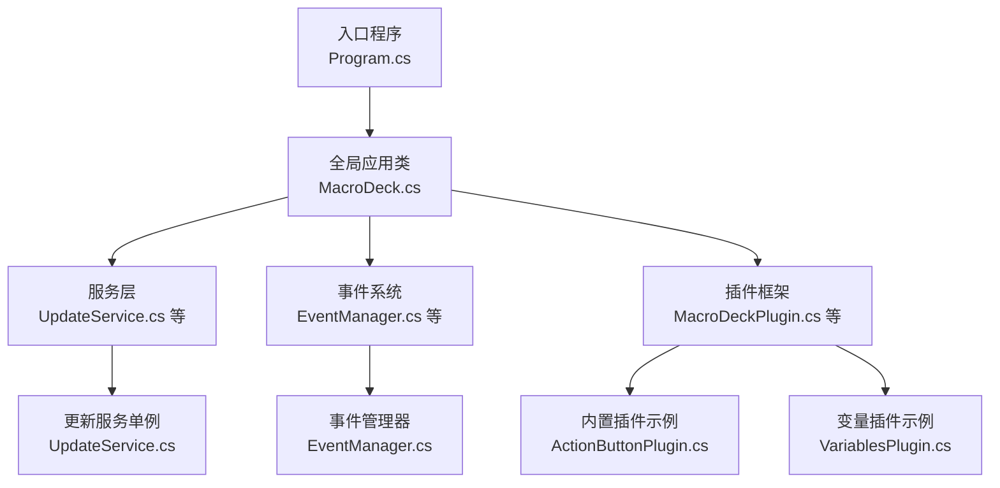
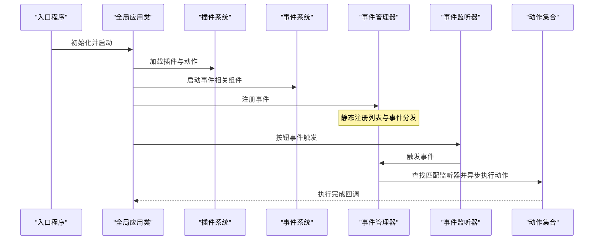
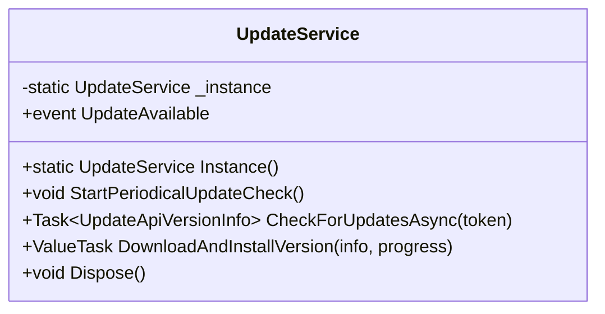
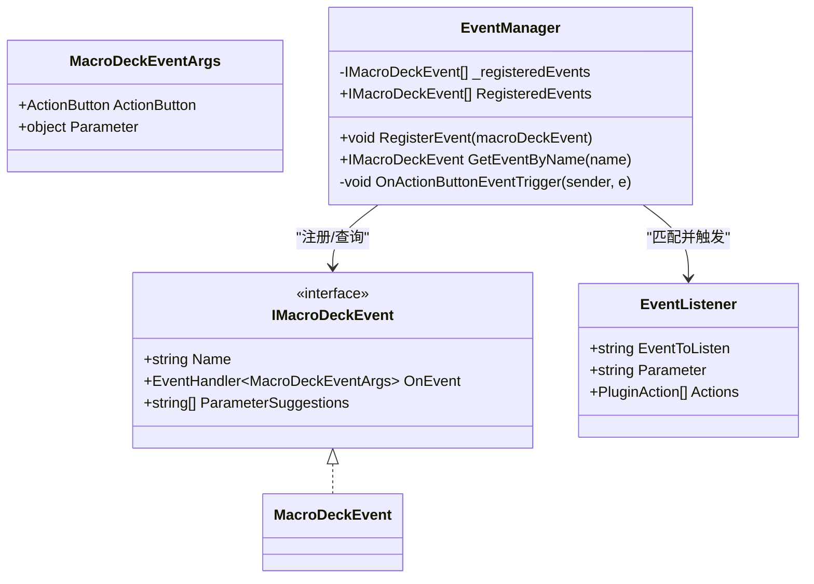
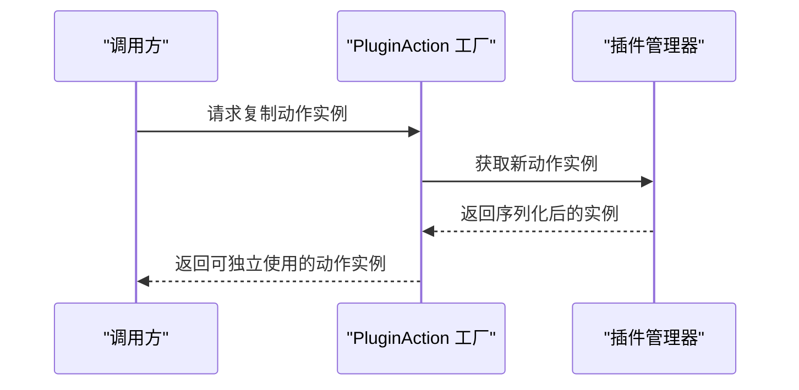
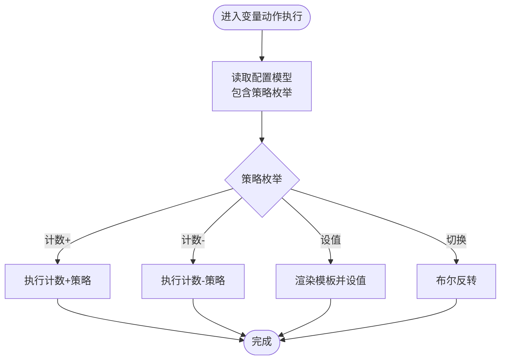
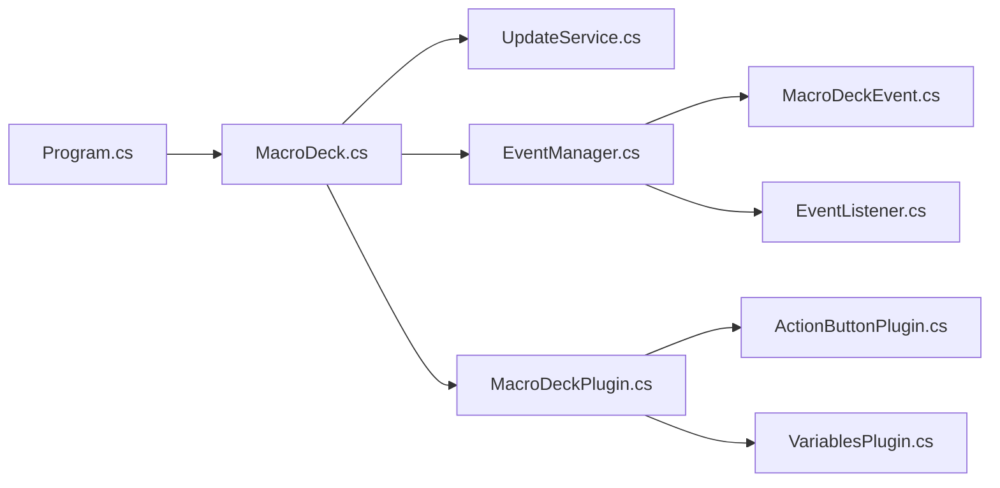

# 设计模式应用

<cite>
**本文引用的文件**
- [MacroDeck.cs](file://src/MacroDeck/MacroDeck.cs)
- [Program.cs](file://src/MacroDeck/Program.cs)
- [EventManager.cs](file://src/MacroDeck/Events/EventManager.cs)
- [EventListener.cs](file://src/MacroDeck/Events/EventListener.cs)
- [MacroDeckEvent.cs](file://src/MacroDeck/Events/MacroDeckEvent.cs)
- [UpdateService.cs](file://src/MacroDeck/Services/UpdateService.cs)
- [MacroDeckPlugin.cs](file://src/MacroDeck/Plugins/MacroDeckPlugin.cs)
- [ActionButtonPlugin.cs](file://src/MacroDeck/InternalPlugins/ActionButtonPlugin/ActionButtonPlugin.cs)
- [ChangeVariableValueActionConfigModel.cs](file://src/MacroDeck/InternalPlugins/Variables/Models/ChangeVariableValueActionConfigModel.cs)
- [ChangeVariableValueActionConfigViewModel.cs](file://src/MacroDeck/InternalPlugins/Variables/ViewModels/ChangeVariableValueActionConfigViewModel.cs)
- [VariablesPlugin.cs](file://src/MacroDeck/InternalPlugins/Variables/VariablesPlugin.cs)
- [ConditionAction.cs](file://src/MacroDeck/ActionButton/ConditionAction.cs)
- [Retry.cs](file://src/MacroDeck/Utils/Retry.cs)
- [StringCipher.cs](file://src/MacroDeck/Utils/StringCipher.cs)
</cite>

## 目录
1. [引言](#引言)
2. [项目结构](#项目结构)
3. [核心组件](#核心组件)
4. [架构总览](#架构总览)
5. [详细组件分析](#详细组件分析)
6. [依赖关系分析](#依赖关系分析)
7. [性能考量](#性能考量)
8. [故障排查指南](#故障排查指南)
9. [结论](#结论)

## 引言
本文件聚焦于 Macro-Deck 应用中的四大设计模式：单例模式、观察者模式、工厂模式与策略模式。我们将从代码结构、控制流、数据流与错误处理等维度，系统解析这些模式在全局服务管理、事件系统、UI 动态组件创建以及插件与操作类型的扩展性实现中的作用，并给出最佳实践与可视化图示。

## 项目结构
- 入口程序负责进程唯一性检查、日志初始化与启动参数解析，随后委托给全局应用类进行完整初始化。
- 全局应用类承担应用生命周期管理、托盘图标、主窗口生命周期、网络接口扫描、服务器与广播服务启动、插件与变量管理初始化等职责。
- 事件子系统通过静态事件管理器集中注册事件、分发触发，支持异步执行与监听器动作链。
- 插件体系以抽象基类定义统一契约，具体插件实现各自功能；动作实例通过序列化复制实现“工厂式”克隆。
- 更新服务采用单例模式提供跨模块一致的更新能力，配合信号量保证并发安全。

图表来源
- [Program.cs:13-35](file://src/MacroDeck/Program.cs#L13-L35)
- [MacroDeck.cs:68-151](file://src/MacroDeck/MacroDeck.cs#L68-L151)
- [UpdateService.cs:22-26](file://src/MacroDeck/Services/UpdateService.cs#L22-L26)
- [MacroDeckPlugin.cs:9-65](file://src/MacroDeck/Plugins/MacroDeckPlugin.cs#L9-L65)
- [ActionButtonPlugin.cs:10-25](file://src/MacroDeck/InternalPlugins/ActionButtonPlugin/ActionButtonPlugin.cs#L10-L25)

章节来源
- [Program.cs:13-35](file://src/MacroDeck/Program.cs#L13-L35)
- [MacroDeck.cs:68-151](file://src/MacroDeck/MacroDeck.cs#L68-L151)

## 核心组件
- 全局应用类（单例风格）：提供静态入口、配置、托盘图标、主窗口生命周期与事件发布点，贯穿应用启动、运行与退出。
- 事件系统（观察者模式）：静态事件管理器集中注册事件与监听器，事件触发时异步遍历匹配监听器并执行动作。
- 插件与动作（工厂/策略）：插件抽象定义能力边界；动作通过序列化复制实现“工厂式”实例化；变量插件根据配置枚举选择不同策略执行。
- 更新服务（单例）：提供版本检查、下载安装与并发控制，确保全局一致性与线程安全。

章节来源
- [MacroDeck.cs:31-151](file://src/MacroDeck/MacroDeck.cs#L31-L151)
- [EventManager.cs:3-42](file://src/MacroDeck/Events/EventManager.cs#L3-L42)
- [MacroDeckPlugin.cs:9-183](file://src/MacroDeck/Plugins/MacroDeckPlugin.cs#L9-L183)
- [UpdateService.cs:15-175](file://src/MacroDeck/Services/UpdateService.cs#L15-L175)

## 架构总览
下图展示了应用启动到事件触发与动作执行的关键流程，体现单例、观察者与工厂/策略的协同：

图表来源
- [Program.cs:34](file://src/MacroDeck/Program.cs#L34)
- [MacroDeck.cs:108-121](file://src/MacroDeck/MacroDeck.cs#L108-L121)
- [EventManager.cs:9-41](file://src/MacroDeck/Events/EventManager.cs#L9-L41)
- [EventListener.cs:5-11](file://src/MacroDeck/Events/EventListener.cs#L5-L11)

## 详细组件分析

### 单例模式：全局服务管理（以更新服务为例）
- 实现要点
  - 私有构造与静态实例缓存，提供静态访问入口。
  - 使用信号量限制并发检查与下载，避免资源争用。
  - 提供周期性任务与取消令牌，保障生命周期可控。
- 线程安全
  - 通过信号量与异步任务串行化关键路径，避免重复下载或检查。
  - 静态事件发布用于跨模块通知（如可用更新）。
- 最佳实践
  - 将耗时操作放入后台任务，避免阻塞 UI。
  - 对外暴露只读状态与事件，内部通过私有字段与锁保护。

图表来源
- [UpdateService.cs:15-175](file://src/MacroDeck/Services/UpdateService.cs#L15-L175)

章节来源
- [UpdateService.cs:22-26](file://src/MacroDeck/Services/UpdateService.cs#L22-L26)
- [UpdateService.cs:39-85](file://src/MacroDeck/Services/UpdateService.cs#L39-L85)
- [UpdateService.cs:108-136](file://src/MacroDeck/Services/UpdateService.cs#L108-L136)

### 观察者模式：事件系统与事件传播
- 组件构成
  - 事件接口与事件参数承载触发上下文（按钮与参数）。
  - 事件管理器集中注册事件，订阅事件触发，查找匹配监听器并执行动作。
  - 事件监听器包含目标事件名、参数与待执行的动作列表。
- 传播机制
  - 事件触发后，管理器异步遍历监听器，按事件名与参数精确匹配，批量触发对应动作。
  - 动作执行在独立任务中进行，避免阻塞事件循环。
- 可扩展性
  - 新增事件只需实现接口并注册至管理器。
  - 监听器可按需绑定不同参数，形成灵活的条件分支。

图表来源
- [MacroDeckEvent.cs:3-14](file://src/MacroDeck/Events/MacroDeckEvent.cs#L3-L14)
- [EventListener.cs:5-11](file://src/MacroDeck/Events/EventListener.cs#L5-L11)
- [EventManager.cs:3-42](file://src/MacroDeck/Events/EventManager.cs#L3-L42)

章节来源
- [MacroDeckEvent.cs:9-14](file://src/MacroDeck/Events/MacroDeckEvent.cs#L9-L14)
- [EventListener.cs:7-10](file://src/MacroDeck/Events/EventListener.cs#L7-L10)
- [EventManager.cs:9-41](file://src/MacroDeck/Events/EventManager.cs#L9-L41)

### 工厂模式：动态 UI 组件与动作实例创建
- 插件动作工厂
  - 通过序列化复制实现“工厂式”动作实例化，避免直接 new 导致的状态耦合。
  - 复制过程使用 JSON 序列化设置，保留类型信息并容错处理。
- 内置插件示例
  - 内置插件在启用时向动作列表注入具体动作实例，形成可配置的 UI 动作集合。
- 最佳实践
  - 将“创建实例”的逻辑封装在工厂方法中，调用方仅依赖抽象。
  - 对复杂对象的复制应考虑深拷贝与不可序列化成员的处理。

图表来源
- [MacroDeckPlugin.cs:171-182](file://src/MacroDeck/Plugins/MacroDeckPlugin.cs#L171-L182)
- [ActionButtonPlugin.cs:15-24](file://src/MacroDeck/InternalPlugins/ActionButtonPlugin/ActionButtonPlugin.cs#L15-L24)

章节来源
- [MacroDeckPlugin.cs:171-182](file://src/MacroDeck/Plugins/MacroDeckPlugin.cs#L171-L182)
- [ActionButtonPlugin.cs:15-24](file://src/MacroDeck/InternalPlugins/ActionButtonPlugin/ActionButtonPlugin.cs#L15-L24)

### 策略模式：插件系统与不同操作类型
- 插件策略
  - 抽象插件定义统一能力边界（启用、配置、图标等），具体插件实现差异化行为。
- 操作策略（变量插件）
  - 配置模型包含策略枚举字段，视图模型根据枚举值映射为用户可读文案。
  - 插件根据配置枚举选择不同策略（加减、设值、切换）执行。
- 条件动作策略
  - 条件动作根据配置解析出比较源、类型与方法，形成多分支判断策略。
- 最佳实践
  - 将“算法族”收敛到单一配置模型，便于持久化与 UI 展示。
  - 在视图模型中做策略名称与摘要生成，提升用户体验。

图表来源
- [VariablesPlugin.cs:189-205](file://src/MacroDeck/InternalPlugins/Variables/VariablesPlugin.cs#L189-L205)
- [ChangeVariableValueActionConfigModel.cs:8-29](file://src/MacroDeck/InternalPlugins/Variables/Models/ChangeVariableValueActionConfigModel.cs#L8-L29)
- [ChangeVariableValueActionConfigViewModel.cs:74-89](file://src/MacroDeck/InternalPlugins/Variables/ViewModels/ChangeVariableValueActionConfigViewModel.cs#L74-L89)

章节来源
- [VariablesPlugin.cs:189-205](file://src/MacroDeck/InternalPlugins/Variables/VariablesPlugin.cs#L189-L205)
- [ChangeVariableValueActionConfigModel.cs:10-12](file://src/MacroDeck/InternalPlugins/Variables/Models/ChangeVariableValueActionConfigModel.cs#L10-L12)
- [ChangeVariableValueActionConfigViewModel.cs:74-89](file://src/MacroDeck/InternalPlugins/Variables/ViewModels/ChangeVariableValueActionConfigViewModel.cs#L74-L89)
- [ConditionAction.cs:95-130](file://src/MacroDeck/ActionButton/ConditionAction.cs#L95-L130)

## 依赖关系分析
- 入口程序依赖全局应用类与启动配置；全局应用类再协调服务、事件与插件模块。
- 事件管理器依赖事件接口与监听器模型；监听器持有动作列表，动作由插件提供。
- 插件动作工厂依赖插件管理器与序列化工具；变量插件依赖配置模型与视图模型。
- 更新服务作为单例被全局应用类与 UI 交互模块引用。

图表来源
- [Program.cs:25-34](file://src/MacroDeck/Program.cs#L25-L34)
- [MacroDeck.cs:108-121](file://src/MacroDeck/MacroDeck.cs#L108-L121)
- [EventManager.cs:3-42](file://src/MacroDeck/Events/EventManager.cs#L3-L42)
- [MacroDeckPlugin.cs:9-65](file://src/MacroDeck/Plugins/MacroDeckPlugin.cs#L9-L65)

章节来源
- [Program.cs:25-34](file://src/MacroDeck/Program.cs#L25-L34)
- [MacroDeck.cs:108-121](file://src/MacroDeck/MacroDeck.cs#L108-L121)
- [MacroDeckPlugin.cs:9-65](file://src/MacroDeck/Plugins/MacroDeckPlugin.cs#L9-L65)

## 性能考量
- 事件传播采用异步任务执行动作，避免阻塞事件线程，但需注意动作数量过多时的并发与资源占用。
- 更新服务使用信号量串行化检查与下载，降低网络与磁盘争用风险，适合后台长期运行。
- 插件动作复制通过序列化完成，建议对大型对象或频繁复制场景评估性能成本。
- 全局应用类在主线程中维护同步上下文与托盘图标，注意避免长时间阻塞 UI。

## 故障排查指南
- 进程唯一性冲突
  - 若检测到已有实例，尝试通过命名管道发送显示主窗体消息；否则终止旧实例。
- 未处理异常
  - 应用级与域级未处理异常均记录日志，便于定位问题。
- 更新服务异常
  - 周期性检查失败会记录错误日志；下载校验失败会抛出异常并中断安装。
- 重试与加密工具
  - 提供通用重试工具，支持指数退避；加密工具提供机器标识读取与随机数生成。

章节来源
- [Program.cs:37-66](file://src/MacroDeck/Program.cs#L37-L66)
- [Program.cs:68-78](file://src/MacroDeck/Program.cs#L68-L78)
- [UpdateService.cs:121-136](file://src/MacroDeck/Services/UpdateService.cs#L121-L136)
- [Retry.cs:39-62](file://src/MacroDeck/Utils/Retry.cs#L39-L62)
- [StringCipher.cs:78-99](file://src/MacroDeck/Utils/StringCipher.cs#L78-L99)

## 结论
Macro-Deck 通过单例模式实现了全局服务的一致性与生命周期管理；通过观察者模式构建了松耦合的事件系统；通过工厂与策略模式提升了插件与动作的可扩展性与可维护性。上述模式协同工作，使应用在复杂 UI、插件生态与后台服务之间保持清晰边界与良好性能表现。