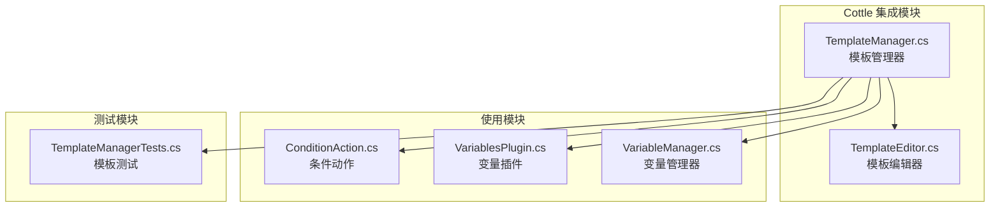
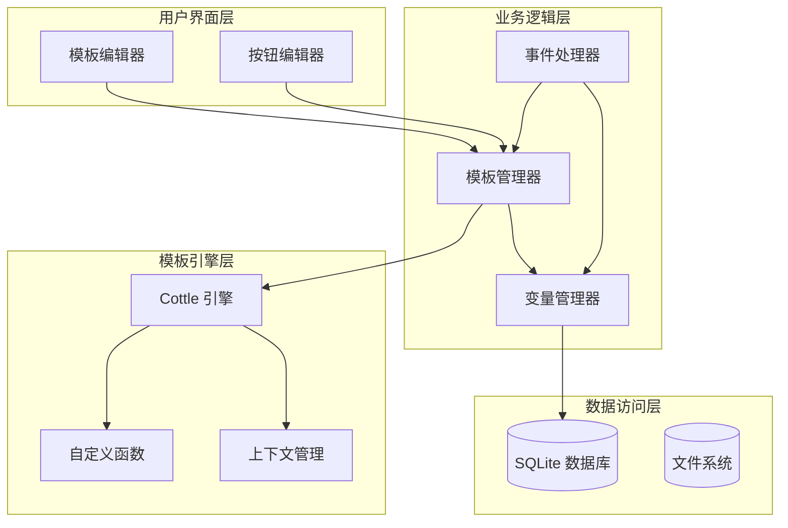
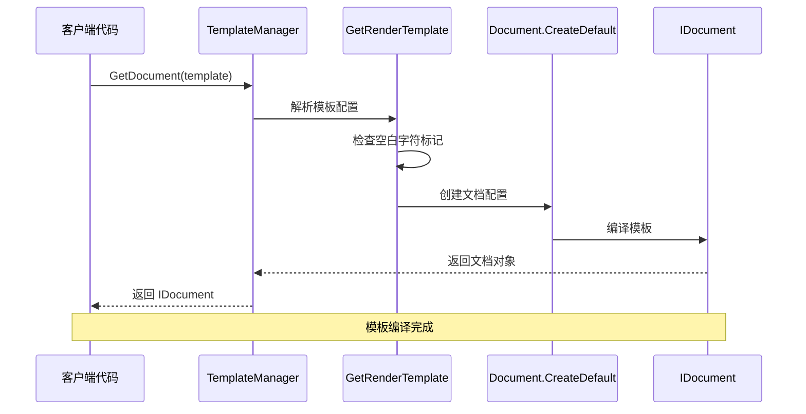
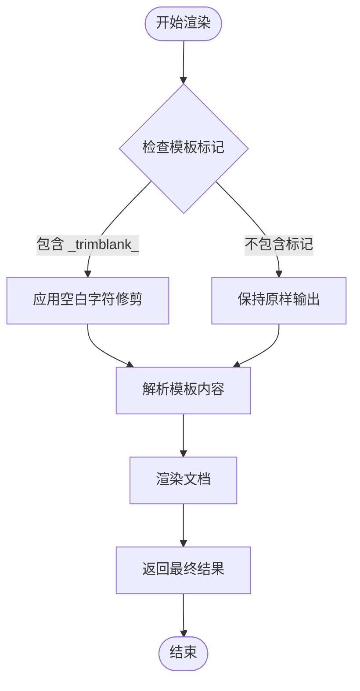
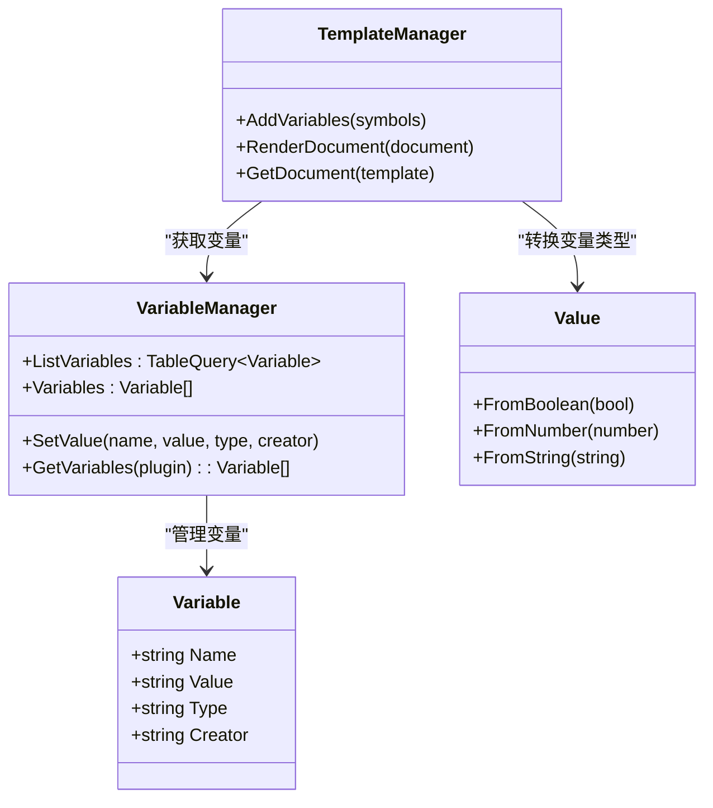
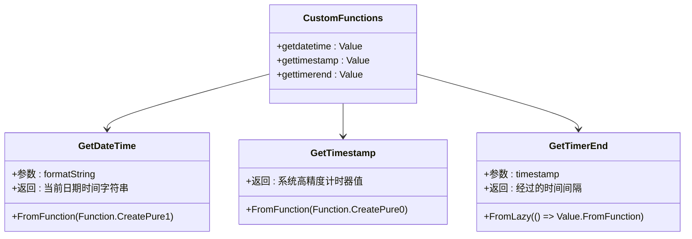
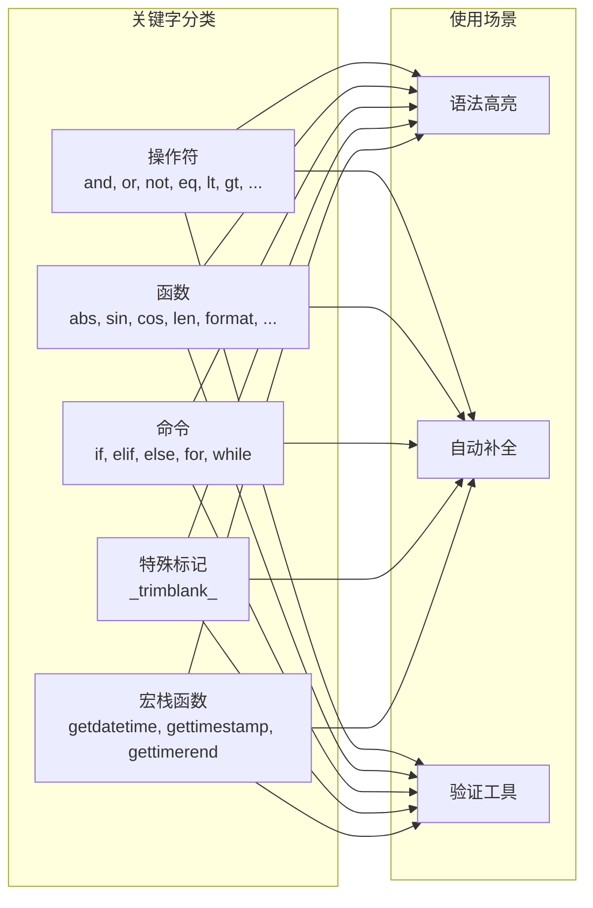
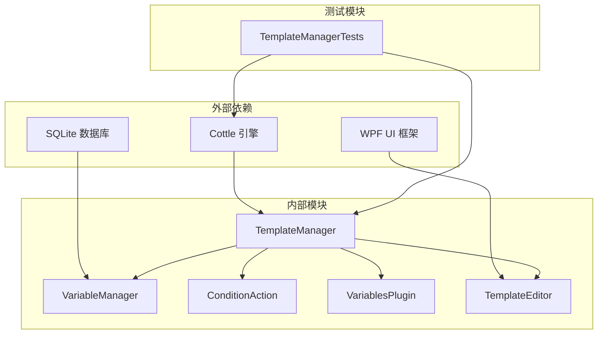

# Cottle 引擎集成

<cite>
**本文档引用的文件**
- [TemplateManager.cs](file://src/MacroDeck/CottleIntegration/TemplateManager.cs)
- [TemplateEditor.cs](file://src/MacroDeck/GUI/Dialogs/TemplateEditor.cs)
- [ConditionAction.cs](file://src/MacroDeck/ActionButton/ConditionAction.cs)
- [VariablesPlugin.cs](file://src/MacroDeck/InternalPlugins/Variables/VariablesPlugin.cs)
- [VariableManager.cs](file://src/MacroDeck/Variables/VariableManager.cs)
- [TemplateManagerTests.cs](file://tests/MacroDeck.Tests/TemplateManagerTests.cs)
- [MacroDeck.csproj](file://src/MacroDeck/MacroDeck.csproj)
</cite>

## 目录
1. [简介](#简介)
2. [项目结构](#项目结构)
3. [核心组件](#核心组件)
4. [架构概览](#架构概览)
5. [详细组件分析](#详细组件分析)
6. [依赖关系分析](#依赖关系分析)
7. [性能考虑](#性能考虑)
8. [故障排除指南](#故障排除指南)
9. [结论](#结论)

## 简介

Macro-Deck 集成了 Cottle 模板引擎，为用户提供强大的模板渲染功能。Cottle 是一个轻量级的模板引擎，支持变量替换、条件判断、循环控制等高级功能。本集成提供了完整的模板解析、编译和渲染流程，包括自定义函数扩展和错误处理机制。

## 项目结构

Cottle 模板引擎集成位于 `src/MacroDeck/CottleIntegration/` 目录下，主要包含以下关键文件：

**图表来源**
- [TemplateManager.cs:1-181](file://src/MacroDeck/CottleIntegration/TemplateManager.cs#L1-L181)
- [TemplateEditor.cs:12-173](file://src/MacroDeck/GUI/Dialogs/TemplateEditor.cs#L12-L173)

**章节来源**
- [TemplateManager.cs:1-181](file://src/MacroDeck/CottleIntegration/TemplateManager.cs#L1-L181)
- [MacroDeck.csproj:45](file://src/MacroDeck/MacroDeck.csproj#L45)

## 核心组件

### TemplateManager 类

TemplateManager 是整个 Cottle 模板引擎的核心管理类，提供了完整的模板生命周期管理：

#### 主要功能特性
- **模板解析与编译**: 将模板字符串转换为可执行的文档对象
- **模板渲染**: 执行模板渲染并返回最终结果
- **变量系统**: 自动注入所有可用变量到模板上下文
- **自定义函数**: 提供时间、计时器等内置函数
- **空白字符处理**: 支持智能空白字符修剪
- **关键字系统**: 维护操作符、函数、命令和特殊标记的完整列表

#### 关键常量和配置
- `TemplateTrimBlank`: 特殊标记 `_trimblank_`，用于启用空白字符修剪
- 内置操作符数组：包含逻辑运算符、比较运算符、控制流关键字等
- 内置函数数组：包含数学函数、字符串处理函数、集合操作函数等
- 命令数组：包含条件判断和循环控制语句
- 特殊标记数组：包含空白字符处理标记

**章节来源**
- [TemplateManager.cs:8-35](file://src/MacroDeck/CottleIntegration/TemplateManager.cs#L8-L35)

## 架构概览

Cottle 引擎在 Macro-Deck 中采用分层架构设计，确保了良好的模块化和可维护性：

**图表来源**
- [TemplateManager.cs:53-88](file://src/MacroDeck/CottleIntegration/TemplateManager.cs#L53-L88)
- [VariableManager.cs:204-212](file://src/MacroDeck/Variables/VariableManager.cs#L204-L212)

## 详细组件分析

### 模板解析与编译流程

TemplateManager 的模板处理采用两阶段模式，确保高效的模板管理和灵活的配置选项：

**图表来源**
- [TemplateManager.cs:36-57](file://src/MacroDeck/CottleIntegration/TemplateManager.cs#L36-L57)

#### GetDocument 方法详解

GetDocument 方法是模板编译的核心入口，负责将原始模板字符串转换为可执行的文档对象：

1. **模板预处理**: 调用 GetRenderTemplate 获取渲染模板和配置
2. **配置应用**: 设置空白字符处理策略
3. **文档创建**: 使用 Cottle 引擎创建默认文档
4. **错误处理**: 通过 DocumentOrThrow 属性获取编译后的文档

#### 渲染流程优化

渲染过程采用延迟加载和上下文共享策略：
- 变量和函数按需添加到符号表
- 使用内置上下文减少重复创建开销
- 支持多线程安全的并发渲染

**章节来源**
- [TemplateManager.cs:53-88](file://src/MacroDeck/CottleIntegration/TemplateManager.cs#L53-L88)

### 空白字符处理机制

Macro-Deck 实现了智能的空白字符处理系统，通过特殊的标记来控制模板输出格式：

**图表来源**
- [TemplateManager.cs:31-51](file://src/MacroDeck/CottleIntegration/TemplateManager.cs#L31-L51)

#### 特殊标记系统

- `_trimblank_`: 启用首尾空白行自动修剪功能
- 模板编辑器自动检测和管理此标记
- 支持动态切换空白字符处理状态

**章节来源**
- [TemplateManager.cs:10](file://src/MacroDeck/CottleIntegration/TemplateManager.cs#L10)
- [TemplateEditor.cs:14](file://src/MacroDeck/GUI/Dialogs/TemplateEditor.cs#L14)

### 变量系统集成

TemplateManager 自动将所有可用变量注入到模板渲染上下文中，支持多种数据类型：

**图表来源**
- [TemplateManager.cs:90-124](file://src/MacroDeck/CottleIntegration/TemplateManager.cs#L90-L124)
- [VariableManager.cs:20-35](file://src/MacroDeck/Variables/VariableManager.cs#L20-L35)

#### 变量类型转换

支持的数据类型转换：
- **布尔类型**: 支持 "On"/"Off" 和 "True"/"False" 两种表示形式
- **整数类型**: 标准整数解析
- **浮点类型**: 支持本地化小数点格式
- **字符串类型**: 直接字符串处理

**章节来源**
- [TemplateManager.cs:90-124](file://src/MacroDeck/CottleIntegration/TemplateManager.cs#L90-L124)

### 自定义函数系统

Macro-Deck 提供了三个核心的自定义函数，扩展了 Cottle 引擎的功能：

#### 时间处理函数

**图表来源**
- [TemplateManager.cs:134-153](file://src/MacroDeck/CottleIntegration/TemplateManager.cs#L134-L153)

#### 函数特性

- **纯函数**: 所有自定义函数都是纯函数，无副作用
- **延迟初始化**: gettimerend 函数采用延迟加载策略
- **反射支持**: 支持复杂的对象方法调用
- **类型安全**: 严格的参数类型验证

**章节来源**
- [TemplateManager.cs:134-153](file://src/MacroDeck/CottleIntegration/TemplateManager.cs#L134-L153)

### 关键字系统

TemplateManager 维护了一个完整的模板关键字系统，支持语法高亮和智能提示：

**图表来源**
- [TemplateManager.cs:12-29](file://src/MacroDeck/CottleIntegration/TemplateManager.cs#L12-L29)
- [TemplateManager.cs:159-179](file://src/MacroDeck/CottleIntegration/TemplateManager.cs#L159-L179)

#### 关键字管理

- **集中管理**: 所有关键字统一存储在静态数组中
- **动态合并**: 通过 GetAllKeywords 方法动态生成完整列表
- **长度验证**: 单元测试确保关键字数量正确
- **无重复**: 自动过滤空值和重复项

**章节来源**
- [TemplateManager.cs:12-29](file://src/MacroDeck/CottleIntegration/TemplateManager.cs#L12-L29)
- [TemplateManagerTests.cs:10-32](file://tests/MacroDeck.Tests/TemplateManagerTests.cs#L10-L32)

## 依赖关系分析

Cottle 引擎集成在整个 Macro-Deck 应用中的依赖关系如下：

**图表来源**
- [MacroDeck.csproj:45](file://src/MacroDeck/MacroDeck.csproj#L45)
- [TemplateManager.cs:3](file://src/MacroDeck/CottleIntegration/TemplateManager.cs#L3)

### 外部依赖管理

- **Cottle**: 模板引擎核心库，版本通过 NuGet 管理
- **SQLite**: 变量持久化存储
- **WPF**: 用户界面框架

### 内部模块耦合

- **低耦合设计**: TemplateManager 与其他模块松散耦合
- **接口隔离**: 通过清晰的接口定义模块边界
- **依赖注入**: 支持模块间的依赖管理

**章节来源**
- [MacroDeck.csproj:45](file://src/MacroDeck/MacroDeck.csproj#L45)

## 性能考虑

### 内存管理策略

TemplateManager 采用了多项内存优化策略：

1. **字符串池化**: 使用 ReadOnlySpan<char> 减少字符串复制
2. **延迟初始化**: 自定义函数采用延迟加载避免不必要的内存分配
3. **对象复用**: 上下文对象在渲染过程中复用
4. **垃圾回收优化**: 避免创建临时对象，减少 GC 压力

### 渲染性能优化

- **符号表缓存**: 变量和函数符号表在进程生命周期内缓存
- **编译缓存**: 文档对象编译后缓存，避免重复编译
- **批量处理**: 支持批量变量处理，减少循环开销
- **异步支持**: 渲染过程支持异步执行

### 错误处理机制

- **异常捕获**: 渲染过程中的异常被捕获并转换为用户友好的错误消息
- **回退策略**: 模板编译失败时返回原始模板或错误信息
- **日志记录**: 详细的错误日志便于调试和问题诊断

**章节来源**
- [TemplateManager.cs:76-88](file://src/MacroDeck/CottleIntegration/TemplateManager.cs#L76-L88)

## 故障排除指南

### 常见问题及解决方案

#### 模板编译错误

**症状**: 模板渲染返回 "Error: ..." 消息
**原因**: 
- 语法错误（未闭合的括号、无效的操作符）
- 变量名冲突
- 函数调用参数错误

**解决方法**:
1. 检查模板语法是否符合 Cottle 规范
2. 验证变量名称是否正确
3. 确认函数参数类型匹配

#### 变量访问问题

**症状**: 模板中无法访问预期的变量
**原因**:
- 变量名称大小写不匹配
- 变量类型转换失败
- 变量未正确初始化

**解决方法**:
1. 检查变量名称的大小写一致性
2. 验证变量值的格式是否正确
3. 确认变量已在 VariableManager 中正确设置

#### 性能问题

**症状**: 模板渲染响应缓慢
**原因**:
- 模板过于复杂
- 变量数量过多
- 频繁的模板重新编译

**解决方法**:
1. 简化模板逻辑
2. 减少不必要的变量引用
3. 复用已编译的文档对象

**章节来源**
- [TemplateManager.cs:76-88](file://src/MacroDeck/CottleIntegration/TemplateManager.cs#L76-L88)

### 调试技巧

1. **启用详细日志**: 在开发环境中启用详细的模板渲染日志
2. **单元测试**: 使用 TemplateManagerTests 验证模板功能
3. **逐步调试**: 从简单的模板开始，逐步增加复杂度
4. **性能监控**: 监控内存使用和渲染时间

## 结论

Macro-Deck 的 Cottle 模板引擎集成为用户提供了强大而灵活的模板处理能力。通过精心设计的架构和完善的错误处理机制，该集成确保了高性能、易用性和可扩展性。

### 主要优势

1. **功能完整性**: 支持完整的 Cottle 语法和宏栈扩展
2. **性能优化**: 采用多种优化策略确保高效运行
3. **易于使用**: 提供直观的 API 和丰富的示例
4. **可扩展性**: 支持自定义函数和变量系统的扩展

### 未来发展方向

1. **模板缓存**: 进一步优化模板编译和缓存机制
2. **并发支持**: 增强多线程环境下的稳定性
3. **性能监控**: 添加更详细的性能指标和监控工具
4. **扩展接口**: 提供更丰富的扩展点和插件接口

该集成为 Macro-Deck 用户提供了专业级的模板处理能力，满足从简单文本替换到复杂条件判断的各种需求。