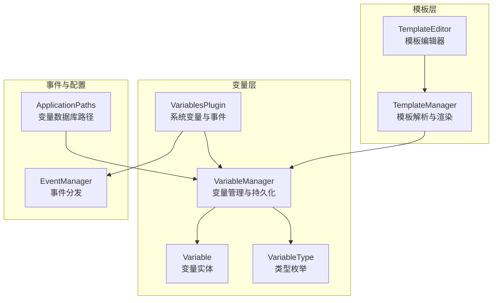
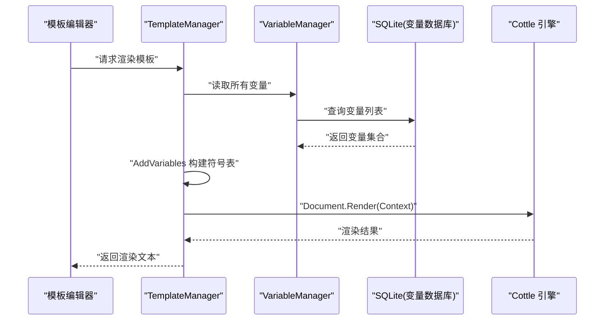
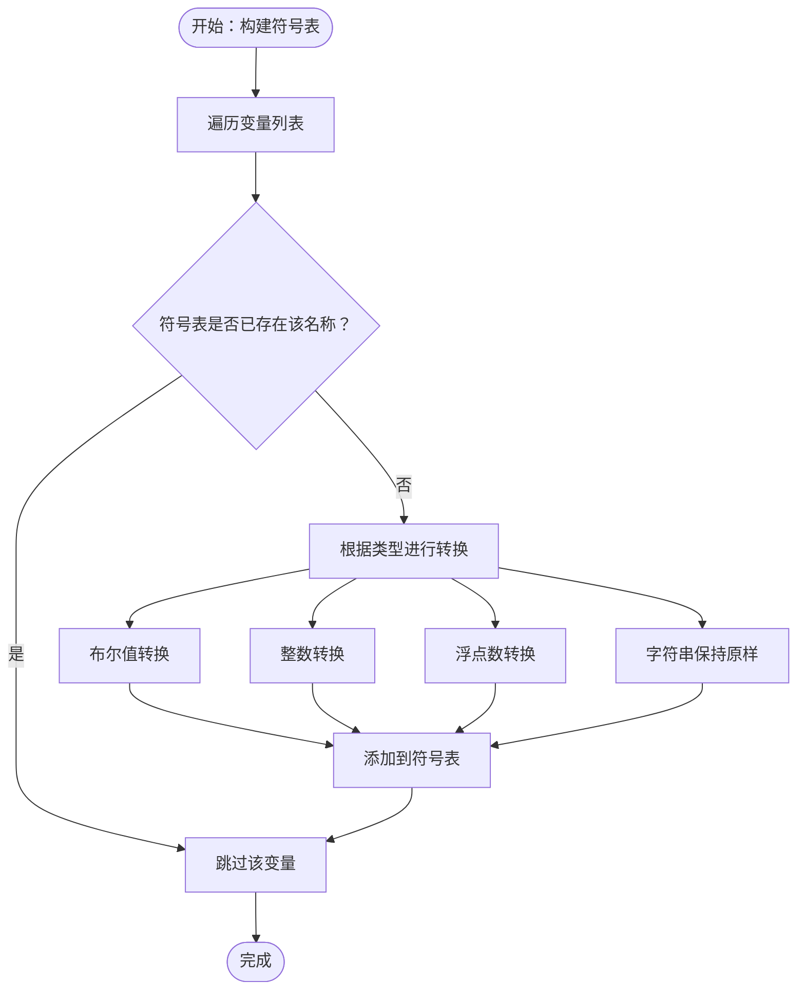
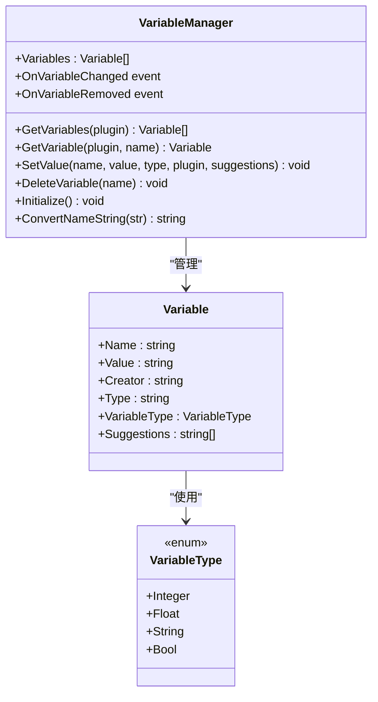
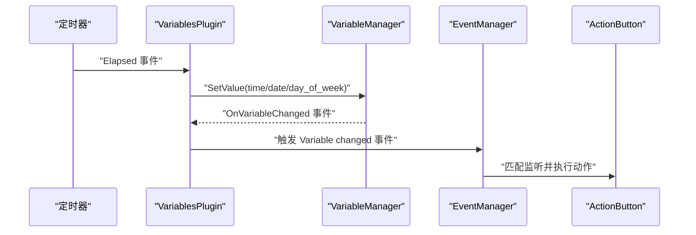
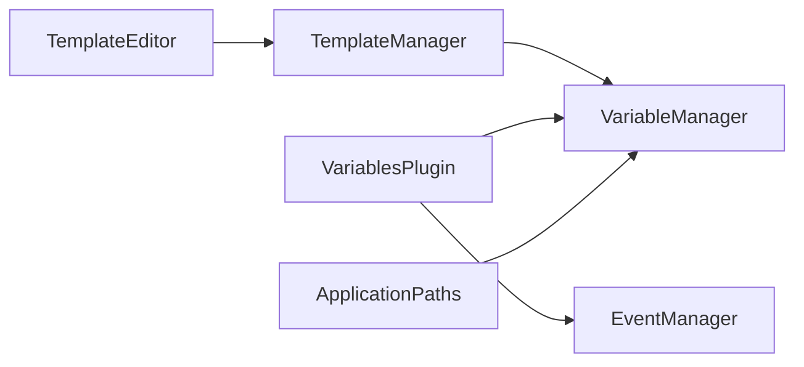

# 变量系统集成

<cite>
**本文档引用的文件**
- [TemplateManager.cs](file://src/MacroDeck/CottleIntegration/TemplateManager.cs)
- [VariableManager.cs](file://src/MacroDeck/Variables/VariableManager.cs)
- [Variable.cs](file://src/MacroDeck/Variables/Variable.cs)
- [VariableType.cs](file://src/MacroDeck/Variables/VariableType.cs)
- [VariablesPlugin.cs](file://src/MacroDeck/InternalPlugins/Variables/VariablesPlugin.cs)
- [TemplateEditor.cs](file://src/MacroDeck/GUI/Dialogs/TemplateEditor.cs)
- [EventManager.cs](file://src/MacroDeck/Events/EventManager.cs)
- [ApplicationPaths.cs](file://src/MacroDeck/StartupConfig/ApplicationPaths.cs)
- [TemplateManagerTests.cs](file://tests/MacroDeck.Tests/TemplateManagerTests.cs)
- [ConvertNameStringTests.cs](file://tests/MacroDeck.Tests/ConvertNameStringTests.cs)
</cite>

## 目录
1. [简介](#简介)
2. [项目结构](#项目结构)
3. [核心组件](#核心组件)
4. [架构总览](#架构总览)
5. [详细组件分析](#详细组件分析)
6. [依赖分析](#依赖分析)
7. [性能考虑](#性能考虑)
8. [故障排除指南](#故障排除指南)
9. [结论](#结论)
10. [附录](#附录)

## 简介
本文件面向模板系统与变量系统的集成，聚焦以下主题：
- 模板如何访问与使用变量：变量类型转换机制（字符串、整数、浮点数、布尔值）、变量符号表构建、变量作用域与命名冲突处理。
- AddVariables 方法的实现细节与变量符号表构建流程。
- 变量在模板中的引用语法与访问模式。
- 类型检测与自动转换的实现细节。
- 变量更新时模板重新渲染的触发链路。
- 自定义函数的注册与使用（如 getdatetime、gettimestamp、gettimerend）。
- 模板变量与系统变量的集成关系。
- 调试与故障排除方法。
- 面向模板开发者的最佳实践与性能优化建议。

## 项目结构
围绕模板与变量系统的关键目录与文件如下：
- Cottle 集成层：TemplateManager 提供模板解析、渲染与内置符号（变量与函数）注入。
- 变量管理层：VariableManager 负责变量的持久化、类型转换、事件通知与初始化。
- 变量模型：Variable 定义变量的存储字段；VariableType 定义支持的类型枚举。
- 内置变量插件：VariablesPlugin 提供系统级变量（如 time、date、day_of_week），并处理变量变更事件。
- GUI 模板编辑器：TemplateEditor 支持插入变量占位符与查看模板引擎文档链接。
- 事件系统：EventManager 将变量变更事件传播到按钮动作链路。
- 应用路径：ApplicationPaths 提供 variables.db 的存储位置，确保变量数据库可定位。

图表来源
- [TemplateManager.cs:1-181](file://src/MacroDeck/CottleIntegration/TemplateManager.cs#L1-L181)
- [VariableManager.cs:1-249](file://src/MacroDeck/Variables/VariableManager.cs#L1-L249)
- [Variable.cs:1-16](file://src/MacroDeck/Variables/Variable.cs#L1-L16)
- [VariableType.cs:1-10](file://src/MacroDeck/Variables/VariableType.cs#L1-L10)
- [VariablesPlugin.cs:1-319](file://src/MacroDeck/InternalPlugins/Variables/VariablesPlugin.cs#L1-L319)
- [TemplateEditor.cs:128-173](file://src/MacroDeck/GUI/Dialogs/TemplateEditor.cs#L128-L173)
- [EventManager.cs:1-43](file://src/MacroDeck/Events/EventManager.cs#L1-L43)
- [ApplicationPaths.cs:1-143](file://src/MacroDeck/StartupConfig/ApplicationPaths.cs#L1-L143)

章节来源
- [TemplateManager.cs:1-181](file://src/MacroDeck/CottleIntegration/TemplateManager.cs#L1-L181)
- [VariableManager.cs:1-249](file://src/MacroDeck/Variables/VariableManager.cs#L1-L249)
- [Variable.cs:1-16](file://src/MacroDeck/Variables/Variable.cs#L1-L16)
- [VariableType.cs:1-10](file://src/MacroDeck/Variables/VariableType.cs#L1-L10)
- [VariablesPlugin.cs:1-319](file://src/MacroDeck/InternalPlugins/Variables/VariablesPlugin.cs#L1-L319)
- [TemplateEditor.cs:128-173](file://src/MacroDeck/GUI/Dialogs/TemplateEditor.cs#L128-L173)
- [EventManager.cs:1-43](file://src/MacroDeck/Events/EventManager.cs#L1-L43)
- [ApplicationPaths.cs:1-143](file://src/MacroDeck/StartupConfig/ApplicationPaths.cs#L1-L143)

## 核心组件
- 模板管理器（TemplateManager）
  - 提供模板解析、渲染入口与内置关键字集合。
  - 构建符号表：AddVariables 注入变量；AddCustomFunctions 注入自定义函数。
  - 支持特殊前缀 _trimblank_ 控制空白行裁剪。
- 变量管理器（VariableManager）
  - 负责变量的增删改查、类型转换、去重与事件通知。
  - 初始化 SQLite 数据库，创建 variables.db 并建立表结构。
  - 提供 ConvertNameString 规范化变量名。
- 变量实体与类型（Variable、VariableType）
  - Variable 定义 Name、Value、Creator、Type 等字段，并暴露类型枚举。
  - VariableType 定义 Integer、Float、String、Bool 四种类型。
- 内置变量插件（VariablesPlugin）
  - 定期更新系统变量（time、date、day_of_week）。
  - 订阅变量变更事件并通过 EventManager 分发给按钮动作。
- 模板编辑器（TemplateEditor）
  - 提供变量占位符插入与模板引擎文档链接。
- 事件系统（EventManager）
  - 将变量变更事件传播到匹配的按钮动作链路。
- 应用路径（ApplicationPaths）
  - 提供 variables.db 的绝对路径，确保变量数据库可定位。

章节来源
- [TemplateManager.cs:53-88](file://src/MacroDeck/CottleIntegration/TemplateManager.cs#L53-L88)
- [VariableManager.cs:204-212](file://src/MacroDeck/Variables/VariableManager.cs#L204-L212)
- [Variable.cs:5-15](file://src/MacroDeck/Variables/Variable.cs#L5-L15)
- [VariableType.cs:3-9](file://src/MacroDeck/Variables/VariableType.cs#L3-L9)
- [VariablesPlugin.cs:33-82](file://src/MacroDeck/InternalPlugins/Variables/VariablesPlugin.cs#L33-L82)
- [TemplateEditor.cs:128-173](file://src/MacroDeck/GUI/Dialogs/TemplateEditor.cs#L128-L173)
- [EventManager.cs:9-41](file://src/MacroDeck/Events/EventManager.cs#L9-L41)
- [ApplicationPaths.cs:58](file://src/MacroDeck/StartupConfig/ApplicationPaths.cs#L58)

## 架构总览
模板与变量系统通过“模板管理器”与“变量管理器”的协作实现：
- 渲染阶段：TemplateManager 解析模板，构建符号表（变量+自定义函数），调用 Cottle 渲染。
- 数据阶段：VariableManager 负责变量的持久化与类型转换，提供列表与查询接口。
- 事件阶段：VariablesPlugin 更新系统变量并触发 OnVariableChanged；EventManager 将事件分发至按钮动作。
- 存储阶段：ApplicationPaths 提供 variables.db 路径，VariableManager 初始化数据库连接。

图表来源
- [TemplateManager.cs:59-87](file://src/MacroDeck/CottleIntegration/TemplateManager.cs#L59-L87)
- [VariableManager.cs:23-35](file://src/MacroDeck/Variables/VariableManager.cs#L23-L35)
- [ApplicationPaths.cs:58](file://src/MacroDeck/StartupConfig/ApplicationPaths.cs#L58)

## 详细组件分析

### 组件一：模板管理器（TemplateManager）
- 关键职责
  - 模板解析：GetDocument 基于模板内容创建文档对象。
  - 符号表构建：RenderDocument 先注入变量，再注入自定义函数。
  - 渲染入口：RenderTemplate 处理异常并返回错误信息。
  - 关键字集合：汇总操作符、函数、命令、特殊标记与自定义函数名。
- AddVariables 实现要点
  - 遍历 VariableManager.ListVariables。
  - 使用名称去重策略（若符号表已存在同名键则跳过）。
  - 根据 Variable.Type 进行类型转换：Bool、Float、Integer、String。
  - 将转换后的值以 Cottle.Value 形式加入符号表。
- 自定义函数
  - getdatetime：返回当前时间格式化字符串。
  - gettimestamp：返回高精度计时戳。
  - gettimerend：基于传入时间戳计算经过时间，惰性求值。
  - 所有函数注册到符号表，可在模板中直接调用。

图表来源
- [TemplateManager.cs:90-124](file://src/MacroDeck/CottleIntegration/TemplateManager.cs#L90-L124)

章节来源
- [TemplateManager.cs:53-88](file://src/MacroDeck/CottleIntegration/TemplateManager.cs#L53-L88)
- [TemplateManager.cs:90-124](file://src/MacroDeck/CottleIntegration/TemplateManager.cs#L90-L124)
- [TemplateManager.cs:126-153](file://src/MacroDeck/CottleIntegration/TemplateManager.cs#L126-L153)
- [TemplateManagerTests.cs:10-40](file://tests/MacroDeck.Tests/TemplateManagerTests.cs#L10-L40)

### 组件二：变量管理器（VariableManager）
- 关键职责
  - 初始化数据库：创建 variables.db 与表结构。
  - 变量增删改查：InsertVariable、SetValue、DeleteVariable。
  - 类型转换与校验：按 VariableType 对输入值进行转换或回退默认值。
  - 事件通知：OnVariableChanged、OnVariableRemoved。
  - 名称规范化：ConvertNameString 将空格与分隔符替换为下划线，处理德语变体字符。
- 作用域与命名冲突
  - 列表查询按名称大小写不敏感匹配。
  - 插入时检查名称重复（大小写不敏感），避免重复键。
  - 渲染阶段 AddVariables 采用“先到先得”的覆盖策略（仅当符号表不存在时才添加）。
- 类型转换细节
  - 布尔：支持 "On"/"Off" 与 "True"/"False" 的互换处理。
  - 浮点：考虑本地化小数点，使用当前文化环境的分隔符。
  - 整数/浮点：失败时回退为 0 或 False。
  - 字符串：直接保存原始字符串。

图表来源
- [VariableManager.cs:26-138](file://src/MacroDeck/Variables/VariableManager.cs#L26-L138)
- [Variable.cs:5-15](file://src/MacroDeck/Variables/Variable.cs#L5-L15)
- [VariableType.cs:3-9](file://src/MacroDeck/Variables/VariableType.cs#L3-L9)

章节来源
- [VariableManager.cs:204-212](file://src/MacroDeck/Variables/VariableManager.cs#L204-L212)
- [VariableManager.cs:54-138](file://src/MacroDeck/Variables/VariableManager.cs#L54-L138)
- [VariableManager.cs:225-247](file://src/MacroDeck/Variables/VariableManager.cs#L225-L247)

### 组件三：内置变量插件（VariablesPlugin）
- 系统变量
  - 每秒更新 time、date、day_of_week，使用语言环境设置文化信息。
- 事件分发
  - 订阅 VariableManager.OnVariableChanged，在 OnTimerTick 中触发事件。
  - 通过 EventManager 将事件分发到匹配的按钮动作链路。
- 文件读写动作
  - SaveVariableToFileAction：将变量值写入文件。
  - ReadVariableFromFileAction：从文件读取并按类型转换后写回变量。

图表来源
- [VariablesPlugin.cs:68-87](file://src/MacroDeck/InternalPlugins/Variables/VariablesPlugin.cs#L68-L87)
- [VariablesPlugin.cs:84-146](file://src/MacroDeck/InternalPlugins/Variables/VariablesPlugin.cs#L84-L146)
- [EventManager.cs:24-41](file://src/MacroDeck/Events/EventManager.cs#L24-L41)

章节来源
- [VariablesPlugin.cs:33-82](file://src/MacroDeck/InternalPlugins/Variables/VariablesPlugin.cs#L33-L82)
- [VariablesPlugin.cs:149-205](file://src/MacroDeck/InternalPlugins/Variables/VariablesPlugin.cs#L149-L205)
- [VariablesPlugin.cs:208-318](file://src/MacroDeck/InternalPlugins/Variables/VariablesPlugin.cs#L208-L318)
- [EventManager.cs:9-41](file://src/MacroDeck/Events/EventManager.cs#L9-L41)

### 组件四：模板编辑器（TemplateEditor）
- 功能
  - 右键菜单列出可用变量，点击插入占位符 {变量名}。
  - 支持 _trimblank_ 前缀控制空白行裁剪。
  - 提供模板引擎文档链接，便于学习语法。

章节来源
- [TemplateEditor.cs:128-173](file://src/MacroDeck/GUI/Dialogs/TemplateEditor.cs#L128-L173)

### 组件五：应用路径与数据库初始化
- ApplicationPaths 提供 variables.db 的绝对路径，确保 VariableManager 初始化时能正确打开数据库。
- VariableManager.Initialize 创建表并清理异常数据，统计变量数量。

章节来源
- [ApplicationPaths.cs:58](file://src/MacroDeck/StartupConfig/ApplicationPaths.cs#L58)
- [VariableManager.cs:204-212](file://src/MacroDeck/Variables/VariableManager.cs#L204-L212)

## 依赖分析
- 模块耦合
  - TemplateManager 依赖 VariableManager 获取变量列表与类型信息。
  - VariablesPlugin 依赖 VariableManager 更新系统变量并触发事件。
  - EventManager 依赖 VariablesPlugin 的事件源进行分发。
  - TemplateEditor 依赖 TemplateManager 进行模板渲染预览。
- 外部依赖
  - Cottle：模板解析与渲染。
  - SQLite：变量持久化存储。
  - Serilog：日志记录（用于错误与调试）。

图表来源
- [TemplateManager.cs:1-181](file://src/MacroDeck/CottleIntegration/TemplateManager.cs#L1-L181)
- [VariableManager.cs:1-249](file://src/MacroDeck/Variables/VariableManager.cs#L1-L249)
- [VariablesPlugin.cs:1-319](file://src/MacroDeck/InternalPlugins/Variables/VariablesPlugin.cs#L1-L319)
- [TemplateEditor.cs:128-173](file://src/MacroDeck/GUI/Dialogs/TemplateEditor.cs#L128-L173)
- [ApplicationPaths.cs:1-143](file://src/MacroDeck/StartupConfig/ApplicationPaths.cs#L1-L143)

章节来源
- [TemplateManager.cs:1-181](file://src/MacroDeck/CottleIntegration/TemplateManager.cs#L1-L181)
- [VariableManager.cs:1-249](file://src/MacroDeck/Variables/VariableManager.cs#L1-L249)
- [VariablesPlugin.cs:1-319](file://src/MacroDeck/InternalPlugins/Variables/VariablesPlugin.cs#L1-L319)
- [TemplateEditor.cs:128-173](file://src/MacroDeck/GUI/Dialogs/TemplateEditor.cs#L128-L173)
- [ApplicationPaths.cs:1-143](file://src/MacroDeck/StartupConfig/ApplicationPaths.cs#L1-L143)

## 性能考虑
- 符号表构建
  - AddVariables 遍历变量列表并进行类型转换，复杂度 O(N)。
  - 建议：尽量减少变量数量或在渲染前缓存符号表（需配合事件更新）。
- 类型转换
  - 布尔与数值转换使用 TryParse，失败回退默认值，避免异常开销。
  - 浮点转换考虑本地化分隔符，建议在插件侧预处理输入以减少转换成本。
- 渲染异常处理
  - RenderTemplate 捕获异常并返回错误提示，避免影响调用方线程。
- 事件分发
  - EventManager 在独立任务中触发动作，降低主线程阻塞风险。
- 数据库访问
  - VariableManager 初始化时一次性打开连接，后续查询复用连接，减少 IO 开销。

## 故障排除指南
- 模板渲染报错
  - 检查模板语法与关键字拼写，确认 TemplateManager.AllKeywords 包含所需关键字。
  - 使用 TemplateEditor 的模板引擎文档链接学习语法。
- 变量未生效
  - 确认变量名大小写不敏感匹配与命名规范化（ConvertNameString）。
  - 检查变量类型转换是否成功，必要时在插件侧显式指定类型。
- 系统变量未更新
  - 确认 VariablesPlugin 的定时器是否运行，以及 OnVariableChanged 是否被订阅。
  - 检查 EventManager 的事件注册与分发逻辑。
- 数据库问题
  - 确认 variables.db 路径正确（ApplicationPaths），并在 VariableManager.Initialize 后检查表是否存在。
- 日志与调试
  - 使用 MacroDeckLogger 输出结构化日志，定位变量更新与渲染异常。
  - 在 DebugConsoleSink 启用时，日志会实时显示在调试窗口。

章节来源
- [TemplateManagerTests.cs:10-40](file://tests/MacroDeck.Tests/TemplateManagerTests.cs#L10-L40)
- [ConvertNameStringTests.cs:28-37](file://tests/MacroDeck.Tests/ConvertNameStringTests.cs#L28-L37)
- [VariablesPlugin.cs:68-87](file://src/MacroDeck/InternalPlugins/Variables/VariablesPlugin.cs#L68-L87)
- [EventManager.cs:24-41](file://src/MacroDeck/Events/EventManager.cs#L24-L41)
- [ApplicationPaths.cs:58](file://src/MacroDeck/StartupConfig/ApplicationPaths.cs#L58)
- [VariableManager.cs:126-137](file://src/MacroDeck/Variables/VariableManager.cs#L126-L137)

## 结论
模板与变量系统的集成通过清晰的职责划分与事件驱动机制实现：
- TemplateManager 负责模板解析与符号表构建，支持变量与自定义函数。
- VariableManager 提供类型安全的变量管理与持久化。
- VariablesPlugin 提供系统变量与事件分发。
- 通过 ApplicationPaths 保证数据库可定位，结合 EventManager 实现变量变更的即时响应。
- 建议在插件侧进行输入校验与类型预处理，减少模板层负担；在模板中合理使用 _trimblank_ 与自定义函数提升可读性与表现力。

## 附录

### 变量引用语法与访问模式
- 在模板中使用花括号包裹变量名进行引用，例如：{变量名}。
- 模板编辑器提供右键菜单插入变量占位符，简化引用过程。
- 自定义函数在模板中直接调用，如：{getdatetime("yyyy-MM-dd")}。

章节来源
- [TemplateEditor.cs:128-173](file://src/MacroDeck/GUI/Dialogs/TemplateEditor.cs#L128-L173)
- [TemplateManager.cs:126-153](file://src/MacroDeck/CottleIntegration/TemplateManager.cs#L126-L153)

### 变量类型检测与自动转换
- 布尔：支持 "On"/"Off" 与 "True"/"False" 的互换处理。
- 数值：整数与浮点分别使用 TryParse，失败回退为 0；浮点考虑本地化小数点。
- 字符串：直接保存原始字符串。

章节来源
- [TemplateManager.cs:101-120](file://src/MacroDeck/CottleIntegration/TemplateManager.cs#L101-L120)
- [VariableManager.cs:80-124](file://src/MacroDeck/Variables/VariableManager.cs#L80-L124)

### 变量更新与模板重新渲染机制
- VariablesPlugin 定期更新系统变量并触发 OnVariableChanged。
- EventManager 将事件分发到匹配的按钮动作，动作内部可再次触发模板渲染或界面刷新。

章节来源
- [VariablesPlugin.cs:68-87](file://src/MacroDeck/InternalPlugins/Variables/VariablesPlugin.cs#L68-L87)
- [VariablesPlugin.cs:149-205](file://src/MacroDeck/InternalPlugins/Variables/VariablesPlugin.cs#L149-L205)
- [EventManager.cs:24-41](file://src/MacroDeck/Events/EventManager.cs#L24-L41)

### 自定义函数注册与使用
- 注册位置：TemplateManager 中的 CustomFunctions 字典。
- 函数示例：
  - getdatetime：返回当前时间格式化字符串。
  - gettimestamp：返回高精度计时戳。
  - gettimerend：基于传入时间戳计算经过时间，惰性求值。
- 使用方式：在模板中以 {函数名(参数)} 形式调用。

章节来源
- [TemplateManager.cs:126-153](file://src/MacroDeck/CottleIntegration/TemplateManager.cs#L126-L153)

### 变量作用域与命名冲突处理
- 作用域：变量由 VariableManager 统一管理，模板渲染时注入到符号表。
- 命名冲突：渲染阶段 AddVariables 采用“先到先得”策略（仅当符号表不存在时添加），避免覆盖已有键。
- 名称规范化：ConvertNameString 将空格与分隔符替换为下划线，处理德语变体字符，确保稳定键值。

章节来源
- [TemplateManager.cs:94-97](file://src/MacroDeck/CottleIntegration/TemplateManager.cs#L94-L97)
- [VariableManager.cs:225-247](file://src/MacroDeck/Variables/VariableManager.cs#L225-L247)

### 最佳实践与性能优化建议
- 输入预处理：在插件侧对用户输入进行类型与格式校验，减少模板层转换失败。
- 变量命名：遵循 ConvertNameString 的规范化规则，避免特殊字符与空格。
- 模板组织：合理使用 _trimblank_ 控制空白行，提升渲染一致性。
- 事件最小化：仅在必要时触发变量变更事件，避免频繁重渲染。
- 缓存策略：在渲染热点场景缓存符号表，结合事件更新机制保持一致性。