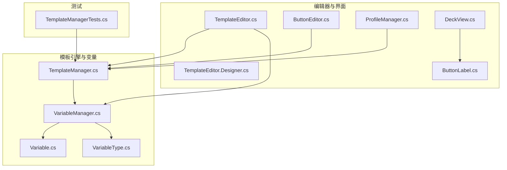
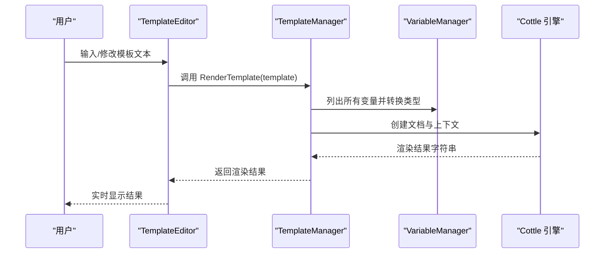
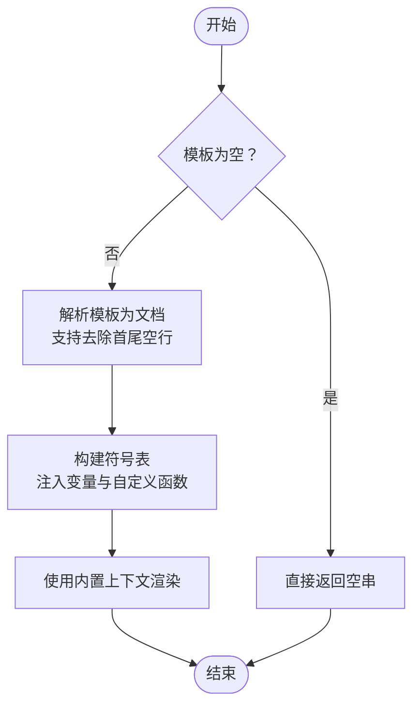
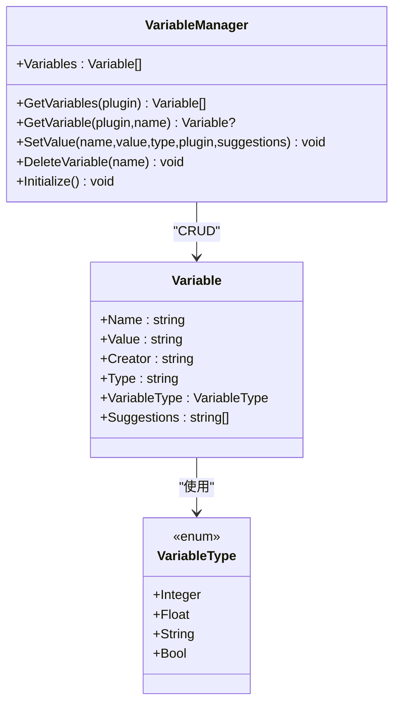
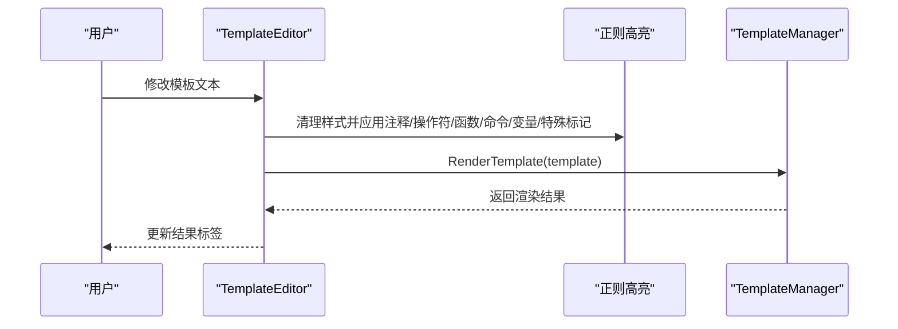
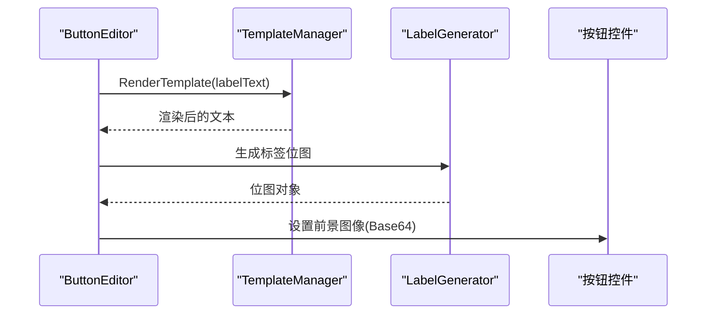
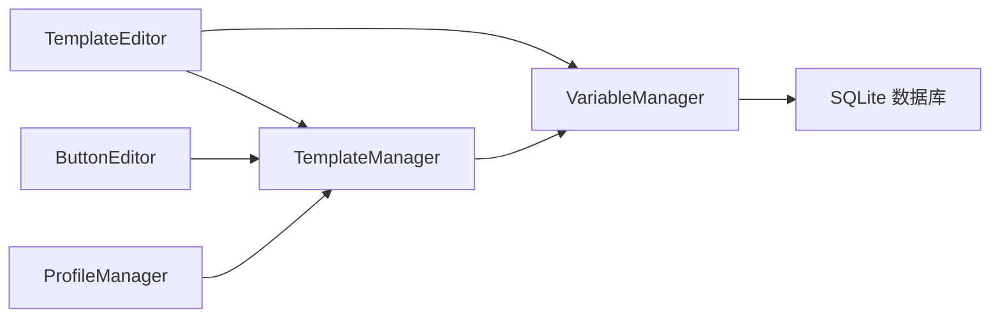

# 模板系统

<cite>
**本文引用的文件**
- [TemplateManager.cs](file://src/MacroDeck/CottleIntegration/TemplateManager.cs)
- [VariableManager.cs](file://src/MacroDeck/Variables/VariableManager.cs)
- [Variable.cs](file://src/MacroDeck/Variables/Variable.cs)
- [VariableType.cs](file://src/MacroDeck/Variables/VariableType.cs)
- [TemplateEditor.cs](file://src/MacroDeck/GUI/Dialogs/TemplateEditor.cs)
- [TemplateEditor.Designer.cs](file://src/MacroDeck/GUI/Dialogs/TemplateEditor.Designer.cs)
- [TemplateManagerTests.cs](file://tests/MacroDeck.Tests/TemplateManagerTests.cs)
- [ButtonLabel.cs](file://src/MacroDeck/ActionButton/ButtonLabel.cs)
- [ButtonEditor.cs](file://src/MacroDeck/GUI/Dialogs/ButtonEditor.cs)
- [ProfileManager.cs](file://src/MacroDeck/Profiles/ProfileManager.cs)
- [DeckView.cs](file://src/MacroDeck/GUI/MainWindowViews/DeckView.cs)
</cite>

## 目录
1. [简介](#简介)
2. [项目结构](#项目结构)
3. [核心组件](#核心组件)
4. [架构总览](#架构总览)
5. [组件详解](#组件详解)
6. [依赖关系分析](#依赖关系分析)
7. [性能与缓存](#性能与缓存)
8. [故障排查指南](#故障排查指南)
9. [结论](#结论)
10. [附录：模板语法参考](#附录模板语法参考)

## 简介
本文件系统性阐述 Macro-Deck 的模板系统，重点覆盖以下方面：
- Cottle 模板引擎的集成方式与关键字体系
- TemplateManager 的实现、模板解析与渲染流程
- 模板变量系统（VariableManager、Variable、VariableType）及其与模板的绑定
- 模板编辑器（TemplateEditor）的功能与使用方法（语法高亮、变量预览、实时渲染）
- 模板在按钮标签、设备显示等界面元素中的应用
- 模板语法参考（条件、循环、自定义函数）、性能优化与缓存策略建议
- 面向模板开发者与用户的完整使用指导

## 项目结构
模板系统相关的核心文件分布如下：
- 引擎与管理
  - Cottle 集成：TemplateManager.cs
  - 变量系统：VariableManager.cs、Variable.cs、VariableType.cs
- 编辑器与界面
  - 模板编辑器：TemplateEditor.cs、TemplateEditor.Designer.cs
  - 按钮标签与预览：ButtonLabel.cs、ButtonEditor.cs
  - 配置与展示：ProfileManager.cs、DeckView.cs
- 测试
  - TemplateManagerTests.cs

图表来源
- [TemplateManager.cs:1-181](file://src/MacroDeck/CottleIntegration/TemplateManager.cs#L1-L181)
- [VariableManager.cs:1-249](file://src/MacroDeck/Variables/VariableManager.cs#L1-L249)
- [Variable.cs:1-16](file://src/MacroDeck/Variables/Variable.cs#L1-L16)
- [VariableType.cs:1-10](file://src/MacroDeck/Variables/VariableType.cs#L1-L10)
- [TemplateEditor.cs:1-174](file://src/MacroDeck/GUI/Dialogs/TemplateEditor.cs#L1-L174)
- [TemplateEditor.Designer.cs:1-323](file://src/MacroDeck/GUI/Dialogs/TemplateEditor.Designer.cs#L1-L323)
- [ButtonLabel.cs:1-69](file://src/MacroDeck/ActionButton/ButtonLabel.cs#L1-L69)
- [ButtonEditor.cs:141-178](file://src/MacroDeck/GUI/Dialogs/ButtonEditor.cs#L141-L178)
- [ProfileManager.cs:149-181](file://src/MacroDeck/Profiles/ProfileManager.cs#L149-L181)
- [DeckView.cs:233-266](file://src/MacroDeck/GUI/MainWindowViews/DeckView.cs#L233-L266)
- [TemplateManagerTests.cs:1-71](file://tests/MacroDeck.Tests/TemplateManagerTests.cs#L1-L71)

章节来源
- [TemplateManager.cs:1-181](file://src/MacroDeck/CottleIntegration/TemplateManager.cs#L1-L181)
- [VariableManager.cs:1-249](file://src/MacroDeck/Variables/VariableManager.cs#L1-L249)
- [TemplateEditor.cs:1-174](file://src/MacroDeck/GUI/Dialogs/TemplateEditor.cs#L1-L174)

## 核心组件
- TemplateManager：负责模板解析、关键字收集、变量注入、自定义函数注册以及最终渲染。
- VariableManager：负责变量的持久化存储、类型转换、事件通知与模板渲染入口兼容。
- Variable/VariableType：定义变量模型与类型枚举。
- TemplateEditor：提供模板编辑、语法高亮、变量插入、实时渲染与“去除首尾空行”开关。
- ButtonLabel/ButtonEditor/ProfileManager/DeckView：模板在按钮标签生成与界面展示中的应用链路。

章节来源
- [TemplateManager.cs:8-181](file://src/MacroDeck/CottleIntegration/TemplateManager.cs#L8-L181)
- [VariableManager.cs:10-249](file://src/MacroDeck/Variables/VariableManager.cs#L10-L249)
- [Variable.cs:5-16](file://src/MacroDeck/Variables/Variable.cs#L5-L16)
- [VariableType.cs:3-10](file://src/MacroDeck/Variables/VariableType.cs#L3-L10)
- [TemplateEditor.cs:12-174](file://src/MacroDeck/GUI/Dialogs/TemplateEditor.cs#L12-L174)
- [ButtonLabel.cs:6-69](file://src/MacroDeck/ActionButton/ButtonLabel.cs#L6-L69)
- [ButtonEditor.cs:141-178](file://src/MacroDeck/GUI/Dialogs/ButtonEditor.cs#L141-L178)
- [ProfileManager.cs:149-181](file://src/MacroDeck/Profiles/ProfileManager.cs#L149-L181)
- [DeckView.cs:233-266](file://src/MacroDeck/GUI/MainWindowViews/DeckView.cs#L233-L266)

## 架构总览
模板系统采用“引擎 + 变量 + 编辑器 + 应用”的分层设计：
- 引擎层：基于 Cottle，通过 TemplateManager 统一解析与渲染。
- 变量层：VariableManager 提供变量 CRUD、类型转换与事件；模板渲染时注入变量与自定义函数。
- 编辑器层：TemplateEditor 提供语法高亮、自动补全、变量插入、实时渲染与“去除首尾空行”。
- 应用层：按钮标签生成、设备显示等场景调用 TemplateManager 进行渲染。

图表来源
- [TemplateEditor.cs:69-91](file://src/MacroDeck/GUI/Dialogs/TemplateEditor.cs#L69-L91)
- [TemplateManager.cs:53-88](file://src/MacroDeck/CottleIntegration/TemplateManager.cs#L53-L88)
- [VariableManager.cs:23-27](file://src/MacroDeck/Variables/VariableManager.cs#L23-L27)

## 组件详解

### TemplateManager：模板解析与渲染
- 关键字体系：集中维护操作符、内置函数、控制命令与特殊标记，用于编辑器高亮与自动补全。
- 文档配置：支持“去除首尾空行”模式（通过特殊前缀触发），避免模板缩进导致的多余空白。
- 变量注入：遍历 VariableManager 中的变量，按类型转换为 Cottle Value 并注入上下文。
- 自定义函数：提供时间戳、定时器结束等常用函数，便于模板侧进行时间相关处理。
- 渲染流程：构建文档 → 注入变量与函数 → 使用内置上下文渲染 → 返回字符串；异常时返回错误信息。

图表来源
- [TemplateManager.cs:53-88](file://src/MacroDeck/CottleIntegration/TemplateManager.cs#L53-L88)
- [TemplateManager.cs:90-132](file://src/MacroDeck/CottleIntegration/TemplateManager.cs#L90-L132)
- [TemplateManager.cs:159-179](file://src/MacroDeck/CottleIntegration/TemplateManager.cs#L159-L179)

章节来源
- [TemplateManager.cs:8-181](file://src/MacroDeck/CottleIntegration/TemplateManager.cs#L8-L181)

### 变量系统：VariableManager、Variable、VariableType
- VariableManager
  - 数据库：SQLite 存储变量，初始化时建表并清理异常数据。
  - 类型转换：根据 VariableType 对输入值进行解析与格式化，确保数值区域的分隔符正确。
  - 事件：变量变更与删除触发事件，供上层刷新。
  - 兼容接口：提供旧版渲染入口，现统一委托给 TemplateManager。
- Variable/VariableType
  - 变量实体：名称、值、创建者、类型、建议值等字段。
  - 类型枚举：整数、浮点、字符串、布尔四种基础类型。

图表来源
- [VariableManager.cs:10-249](file://src/MacroDeck/Variables/VariableManager.cs#L10-L249)
- [Variable.cs:5-16](file://src/MacroDeck/Variables/Variable.cs#L5-L16)
- [VariableType.cs:3-10](file://src/MacroDeck/Variables/VariableType.cs#L3-L10)

章节来源
- [VariableManager.cs:10-249](file://src/MacroDeck/Variables/VariableManager.cs#L10-L249)
- [Variable.cs:5-16](file://src/MacroDeck/Variables/Variable.cs#L5-L16)
- [VariableType.cs:3-10](file://src/MacroDeck/Variables/VariableType.cs#L3-L10)

### 模板编辑器：TemplateEditor
- 功能概览
  - 实时渲染：文本变化即调用 TemplateManager.RenderTemplate 并更新结果标签。
  - 语法高亮：对注释、操作符、内置函数、控制命令、变量名与特殊标记分别着色。
  - 自动补全：基于 TemplateManager.AllKeywords 与变量名集合提供智能提示。
  - 快捷插入：提供 If/And/Or/Not 等常用片段快速插入。
  - 变量面板：点击“变量”弹出菜单，选择变量名插入到光标处。
  - 去除首尾空行：勾选后在模板前插入特殊标记，渲染时启用首尾空行裁剪。
- 设计要点
  - 使用 FastColoredTextBox 作为编辑器控件，配置注释前缀、括号自动匹配、字体与颜色主题。
  - 正则表达式按类别匹配高亮，编译后提升性能。
  - AutocompleteMenu 将关键字与变量名合并，形成统一的补全源。

图表来源
- [TemplateEditor.cs:69-91](file://src/MacroDeck/GUI/Dialogs/TemplateEditor.cs#L69-L91)
- [TemplateEditor.Designer.cs:35-323](file://src/MacroDeck/GUI/Dialogs/TemplateEditor.Designer.cs#L35-L323)

章节来源
- [TemplateEditor.cs:12-174](file://src/MacroDeck/GUI/Dialogs/TemplateEditor.cs#L12-L174)
- [TemplateEditor.Designer.cs:1-323](file://src/MacroDeck/GUI/Dialogs/TemplateEditor.Designer.cs#L1-L323)

### 模板在界面中的应用
- 按钮标签生成
  - ButtonEditor 在预览按钮标签时，先调用 TemplateManager.RenderTemplate 渲染文本，再通过 LabelGenerator 生成位图并编码为 Base64，供按钮显示。
- 按钮状态标签
  - ProfileManager 在变量变更时批量更新按钮标签，分别渲染“开/关”两种状态下的标签文本，并生成对应图标。
- 界面展示
  - DeckView 从按钮模型读取已生成的 Base64 图像并设置为按钮前景图，完成最终展示。

图表来源
- [ButtonEditor.cs:141-178](file://src/MacroDeck/GUI/Dialogs/ButtonEditor.cs#L141-L178)
- [ProfileManager.cs:156-181](file://src/MacroDeck/Profiles/ProfileManager.cs#L156-L181)
- [DeckView.cs:233-266](file://src/MacroDeck/GUI/MainWindowViews/DeckView.cs#L233-L266)

章节来源
- [ButtonEditor.cs:141-178](file://src/MacroDeck/GUI/Dialogs/ButtonEditor.cs#L141-L178)
- [ProfileManager.cs:149-181](file://src/MacroDeck/Profiles/ProfileManager.cs#L149-L181)
- [DeckView.cs:233-266](file://src/MacroDeck/GUI/MainWindowViews/DeckView.cs#L233-L266)

## 依赖关系分析
- TemplateManager 依赖 Cottle 引擎与 VariableManager，负责模板解析与渲染。
- TemplateEditor 依赖 TemplateManager 与 VariableManager，提供编辑体验与实时反馈。
- ButtonEditor/ProfileManager 依赖 TemplateManager，将模板渲染结果用于按钮标签生成。
- VariableManager 依赖 SQLite，提供变量持久化与类型转换。

图表来源
- [TemplateManager.cs:1-181](file://src/MacroDeck/CottleIntegration/TemplateManager.cs#L1-L181)
- [VariableManager.cs:1-249](file://src/MacroDeck/Variables/VariableManager.cs#L1-L249)
- [TemplateEditor.cs:1-174](file://src/MacroDeck/GUI/Dialogs/TemplateEditor.cs#L1-L174)
- [ButtonEditor.cs:141-178](file://src/MacroDeck/GUI/Dialogs/ButtonEditor.cs#L141-L178)
- [ProfileManager.cs:149-181](file://src/MacroDeck/Profiles/ProfileManager.cs#L149-L181)

章节来源
- [TemplateManager.cs:1-181](file://src/MacroDeck/CottleIntegration/TemplateManager.cs#L1-L181)
- [VariableManager.cs:1-249](file://src/MacroDeck/Variables/VariableManager.cs#L1-L249)

## 性能与缓存
- 渲染性能
  - 使用 FastColoredTextBox 的正则高亮与编译正则，减少重复计算。
  - 模板渲染在文本变更时触发，建议在高频输入场景下考虑节流或防抖以降低 CPU 占用。
- 缓存策略
  - 模板渲染结果未在引擎层做显式缓存；可结合业务场景在调用方（如按钮标签生成）缓存最近渲染结果，避免重复渲染相同模板。
  - 对于频繁访问的静态模板，可在应用层引入轻量缓存（如内存字典）以减少重复解析与渲染。
- 数据库与变量
  - VariableManager 初始化时建表并清理异常数据，保证变量存储一致性；变量变更触发事件，便于上层及时刷新。

章节来源
- [TemplateEditor.cs:69-91](file://src/MacroDeck/GUI/Dialogs/TemplateEditor.cs#L69-L91)
- [VariableManager.cs:204-212](file://src/MacroDeck/Variables/VariableManager.cs#L204-L212)

## 故障排查指南
- 渲染报错
  - TemplateManager 在渲染异常时会返回包含错误信息的字符串，便于定位问题。
- 变量类型不匹配
  - VariableManager 在设置变量值时会按类型进行解析与格式化，若输入非法，将回退到默认值并记录日志。
- 编辑器无高亮或补全
  - 检查 TemplateManager.AllKeywords 是否包含所需关键字；确认变量列表是否正确加载。
- 首尾空行问题
  - 若期望去除首尾空行，请在模板前添加特殊标记；编辑器提供勾选开关辅助处理。

章节来源
- [TemplateManager.cs:76-88](file://src/MacroDeck/CottleIntegration/TemplateManager.cs#L76-L88)
- [VariableManager.cs:80-134](file://src/MacroDeck/Variables/VariableManager.cs#L80-L134)
- [TemplateEditor.cs:38-67](file://src/MacroDeck/GUI/Dialogs/TemplateEditor.cs#L38-L67)

## 结论
Macro-Deck 的模板系统以 Cottle 为核心，结合本地变量数据库与可视化编辑器，实现了从语法高亮、实时渲染到界面应用的完整闭环。TemplateManager 提供了稳定的解析与渲染能力，VariableManager 提供可靠的变量持久化与类型转换，TemplateEditor 则显著提升了模板编写效率与准确性。在实际使用中，建议结合业务场景对渲染结果进行缓存，并在高频输入时注意性能优化。

## 附录：模板语法参考
- 基础语法
  - 使用花括号包裹表达式与语句。
  - 支持字符串、数字、布尔等字面量与变量引用。
- 控制结构
  - 条件：if/elif/else
  - 循环：for、while
- 内置函数与操作符
  - 函数族：abs、add、cat、ceil、cos、div、eq、filter、find、floor、format、ge、gt、has、join、lcase、le、len、lt、map、match、max、min、mod、mul、ne、pow、rand、range、round、sin、slice、sort、split、sub、token、type、ucase、union、when、xor、zip 等。
  - 操作符：and、cmp、default、defined、eq、ge、gt、has、le、lt、ne、not、or、xor、when、declare、as、dump、echo、empty、set、to、return、true、false、void 等。
- 特殊标记
  - 去除首尾空行：在模板开头放置特定标记以启用该行为。
- 自定义函数
  - getdatetime：按指定格式输出当前时间。
  - gettimestamp：获取高精度时间戳。
  - gettimerend：计算从传入时间戳起的耗时。
- 变量系统
  - 变量名大小写不敏感，空格与部分特殊字符会被替换为下划线；支持德文字母变体替换。
  - 变量类型：整数、浮点、字符串、布尔；设置时会进行类型转换与格式化。
- 应用示例
  - 按钮标签：在按钮编辑器中使用模板渲染文本，再生成位图并显示。
  - 设备显示：在界面视图中读取已生成的 Base64 图像并设置为按钮前景图。

章节来源
- [TemplateManager.cs:12-29](file://src/MacroDeck/CottleIntegration/TemplateManager.cs#L12-L29)
- [TemplateManager.cs:148-155](file://src/MacroDeck/CottleIntegration/TemplateManager.cs#L148-L155)
- [VariableManager.cs:225-247](file://src/MacroDeck/Variables/VariableManager.cs#L225-L247)
- [TemplateEditor.cs:145-152](file://src/MacroDeck/GUI/Dialogs/TemplateEditor.cs#L145-L152)