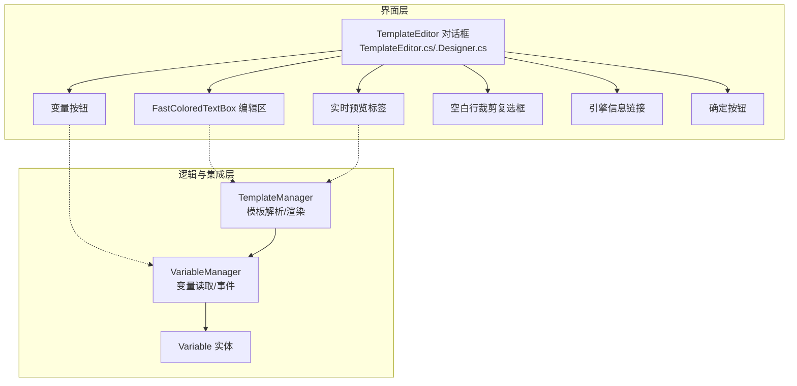
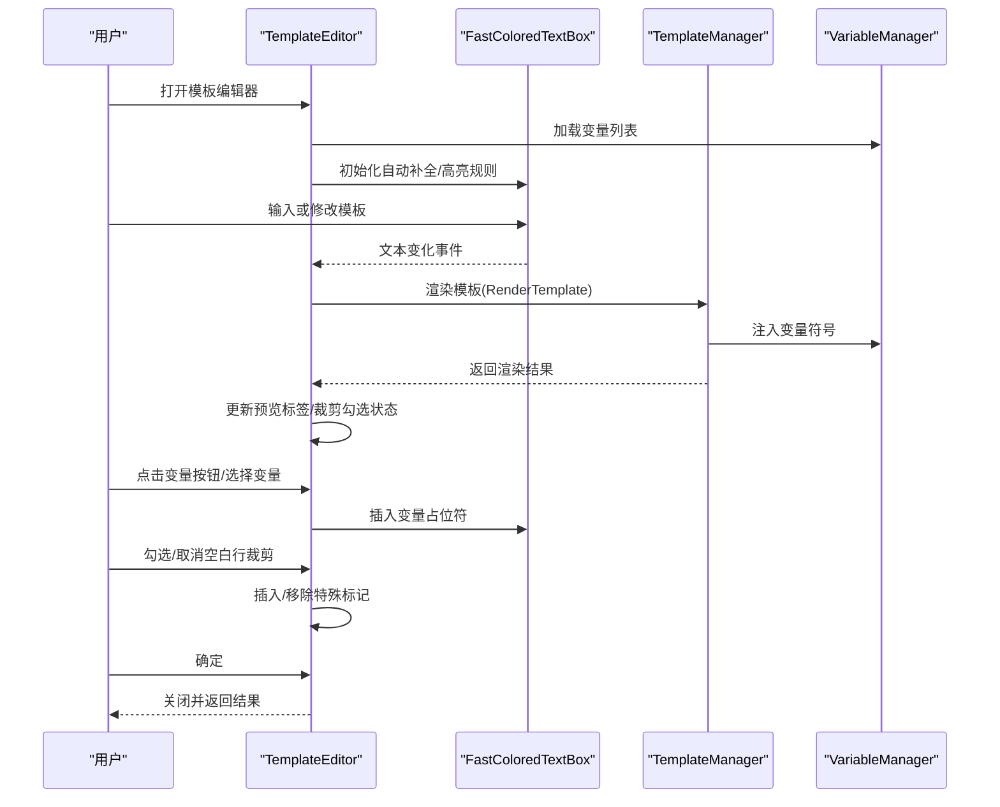
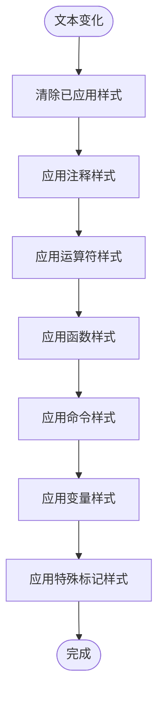
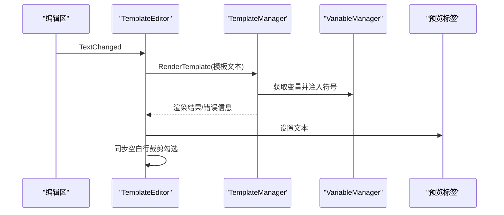
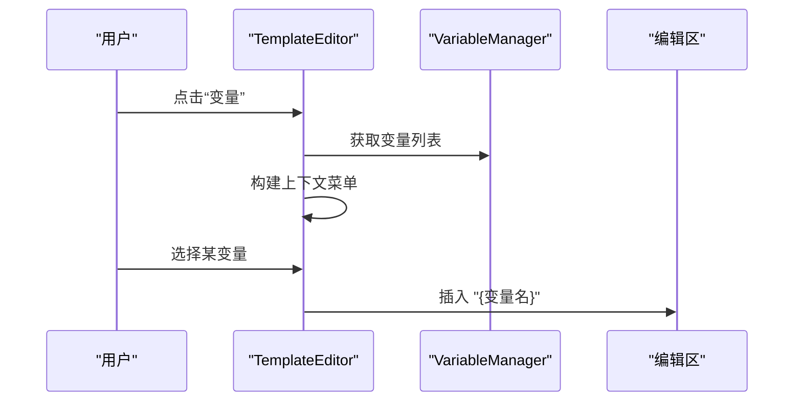
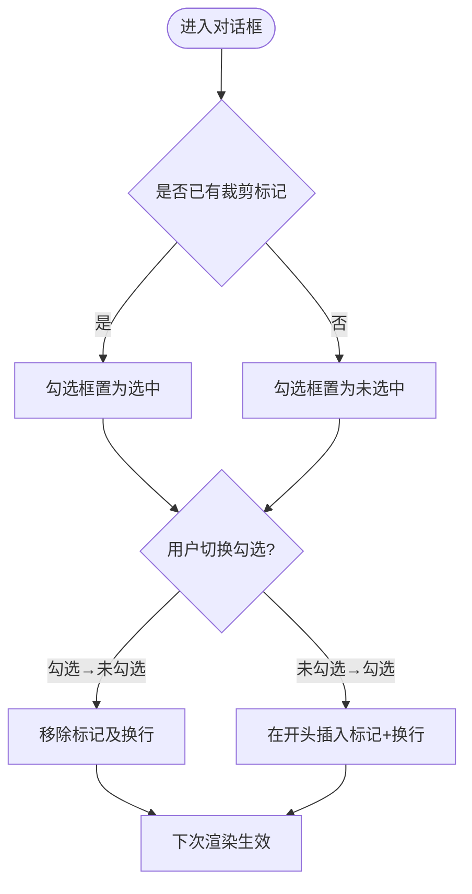
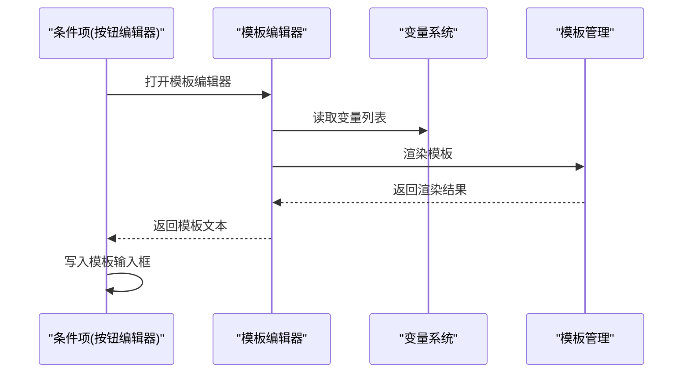
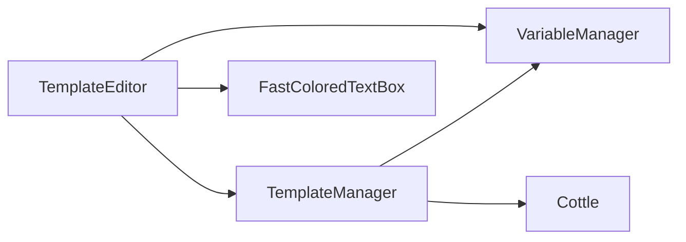

# 模板编辑器界面

<cite>
**本文引用的文件**
- [TemplateEditor.cs](file://src/MacroDeck/GUI/Dialogs/TemplateEditor.cs)
- [TemplateEditor.Designer.cs](file://src/MacroDeck/GUI/Dialogs/TemplateEditor.Designer.cs)
- [TemplateManager.cs](file://src/MacroDeck/CottleIntegration/TemplateManager.cs)
- [VariableManager.cs](file://src/MacroDeck/Variables/VariableManager.cs)
- [Variable.cs](file://src/MacroDeck/Variables/Variable.cs)
- [ConditionItem.cs](file://src/MacroDeck/GUI/CustomControls/ButtonEditor/ConditionItem.cs)
- [ConditionItem.Designer.cs](file://src/MacroDeck/GUI/CustomControls/ButtonEditor/ConditionItem.Designer.cs)
- [TemplateEditor.resx](file://src/MacroDeck/GUI/Dialogs/TemplateEditor.resx)
- [TemplateManagerTests.cs](file://tests/MacroDeck.Tests/TemplateManagerTests.cs)
</cite>

## 目录
1. [简介](#简介)
2. [项目结构](#项目结构)
3. [核心组件](#核心组件)
4. [架构总览](#架构总览)
5. [详细组件分析](#详细组件分析)
6. [依赖分析](#依赖分析)
7. [性能考虑](#性能考虑)
8. [故障排查指南](#故障排查指南)
9. [结论](#结论)
10. [附录](#附录)

## 简介
本文件面向 Macro-Deck 的“模板编辑器”（TemplateEditor）对话框，提供从界面设计到渲染机制、语法高亮、变量与模板联动、导航与辅助功能、验证与错误处理、保存与导入导出、以及与系统其他组件的集成关系的完整说明。同时给出用户体验优化建议、无障碍支持要点、最佳实践与定制化配置方法。

## 项目结构
TemplateEditor 是一个 WinForms 对话框，位于 GUI/Dialogs 下；其语法高亮与模板渲染由 Cottle 集成层 TemplateManager 提供；变量数据来自 VariableManager 与数据库；在按钮编辑器中通过“打开模板编辑器”按钮与之集成。

图表来源
- [TemplateEditor.cs:12-67](file://src/MacroDeck/GUI/Dialogs/TemplateEditor.cs#L12-L67)
- [TemplateEditor.Designer.cs:35-306](file://src/MacroDeck/GUI/Dialogs/TemplateEditor.Designer.cs#L35-L306)
- [TemplateManager.cs:8-57](file://src/MacroDeck/CottleIntegration/TemplateManager.cs#L8-L57)
- [VariableManager.cs:10-27](file://src/MacroDeck/Variables/VariableManager.cs#L10-L27)
- [Variable.cs:5-15](file://src/MacroDeck/Variables/Variable.cs#L5-L15)

章节来源
- [TemplateEditor.cs:12-67](file://src/MacroDeck/GUI/Dialogs/TemplateEditor.cs#L12-L67)
- [TemplateEditor.Designer.cs:35-306](file://src/MacroDeck/GUI/Dialogs/TemplateEditor.Designer.cs#L35-L306)

## 核心组件
- TemplateEditor：对话框主体，负责界面布局、控件组织、用户交互、语法高亮、实时预览、变量插入、空白行裁剪开关等。
- TemplateManager：提供模板关键字集合、函数/命令/运算符/特殊标记识别、模板文档构建、变量注入、自定义函数注入、模板渲染与错误包装。
- VariableManager：提供变量列表、变量变更事件、变量类型转换与持久化。
- Variable：变量实体，包含名称、值、类型、创建者等。
- 按钮编辑器中的条件项：在“条件类型=模板”时，提供打开模板编辑器的入口，用于配置模板表达式。

章节来源
- [TemplateEditor.cs:12-173](file://src/MacroDeck/GUI/Dialogs/TemplateEditor.cs#L12-L173)
- [TemplateManager.cs:8-181](file://src/MacroDeck/CottleIntegration/TemplateManager.cs#L8-L181)
- [VariableManager.cs:10-249](file://src/MacroDeck/Variables/VariableManager.cs#L10-L249)
- [Variable.cs:5-15](file://src/MacroDeck/Variables/Variable.cs#L5-L15)
- [ConditionItem.cs:336-343](file://src/MacroDeck/GUI/CustomControls/ButtonEditor/ConditionItem.cs#L336-L343)

## 架构总览
TemplateEditor 以 FastColoredTextBox 作为编辑区，结合正则样式表对模板进行语法高亮；每次文本变化触发 TemplateManager 渲染，将结果写入预览标签；变量按钮弹出上下文菜单，点击后将变量名插入光标位置；空白行裁剪复选框与内部特殊标记配合，控制首尾空白行的去除；模板编辑器与按钮编辑器通过“打开模板编辑器”按钮打通。

图表来源
- [TemplateEditor.cs:48-91](file://src/MacroDeck/GUI/Dialogs/TemplateEditor.cs#L48-L91)
- [TemplateManager.cs:69-88](file://src/MacroDeck/CottleIntegration/TemplateManager.cs#L69-L88)
- [VariableManager.cs:23-27](file://src/MacroDeck/Variables/VariableManager.cs#L23-L27)

## 详细组件分析

### 界面布局与控件组织
- 主要控件
  - 编辑区：FastColoredTextBox，支持括号自动补全、注释前缀、自动缩进模式、热键资源、滚动与选择色等。
  - 实时预览：Label，显示 TemplateManager.RenderTemplate 的结果。
  - 变量按钮：弹出上下文菜单，列出所有变量名，点击插入形如 “{变量名}”。
  - 条件按钮：If/And/Or/Not 快捷片段插入。
  - 空白行裁剪：CheckBox，与内部特殊标记配合，控制首尾空白行去除。
  - 引擎信息：LinkLabel，跳转至 Cottle 官方文档。
  - 确定：关闭对话框并返回 OK。
- 设计器初始化：控件尺寸、颜色、字体、事件绑定均在设计器中完成。

章节来源
- [TemplateEditor.Designer.cs:35-306](file://src/MacroDeck/GUI/Dialogs/TemplateEditor.Designer.cs#L35-L306)
- [TemplateEditor.resx:120-121](file://src/MacroDeck/GUI/Dialogs/TemplateEditor.resx#L120-L121)

### 语法高亮与自动补全
- 高亮样式
  - 函数、注释、运算符、命令、变量、特殊标记分别设置不同样式。
- 正则匹配
  - 注释：以 “{_” 开头的注释块。
  - 运算符/函数/命令/特殊标记：基于 TemplateManager 中的集合生成单词边界正则。
  - 变量：基于 VariableManager 列表生成变量名正则。
- 自动补全
  - 使用 AutocompleteMenu，候选项来源于 TemplateManager.AllKeywords 与变量名列表。

图表来源
- [TemplateEditor.cs:75-91](file://src/MacroDeck/GUI/Dialogs/TemplateEditor.cs#L75-L91)
- [TemplateManager.cs:12-29](file://src/MacroDeck/CottleIntegration/TemplateManager.cs#L12-L29)

章节来源
- [TemplateEditor.cs:16-35](file://src/MacroDeck/GUI/Dialogs/TemplateEditor.cs#L16-L35)
- [TemplateEditor.cs:63-63](file://src/MacroDeck/GUI/Dialogs/TemplateEditor.cs#L63-L63)

### 实时预览与动态更新
- 触发时机：编辑区文本变化即触发。
- 渲染流程：调用 TemplateManager.RenderTemplate，内部构建文档并注入变量与自定义函数，返回渲染字符串；异常时返回带错误前缀的结果。
- 预览更新：将结果写入预览标签，同时同步空白行裁剪勾选状态。

图表来源
- [TemplateEditor.cs:69-71](file://src/MacroDeck/GUI/Dialogs/TemplateEditor.cs#L69-L71)
- [TemplateManager.cs:69-88](file://src/MacroDeck/CottleIntegration/TemplateManager.cs#L69-L88)

章节来源
- [TemplateEditor.cs:69-71](file://src/MacroDeck/GUI/Dialogs/TemplateEditor.cs#L69-L71)
- [TemplateManager.cs:69-88](file://src/MacroDeck/CottleIntegration/TemplateManager.cs#L69-L88)

### 变量预览与插入
- 变量列表：启动时从 VariableManager.ListVariables 获取全部变量。
- 弹出菜单：点击“变量”按钮，动态生成菜单项，点击后将变量名插入到编辑区光标处。
- 类型注入：TemplateManager 在渲染前将变量按类型转换为 Cottle Value 并注入上下文。

图表来源
- [TemplateEditor.cs:121-143](file://src/MacroDeck/GUI/Dialogs/TemplateEditor.cs#L121-L143)
- [VariableManager.cs:23-27](file://src/MacroDeck/Variables/VariableManager.cs#L23-L27)
- [TemplateManager.cs:90-124](file://src/MacroDeck/CottleIntegration/TemplateManager.cs#L90-L124)

章节来源
- [TemplateEditor.cs:121-143](file://src/MacroDeck/GUI/Dialogs/TemplateEditor.cs#L121-L143)
- [VariableManager.cs:23-27](file://src/MacroDeck/Variables/VariableManager.cs#L23-L27)
- [TemplateManager.cs:90-124](file://src/MacroDeck/CottleIntegration/TemplateManager.cs#L90-L124)

### 导航与快捷操作
- 快捷片段：提供 If/And/Or/Not 四个常用模板片段一键插入。
- 注释：编辑区支持注释前缀 “{_”，并被高亮识别。
- 热键：编辑区热键资源覆盖查找、替换、撤销重做、缩放、列选择等常用操作。
- 自动补全：Ctrl+Space 触发 AutocompleteMenu，候选项包含关键字与变量名。

章节来源
- [TemplateEditor.cs:101-119](file://src/MacroDeck/GUI/Dialogs/TemplateEditor.cs#L101-L119)
- [TemplateEditor.Designer.cs:56-68](file://src/MacroDeck/GUI/Dialogs/TemplateEditor.Designer.cs#L56-L68)
- [TemplateEditor.resx:120-121](file://src/MacroDeck/GUI/Dialogs/TemplateEditor.resx#L120-L121)

### 空白行裁剪机制
- 特殊标记：内部使用固定前缀作为裁剪标记。
- 勾选行为：
  - 勾选且当前无标记：在模板开头插入标记与换行。
  - 取消勾选且存在标记：移除标记与对应换行。
- 渲染行为：TemplateManager 根据是否存在标记决定是否裁剪首尾空白行。

图表来源
- [TemplateEditor.cs:38-38](file://src/MacroDeck/GUI/Dialogs/TemplateEditor.cs#L38-L38)
- [TemplateEditor.cs:160-172](file://src/MacroDeck/GUI/Dialogs/TemplateEditor.cs#L160-L172)
- [TemplateManager.cs:31-51](file://src/MacroDeck/CottleIntegration/TemplateManager.cs#L31-L51)

章节来源
- [TemplateEditor.cs:160-172](file://src/MacroDeck/GUI/Dialogs/TemplateEditor.cs#L160-L172)
- [TemplateManager.cs:31-51](file://src/MacroDeck/CottleIntegration/TemplateManager.cs#L31-L51)

### 模板验证与错误检测
- 渲染异常捕获：TemplateManager.RenderTemplate 包裹 try/catch，异常时返回带错误前缀的字符串，确保界面不会崩溃。
- 关键字完整性：单元测试保证 AllKeywords 不含空值且长度等于各集合长度之和。
- 裁剪行为验证：单元测试覆盖无标记与有标记两种渲染结果。

章节来源
- [TemplateManager.cs:76-88](file://src/MacroDeck/CottleIntegration/TemplateManager.cs#L76-L88)
- [TemplateManagerTests.cs:10-40](file://tests/MacroDeck.Tests/TemplateManagerTests.cs#L10-L40)
- [TemplateManagerTests.cs:42-70](file://tests/MacroDeck.Tests/TemplateManagerTests.cs#L42-L70)

### 保存与导入导出
- 对话框本身不直接提供保存/导入导出按钮；其职责是编辑与预览。
- 实际保存通常发生在调用方（例如按钮编辑器的条件项）中，模板编辑器返回编辑后的模板文本，由调用方负责序列化与持久化。
- 若需扩展导入导出，可在对话框中增加相应按钮与逻辑，并与现有变量/模板存储机制对接。

章节来源
- [TemplateEditor.cs:154-158](file://src/MacroDeck/GUI/Dialogs/TemplateEditor.cs#L154-L158)
- [ConditionItem.Designer.cs:386-392](file://src/MacroDeck/GUI/CustomControls/ButtonEditor/ConditionItem.Designer.cs#L386-L392)

### 与系统组件的集成
- 与按钮编辑器集成：当条件类型为“模板”时，显示“打开模板编辑器”按钮，点击后弹出 TemplateEditor，编辑完成后回填到模板输入框。
- 与变量系统集成：变量列表与类型注入贯穿于模板渲染过程，确保表达式可正确引用变量。
- 与语言本地化集成：界面文本通过语言管理器加载，支持多语言显示。

图表来源
- [ConditionItem.cs:336-343](file://src/MacroDeck/GUI/CustomControls/ButtonEditor/ConditionItem.cs#L336-L343)
- [TemplateEditor.cs:48-67](file://src/MacroDeck/GUI/Dialogs/TemplateEditor.cs#L48-L67)
- [VariableManager.cs:23-27](file://src/MacroDeck/Variables/VariableManager.cs#L23-L27)
- [TemplateManager.cs:69-88](file://src/MacroDeck/CottleIntegration/TemplateManager.cs#L69-L88)

## 依赖分析
- 组件耦合
  - TemplateEditor 依赖 TemplateManager（渲染）、VariableManager（变量）、AutocompleteMenu（自动补全）、FastColoredTextBox（编辑与高亮）。
  - TemplateManager 依赖 Cottle（文档与上下文）、VariableManager（变量注入）。
- 外部依赖
  - FastColoredTextBoxNS：编辑器与高亮。
  - Cottle：模板引擎。
- 潜在循环依赖
  - 当前未见循环依赖；若后续扩展，避免在 TemplateEditor 中直接反向依赖 VariableManager 的持久化细节。

图表来源
- [TemplateEditor.cs:1-8](file://src/MacroDeck/GUI/Dialogs/TemplateEditor.cs#L1-L8)
- [TemplateManager.cs:1-5](file://src/MacroDeck/CottleIntegration/TemplateManager.cs#L1-L5)

章节来源
- [TemplateEditor.cs:1-8](file://src/MacroDeck/GUI/Dialogs/TemplateEditor.cs#L1-L8)
- [TemplateManager.cs:1-5](file://src/MacroDeck/CottleIntegration/TemplateManager.cs#L1-L5)

## 性能考虑
- 正则编译：关键字与变量正则均使用 RegexOptions.Compiled，减少重复编译开销。
- 样式更新范围：仅对变更区域清除与应用样式，避免全量重绘。
- 渲染异常保护：捕获渲染异常，避免阻塞 UI 线程。
- 变量注入去重：按名称去重注入，避免重复键导致的上下文冲突。

章节来源
- [TemplateEditor.cs:23-35](file://src/MacroDeck/GUI/Dialogs/TemplateEditor.cs#L23-L35)
- [TemplateEditor.cs:75-91](file://src/MacroDeck/GUI/Dialogs/TemplateEditor.cs#L75-L91)
- [TemplateManager.cs:76-88](file://src/MacroDeck/CottleIntegration/TemplateManager.cs#L76-L88)
- [TemplateManager.cs:90-124](file://src/MacroDeck/CottleIntegration/TemplateManager.cs#L90-L124)

## 故障排查指南
- 预览显示“错误”：检查模板语法与变量名是否正确；确认变量类型与表达式兼容。
- 变量未生效：确认变量已在 VariableManager 中存在且类型匹配；检查变量名大小写与拼写。
- 注释未高亮：确认注释使用 “{_ ... _}” 形式；注意空格与换行。
- 热键无效：检查编辑区热键资源是否正确加载；确认未被其他控件拦截。
- 裁剪未生效：确认勾选状态与模板开头标记一致；检查是否误删换行。

章节来源
- [TemplateManager.cs:76-88](file://src/MacroDeck/CottleIntegration/TemplateManager.cs#L76-L88)
- [TemplateEditor.cs:23-35](file://src/MacroDeck/GUI/Dialogs/TemplateEditor.cs#L23-L35)
- [TemplateEditor.resx:120-121](file://src/MacroDeck/GUI/Dialogs/TemplateEditor.resx#L120-L121)

## 结论
TemplateEditor 通过 FastColoredTextBox 提供高效的模板编辑体验，结合 TemplateManager 的渲染与变量注入能力，实现了语法高亮、实时预览、变量插入与裁剪控制等功能。其与按钮编辑器、变量系统紧密集成，满足日常模板配置需求。建议在实际使用中遵循最佳实践，关注性能与错误处理，以获得稳定可靠的编辑体验。

## 附录

### 用户体验优化与无障碍支持
- 高对比度主题：编辑区背景与前景色适配深色主题，提升可读性。
- 键盘友好：内置大量编辑热键，支持快速导航、选择与编辑。
- 无障碍：为关键控件提供可读文本与可聚焦顺序；为链接提供外部打开行为。

章节来源
- [TemplateEditor.Designer.cs:71-94](file://src/MacroDeck/GUI/Dialogs/TemplateEditor.Designer.cs#L71-L94)
- [TemplateEditor.resx:120-121](file://src/MacroDeck/GUI/Dialogs/TemplateEditor.resx#L120-L121)

### 最佳实践与技巧
- 使用注释分段：利用 “{_ ... _}” 注释清晰标注模板逻辑。
- 变量命名规范：保持变量名简洁且具描述性，避免与关键字冲突。
- 分步调试：先写简单表达式，逐步加入复杂逻辑，借助实时预览核对结果。
- 裁剪策略：在需要紧凑输出时启用裁剪，在调试阶段可关闭以便观察换行。

章节来源
- [TemplateEditor.cs:23-35](file://src/MacroDeck/GUI/Dialogs/TemplateEditor.cs#L23-L35)
- [TemplateManager.cs:31-51](file://src/MacroDeck/CottleIntegration/TemplateManager.cs#L31-L51)

### 定制化选项与配置方法
- 自动补全候选项：可通过扩展 TemplateManager.AllKeywords 或变量列表来调整。
- 高亮样式：可修改样式对象与正则集，以适配团队风格。
- 热键与行为：通过编辑区资源与事件处理扩展更多快捷操作。
- 引擎信息：可修改 LinkLabel 目标链接指向更合适的帮助文档。

章节来源
- [TemplateEditor.cs:63-63](file://src/MacroDeck/GUI/Dialogs/TemplateEditor.cs#L63-L63)
- [TemplateEditor.Designer.cs:56-68](file://src/MacroDeck/GUI/Dialogs/TemplateEditor.Designer.cs#L56-L68)
- [TemplateEditor.cs:145-152](file://src/MacroDeck/GUI/Dialogs/TemplateEditor.cs#L145-L152)