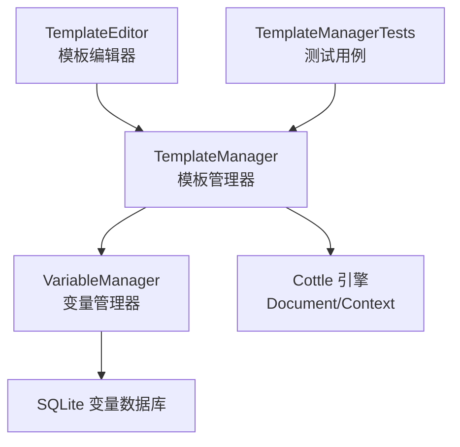
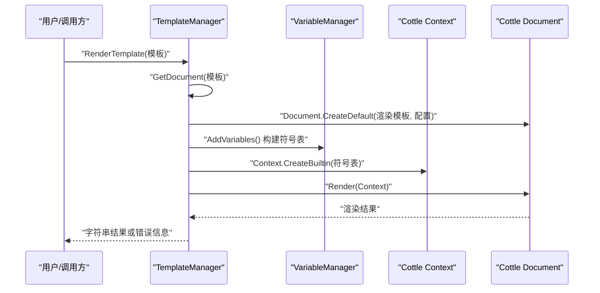
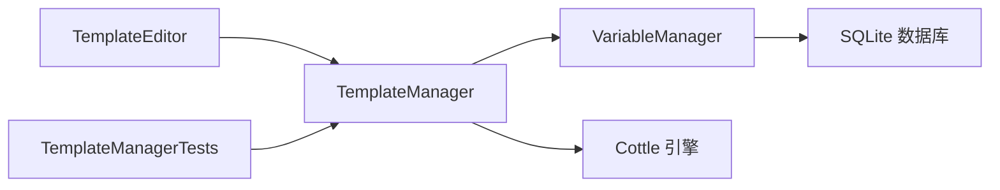

# 模板语法参考

<cite>
**本文档引用的文件**
- [TemplateManager.cs](file://src/MacroDeck/CottleIntegration/TemplateManager.cs)
- [TemplateEditor.cs](file://src/MacroDeck/GUI/Dialogs/TemplateEditor.cs)
- [VariableManager.cs](file://src/MacroDeck/Variables/VariableManager.cs)
- [Variable.cs](file://src/MacroDeck/Variables/Variable.cs)
- [VariableType.cs](file://src/MacroDeck/Variables/VariableType.cs)
- [TemplateManagerTests.cs](file://tests/MacroDeck.Tests/TemplateManagerTests.cs)
- [README.md](file://README.md)
</cite>

## 目录
1. [简介](#简介)
2. [项目结构](#项目结构)
3. [核心组件](#核心组件)
4. [架构总览](#架构总览)
5. [详细组件分析](#详细组件分析)
6. [依赖关系分析](#依赖关系分析)
7. [性能考量](#性能考量)
8. [故障排查指南](#故障排查指南)
9. [结论](#结论)
10. [附录](#附录)

## 简介
本参考文档面向 Macro-Deck 的模板系统，基于其对 Cottle 模板引擎的集成与扩展，系统梳理并说明：
- 可用操作符（and、or、not、eq、ne、lt、gt 等）及其使用方法与优先级
- 内置函数（abs、add、format、len、map、filter 等）的参数、返回值与典型用法
- 控制结构语法：if/elif/else 条件语句、for 循环与 while 循环
- 特殊标记 _trimblank_ 的作用与应用场景
- 模板变量引用语法与作用域规则
- 字符串插值、数字运算与布尔表达式
- 模板语法与标准 Cottle 语法的关系与差异
- 针对每类语法元素的实际示例与预期输出路径

## 项目结构
模板系统主要由以下模块构成：
- 模板管理器：负责模板解析、渲染、关键字收集与自定义函数注入
- 变量管理器：提供模板中可用的变量符号表（变量名到值）
- 模板编辑器：提供高亮、自动补全与片段插入，辅助编写模板
- 测试用例：覆盖基础渲染与 _trimblank_ 行首标记行为

图表来源
- [TemplateManager.cs:1-181](file://src/MacroDeck/CottleIntegration/TemplateManager.cs#L1-L181)
- [VariableManager.cs:1-249](file://src/MacroDeck/Variables/VariableManager.cs#L1-L249)
- [TemplateEditor.cs:1-173](file://src/MacroDeck/GUI/Dialogs/TemplateEditor.cs#L1-L173)
- [TemplateManagerTests.cs:1-71](file://tests/MacroDeck.Tests/TemplateManagerTests.cs#L1-L71)

章节来源
- [TemplateManager.cs:1-181](file://src/MacroDeck/CottleIntegration/TemplateManager.cs#L1-L181)
- [VariableManager.cs:1-249](file://src/MacroDeck/Variables/VariableManager.cs#L1-L249)
- [TemplateEditor.cs:1-173](file://src/MacroDeck/GUI/Dialogs/TemplateEditor.cs#L1-L173)
- [TemplateManagerTests.cs:1-71](file://tests/MacroDeck.Tests/TemplateManagerTests.cs#L1-L71)

## 核心组件
- 模板管理器（TemplateManager）
  - 定义并暴露所有可用的关键字集合：操作符、函数、命令、特殊标记与宏栈自定义函数
  - 提供模板解析与渲染流程：构建 Document → 注入符号表 → 渲染
  - 支持 _trimblank_ 行首标记，控制首尾空白行裁剪
- 变量管理器（VariableManager）
  - 维护变量数据库，提供变量列表与类型转换
  - 将变量注入到模板上下文，支持整数、浮点、布尔、字符串类型
- 模板编辑器（TemplateEditor）
  - 基于关键字集合进行语法高亮与自动补全
  - 提供常用片段插入按钮（如 if/and/or/not 等）
  - 支持勾选“裁剪空白行”时在模板前插入 _trimblank_ 标记
- 测试用例（TemplateManagerTests）
  - 覆盖关键字完整性校验与基础渲染行为
  - 展示 _trimblank_ 对输出的影响

章节来源
- [TemplateManager.cs:10-34](file://src/MacroDeck/CottleIntegration/TemplateManager.cs#L10-L34)
- [TemplateManager.cs:53-88](file://src/MacroDeck/CottleIntegration/TemplateManager.cs#L53-L88)
- [VariableManager.cs:204-212](file://src/MacroDeck/Variables/VariableManager.cs#L204-L212)
- [TemplateEditor.cs:25-35](file://src/MacroDeck/GUI/Dialogs/TemplateEditor.cs#L25-L35)
- [TemplateManagerTests.cs:10-32](file://tests/MacroDeck.Tests/TemplateManagerTests.cs#L10-L32)

## 架构总览
模板渲染的端到端流程如下：

图表来源
- [TemplateManager.cs:53-88](file://src/MacroDeck/CottleIntegration/TemplateManager.cs#L53-L88)
- [VariableManager.cs:204-212](file://src/MacroDeck/Variables/VariableManager.cs#L204-L212)

章节来源
- [TemplateManager.cs:53-88](file://src/MacroDeck/CottleIntegration/TemplateManager.cs#L53-L88)

## 详细组件分析

### 操作符与布尔表达式
- 已知操作符集合（按出现顺序）：and、cmp、default、defined、eq、ge、gt、has、le、lt、ne、not、or、xor、when、declare、as、dump、echo、empty、set、to、return、true、false、void
- 优先级与结合性
  - 未在源码中显式声明优先级；默认遵循 Cottle 的内置优先级规则
  - 建议在复杂表达式中使用括号明确计算顺序
- 典型用法
  - 布尔组合：and、or、not
  - 比较运算：eq、ne、lt、le、gt、ge
  - 类型/存在性：defined、has、empty
  - 控制流：when、return、true/false/void
- 示例与预期输出
  - and、or、not 的使用可参考模板编辑器中的片段插入按钮逻辑
  - 示例路径：[TemplateEditor.cs:106-119](file://src/MacroDeck/GUI/Dialogs/TemplateEditor.cs#L106-L119)

章节来源
- [TemplateManager.cs:12-17](file://src/MacroDeck/CottleIntegration/TemplateManager.cs#L12-L17)
- [TemplateEditor.cs:106-119](file://src/MacroDeck/GUI/Dialogs/TemplateEditor.cs#L106-L119)

### 内置函数
- 已知函数集合（部分列举）：abs、add、call、cast、cat、ceil、char、cmp、cos、cross、default、defined、div、eq、except、filter、find、flip、floor、format、ge、gt、has、join、lcase、le、len、lt、map、match、max、min、mod、mul、ne、ord、pow、rand、range、round、sin、slice、sort、split、sub、token、type、ucase、union、when、xor、zip
- 自定义函数（宏栈提供）
  - getdatetime：接收格式化字符串，返回当前时间字符串
  - gettimestamp：无参，返回高精度计时戳
  - gettimerend：接收一个计时戳，返回自该时刻起的耗时对象
- 参数与返回值要点
  - 函数参数类型与返回值由 Cottle 的 Value/Function 类型系统决定
  - 自定义函数通过 Function.CreatePureX 或延迟初始化包装
- 示例与预期输出
  - 使用自定义函数的示例可参考测试用例中对 Document 的渲染调用
  - 示例路径：[TemplateManagerTests.cs:34-39](file://tests/MacroDeck.Tests/TemplateManagerTests.cs#L34-L39)

章节来源
- [TemplateManager.cs:19-26](file://src/MacroDeck/CottleIntegration/TemplateManager.cs#L19-L26)
- [TemplateManager.cs:134-153](file://src/MacroDeck/CottleIntegration/TemplateManager.cs#L134-L153)
- [TemplateManagerTests.cs:34-39](file://tests/MacroDeck.Tests/TemplateManagerTests.cs#L34-L39)

### 控制结构语法
- 支持的命令：if、elif、else、for、while
- 语法要点
  - if/elif/else：条件分支，支持嵌套
  - for/while：循环结构，具体迭代与终止条件遵循 Cottle 语义
- 示例与预期输出
  - 模板编辑器提供 if 片段插入，便于快速构造条件块
  - 示例路径：[TemplateEditor.cs:101-104](file://src/MacroDeck/GUI/Dialogs/TemplateEditor.cs#L101-L104)

章节来源
- [TemplateManager.cs:28](file://src/MacroDeck/CottleIntegration/TemplateManager.cs#L28)
- [TemplateEditor.cs:101-104](file://src/MacroDeck/GUI/Dialogs/TemplateEditor.cs#L101-L104)

### 特殊标记 _trimblank_
- 作用
  - 放置于模板第一行，启用首尾空白行裁剪策略
  - 渲染时移除首尾空行，保留中间内容的缩进与换行
- 行为验证
  - 测试用例展示了两种模板：带 _trimblank_ 与不带 _trimblank_ 的渲染差异
- 示例与预期输出
  - 不带标记：保留每行末尾空格与换行
  - 带 _trimblank_：去除首尾空行，中间内容拼接为连续文本
  - 示例路径：[TemplateManagerTests.cs:48-68](file://tests/MacroDeck.Tests/TemplateManagerTests.cs#L48-L68)

章节来源
- [TemplateManager.cs:10](file://src/MacroDeck/CottleIntegration/TemplateManager.cs#L10)
- [TemplateManager.cs:31-51](file://src/MacroDeck/CottleIntegration/TemplateManager.cs#L31-L51)
- [TemplateManagerTests.cs:48-68](file://tests/MacroDeck.Tests/TemplateManagerTests.cs#L48-L68)

### 模板变量引用与作用域
- 变量来源
  - 来自变量管理器维护的数据库，按名称与类型存储
  - 渲染前将变量注入到 Cottle 上下文的符号表中
- 类型映射
  - 整数、浮点、布尔、字符串四类，分别转换为 Cottle 的数值/布尔/字符串值
  - 布尔值支持“On/Off”到“True/False”的兼容转换
- 作用域规则
  - 变量在模板渲染期间作为顶层符号可见
  - 若符号表中已存在同名键，则跳过重复注入
- 示例与预期输出
  - 变量注入逻辑与类型转换可参考以下路径
  - 示例路径：[VariableManager.cs:204-212](file://src/MacroDeck/Variables/VariableManager.cs#L204-L212)，[TemplateManager.cs:90-124](file://src/MacroDeck/CottleIntegration/TemplateManager.cs#L90-L124)

章节来源
- [VariableManager.cs:204-212](file://src/MacroDeck/Variables/VariableManager.cs#L204-L212)
- [TemplateManager.cs:90-124](file://src/MacroDeck/CottleIntegration/TemplateManager.cs#L90-L124)
- [Variable.cs:5-15](file://src/MacroDeck/Variables/Variable.cs#L5-L15)
- [VariableType.cs:3-9](file://src/MacroDeck/Variables/VariableType.cs#L3-L9)

### 字符串插值、数字运算与布尔表达式
- 字符串插值
  - 使用花括号包裹表达式进行插值，支持任意表达式（变量、函数、运算）
- 数字运算
  - 支持加减乘除、取模、幂、取整等运算（由 Cottle 内置函数提供）
- 布尔表达式
  - 使用比较与逻辑操作符组合，注意优先级建议使用括号
- 示例与预期输出
  - 插值与布尔表达式示例可参考模板编辑器的片段插入
  - 示例路径：[TemplateEditor.cs:106-119](file://src/MacroDeck/GUI/Dialogs/TemplateEditor.cs#L106-L119)

章节来源
- [TemplateEditor.cs:106-119](file://src/MacroDeck/GUI/Dialogs/TemplateEditor.cs#L106-L119)

### 模板语法与标准 Cottle 语法的关系与差异
- 关系
  - Macro-Deck 的模板语法基于 Cottle 引擎，继承其语法与运行时模型
  - 官方文档链接指向 Cottle 官方文档页面
- 差异
  - 关键字集合扩展：新增宏栈特有的命令与函数
  - 符号表扩展：自动注入变量与自定义函数
  - 特殊标记：_trimblank_ 用于控制首尾空白行裁剪
- 参考
  - 官方文档链接：[README.md:15](file://README.md#L15)

章节来源
- [README.md:15](file://README.md#L15)
- [TemplateManager.cs:12-29](file://src/MacroDeck/CottleIntegration/TemplateManager.cs#L12-L29)
- [TemplateManager.cs:134-153](file://src/MacroDeck/CottleIntegration/TemplateManager.cs#L134-L153)

## 依赖关系分析
- 模块耦合
  - TemplateManager 依赖 VariableManager 提供变量符号表
  - TemplateEditor 依赖 TemplateManager 的关键字集合进行高亮与自动补全
  - 测试用例依赖 TemplateManager 进行渲染验证
- 外部依赖
  - Cottle 引擎：Document/Context/Value/Function
  - SQLite：变量持久化存储

图表来源
- [TemplateManager.cs:1-181](file://src/MacroDeck/CottleIntegration/TemplateManager.cs#L1-L181)
- [VariableManager.cs:1-249](file://src/MacroDeck/Variables/VariableManager.cs#L1-L249)
- [TemplateEditor.cs:1-173](file://src/MacroDeck/GUI/Dialogs/TemplateEditor.cs#L1-L173)
- [TemplateManagerTests.cs:1-71](file://tests/MacroDeck.Tests/TemplateManagerTests.cs#L1-L71)

章节来源
- [TemplateManager.cs:1-181](file://src/MacroDeck/CottleIntegration/TemplateManager.cs#L1-L181)
- [VariableManager.cs:1-249](file://src/MacroDeck/Variables/VariableManager.cs#L1-L249)
- [TemplateEditor.cs:1-173](file://src/MacroDeck/GUI/Dialogs/TemplateEditor.cs#L1-L173)
- [TemplateManagerTests.cs:1-71](file://tests/MacroDeck.Tests/TemplateManagerTests.cs#L1-L71)

## 性能考量
- 渲染路径
  - 模板解析仅在首次渲染时执行，后续复用 Document 实例可减少解析开销
- 符号表构建
  - 变量注入为 O(N) 遍历，N 为变量数量；建议避免频繁变更变量集
- 自定义函数
  - gettimestamp/gettimerend 采用惰性初始化，减少不必要的反射开销
- 建议
  - 复杂模板尽量拆分，减少单次渲染负载
  - 合理使用括号降低求值复杂度

## 故障排查指南
- 常见问题
  - 模板报错：RenderTemplate 包裹异常并返回“Error: + 错误消息”
  - 关键字未识别：确认是否使用了宏栈支持的关键字集合
  - 变量未生效：检查变量类型与名称大小写，确认已在符号表中注入
- 排查步骤
  - 使用模板编辑器高亮与自动补全定位语法问题
  - 在测试用例中对照期望输出，逐步缩小范围
- 参考
  - 错误处理路径：[TemplateManager.cs:76-87](file://src/MacroDeck/CottleIntegration/TemplateManager.cs#L76-L87)

章节来源
- [TemplateManager.cs:76-87](file://src/MacroDeck/CottleIntegration/TemplateManager.cs#L76-L87)

## 结论
Macro-Deck 的模板系统在 Cottle 引擎之上提供了变量注入、自定义函数与 _trimblank_ 等增强能力，既保持了 Cottle 的简洁与强大，又针对实际使用场景提供了更友好的体验。通过本文档的语法参考与示例路径，开发者可以高效地编写与调试模板。

## 附录
- 快速索引
  - 操作符集合：[TemplateManager.cs:12-17](file://src/MacroDeck/CottleIntegration/TemplateManager.cs#L12-L17)
  - 函数集合：[TemplateManager.cs:19-26](file://src/MacroDeck/CottleIntegration/TemplateManager.cs#L19-L26)
  - 控制结构：[TemplateManager.cs:28](file://src/MacroDeck/CottleIntegration/TemplateManager.cs#L28)
  - 特殊标记：[TemplateManager.cs:10](file://src/MacroDeck/CottleIntegration/TemplateManager.cs#L10)
  - 变量注入与类型映射：[TemplateManager.cs:90-124](file://src/MacroDeck/CottleIntegration/TemplateManager.cs#L90-L124)
  - 自定义函数：[TemplateManager.cs:134-153](file://src/MacroDeck/CottleIntegration/TemplateManager.cs#L134-L153)
  - 模板编辑器高亮与片段插入：[TemplateEditor.cs:25-35](file://src/MacroDeck/GUI/Dialogs/TemplateEditor.cs#L25-L35), [TemplateEditor.cs:101-119](file://src/MacroDeck/GUI/Dialogs/TemplateEditor.cs#L101-L119)
  - 测试用例示例：[TemplateManagerTests.cs:48-68](file://tests/MacroDeck.Tests/TemplateManagerTests.cs#L48-L68)