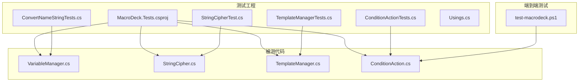
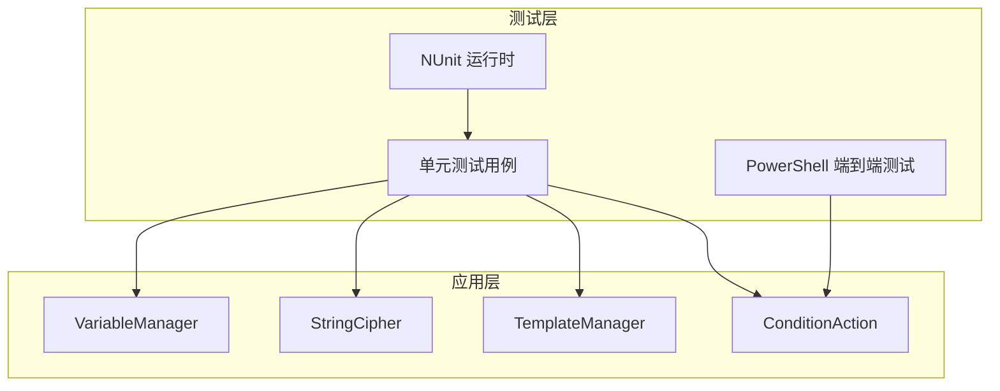
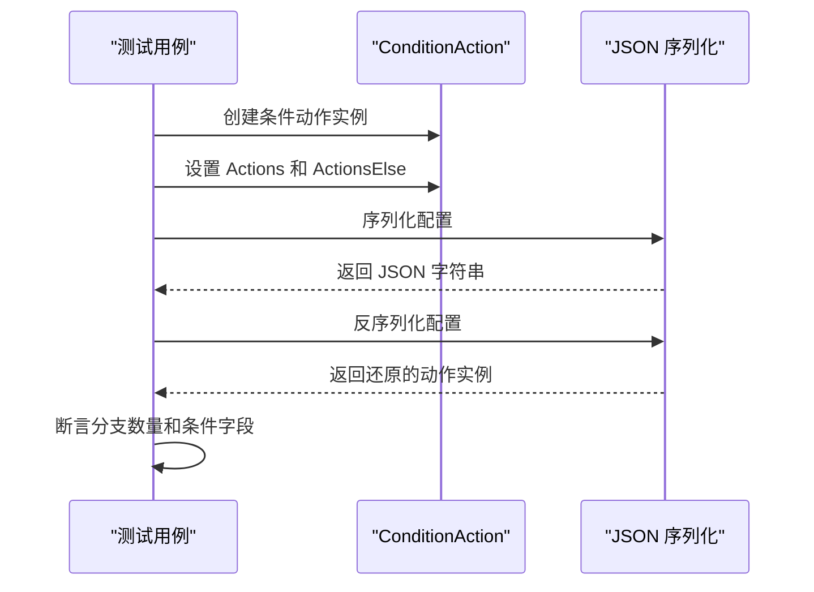
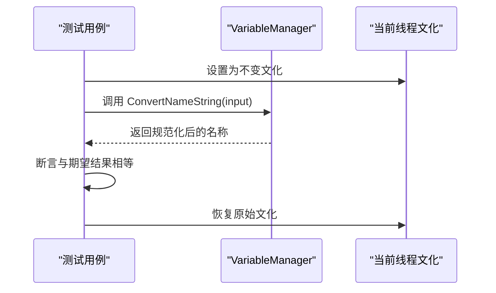
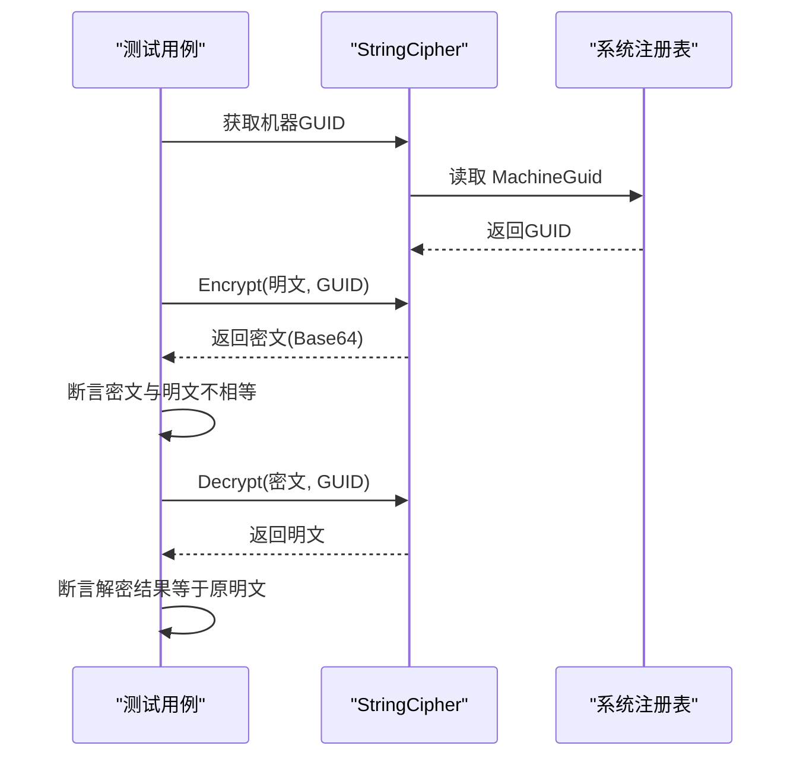
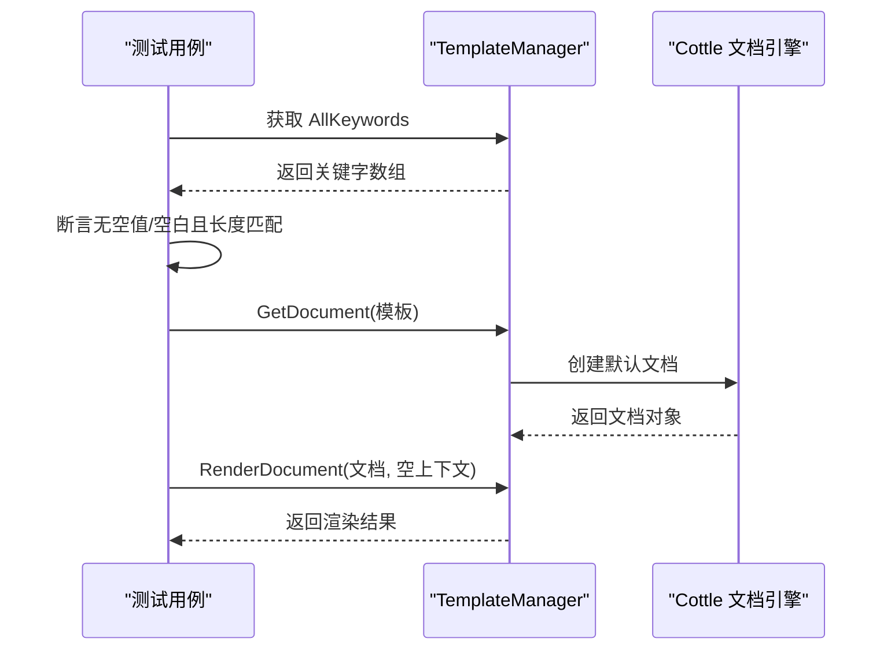
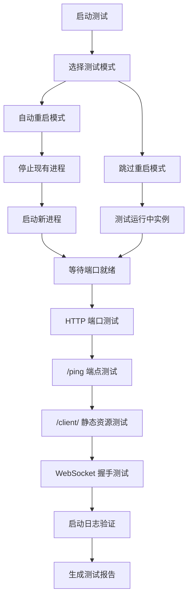
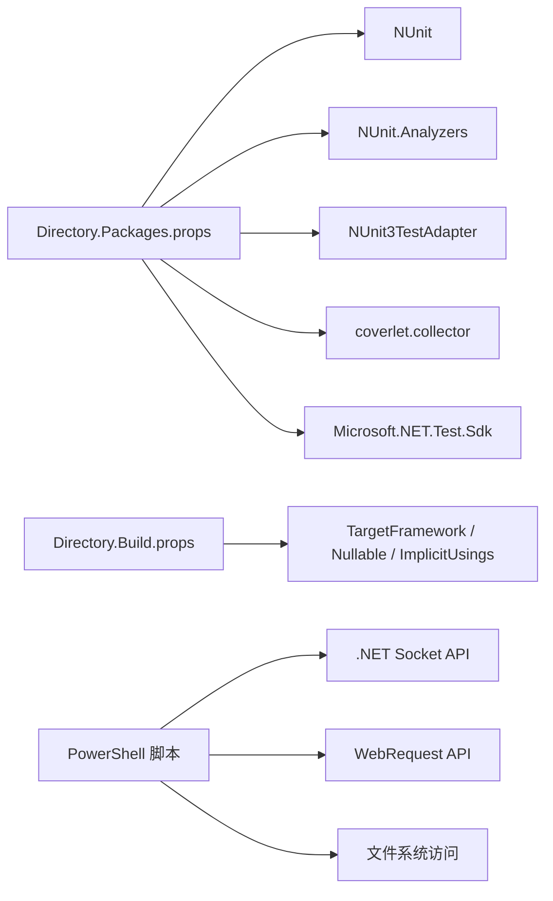

# 测试框架

<cite>
**本文引用的文件**
- [MacroDeck.Tests.csproj](file://tests/MacroDeck.Tests/MacroDeck.Tests.csproj)
- [Directory.Build.props](file://Directory.Build.props)
- [Directory.Packages.props](file://Directory.Packages.props)
- [ConvertNameStringTests.cs](file://tests/MacroDeck.Tests/ConvertNameStringTests.cs)
- [StringCipherTest.cs](file://tests/MacroDeck.Tests/StringCipherTest.cs)
- [TemplateManagerTests.cs](file://tests/MacroDeck.Tests/TemplateManagerTests.cs)
- [ConditionActionTests.cs](file://tests/MacroDeck.Tests/ConditionActionTests.cs)
- [Usings.cs](file://tests/MacroDeck.Tests/Usings.cs)
- [VariableManager.cs](file://src/MacroDeck/Variables/VariableManager.cs)
- [StringCipher.cs](file://src/MacroDeck/Utils/StringCipher.cs)
- [TemplateManager.cs](file://src/MacroDeck/CottleIntegration/TemplateManager.cs)
- [ConditionAction.cs](file://src/MacroDeck/ActionButton/ConditionAction.cs)
- [test-macrodeck.ps1](file://test-macrodeck.ps1)
</cite>

## 更新摘要
**变更内容**
- 新增 ConditionAction 序列化测试，专门针对条件动作的分支序列化缺陷进行回归测试
- 新增端到端冒烟测试脚本，提供完整的应用级集成测试能力
- 增强测试覆盖范围，从纯单元测试扩展到集成测试和端到端测试
- 完善测试框架文档以反映新的测试策略和质量保证流程

## 目录
1. [引言](#引言)
2. [项目结构](#项目结构)
3. [核心组件](#核心组件)
4. [架构总览](#架构总览)
5. [详细组件分析](#详细组件分析)
6. [依赖关系分析](#依赖关系分析)
7. [性能考虑](#性能考虑)
8. [故障排查指南](#故障排查指南)
9. [结论](#结论)
10. [附录](#附录)

## 引言
本文件系统性梳理 Macro-Deck 的测试框架与质量保证实践，聚焦以下目标：
- 单元测试策略与测试用例设计原则
- 测试项目的组织结构与测试框架选型（NUnit）
- 关键功能测试覆盖：字符串处理、加密解密、模板渲染、条件动作序列化
- 测试数据准备与模拟对象使用建议
- 测试执行与持续集成配置指引
- 性能测试与压力测试实施方法
- 测试结果分析与问题追踪流程
- 面向开发者的测试编写指导与面向维护者的质量保证策略
- **新增**：端到端冒烟测试脚本的集成测试能力

## 项目结构
测试工程位于 tests/MacroDeck.Tests，采用 NUnit 作为测试框架，并通过 SDK 样式项目组织。测试工程引用主程序工程以进行集成测试与行为验证。**新增**：端到端测试脚本位于根目录，提供完整的应用级测试能力。

**图表来源**
- [MacroDeck.Tests.csproj:1-26](file://tests/MacroDeck.Tests/MacroDeck.Tests.csproj#L1-L26)
- [ConditionActionTests.cs:1-89](file://tests/MacroDeck.Tests/ConditionActionTests.cs#L1-L89)
- [test-macrodeck.ps1:1-200](file://test-macrodeck.ps1#L1-L200)

**章节来源**
- [MacroDeck.Tests.csproj:1-26](file://tests/MacroDeck.Tests/MacroDeck.Tests.csproj#L1-L26)
- [Directory.Build.props:1-11](file://Directory.Build.props#L1-L11)
- [Directory.Packages.props:1-35](file://Directory.Packages.props#L1-L35)

## 核心组件
- 测试框架与工具链
  - 测试运行器：NUnit
  - 分析器与适配器：NUnit.Analyzers、NUnit3TestAdapter
  - 覆盖率收集：coverlet.collector
  - 测试 SDK：Microsoft.NET.Test.Sdk
- 测试工程与被测代码
  - 测试工程引用主程序工程，便于直接调用被测类型
  - 使用全局 using 简化命名空间导入
- **新增**：端到端测试脚本
  - PowerShell 脚本提供完整的应用级测试能力
  - 支持自动重启和手动测试模式
  - 验证 HTTP/WebSocket 服务、API 端点、WebSocket 握手和启动日志

**章节来源**
- [MacroDeck.Tests.csproj:7-23](file://tests/MacroDeck.Tests/MacroDeck.Tests.csproj#L7-L23)
- [Directory.Packages.props:26-33](file://Directory.Packages.props#L26-L33)
- [Usings.cs:1-2](file://tests/MacroDeck.Tests/Usings.cs#L1-L2)
- [test-macrodeck.ps1:1-200](file://test-macrodeck.ps1#L1-L200)

## 架构总览
测试架构围绕"测试工程引用主工程"的方式构建，测试用例直接调用被测类的公共或内部公开接口，确保在隔离环境中验证逻辑正确性与边界条件。**新增**：端到端测试脚本提供应用级集成测试，验证完整的服务栈。

**图表来源**
- [MacroDeck.Tests.csproj:21-23](file://tests/MacroDeck.Tests/MacroDeck.Tests.csproj#L21-L23)
- [ConditionActionTests.cs:17-89](file://tests/MacroDeck.Tests/ConditionActionTests.cs#L17-L89)
- [test-macrodeck.ps1:46-200](file://test-macrodeck.ps1#L46-L200)

## 详细组件分析

### 条件动作序列化测试（ConditionAction）
- **新增**：专门针对条件动作的序列化缺陷进行回归测试
- 目标：验证条件动作的 if-branch 和 else-branch 分支独立序列化，防止分支相互覆盖
- 关键点
  - 使用自定义 JSON 序列化设置，包含类型处理和错误处理
  - 通过 JSON 对象解析验证分支计数的准确性
  - 支持完整的往返序列化测试，保持条件字段的完整性
- 测试策略
  - 覆盖空分支、混合分支、条件字段保留等场景
  - 使用参数化测试验证分支独立性和数据完整性

**图表来源**
- [ConditionActionTests.cs:20-89](file://tests/MacroDeck.Tests/ConditionActionTests.cs#L20-L89)
- [ConditionAction.cs:126-154](file://src/MacroDeck/ActionButton/ConditionAction.cs#L126-L154)

**章节来源**
- [ConditionActionTests.cs:1-89](file://tests/MacroDeck.Tests/ConditionActionTests.cs#L1-L89)
- [ConditionAction.cs:11-273](file://src/MacroDeck/ActionButton/ConditionAction.cs#L11-L273)

### 字符串处理测试（变量名规范化）
- 目标：验证变量名规范化函数在不同文化环境下的稳定行为，确保生成的键值一致且可预测
- 关键点
  - 固定线程文化为不变文化，避免本地化差异导致的不一致
  - 覆盖大小写转换、分隔符替换、德语音标字符转写等场景
- 测试策略
  - 参数化用例覆盖典型输入与边界情况
  - 断言输出与期望结果严格相等

**图表来源**
- [ConvertNameStringTests.cs:10-38](file://tests/MacroDeck.Tests/ConvertNameStringTests.cs#L10-L38)
- [VariableManager.cs:225-247](file://src/MacroDeck/Variables/VariableManager.cs#L225-L247)

**章节来源**
- [ConvertNameStringTests.cs:1-39](file://tests/MacroDeck.Tests/ConvertNameStringTests.cs#L1-L39)
- [VariableManager.cs:225-247](file://src/MacroDeck/Variables/VariableManager.cs#L225-L247)

### 加密解密测试（对称加密）
- 目标：验证字符串加解密的正确性与一致性
- 关键点
  - 基于机器唯一标识生成密钥材料，确保跨进程一致性
  - 加密后密文与明文不相等；解密后应与原明文完全一致
- 测试策略
  - 多组不同长度与内容的明文进行端到端验证
  - 断言加密产物非明文、解密结果等于明文

**图表来源**
- [StringCipherTest.cs:6-27](file://tests/MacroDeck.Tests/StringCipherTest.cs#L6-L27)
- [StringCipher.cs:78-98](file://src/MacroDeck/Utils/StringCipher.cs#L78-L98)
- [StringCipher.cs:16-67](file://src/MacroDeck/Utils/StringCipher.cs#L16-L67)

**章节来源**
- [StringCipherTest.cs:1-28](file://tests/MacroDeck.Tests/StringCipherTest.cs#L1-L28)
- [StringCipher.cs:1-100](file://src/MacroDeck/Utils/StringCipher.cs#L1-L100)

### 模板渲染测试（Cottle 集成）
- 目标：验证模板关键字集合完整性与模板渲染行为
- 关键点
  - 关键字集合不应包含空值或空白项
  - 关键字总数应等于各分类数组长度之和
  - 渲染上下文为空时仍需稳定返回
- 测试策略
  - 断言集合长度与内容完整性
  - 使用参数化用例验证不同模板片段的渲染结果

**图表来源**
- [TemplateManagerTests.cs:8-40](file://tests/MacroDeck.Tests/TemplateManagerTests.cs#L8-L40)
- [TemplateManager.cs:157-179](file://src/MacroDeck/CottleIntegration/TemplateManager.cs#L157-L179)
- [TemplateManager.cs:53-88](file://src/MacroDeck/CottleIntegration/TemplateManager.cs#L53-L88)

**章节来源**
- [TemplateManagerTests.cs:1-71](file://tests/MacroDeck.Tests/TemplateManagerTests.cs#L1-L71)
- [TemplateManager.cs:1-181](file://src/MacroDeck/CottleIntegration/TemplateManager.cs#L1-L181)

### 端到端冒烟测试（PowerShell 脚本）
- **新增**：完整的应用级集成测试脚本
- 目标：验证 Macro Deck 主应用程序的完整功能栈
- 关键测试点
  - HTTP/WebSocket 端口连接可用性
  - REST API 端点响应（/ping）
  - Web 客户端静态资源服务
  - WebSocket 握手协议（CONNECTED + GET_BUTTONS）
  - 启动日志验证（插件加载、启动完成、无服务器错误）
- 测试策略
  - 支持自动重启和跳过重启两种模式
  - 详细的测试结果报告和状态跟踪
  - 超时控制和错误处理机制

**图表来源**
- [test-macrodeck.ps1:56-185](file://test-macrodeck.ps1#L56-L185)

**章节来源**
- [test-macrodeck.ps1:1-200](file://test-macrodeck.ps1#L1-L200)

## 依赖关系分析
- 测试工程依赖
  - NUnit 及其分析器与适配器用于测试发现、执行与报告
  - coverlet.collector 用于覆盖率统计
  - Microsoft.NET.Test.Sdk 提供测试 SDK 支持
- 中央包版本管理
  - 通过 Directory.Packages.props 统一管理 NUnit、Test.Sdk、Analyzers、coverlet 等版本
- 目标框架与编译选项
  - 目标框架与可空引用、隐式 using 等由 Directory.Build.props 统一设置
- **新增**：端到端测试依赖
  - PowerShell 脚本依赖 .NET Framework Socket 和 WebRequest 功能
  - 需要访问应用程序安装目录和用户日志目录

**图表来源**
- [Directory.Packages.props:26-33](file://Directory.Packages.props#L26-L33)
- [Directory.Build.props:3-8](file://Directory.Build.props#L3-L8)
- [test-macrodeck.ps1:33-36](file://test-macrodeck.ps1#L33-L36)

**章节来源**
- [Directory.Packages.props:1-35](file://Directory.Packages.props#L1-L35)
- [Directory.Build.props:1-11](file://Directory.Build.props#L1-L11)

## 性能考虑
- 单元测试性能
  - 避免在测试中进行外部 I/O 或网络请求；如需，使用内存中的替代方案或桩/替身
  - 对热点路径（如字符串处理、模板解析）进行小规模回归测试，确保关键路径稳定
  - **新增**：条件动作序列化测试使用内存中的 JSON 操作，避免实际的 GUI 或变量管理器状态
- 覆盖率与质量门禁
  - 使用 coverlet.collector 生成覆盖率报告，结合 CI 设置覆盖率阈值门禁
- 性能测试与压力测试建议
  - 使用基准测试框架（如 BenchmarkDotNet）对关键算法（如字符串规范化、模板渲染）进行微基准测试
  - 在受控环境下对模板渲染进行吞吐量与延迟压测，记录 P50/P95/P99 延迟与错误率
  - **新增**：端到端测试脚本提供性能基准，验证服务启动时间和响应延迟
  - 压测数据集应覆盖真实业务场景的模板复杂度与变量规模

## 故障排查指南
- 常见问题与定位
  - 文化相关断言失败：检查测试是否固定了线程文化；参考字符串处理测试中的文化设置与恢复
  - 加密解密失败：确认机器 GUID 是否可读；确保测试环境具备访问注册表的权限
  - 模板渲染异常：捕获异常并检查错误消息；验证模板关键字集合与渲染上下文
  - **新增**：条件动作序列化失败：检查 JSON 序列化设置和分支配置；验证 UpdateConfiguration 方法的正确性
  - **新增**：端到端测试失败：检查应用程序是否正确安装、端口是否开放、日志文件是否存在
- 日志与诊断
  - 利用日志库输出关键步骤与异常堆栈，便于快速定位问题
  - **新增**：端到端测试脚本提供详细的测试步骤输出和错误信息
- 修复与回归
  - 针对问题补充最小可复现用例，防止回归
  - 对修复进行小范围回归测试，确保影响面可控
  - **新增**：条件动作序列化缺陷修复后，立即运行回归测试确保问题不再出现

**章节来源**
- [ConvertNameStringTests.cs:15-26](file://tests/MacroDeck.Tests/ConvertNameStringTests.cs#L15-L26)
- [StringCipher.cs:78-98](file://src/MacroDeck/Utils/StringCipher.cs#L78-L98)
- [TemplateManager.cs:82-87](file://src/MacroDeck/CottleIntegration/TemplateManager.cs#L82-L87)
- [ConditionActionTests.cs:8-16](file://tests/MacroDeck.Tests/ConditionActionTests.cs#L8-L16)
- [test-macrodeck.ps1:156-185](file://test-macrodeck.ps1#L156-L185)

## 结论
本测试框架以 NUnit 为核心，结合中央包版本管理与统一编译配置，实现了对关键功能（字符串处理、加密解密、模板渲染、条件动作序列化）的稳定覆盖。**新增**：端到端冒烟测试脚本提供了完整的应用级集成测试能力，确保服务栈的完整性和可靠性。通过参数化用例、文化固定、异常捕获和序列化测试等策略，提升了测试的可靠性与可维护性。建议在 CI 中引入覆盖率门禁与性能基准，持续提升质量与稳定性。

## 附录

### 测试执行与持续集成配置建议
- 本地执行
  - 使用 dotnet test 执行测试套件，启用 --logger 和 --collect:"XPlat Code Coverage" 生成覆盖率
  - **新增**：使用 PowerShell 执行端到端测试脚本，支持参数化配置
- CI 集成
  - 在流水线中添加步骤执行测试与覆盖率收集
  - 将覆盖率报告上传至代码覆盖率平台，设置阈值门禁
  - **新增**：在 CI 中集成端到端测试，验证部署后的完整功能
  - 对关键分支与 PR 添加性能基线对比，防止回归

### 测试编写最佳实践
- 用例命名清晰，描述输入、行为与期望
- 使用参数化与组合用例覆盖边界条件
- 避免测试间耦合，每个用例独立初始化与清理
- 对外部依赖进行隔离，必要时使用桩/替身
- **新增**：条件动作测试专注于序列化路径，不依赖 GUI 或变量管理器状态
- **新增**：端到端测试脚本提供可配置的测试参数，支持不同的部署环境

### 测试类型与覆盖范围
- 单元测试：针对具体类和方法的功能测试
- 集成测试：测试组件间的交互和数据流
- 端到端测试：验证完整应用功能和用户体验
- **新增**：序列化测试专门验证数据持久化和传输的正确性

**章节来源**
- [ConditionActionTests.cs:14-16](file://tests/MacroDeck.Tests/ConditionActionTests.cs#L14-L16)
- [test-macrodeck.ps1:11-22](file://test-macrodeck.ps1#L11-L22)