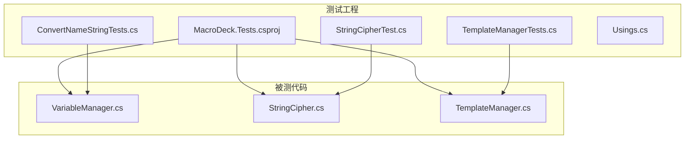
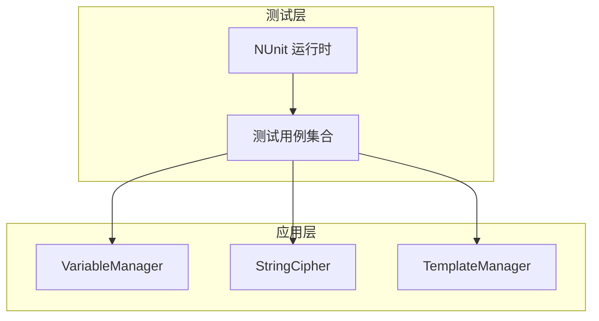
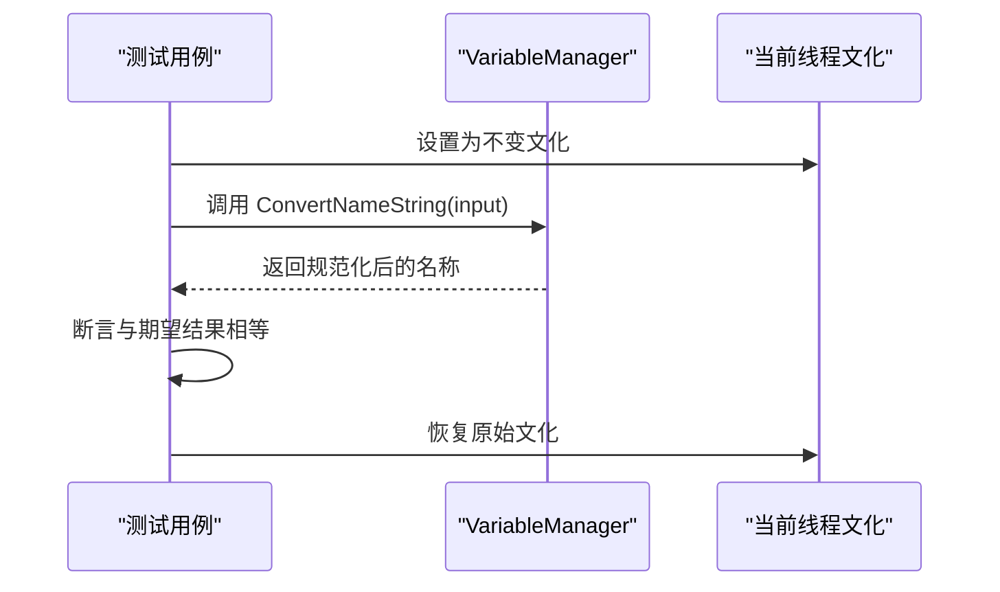
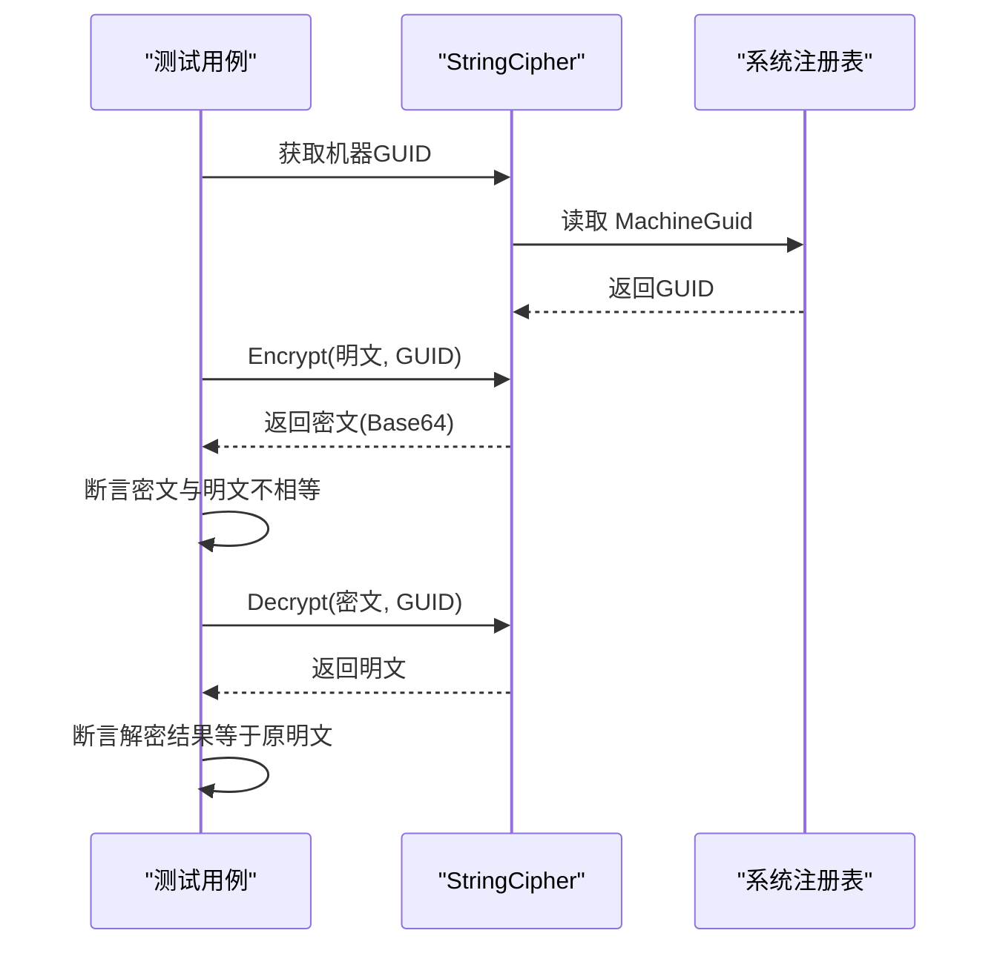
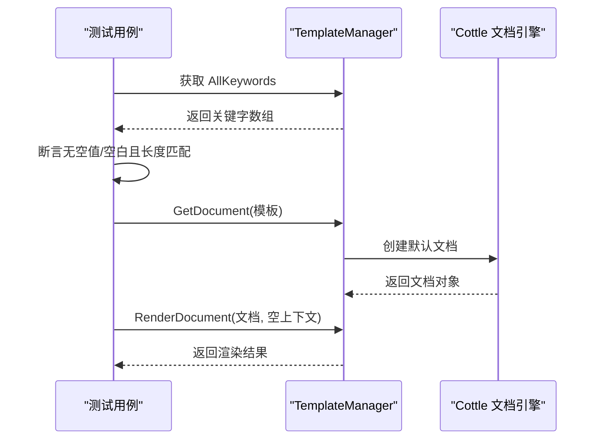
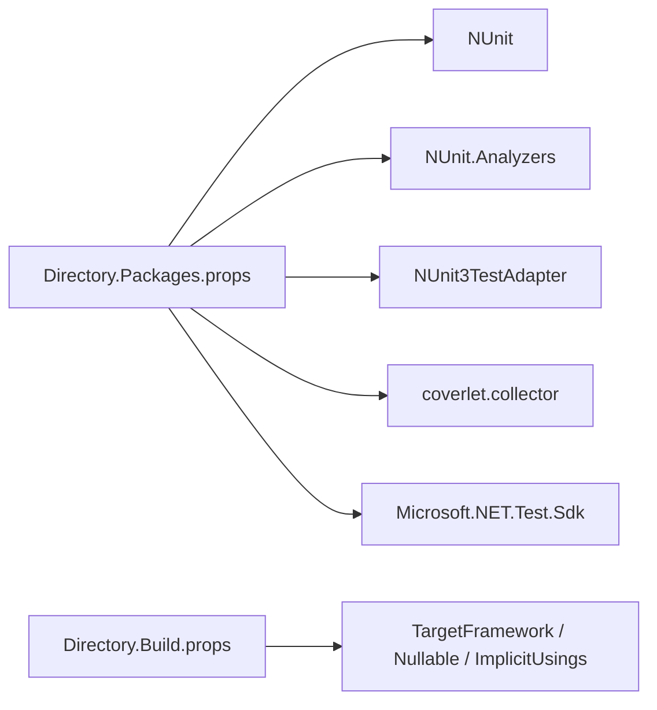

# 测试框架

<cite>
**本文引用的文件**
- [MacroDeck.Tests.csproj](file://tests/MacroDeck.Tests/MacroDeck.Tests.csproj)
- [Directory.Build.props](file://Directory.Build.props)
- [Directory.Packages.props](file://Directory.Packages.props)
- [ConvertNameStringTests.cs](file://tests/MacroDeck.Tests/ConvertNameStringTests.cs)
- [StringCipherTest.cs](file://tests/MacroDeck.Tests/StringCipherTest.cs)
- [TemplateManagerTests.cs](file://tests/MacroDeck.Tests/TemplateManagerTests.cs)
- [Usings.cs](file://tests/MacroDeck.Tests/Usings.cs)
- [VariableManager.cs](file://src/MacroDeck/Variables/VariableManager.cs)
- [StringCipher.cs](file://src/MacroDeck/Utils/StringCipher.cs)
- [TemplateManager.cs](file://src/MacroDeck/CottleIntegration/TemplateManager.cs)
</cite>

## 目录
1. [引言](#引言)
2. [项目结构](#项目结构)
3. [核心组件](#核心组件)
4. [架构总览](#架构总览)
5. [详细组件分析](#详细组件分析)
6. [依赖关系分析](#依赖关系分析)
7. [性能考虑](#性能考虑)
8. [故障排查指南](#故障排查指南)
9. [结论](#结论)
10. [附录](#附录)

## 引言
本文件系统性梳理 Macro-Deck 的测试框架与质量保证实践，聚焦以下目标：
- 单元测试策略与测试用例设计原则
- 测试项目的组织结构与测试框架选型（NUnit）
- 关键功能测试覆盖：字符串处理、加密解密、模板渲染
- 测试数据准备与模拟对象使用建议
- 测试执行与持续集成配置指引
- 性能测试与压力测试实施方法
- 测试结果分析与问题追踪流程
- 面向开发者的测试编写指导与面向维护者的质量保证策略

## 项目结构
测试工程位于 tests/MacroDeck.Tests，采用 NUnit 作为测试框架，并通过 SDK 样式项目组织。测试工程引用主程序工程以进行集成测试与行为验证。

图表来源
- [MacroDeck.Tests.csproj:1-26](file://tests/MacroDeck.Tests/MacroDeck.Tests.csproj#L1-L26)
- [VariableManager.cs:1-249](file://src/MacroDeck/Variables/VariableManager.cs#L1-L249)
- [StringCipher.cs:1-100](file://src/MacroDeck/Utils/StringCipher.cs#L1-L100)
- [TemplateManager.cs:1-181](file://src/MacroDeck/CottleIntegration/TemplateManager.cs#L1-L181)

章节来源
- [MacroDeck.Tests.csproj:1-26](file://tests/MacroDeck.Tests/MacroDeck.Tests.csproj#L1-L26)
- [Directory.Build.props:1-11](file://Directory.Build.props#L1-L11)
- [Directory.Packages.props:1-35](file://Directory.Packages.props#L1-L35)

## 核心组件
- 测试框架与工具链
  - 测试运行器：NUnit
  - 分析器与适配器：NUnit.Analyzers、NUnit3TestAdapter
  - 覆盖率收集：coverlet.collector
  - 测试 SDK：Microsoft.NET.Test.Sdk
- 测试工程与被测代码
  - 测试工程引用主程序工程，便于直接调用被测类型
  - 使用全局 using 简化命名空间导入

章节来源
- [MacroDeck.Tests.csproj:7-23](file://tests/MacroDeck.Tests/MacroDeck.Tests.csproj#L7-L23)
- [Directory.Packages.props:26-33](file://Directory.Packages.props#L26-L33)
- [Usings.cs:1-2](file://tests/MacroDeck.Tests/Usings.cs#L1-L2)

## 架构总览
测试架构围绕“测试工程引用主工程”的方式构建，测试用例直接调用被测类的公共或内部公开接口，确保在隔离环境中验证逻辑正确性与边界条件。

图表来源
- [MacroDeck.Tests.csproj:21-23](file://tests/MacroDeck.Tests/MacroDeck.Tests.csproj#L21-L23)
- [VariableManager.cs:10-249](file://src/MacroDeck/Variables/VariableManager.cs#L10-L249)
- [StringCipher.cs:7-100](file://src/MacroDeck/Utils/StringCipher.cs#L7-L100)
- [TemplateManager.cs:8-181](file://src/MacroDeck/CottleIntegration/TemplateManager.cs#L8-L181)

## 详细组件分析

### 字符串处理测试（变量名规范化）
- 目标：验证变量名规范化函数在不同文化环境下的稳定行为，确保生成的键值一致且可预测
- 关键点
  - 固定线程文化为不变文化，避免本地化差异导致的不一致
  - 覆盖大小写转换、分隔符替换、德语音标字符转写等场景
- 测试策略
  - 参数化用例覆盖典型输入与边界情况
  - 断言输出与期望结果严格相等

图表来源
- [ConvertNameStringTests.cs:10-38](file://tests/MacroDeck.Tests/ConvertNameStringTests.cs#L10-L38)
- [VariableManager.cs:225-247](file://src/MacroDeck/Variables/VariableManager.cs#L225-L247)

章节来源
- [ConvertNameStringTests.cs:1-39](file://tests/MacroDeck.Tests/ConvertNameStringTests.cs#L1-L39)
- [VariableManager.cs:225-247](file://src/MacroDeck/Variables/VariableManager.cs#L225-L247)

### 加密解密测试（对称加密）
- 目标：验证字符串加解密的正确性与一致性
- 关键点
  - 基于机器唯一标识生成密钥材料，确保跨进程一致性
  - 加密后密文与明文不相等；解密后应与原明文完全一致
- 测试策略
  - 多组不同长度与内容的明文进行端到端验证
  - 断言加密产物非明文、解密结果等于明文

图表来源
- [StringCipherTest.cs:6-27](file://tests/MacroDeck.Tests/StringCipherTest.cs#L6-L27)
- [StringCipher.cs:78-98](file://src/MacroDeck/Utils/StringCipher.cs#L78-L98)
- [StringCipher.cs:16-67](file://src/MacroDeck/Utils/StringCipher.cs#L16-L67)

章节来源
- [StringCipherTest.cs:1-28](file://tests/MacroDeck.Tests/StringCipherTest.cs#L1-L28)
- [StringCipher.cs:1-100](file://src/MacroDeck/Utils/StringCipher.cs#L1-L100)

### 模板渲染测试（Cottle 集成）
- 目标：验证模板关键字集合完整性与模板渲染行为
- 关键点
  - 关键字集合不应包含空值或空白项
  - 关键字总数应等于各分类数组长度之和
  - 渲染上下文为空时仍需稳定返回
- 测试策略
  - 断言集合长度与内容完整性
  - 使用参数化用例验证不同模板片段的渲染结果

图表来源
- [TemplateManagerTests.cs:8-40](file://tests/MacroDeck.Tests/TemplateManagerTests.cs#L8-L40)
- [TemplateManager.cs:157-179](file://src/MacroDeck/CottleIntegration/TemplateManager.cs#L157-L179)
- [TemplateManager.cs:53-88](file://src/MacroDeck/CottleIntegration/TemplateManager.cs#L53-L88)

章节来源
- [TemplateManagerTests.cs:1-71](file://tests/MacroDeck.Tests/TemplateManagerTests.cs#L1-L71)
- [TemplateManager.cs:1-181](file://src/MacroDeck/CottleIntegration/TemplateManager.cs#L1-L181)

## 依赖关系分析
- 测试工程依赖
  - NUnit 及其分析器与适配器用于测试发现、执行与报告
  - coverlet.collector 用于覆盖率统计
  - Microsoft.NET.Test.Sdk 提供测试 SDK 支持
- 中央包版本管理
  - 通过 Directory.Packages.props 统一管理 NUnit、Test.Sdk、Analyzers、coverlet 等版本
- 目标框架与编译选项
  - 目标框架与可空引用、隐式 using 等由 Directory.Build.props 统一设置

图表来源
- [Directory.Packages.props:26-33](file://Directory.Packages.props#L26-L33)
- [Directory.Build.props:3-8](file://Directory.Build.props#L3-L8)

章节来源
- [Directory.Packages.props:1-35](file://Directory.Packages.props#L1-L35)
- [Directory.Build.props:1-11](file://Directory.Build.props#L1-L11)

## 性能考虑
- 单元测试性能
  - 避免在测试中进行外部 I/O 或网络请求；如需，使用内存中的替代方案或桩/替身
  - 对热点路径（如字符串处理、模板解析）进行小规模回归测试，确保关键路径稳定
- 覆盖率与质量门禁
  - 使用 coverlet.collector 生成覆盖率报告，结合 CI 设置覆盖率阈值门禁
- 性能测试与压力测试建议
  - 使用基准测试框架（如 BenchmarkDotNet）对关键算法（如字符串规范化、模板渲染）进行微基准测试
  - 在受控环境下对模板渲染进行吞吐量与延迟压测，记录 P50/P95/P99 延迟与错误率
  - 压测数据集应覆盖真实业务场景的模板复杂度与变量规模

## 故障排查指南
- 常见问题与定位
  - 文化相关断言失败：检查测试是否固定了线程文化；参考字符串处理测试中的文化设置与恢复
  - 加密解密失败：确认机器 GUID 是否可读；确保测试环境具备访问注册表的权限
  - 模板渲染异常：捕获异常并检查错误消息；验证模板关键字集合与渲染上下文
- 日志与诊断
  - 利用日志库输出关键步骤与异常堆栈，便于快速定位问题
- 修复与回归
  - 针对问题补充最小可复现用例，防止回归
  - 对修复进行小范围回归测试，确保影响面可控

章节来源
- [ConvertNameStringTests.cs:15-26](file://tests/MacroDeck.Tests/ConvertNameStringTests.cs#L15-L26)
- [StringCipher.cs:78-98](file://src/MacroDeck/Utils/StringCipher.cs#L78-L98)
- [TemplateManager.cs:82-87](file://src/MacroDeck/CottleIntegration/TemplateManager.cs#L82-L87)

## 结论
本测试框架以 NUnit 为核心，结合中央包版本管理与统一编译配置，实现了对关键功能（字符串处理、加密解密、模板渲染）的稳定覆盖。通过参数化用例、文化固定与异常捕获等策略，提升了测试的可靠性与可维护性。建议在 CI 中引入覆盖率门禁与性能基准，持续提升质量与稳定性。

## 附录

### 测试执行与持续集成配置建议
- 本地执行
  - 使用 dotnet test 执行测试套件，启用 --logger 和 --collect:"XPlat Code Coverage" 生成覆盖率
- CI 集成
  - 在流水线中添加步骤执行测试与覆盖率收集
  - 将覆盖率报告上传至代码覆盖率平台，设置阈值门禁
  - 对关键分支与 PR 添加性能基线对比，防止回归

### 测试编写最佳实践
- 用例命名清晰，描述输入、行为与期望
- 使用参数化与组合用例覆盖边界条件
- 避免测试间耦合，每个用例独立初始化与清理
- 对外部依赖进行隔离，必要时使用桩/替身