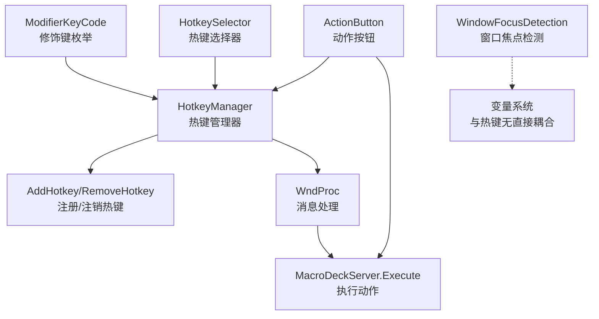
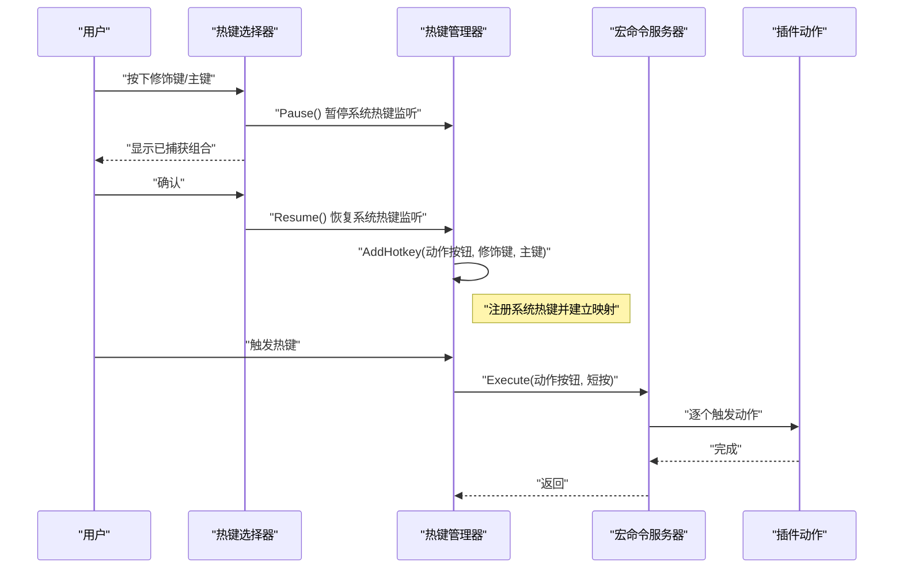
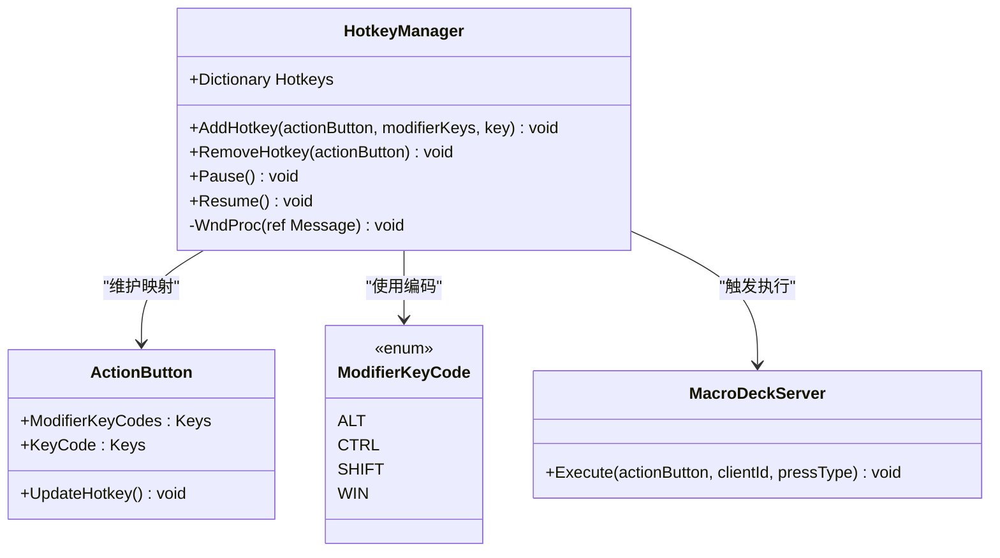
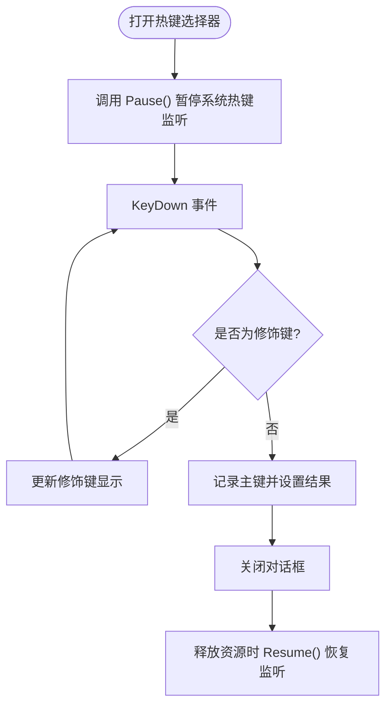
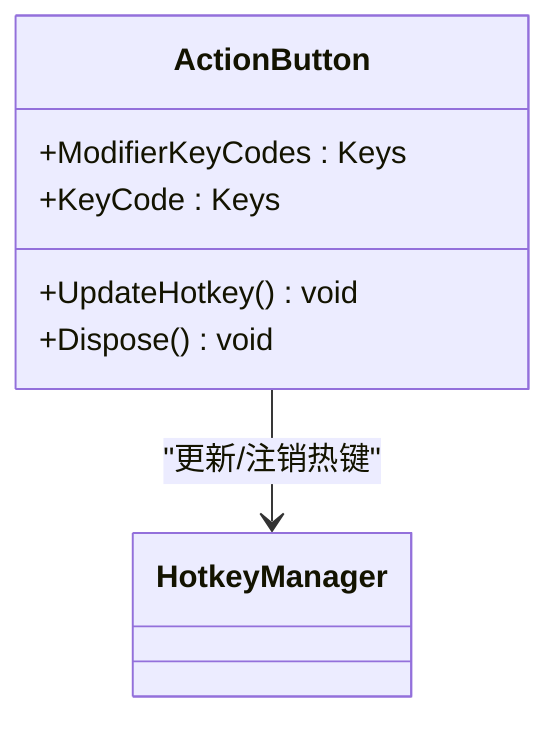
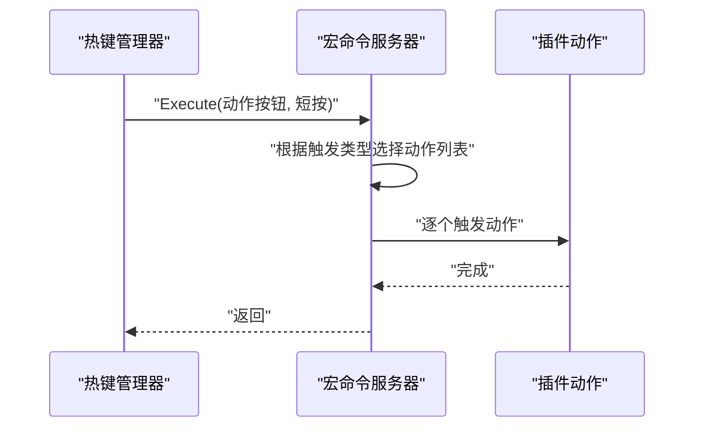
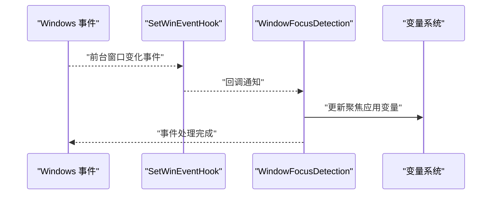
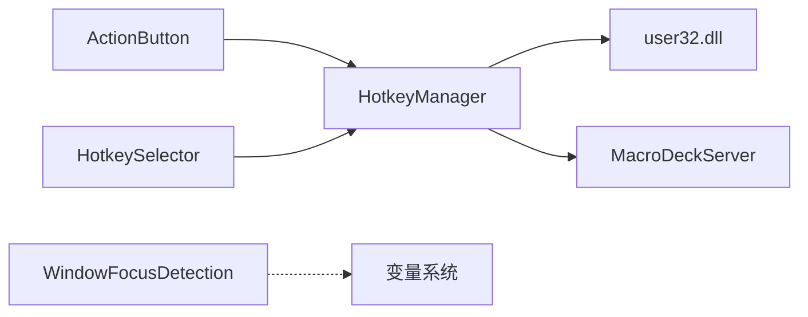

# 热键系统

<cite>
**本文引用的文件**
- [HotkeyManager.cs](file://src/MacroDeck/Hotkeys/HotkeyManager.cs)
- [ModifierKeyCode.cs](file://src/MacroDeck/Hotkeys/ModifierKeyCode.cs)
- [HotkeySelector.cs](file://src/MacroDeck/GUI/Dialogs/HotkeySelector.cs)
- [HotkeySelector.Designer.cs](file://src/MacroDeck/GUI/Dialogs/HotkeySelector.Designer.cs)
- [ActionButton.cs](file://src/MacroDeck/ActionButton/ActionButton.cs)
- [MacroDeckServer.cs](file://src/MacroDeck/Server/MacroDeckServer.cs)
- [ButtonPressType.cs](file://src/MacroDeck/Enums/ButtonPressType.cs)
- [WindowFocusDetection.cs](file://src/MacroDeck/WindowFocus/WindowFocusDetection.cs)
- [DeckView.cs](file://src/MacroDeck/GUI/MainWindowViews/DeckView.cs)
- [ButtonEditor.cs](file://src/MacroDeck/GUI/Dialogs/ButtonEditor.cs)
</cite>

## 目录
1. [简介](#简介)
2. [项目结构](#项目结构)
3. [核心组件](#核心组件)
4. [架构总览](#架构总览)
5. [详细组件分析](#详细组件分析)
6. [依赖关系分析](#依赖关系分析)
7. [性能考量](#性能考量)
8. [故障排查指南](#故障排查指南)
9. [结论](#结论)
10. [附录](#附录)

## 简介
本文件面向 Macro-Deck 的热键系统，围绕热键注册机制、热键管理与系统集成功能展开，重点覆盖以下方面：
- 热键注册与事件分发：基于 Windows API 的热键注册、消息循环与触发执行链路
- 热键冲突检测与处理：当前实现未内置冲突检测，但通过注册前移除旧热键避免重复注册
- 热键组合定义与修饰键处理：支持 Ctrl、Shift、Alt 组合；WIN 键枚举存在但当前未使用
- 按键事件捕获与 UI 配置：热键选择器用于捕获用户输入并暂停系统热键监听
- 插件系统集成：热键触发最终调用插件动作，支持短按、长按等不同触发类型
- 全局注册与进程内协调：通过 NativeWindow 接收系统消息，暂停/恢复机制避免 UI 干扰
- 系统级快捷键关系与优先级：当前实现未显式处理系统级快捷键优先级
- 窗口焦点检测协作：独立于热键系统，但可与变量绑定配合实现条件化行为

## 项目结构
热键系统主要由以下模块构成：
- 热键管理器：负责热键注册、注销、消息处理与触发执行
- 修饰键枚举：定义修饰键编码
- 热键选择器：图形化界面用于捕获用户热键组合
- 动作按钮：持有热键配置并驱动热键更新
- 宏命令服务器：根据触发类型执行插件动作
- 窗口焦点检测：系统级前台窗口变化监听（与热键解耦）
- 主界面视图与编辑器：热键显示与应用修改后的热键

图表来源
- [HotkeyManager.cs:1-121](file://src/MacroDeck/Hotkeys/HotkeyManager.cs#L1-L121)
- [ModifierKeyCode.cs:1-10](file://src/MacroDeck/Hotkeys/ModifierKeyCode.cs#L1-L10)
- [HotkeySelector.cs:1-71](file://src/MacroDeck/GUI/Dialogs/HotkeySelector.cs#L1-L71)
- [ActionButton.cs:1-198](file://src/MacroDeck/ActionButton/ActionButton.cs#L1-L198)
- [MacroDeckServer.cs:246-277](file://src/MacroDeck/Server/MacroDeckServer.cs#L246-L277)
- [WindowFocusDetection.cs:1-113](file://src/MacroDeck/WindowFocus/WindowFocusDetection.cs#L1-L113)

章节来源
- [HotkeyManager.cs:1-121](file://src/MacroDeck/Hotkeys/HotkeyManager.cs#L1-L121)
- [ModifierKeyCode.cs:1-10](file://src/MacroDeck/Hotkeys/ModifierKeyCode.cs#L1-L10)
- [HotkeySelector.cs:1-71](file://src/MacroDeck/GUI/Dialogs/HotkeySelector.cs#L1-L71)
- [ActionButton.cs:1-198](file://src/MacroDeck/ActionButton/ActionButton.cs#L1-L198)
- [MacroDeckServer.cs:246-277](file://src/MacroDeck/Server/MacroDeckServer.cs#L246-L277)
- [WindowFocusDetection.cs:1-113](file://src/MacroDeck/WindowFocus/WindowFocusDetection.cs#L1-L113)

## 核心组件
- 热键管理器（HotkeyManager）
  - 基于 Windows API 注册/注销系统热键，内部维护“动作按钮 → 热键ID”的映射
  - 通过 NativeWindow 接收系统消息，识别热键触发并调用宏命令服务器执行对应动作
  - 提供暂停/恢复机制，避免 UI 捕获热键时干扰
- 修饰键枚举（ModifierKeyCode）
  - 定义 Ctrl、Shift、Alt、WIN 的编码值，用于组合键注册
- 热键选择器（HotkeySelector）
  - 图形化界面，捕获用户按键组合，区分修饰键与主键
  - 在加载时暂停系统热键监听，在释放资源时恢复
- 动作按钮（ActionButton）
  - 持有热键配置（修饰键集合与主键），负责更新热键注册
  - 生命周期结束时自动注销热键
- 宏命令服务器（MacroDeckServer）
  - 根据触发类型（短按、长按等）执行插件动作列表
- 窗口焦点检测（WindowFocusDetection）
  - 监听系统前台窗口变化，更新变量以供条件化使用（与热键系统解耦）

章节来源
- [HotkeyManager.cs:1-121](file://src/MacroDeck/Hotkeys/HotkeyManager.cs#L1-L121)
- [ModifierKeyCode.cs:1-10](file://src/MacroDeck/Hotkeys/ModifierKeyCode.cs#L1-L10)
- [HotkeySelector.cs:1-71](file://src/MacroDeck/GUI/Dialogs/HotkeySelector.cs#L1-L71)
- [ActionButton.cs:1-198](file://src/MacroDeck/ActionButton/ActionButton.cs#L1-L198)
- [MacroDeckServer.cs:246-277](file://src/MacroDeck/Server/MacroDeckServer.cs#L246-L277)
- [WindowFocusDetection.cs:1-113](file://src/MacroDeck/WindowFocus/WindowFocusDetection.cs#L1-L113)

## 架构总览
热键从“用户输入”到“插件动作执行”的完整流程如下：

图表来源
- [HotkeySelector.cs:19-46](file://src/MacroDeck/GUI/Dialogs/HotkeySelector.cs#L19-L46)
- [HotkeySelector.Designer.cs:19-27](file://src/MacroDeck/GUI/Dialogs/HotkeySelector.Designer.cs#L19-L27)
- [HotkeyManager.cs:34-66](file://src/MacroDeck/Hotkeys/HotkeyManager.cs#L34-L66)
- [HotkeyManager.cs:92-119](file://src/MacroDeck/Hotkeys/HotkeyManager.cs#L92-L119)
- [MacroDeckServer.cs:246-277](file://src/MacroDeck/Server/MacroDeckServer.cs#L246-L277)

## 详细组件分析

### 热键管理器（HotkeyManager）
- 责任边界
  - 注册/注销系统热键
  - 处理系统热键消息并触发动作
  - 暂停/恢复以避免 UI 干扰
- 关键点
  - 使用随机数生成热键ID，避免冲突（当前未做冲突检测）
  - 修饰键编码通过位或运算合并
  - 通过消息常量识别热键触发并定位对应动作按钮
  - 执行动作时默认触发“短按”类型

图表来源
- [HotkeyManager.cs:8-121](file://src/MacroDeck/Hotkeys/HotkeyManager.cs#L8-L121)
- [ModifierKeyCode.cs:3-9](file://src/MacroDeck/Hotkeys/ModifierKeyCode.cs#L3-L9)
- [ActionButton.cs:20-26](file://src/MacroDeck/ActionButton/ActionButton.cs#L20-L26)
- [MacroDeckServer.cs:246-277](file://src/MacroDeck/Server/MacroDeckServer.cs#L246-L277)

章节来源
- [HotkeyManager.cs:1-121](file://src/MacroDeck/Hotkeys/HotkeyManager.cs#L1-L121)
- [ModifierKeyCode.cs:1-10](file://src/MacroDeck/Hotkeys/ModifierKeyCode.cs#L1-L10)
- [ActionButton.cs:1-198](file://src/MacroDeck/ActionButton/ActionButton.cs#L1-L198)
- [MacroDeckServer.cs:246-277](file://src/MacroDeck/Server/MacroDeckServer.cs#L246-L277)

### 热键选择器（HotkeySelector）
- 责任边界
  - 捕获用户按键组合，区分修饰键与主键
  - 在加载时暂停系统热键监听，释放时恢复
- 关键点
  - 修饰键判断覆盖左右控制键、左右 Shift、左右 Alt
  - 仅当非修饰键按下时才记录主键并关闭对话框

图表来源
- [HotkeySelector.cs:19-46](file://src/MacroDeck/GUI/Dialogs/HotkeySelector.cs#L19-L46)
- [HotkeySelector.Designer.cs:19-27](file://src/MacroDeck/GUI/Dialogs/HotkeySelector.Designer.cs#L19-L27)

章节来源
- [HotkeySelector.cs:1-71](file://src/MacroDeck/GUI/Dialogs/HotkeySelector.cs#L1-L71)
- [HotkeySelector.Designer.cs:1-82](file://src/MacroDeck/GUI/Dialogs/HotkeySelector.Designer.cs#L1-L82)

### 动作按钮（ActionButton）
- 责任边界
  - 持有热键配置（修饰键集合与主键）
  - 更新热键注册，生命周期结束时注销
- 关键点
  - 当主键非空时调用热键管理器注册
  - 释放资源时主动注销热键，防止残留

图表来源
- [ActionButton.cs:20-26](file://src/MacroDeck/ActionButton/ActionButton.cs#L20-L26)
- [ActionButton.cs:54](file://src/MacroDeck/ActionButton/ActionButton.cs#L54)

章节来源
- [ActionButton.cs:1-198](file://src/MacroDeck/ActionButton/ActionButton.cs#L1-L198)

### 宏命令服务器（MacroDeckServer）
- 责任边界
  - 根据触发类型（短按、短按释放、长按、长按释放）选择动作列表并执行
- 关键点
  - 热键触发默认执行“短按”动作
  - 动作执行在后台任务中进行，避免阻塞 UI

图表来源
- [HotkeyManager.cs:108](file://src/MacroDeck/Hotkeys/HotkeyManager.cs#L108)
- [MacroDeckServer.cs:246-277](file://src/MacroDeck/Server/MacroDeckServer.cs#L246-L277)
- [ButtonPressType.cs:3-9](file://src/MacroDeck/Enums/ButtonPressType.cs#L3-L9)

章节来源
- [MacroDeckServer.cs:246-277](file://src/MacroDeck/Server/MacroDeckServer.cs#L246-L277)
- [ButtonPressType.cs:1-10](file://src/MacroDeck/Enums/ButtonPressType.cs#L1-L10)

### 窗口焦点检测（WindowFocusDetection）
- 责任边界
  - 监听系统前台窗口变化，发布事件并更新变量
- 关键点
  - 与热键系统解耦，不参与热键注册/触发逻辑
  - 可与变量绑定配合实现条件化行为（如仅在特定应用前台时生效）

图表来源
- [WindowFocusDetection.cs:43-53](file://src/MacroDeck/WindowFocus/WindowFocusDetection.cs#L43-L53)
- [WindowFocusDetection.cs:77-111](file://src/MacroDeck/WindowFocus/WindowFocusDetection.cs#L77-L111)

章节来源
- [WindowFocusDetection.cs:1-113](file://src/MacroDeck/WindowFocus/WindowFocusDetection.cs#L1-L113)

## 依赖关系分析
- 组件耦合
  - HotkeyManager 依赖 Windows API 与 MacroDeckServer
  - ActionButton 依赖 HotkeyManager 与变量系统
  - HotkeySelector 依赖 HotkeyManager 以暂停/恢复监听
  - WindowFocusDetection 与热键系统无直接耦合
- 外部依赖
  - Windows user32.dll 热键 API
  - Serilog 日志框架
  - 变量系统（用于状态与条件化）

图表来源
- [HotkeyManager.cs:13-17](file://src/MacroDeck/Hotkeys/HotkeyManager.cs#L13-L17)
- [HotkeyManager.cs:4](file://src/MacroDeck/Hotkeys/HotkeyManager.cs#L4)
- [ActionButton.cs:3-6](file://src/MacroDeck/ActionButton/ActionButton.cs#L3-L6)
- [HotkeySelector.Designer.cs:21](file://src/MacroDeck/GUI/Dialogs/HotkeySelector.Designer.cs#L21)
- [WindowFocusDetection.cs:36](file://src/MacroDeck/WindowFocus/WindowFocusDetection.cs#L36)

章节来源
- [HotkeyManager.cs:1-121](file://src/MacroDeck/Hotkeys/HotkeyManager.cs#L1-L121)
- [ActionButton.cs:1-198](file://src/MacroDeck/ActionButton/ActionButton.cs#L1-L198)
- [HotkeySelector.Designer.cs:19-27](file://src/MacroDeck/GUI/Dialogs/HotkeySelector.Designer.cs#L19-L27)
- [WindowFocusDetection.cs:1-113](file://src/MacroDeck/WindowFocus/WindowFocusDetection.cs#L1-L113)

## 性能考量
- 热键注册/注销成本低，主要开销在消息分发与动作执行
- 动作执行在后台任务中进行，避免阻塞 UI
- 暂停/恢复机制仅在热键选择器交互期间启用，对整体性能影响有限
- 修饰键编码采用位运算，计算开销极小

## 故障排查指南
- 热键无效
  - 检查主键是否为空（空则不会注册）
  - 确认热键管理器未处于暂停状态
  - 查看日志中热键注册/注销信息
- 热键冲突
  - 当前实现未内置冲突检测，建议手动避免重复组合
  - 若出现冲突，先注销旧热键再重新注册
- 热键选择器无法捕获
  - 确保加载时调用了暂停监听，并在释放资源时恢复
  - 检查修饰键识别逻辑是否覆盖了左右键变体
- 触发动作异常
  - 查看宏命令服务器执行日志
  - 确认插件动作未抛出未处理异常

章节来源
- [HotkeyManager.cs:37-40](file://src/MacroDeck/Hotkeys/HotkeyManager.cs#L37-L40)
- [HotkeyManager.cs:68-76](file://src/MacroDeck/Hotkeys/HotkeyManager.cs#L68-L76)
- [HotkeySelector.cs:21](file://src/MacroDeck/GUI/Dialogs/HotkeySelector.cs#L21)
- [HotkeySelector.Designer.cs:21](file://src/MacroDeck/GUI/Dialogs/HotkeySelector.Designer.cs#L21)
- [MacroDeckServer.cs:246-277](file://src/MacroDeck/Server/MacroDeckServer.cs#L246-L277)

## 结论
Macro-Deck 的热键系统以 Windows API 为基础，通过热键管理器统一注册与分发热键事件，结合动作按钮与宏命令服务器实现从热键到插件动作的完整链路。系统提供了热键选择器用于便捷配置，并通过暂停/恢复机制避免 UI 干扰。当前实现未内置热键冲突检测，但通过注册前移除旧热键的方式规避重复注册问题。窗口焦点检测作为独立模块，可与变量系统配合实现条件化行为。

## 附录

### 热键配置与管理（用户视角）
- 在按钮编辑器中设置热键
  - 打开按钮编辑器，点击热键控件
  - 弹出热键选择器，按下修饰键与主键
  - 确认后热键被注册，主界面按钮会显示热键指示
- 移除热键
  - 在按钮编辑器中移除热键配置
  - 或在热键选择器中取消确认以不应用新组合
- 热键显示
  - 主界面按钮区域会显示热键组合提示

章节来源
- [DeckView.cs:343-351](file://src/MacroDeck/GUI/MainWindowViews/DeckView.cs#L343-L351)
- [ButtonEditor.cs:284](file://src/MacroDeck/GUI/Dialogs/ButtonEditor.cs#L284)
- [HotkeySelector.cs:31-46](file://src/MacroDeck/GUI/Dialogs/HotkeySelector.cs#L31-L46)

### 开发者扩展接口（建议）
- 热键冲突检测
  - 建议在注册前检查是否存在相同组合，若存在则提示或拒绝注册
- 系统级快捷键优先级
  - 建议增加对系统级快捷键的查询与冲突规避策略
- 触发类型扩展
  - 支持长按、长按释放等类型的热键配置与执行
- 窗口焦点联动
  - 提供基于窗口焦点的热键启用/禁用开关，通过变量系统实现