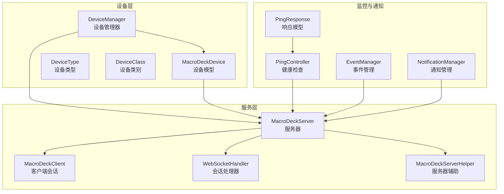
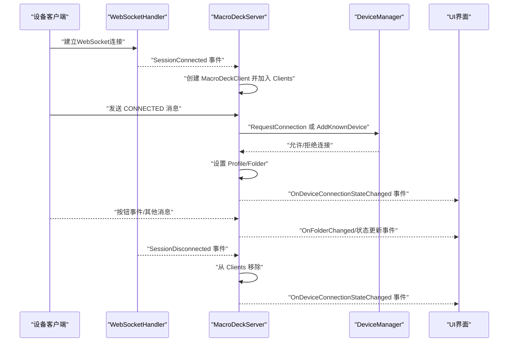
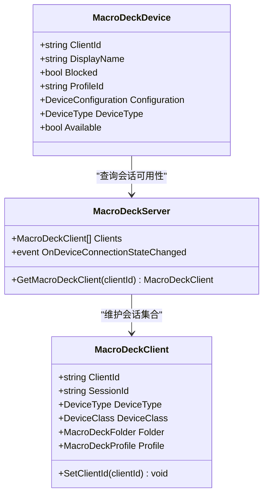
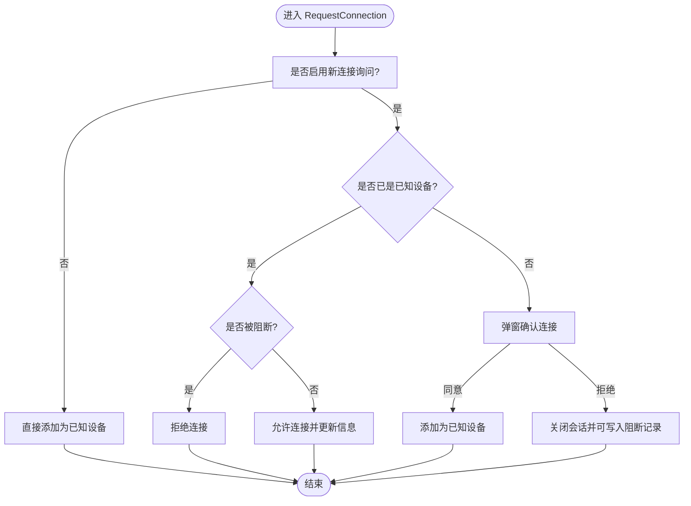
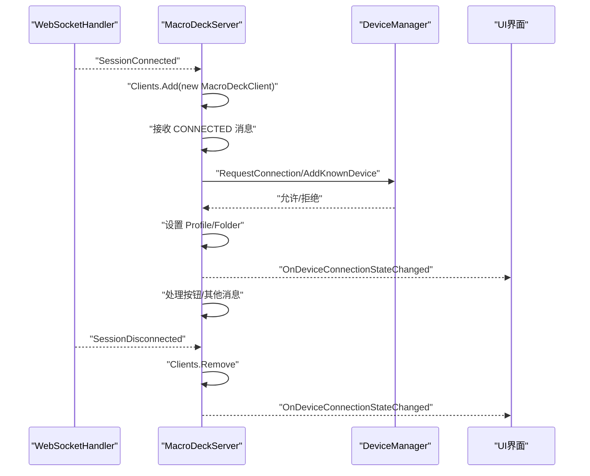
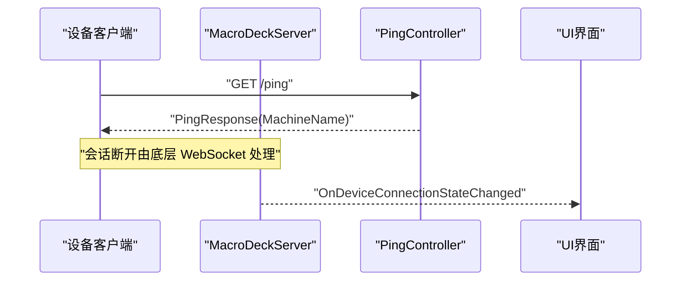
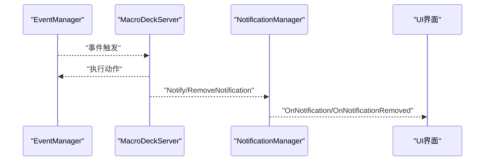
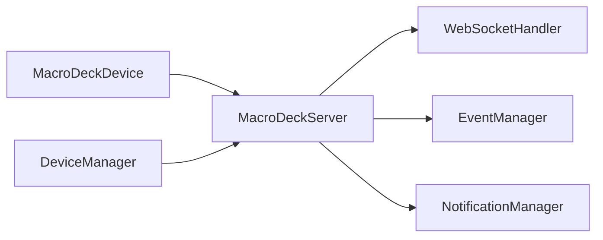

# 设备状态监控

<cite>
**本文引用的文件**
- [DeviceManager.cs](file://src/MacroDeck/Device/DeviceManager.cs)
- [MacroDeckDevice.cs](file://src/MacroDeck/Device/MacroDeckDevice.cs)
- [DeviceClass.cs](file://src/MacroDeck/Device/DeviceClass.cs)
- [DeviceType.cs](file://src/MacroDeck/Device/DeviceType.cs)
- [MacroDeckServer.cs](file://src/MacroDeck/Server/MacroDeckServer.cs)
- [MacroDeckClient.cs](file://src/MacroDeck/Server/MacroDeckClient.cs)
- [PingController.cs](file://src/MacroDeck/Controllers/PingController.cs)
- [PingResponse.cs](file://src/MacroDeck/DataTypes/PingResponse.cs)
- [WebSocketHandler.cs](file://src/MacroDeck/WebSocketHandler.cs)
- [MacroDeckServerHelper.cs](file://src/MacroDeck/MacroDeckServerHelper.cs)
- [EventManager.cs](file://src/MacroDeck/Events/EventManager.cs)
- [MacroDeckEvent.cs](file://src/MacroDeck/Events/MacroDeckEvent.cs)
- [NotificationManager.cs](file://src/MacroDeck/Notifications/NotificationManager.cs)
</cite>

## 目录
1. [简介](#简介)
2. [项目结构](#项目结构)
3. [核心组件](#核心组件)
4. [架构总览](#架构总览)
5. [详细组件分析](#详细组件分析)
6. [依赖关系分析](#依赖关系分析)
7. [性能考量](#性能考量)
8. [故障排查指南](#故障排查指南)
9. [结论](#结论)
10. [附录](#附录)

## 简介
本文件面向 Macro-Deck 的“设备状态监控”主题，系统性阐述设备连接状态、活跃度检测、事件通知与界面刷新、离线检测与恢复（心跳/超时/自动重连）、历史与统计（连接时间/故障记录）、以及与用户界面的集成与诊断工具。文档以代码为依据，结合可视化图示帮助开发者与用户理解并使用该监控体系。

## 项目结构
围绕设备状态监控的关键模块分布如下：
- 设备模型与管理：设备列表、已知设备持久化、连接请求与阻断控制
- 服务器与会话：WebSocket 会话生命周期、消息分发、连接状态变更事件
- 类型与枚举：设备类型、设备类别、ADB 连接状态等
- 健康检查：HTTP ping 接口
- 事件与通知：事件注册与派发、系统通知推送
- UI 集成：通过事件驱动实现界面刷新与用户反馈

图表来源
- [DeviceManager.cs:12-278](file://src/MacroDeck/Device/DeviceManager.cs#L12-L278)
- [MacroDeckDevice.cs:6-34](file://src/MacroDeck/Device/MacroDeckDevice.cs#L6-L34)
- [DeviceType.cs:3-11](file://src/MacroDeck/Device/DeviceType.cs#L3-L11)
- [DeviceClass.cs:3-8](file://src/MacroDeck/Device/DeviceClass.cs#L3-L8)
- [MacroDeckServer.cs:16-376](file://src/MacroDeck/Server/MacroDeckServer.cs#L16-L376)
- [MacroDeckClient.cs:8-53](file://src/MacroDeck/Server/MacroDeckClient.cs#L8-L53)
- [PingController.cs:6-15](file://src/MacroDeck/Controllers/PingController.cs#L6-L15)
- [PingResponse.cs:3-12](file://src/MacroDeck/DataTypes/PingResponse.cs#L3-L12)
- [EventManager.cs:3-43](file://src/MacroDeck/Events/EventManager.cs#L3-L43)
- [NotificationManager.cs:17-129](file://src/MacroDeck/Notifications/NotificationManager.cs#L17-L129)

章节来源
- [DeviceManager.cs:12-278](file://src/MacroDeck/Device/DeviceManager.cs#L12-L278)
- [MacroDeckServer.cs:16-376](file://src/MacroDeck/Server/MacroDeckServer.cs#L16-L376)

## 核心组件
- 设备模型与可用性判断
  - 设备模型包含标识、显示名、配置、类型、是否被阻断、当前配置文件等字段；其可用性通过服务器侧会话可用性判定。
- 设备管理器
  - 负责已知设备的加载/保存/增删改查、连接请求处理、阻断设备关闭会话、重命名与设置配置文件。
- 服务器与会话
  - 维护客户端集合，监听会话连接/断开事件，分发消息，触发连接状态变更事件。
- 健康检查
  - 提供 HTTP GET /ping 接口返回本地机器名，用于外部探测服务可用性。
- 事件与通知
  - 事件注册与派发，通知管理器负责在 UI 上弹出通知并支持气球提示。

章节来源
- [MacroDeckDevice.cs:6-34](file://src/MacroDeck/Device/MacroDeckDevice.cs#L6-L34)
- [DeviceManager.cs:12-278](file://src/MacroDeck/Device/DeviceManager.cs#L12-L278)
- [MacroDeckServer.cs:16-376](file://src/MacroDeck/Server/MacroDeckServer.cs#L16-L376)
- [PingController.cs:6-15](file://src/MacroDeck/Controllers/PingController.cs#L6-L15)
- [PingResponse.cs:3-12](file://src/MacroDeck/DataTypes/PingResponse.cs#L3-L12)
- [EventManager.cs:3-43](file://src/MacroDeck/Events/EventManager.cs#L3-L43)
- [NotificationManager.cs:17-129](file://src/MacroDeck/Notifications/NotificationManager.cs#L17-L129)

## 架构总览
下图展示了从设备接入到状态变更通知的端到端流程，包括连接建立、消息分发、状态变更事件与 UI 刷新路径。

图表来源
- [MacroDeckServer.cs:74-110](file://src/MacroDeck/Server/MacroDeckServer.cs#L74-L110)
- [MacroDeckServer.cs:141-200](file://src/MacroDeck/Server/MacroDeckServer.cs#L141-L200)
- [DeviceManager.cs:185-276](file://src/MacroDeck/Device/DeviceManager.cs#L185-L276)

## 详细组件分析

### 设备模型与可用性
- 可用性判断逻辑
  - 设备的 Available 属性通过服务器侧查找对应会话并调用会话可用性检测来决定。
- 关键字段
  - 标识、显示名、阻断标记、配置、设备类型、当前配置文件 ID。
- 设备类型与类别
  - DeviceType 定义了未知、Web、Android、iOS、StreamDeck 等类型；DeviceClass 用于区分硬件或软件客户端。

图表来源
- [MacroDeckDevice.cs:6-34](file://src/MacroDeck/Device/MacroDeckDevice.cs#L6-L34)
- [MacroDeckServer.cs:359-364](file://src/MacroDeck/Server/MacroDeckServer.cs#L359-L364)
- [MacroDeckClient.cs:8-53](file://src/MacroDeck/Server/MacroDeckClient.cs#L8-L53)

章节来源
- [MacroDeckDevice.cs:6-34](file://src/MacroDeck/Device/MacroDeckDevice.cs#L6-L34)
- [DeviceType.cs:3-11](file://src/MacroDeck/Device/DeviceType.cs#L3-L11)
- [DeviceClass.cs:3-8](file://src/MacroDeck/Device/DeviceClass.cs#L3-L8)

### 设备管理器与连接请求
- 已知设备持久化
  - 加载/保存设备列表至本地文件，异常时重置并触发设备变更事件。
- 连接请求处理
  - 支持首次连接时弹窗确认、根据配置决定是否需要授权；可阻断设备并关闭会话。
- 设备操作
  - 添加/删除/重命名/设置配置文件/阻断设备等。

图表来源
- [DeviceManager.cs:185-276](file://src/MacroDeck/Device/DeviceManager.cs#L185-L276)

章节来源
- [DeviceManager.cs:12-278](file://src/MacroDeck/Device/DeviceManager.cs#L12-L278)

### 服务器与会话生命周期
- 会话建立
  - 监听连接事件，创建客户端对象并加入集合；若条件不满足则关闭连接。
- 消息处理
  - 解析方法名，处理连接、按钮事件、获取按钮等；在连接成功后设置客户端的配置文件与文件夹，并触发连接状态变更事件。
- 会话断开
  - 从集合移除并触发连接状态变更事件。

图表来源
- [MacroDeckServer.cs:74-110](file://src/MacroDeck/Server/MacroDeckServer.cs#L74-L110)
- [MacroDeckServer.cs:141-200](file://src/MacroDeck/Server/MacroDeckServer.cs#L141-L200)
- [DeviceManager.cs:185-276](file://src/MacroDeck/Device/DeviceManager.cs#L185-L276)

章节来源
- [MacroDeckServer.cs:16-376](file://src/MacroDeck/Server/MacroDeckServer.cs#L16-L376)

### 健康检查与离线检测
- 健康检查
  - 提供 /ping 接口返回本地机器名，便于外部探测服务可用性。
- 离线检测与恢复
  - 当前代码未显式实现心跳/超时/自动重连逻辑；离线检测依赖 WebSocket 断开事件与设备可用性属性的会话可用性判断。

图表来源
- [PingController.cs:6-15](file://src/MacroDeck/Controllers/PingController.cs#L6-L15)
- [PingResponse.cs:3-12](file://src/MacroDeck/DataTypes/PingResponse.cs#L3-L12)
- [MacroDeckServer.cs:93-110](file://src/MacroDeck/Server/MacroDeckServer.cs#L93-L110)

章节来源
- [PingController.cs:6-15](file://src/MacroDeck/Controllers/PingController.cs#L6-L15)
- [PingResponse.cs:3-12](file://src/MacroDeck/DataTypes/PingResponse.cs#L3-L12)
- [MacroDeckServer.cs:93-110](file://src/MacroDeck/Server/MacroDeckServer.cs#L93-L110)

### 事件与通知集成
- 事件系统
  - 事件管理器注册事件并在触发时执行绑定的动作。
- 通知系统
  - 通知管理器负责去重、限制数量、在同步上下文中触发 UI 事件，并可选显示气球提示。

图表来源
- [EventManager.cs:9-42](file://src/MacroDeck/Events/EventManager.cs#L9-L42)
- [NotificationManager.cs:38-127](file://src/MacroDeck/Notifications/NotificationManager.cs#L38-L127)

章节来源
- [EventManager.cs:3-43](file://src/MacroDeck/Events/EventManager.cs#L3-L43)
- [MacroDeckEvent.cs:3-15](file://src/MacroDeck/Events/MacroDeckEvent.cs#L3-L15)
- [NotificationManager.cs:17-129](file://src/MacroDeck/Notifications/NotificationManager.cs#L17-L129)

## 依赖关系分析
- 设备模型依赖服务器侧会话可用性判断，从而间接依赖 WebSocketHandler 的可用性检测。
- 服务器对设备管理器进行连接请求处理与已知设备管理。
- 事件与通知模块独立于设备状态，但通过事件驱动与通知机制实现 UI 反馈。

图表来源
- [MacroDeckDevice.cs:11-24](file://src/MacroDeck/Device/MacroDeckDevice.cs#L11-L24)
- [MacroDeckServer.cs:20-22](file://src/MacroDeck/Server/MacroDeckServer.cs#L20-L22)
- [DeviceManager.cs:19](file://src/MacroDeck/Device/DeviceManager.cs#L19)
- [NotificationManager.cs:19-21](file://src/MacroDeck/Notifications/NotificationManager.cs#L19-L21)

章节来源
- [MacroDeckDevice.cs:6-34](file://src/MacroDeck/Device/MacroDeckDevice.cs#L6-L34)
- [MacroDeckServer.cs:16-376](file://src/MacroDeck/Server/MacroDeckServer.cs#L16-L376)
- [DeviceManager.cs:12-278](file://src/MacroDeck/Device/DeviceManager.cs#L12-L278)
- [NotificationManager.cs:17-129](file://src/MacroDeck/Notifications/NotificationManager.cs#L17-L129)

## 性能考量
- 会话集合与事件触发
  - 服务器维护客户端集合，断开与连接事件均触发 UI 更新，注意避免频繁刷新导致的 UI 抖动。
- 异步处理
  - 发送消息与关闭会话采用异步方式，降低阻塞风险。
- 通知节流
  - 通知管理器限制同一发送者的通知数量，防止 UI 被刷屏。

章节来源
- [MacroDeckServer.cs:371-374](file://src/MacroDeck/Server/MacroDeckServer.cs#L371-L374)
- [NotificationManager.cs:108-111](file://src/MacroDeck/Notifications/NotificationManager.cs#L108-L111)

## 故障排查指南
- 无法连接设备
  - 检查服务器启动日志与证书生成；确认设备发送的连接消息包含有效参数；查看是否被阻断。
- 连接后无响应
  - 确认设备已分配配置文件与文件夹；检查按钮动作是否正确绑定。
- UI 不刷新
  - 确认事件订阅与同步上下文调用；检查通知事件是否被触发。
- 健康检查失败
  - 访问 /ping 接口验证服务可用性；检查防火墙与端口配置。

章节来源
- [MacroDeckServer.cs:42-54](file://src/MacroDeck/Server/MacroDeckServer.cs#L42-L54)
- [MacroDeckServer.cs:141-200](file://src/MacroDeck/Server/MacroDeckServer.cs#L141-L200)
- [PingController.cs:6-15](file://src/MacroDeck/Controllers/PingController.cs#L6-L15)

## 结论
本监控体系以 WebSocket 会话为核心，结合设备模型与管理器完成连接生命周期管理，通过事件与通知实现 UI 实时更新。当前未实现显式的“心跳/超时/自动重连”，离线检测依赖断开事件与可用性属性。建议后续补充心跳与自动重连机制以提升鲁棒性，并完善历史与统计能力（如连接时间与故障记录）以便运维与诊断。

## 附录
- 可视化展示建议
  - 状态图标：在线/离线/阻断等状态可通过不同图标表示。
  - 颜色编码：绿色=在线，红色=离线，灰色=阻断。
  - 状态描述：附加设备类型、最近一次连接时间、配置文件名等。
- 诊断工具建议
  - 健康检查：/ping 接口已具备，可扩展为更详细的运行时指标。
  - 日志：结合服务器日志与设备日志定位问题。
- 扩展接口与自定义监控项
  - 事件系统可作为扩展点，开发者可注册自定义事件与动作。
  - 通知系统可承载扩展告警与诊断结果。