# 设备管理

<cite>
**本文引用的文件**
- [MacroDeckDevice.cs](file://src/MacroDeck/Device/MacroDeckDevice.cs)
- [DeviceManager.cs](file://src/MacroDeck/Device/DeviceManager.cs)
- [DeviceType.cs](file://src/MacroDeck/Device/DeviceType.cs)
- [DeviceConfiguration.cs](file://src/MacroDeck/Device/DeviceConfiguration.cs)
- [DeviceClass.cs](file://src/MacroDeck/Device/DeviceClass.cs)
- [MacroDeckServer.cs](file://src/MacroDeck/Server/MacroDeckServer.cs)
- [MacroDeckClient.cs](file://src/MacroDeck/Server/MacroDeckClient.cs)
- [AdbServerHelper.cs](file://src/MacroDeck/Server/AdbServerHelper.cs)
- [BroadcastServer.cs](file://src/MacroDeck/Server/BroadcastServer.cs)
- [DeviceManagerView.cs](file://src/MacroDeck/GUI/MainWindowViews/DeviceManagerView.cs)
- [DeviceConfigurator.cs](file://src/MacroDeck/GUI/Dialogs/DeviceConfigurator.cs)
- [NewConnectionDialog.cs](file://src/MacroDeck/GUI/Dialogs/NewConnectionDialog.cs)
- [ActionButton.cs](file://src/MacroDeck/ActionButton/ActionButton.cs)
- [DevicePlugin.cs](file://src/MacroDeck/InternalPlugins/DevicePlugin/DevicePlugin.cs)
- [BackupManager.cs](file://src/MacroDeck/Backup/BackupManager.cs)
</cite>

## 目录
1. [简介](#简介)
2. [项目结构](#项目结构)
3. [核心组件](#核心组件)
4. [架构总览](#架构总览)
5. [详细组件分析](#详细组件分析)
6. [依赖分析](#依赖分析)
7. [性能考虑](#性能考虑)
8. [故障排除指南](#故障排除指南)
9. [结论](#结论)
10. [附录](#附录)

## 简介
本文件面向 Macro-Deck 的设备管理系统，系统性阐述设备连接机制、设备配置管理与设备类型体系；深入解析 MacroDeckDevice 数据模型与设备状态管理；记录设备连接流程（ADB 连接、网络发现与手动配置）；解释不同设备类型的特性与配置项；提供设备状态监控与错误处理机制；涵盖设备配置的导入导出能力；说明设备与按钮系统的集成及在触发动作中的作用；最后给出设备使用者的连接配置指导与开发者扩展接口建议。

## 项目结构
设备管理相关代码主要分布在以下模块：
- 设备模型与管理：Device 目录下的设备模型、设备管理器、设备类型与配置
- 服务器与客户端：Server 目录下的服务端、客户端、ADB 辅助、广播服务
- 图形界面：GUI 目录下的设备管理视图、设备配置对话框、新连接确认对话框
- 按钮系统：ActionButton 目录下的按钮模型与事件驱动
- 内置插件：InternalPlugins/DevicePlugin 提供设备相关动作（如设置亮度、切换配置）
- 备份与恢复：BackupManager 支持设备配置的备份与恢复

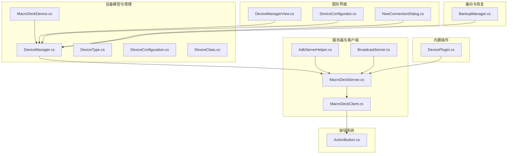

图表来源
- [MacroDeckDevice.cs:1-34](file://src/MacroDeck/Device/MacroDeckDevice.cs#L1-L34)
- [DeviceManager.cs:1-278](file://src/MacroDeck/Device/DeviceManager.cs#L1-L278)
- [MacroDeckServer.cs:1-376](file://src/MacroDeck/Server/MacroDeckServer.cs#L1-L376)
- [MacroDeckClient.cs:1-53](file://src/MacroDeck/Server/MacroDeckClient.cs#L1-L53)
- [AdbServerHelper.cs:1-221](file://src/MacroDeck/Server/AdbServerHelper.cs#L1-L221)
- [BroadcastServer.cs:1-79](file://src/MacroDeck/Server/BroadcastServer.cs#L1-L79)
- [DeviceManagerView.cs:1-86](file://src/MacroDeck/GUI/MainWindowViews/DeviceManagerView.cs#L1-L86)
- [DeviceConfigurator.cs:1-136](file://src/MacroDeck/GUI/Dialogs/DeviceConfigurator.cs#L1-L136)
- [NewConnectionDialog.cs:1-71](file://src/MacroDeck/GUI/Dialogs/NewConnectionDialog.cs#L1-L71)
- [ActionButton.cs:1-198](file://src/MacroDeck/ActionButton/ActionButton.cs#L1-L198)
- [DevicePlugin.cs:1-22](file://src/MacroDeck/InternalPlugins/DevicePlugin/DevicePlugin.cs#L1-L22)
- [BackupManager.cs:286-315](file://src/MacroDeck/Backup/BackupManager.cs#L286-L315)

章节来源
- [MacroDeckDevice.cs:1-34](file://src/MacroDeck/Device/MacroDeckDevice.cs#L1-L34)
- [DeviceManager.cs:1-278](file://src/MacroDeck/Device/DeviceManager.cs#L1-L278)
- [MacroDeckServer.cs:1-376](file://src/MacroDeck/Server/MacroDeckServer.cs#L1-L376)

## 核心组件
- 设备模型与配置
  - MacroDeckDevice：设备标识、显示名、可用性判断、阻断标记、当前配置、设备类型等
  - DeviceConfiguration：亮度、自动连接、唤醒锁策略等配置项
  - DeviceType：设备类型枚举（未知、Web、Android、iOS、StreamDeck）
  - DeviceClass：设备类别（软件客户端、特定硬件 DIY OLED 6 V1）

- 设备管理器
  - 负责已知设备的加载、保存、增删改查、连接请求处理、阻断与关闭会话、设备资料更新与同步

- 服务器与客户端
  - MacroDeckServer：WebSocket 服务端、消息分发、连接生命周期管理、按钮事件执行、配置下发
  - MacroDeckClient：客户端会话、设备类型/类映射、设备消息通道

- 连接辅助
  - AdbServerHelper：ADB 服务初始化、设备连接/断开监听、自动启动客户端与反向转发
  - BroadcastServer：UDP 广播本机地址与端口，便于设备发现

- 图形界面
  - DeviceManagerView：设备管理界面，展示已知设备列表与连接行为设置
  - DeviceConfigurator：设备配置对话框，调整亮度、自动连接与唤醒锁策略
  - NewConnectionDialog：新连接请求确认与阻断

- 按钮系统
  - ActionButton：按钮模型，支持状态、图标、颜色、热键绑定与多类动作（按下/释放/长按/长按释放）

- 内置插件
  - DevicePlugin：提供“设置配置”“设置亮度”等设备级动作

- 备份与恢复
  - BackupManager：支持设备配置文件的打包与恢复

章节来源
- [MacroDeckDevice.cs:6-33](file://src/MacroDeck/Device/MacroDeckDevice.cs#L6-L33)
- [DeviceConfiguration.cs:3-16](file://src/MacroDeck/Device/DeviceConfiguration.cs#L3-L16)
- [DeviceType.cs:3-10](file://src/MacroDeck/Device/DeviceType.cs#L3-L10)
- [DeviceClass.cs:3-7](file://src/MacroDeck/Device/DeviceClass.cs#L3-L7)
- [DeviceManager.cs:12-278](file://src/MacroDeck/Device/DeviceManager.cs#L12-L278)
- [MacroDeckServer.cs:16-376](file://src/MacroDeck/Server/MacroDeckServer.cs#L16-L376)
- [MacroDeckClient.cs:8-53](file://src/MacroDeck/Server/MacroDeckClient.cs#L8-L53)
- [AdbServerHelper.cs:11-221](file://src/MacroDeck/Server/AdbServerHelper.cs#L11-L221)
- [BroadcastServer.cs:8-79](file://src/MacroDeck/Server/BroadcastServer.cs#L8-L79)
- [DeviceManagerView.cs:9-86](file://src/MacroDeck/GUI/MainWindowViews/DeviceManagerView.cs#L9-L86)
- [DeviceConfigurator.cs:9-136](file://src/MacroDeck/GUI/Dialogs/DeviceConfigurator.cs#L9-L136)
- [NewConnectionDialog.cs:8-71](file://src/MacroDeck/GUI/Dialogs/NewConnectionDialog.cs#L8-L71)
- [ActionButton.cs:10-198](file://src/MacroDeck/ActionButton/ActionButton.cs#L10-L198)
- [DevicePlugin.cs:7-22](file://src/MacroDeck/InternalPlugins/DevicePlugin/DevicePlugin.cs#L7-L22)
- [BackupManager.cs:286-315](file://src/MacroDeck/Backup/BackupManager.cs#L286-L315)

## 架构总览
设备管理以“设备模型 + 管理器 + 服务器 + 客户端 + GUI + 插件 + 备份”的分层方式组织，核心交互围绕 WebSocket 与本地 ADB/Broadcast 协作展开。

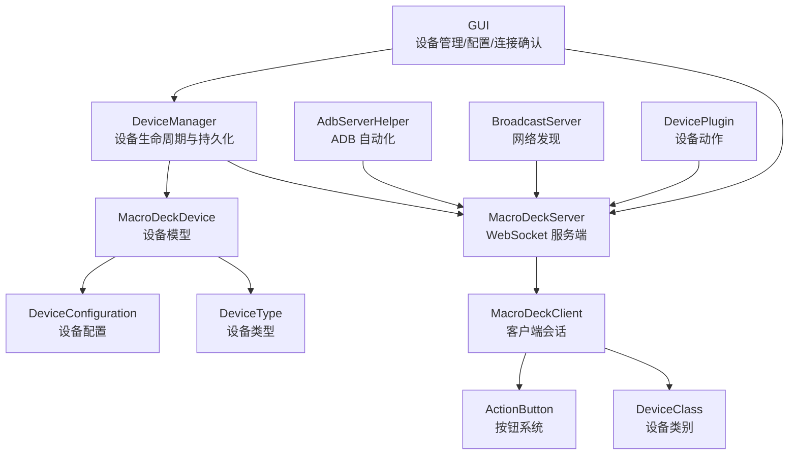

图表来源
- [DeviceManager.cs:12-278](file://src/MacroDeck/Device/DeviceManager.cs#L12-L278)
- [MacroDeckServer.cs:16-376](file://src/MacroDeck/Server/MacroDeckServer.cs#L16-L376)
- [MacroDeckClient.cs:8-53](file://src/MacroDeck/Server/MacroDeckClient.cs#L8-L53)
- [MacroDeckDevice.cs:6-33](file://src/MacroDeck/Device/MacroDeckDevice.cs#L6-L33)
- [DeviceConfiguration.cs:3-16](file://src/MacroDeck/Device/DeviceConfiguration.cs#L3-L16)
- [DeviceType.cs:3-10](file://src/MacroDeck/Device/DeviceType.cs#L3-L10)
- [DeviceClass.cs:3-7](file://src/MacroDeck/Device/DeviceClass.cs#L3-L7)
- [AdbServerHelper.cs:11-221](file://src/MacroDeck/Server/AdbServerHelper.cs#L11-L221)
- [BroadcastServer.cs:8-79](file://src/MacroDeck/Server/BroadcastServer.cs#L8-L79)
- [DeviceManagerView.cs:9-86](file://src/MacroDeck/GUI/MainWindowViews/DeviceManagerView.cs#L9-L86)
- [DeviceConfigurator.cs:9-136](file://src/MacroDeck/GUI/Dialogs/DeviceConfigurator.cs#L9-L136)
- [NewConnectionDialog.cs:8-71](file://src/MacroDeck/GUI/Dialogs/NewConnectionDialog.cs#L8-L71)
- [ActionButton.cs:10-198](file://src/MacroDeck/ActionButton/ActionButton.cs#L10-L198)
- [DevicePlugin.cs:7-22](file://src/MacroDeck/InternalPlugins/DevicePlugin/DevicePlugin.cs#L7-L22)

## 详细组件分析

### 设备模型与状态管理
- 关键属性
  - ClientId：设备唯一标识
  - DisplayName：显示名称
  - Available：通过服务器会话可用性判断
  - Blocked：是否阻断该设备
  - ProfileId：当前配置文件 ID
  - Configuration：设备配置对象
  - DeviceType：设备类型

- 可用性判定逻辑
  - 通过 MacroDeckServer 获取对应客户端，并结合 WebSocketHandler 的会话可用性判断

- 状态变更与同步
  - 设置配置（亮度、自动连接、唤醒锁）时，若设备在线则实时下发配置
  - 阻断设备时，若设备在线则主动关闭其会话

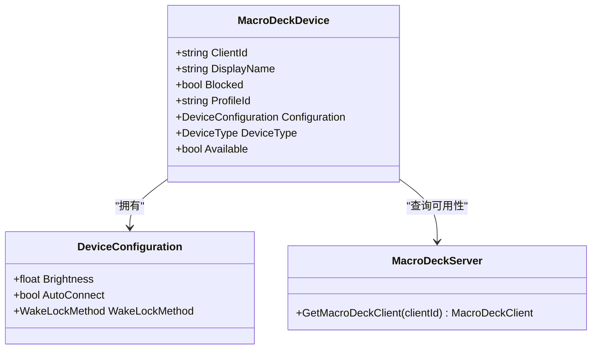

图表来源
- [MacroDeckDevice.cs:6-33](file://src/MacroDeck/Device/MacroDeckDevice.cs#L6-L33)
- [DeviceConfiguration.cs:3-16](file://src/MacroDeck/Device/DeviceConfiguration.cs#L3-L16)
- [MacroDeckServer.cs:359-364](file://src/MacroDeck/Server/MacroDeckServer.cs#L359-L364)

章节来源
- [MacroDeckDevice.cs:6-33](file://src/MacroDeck/Device/MacroDeckDevice.cs#L6-L33)
- [DeviceConfiguration.cs:3-16](file://src/MacroDeck/Device/DeviceConfiguration.cs#L3-L16)
- [MacroDeckServer.cs:359-364](file://src/MacroDeck/Server/MacroDeckServer.cs#L359-L364)

### 设备管理器与持久化
- 加载与保存
  - 从应用路径读取设备清单 JSON，异常时重置并记录日志
  - 采用临时文件写入后原子移动的方式保证一致性，并触发变更事件

- 增删改查
  - 添加/移除/重命名/查找设备
  - 判断显示名可用性

- 连接请求处理
  - 根据全局配置决定是否弹窗确认或直接接受
  - 已阻断设备拒绝接入
  - 新连接时可选择阻断并持久化

- 设备资料更新
  - 设置配置文件与阻断状态，必要时对在线设备下发最新配置

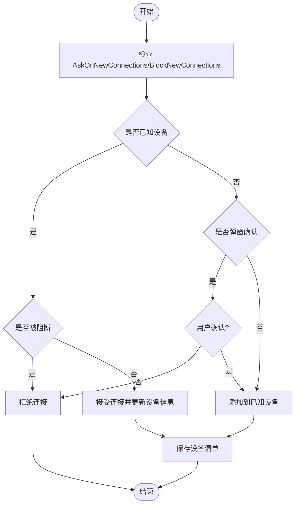

图表来源
- [DeviceManager.cs:185-276](file://src/MacroDeck/Device/DeviceManager.cs#L185-L276)

章节来源
- [DeviceManager.cs:21-81](file://src/MacroDeck/Device/DeviceManager.cs#L21-L81)
- [DeviceManager.cs:83-177](file://src/MacroDeck/Device/DeviceManager.cs#L83-L177)
- [DeviceManager.cs:185-276](file://src/MacroDeck/Device/DeviceManager.cs#L185-L276)

### 服务器与客户端交互
- 会话建立
  - 接收新会话，校验连接参数，分配客户端实例
  - 根据快速设置令牌或连接请求流程决定是否允许接入

- 消息处理
  - CONNECTED：设置 ClientId、DeviceType，选择性加入已知设备，下发按钮与配置
  - BUTTON_*：根据按键事件类型定位按钮并执行相应动作集合
  - GET_BUTTONS：发送当前文件夹全部按钮

- 配置下发
  - SetProfile/SetFolder/SendAllButtons/SendButton 等方法用于同步界面与配置

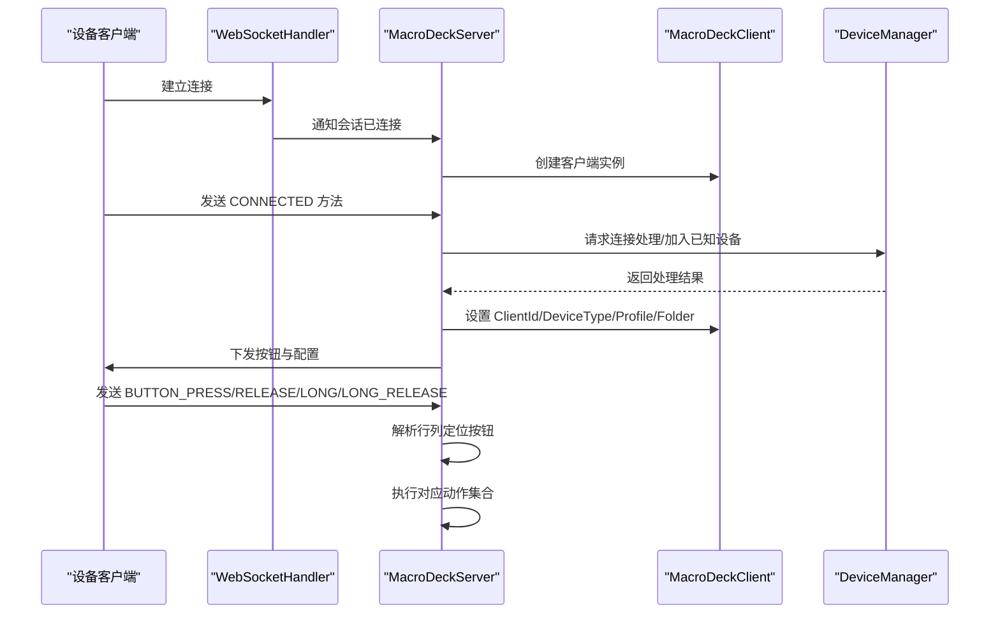

图表来源
- [MacroDeckServer.cs:74-244](file://src/MacroDeck/Server/MacroDeckServer.cs#L74-L244)
- [MacroDeckClient.cs:8-53](file://src/MacroDeck/Server/MacroDeckClient.cs#L8-L53)
- [DeviceManager.cs:185-251](file://src/MacroDeck/Device/DeviceManager.cs#L185-251)

章节来源
- [MacroDeckServer.cs:74-244](file://src/MacroDeck/Server/MacroDeckServer.cs#L74-L244)
- [MacroDeckClient.cs:8-53](file://src/MacroDeck/Server/MacroDeckClient.cs#L8-L53)
- [DeviceManager.cs:185-251](file://src/MacroDeck/Device/DeviceManager.cs#L185-L251)

### 设备类型系统与分类
- DeviceType：Unknown/Web/Android/iOS/StreamDeck
- DeviceClass：SoftwareClient（默认软件客户端）、Macro_Deck_DIY_OLED_6_V1（特定硬件）
- 类型到类别的映射：根据 DeviceType 设置 DeviceClass，并绑定对应的设备消息实现

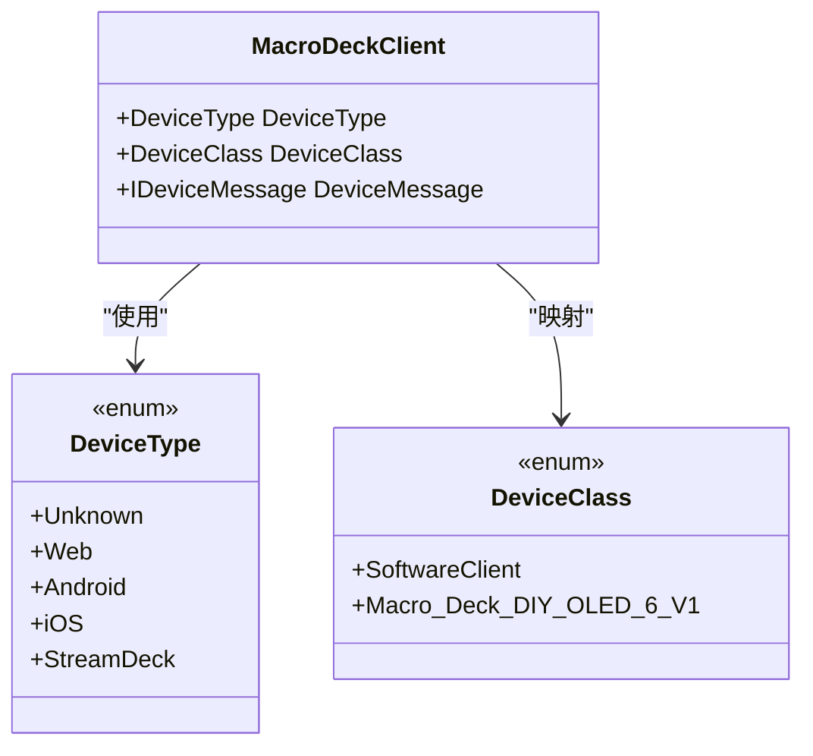

图表来源
- [DeviceType.cs:3-10](file://src/MacroDeck/Device/DeviceType.cs#L3-L10)
- [DeviceClass.cs:3-7](file://src/MacroDeck/Device/DeviceClass.cs#L3-L7)
- [MacroDeckClient.cs:31-49](file://src/MacroDeck/Server/MacroDeckClient.cs#L31-L49)

章节来源
- [DeviceType.cs:3-10](file://src/MacroDeck/Device/DeviceType.cs#L3-L10)
- [DeviceClass.cs:3-7](file://src/MacroDeck/Device/DeviceClass.cs#L3-L7)
- [MacroDeckClient.cs:31-49](file://src/MacroDeck/Server/MacroDeckClient.cs#L31-L49)

### 连接流程：ADB、网络发现与手动配置
- ADB 自动化
  - 初始化 ADB 服务，监听设备连接/断开
  - 设备连接后尝试唤醒并启动客户端，建立反向转发
  - 断开时记录日志

- 网络发现
  - 启动 UDP 广播，周期性发送本机名称、IP 与端口
  - 设备侧可据此发现主机并发起连接

- 手动配置
  - 通过 GUI 的“新连接确认”对话框进行授权/阻断
  - 在设备管理界面设置“允许全部/询问/阻断”三种行为模式

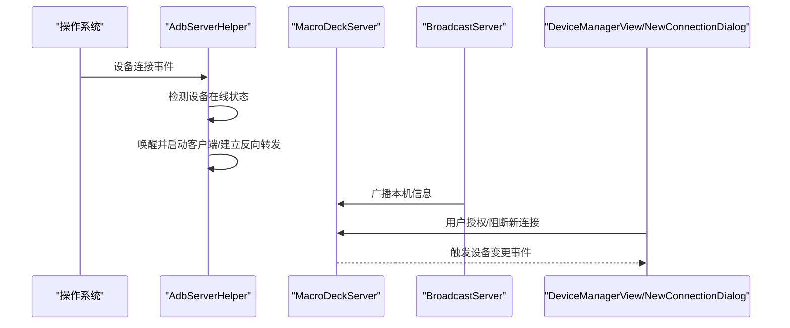

图表来源
- [AdbServerHelper.cs:112-221](file://src/MacroDeck/Server/AdbServerHelper.cs#L112-L221)
- [BroadcastServer.cs:58-77](file://src/MacroDeck/Server/BroadcastServer.cs#L58-L77)
- [DeviceManagerView.cs:79-84](file://src/MacroDeck/GUI/MainWindowViews/DeviceManagerView.cs#L79-L84)
- [NewConnectionDialog.cs:19-71](file://src/MacroDeck/GUI/Dialogs/NewConnectionDialog.cs#L19-L71)

章节来源
- [AdbServerHelper.cs:31-57](file://src/MacroDeck/Server/AdbServerHelper.cs#L31-L57)
- [AdbServerHelper.cs:112-221](file://src/MacroDeck/Server/AdbServerHelper.cs#L112-L221)
- [BroadcastServer.cs:13-77](file://src/MacroDeck/Server/BroadcastServer.cs#L13-L77)
- [DeviceManagerView.cs:23-84](file://src/MacroDeck/GUI/MainWindowViews/DeviceManagerView.cs#L23-L84)
- [NewConnectionDialog.cs:19-71](file://src/MacroDeck/GUI/Dialogs/NewConnectionDialog.cs#L19-L71)

### 设备配置管理与导入导出
- 设备配置项
  - 亮度、自动连接、唤醒锁策略（从不/连接时/总是）
  - 在线设备时即时下发配置更新

- 导入导出
  - 设备清单 JSON 文件作为配置载体
  - 备份管理器在打包时包含设备清单文件，支持完整恢复

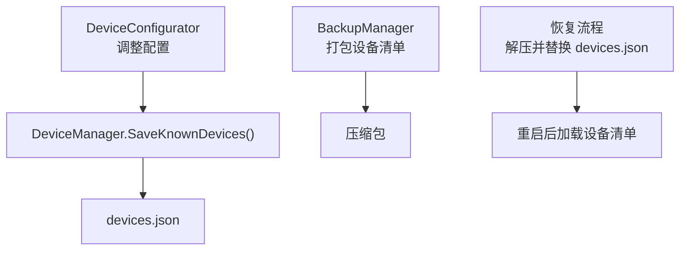

图表来源
- [DeviceConfigurator.cs:53-134](file://src/MacroDeck/GUI/Dialogs/DeviceConfigurator.cs#L53-134)
- [DeviceManager.cs:53-81](file://src/MacroDeck/Device/DeviceManager.cs#L53-81)
- [BackupManager.cs:286-315](file://src/MacroDeck/Backup/BackupManager.cs#L286-315)

章节来源
- [DeviceConfigurator.cs:24-134](file://src/MacroDeck/GUI/Dialogs/DeviceConfigurator.cs#L24-L134)
- [DeviceManager.cs:53-81](file://src/MacroDeck/Device/DeviceManager.cs#L53-L81)
- [BackupManager.cs:286-315](file://src/MacroDeck/Backup/BackupManager.cs#L286-L315)

### 设备与按钮系统的集成
- 按键事件路由
  - 服务器解析按钮事件（短按/释放/长按/长按释放），定位当前文件夹中的按钮
  - 根据事件类型执行对应的动作列表（Actions/ActionsRelease/ActionsLongPress/ActionsLongPressRelease）

- 状态联动
  - 按钮状态变化通过服务器广播至所有关注该按钮的设备
  - 支持变量绑定与热键绑定，增强交互体验

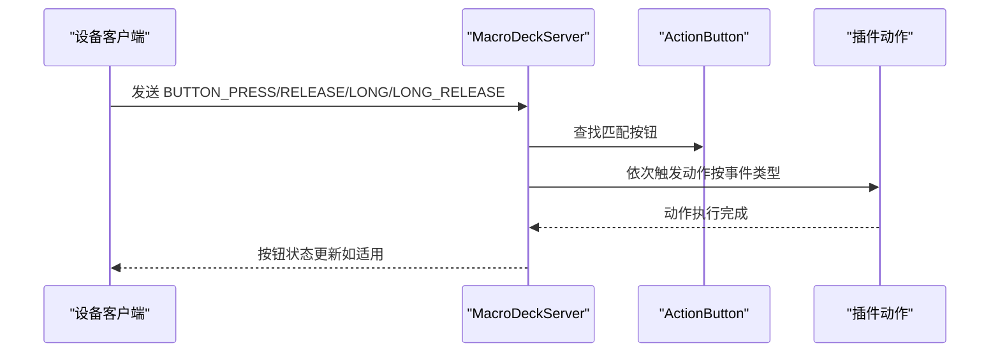

图表来源
- [MacroDeckServer.cs:201-239](file://src/MacroDeck/Server/MacroDeckServer.cs#L201-239)
- [ActionButton.cs:109-198](file://src/MacroDeck/ActionButton/ActionButton.cs#L109-L198)

章节来源
- [MacroDeckServer.cs:201-239](file://src/MacroDeck/Server/MacroDeckServer.cs#L201-L239)
- [ActionButton.cs:109-198](file://src/MacroDeck/ActionButton/ActionButton.cs#L109-L198)

### 设备管理与服务器协作
- 服务器负责：
  - WebSocket 会话生命周期管理
  - 连接请求验证与授权
  - 按钮事件分发与动作执行
  - 配置下发与状态同步

- 管理器负责：
  - 设备清单持久化与变更通知
  - 连接请求策略与阻断控制
  - 在线设备配置同步

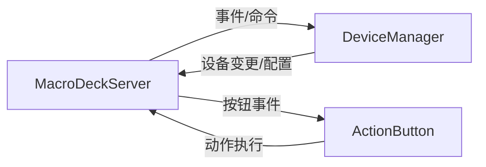

图表来源
- [MacroDeckServer.cs:20-55](file://src/MacroDeck/Server/MacroDeckServer.cs#L20-L55)
- [DeviceManager.cs:19-21](file://src/MacroDeck/Device/DeviceManager.cs#L19-L21)

章节来源
- [MacroDeckServer.cs:20-55](file://src/MacroDeck/Server/MacroDeckServer.cs#L20-L55)
- [DeviceManager.cs:19-21](file://src/MacroDeck/Device/DeviceManager.cs#L19-L21)

## 依赖分析
- 组件耦合
  - DeviceManager 与 MacroDeckServer 通过客户端实例与事件交互
  - MacroDeckClient 的 DeviceClass 由 DeviceType 决定，影响消息通道实现
  - GUI 层通过事件订阅设备变更，实现 UI 实时更新

- 外部依赖
  - ADB 库用于设备自动化
  - WebSocket 通道承载设备与服务器通信
  - JSON 序列化用于设备清单持久化

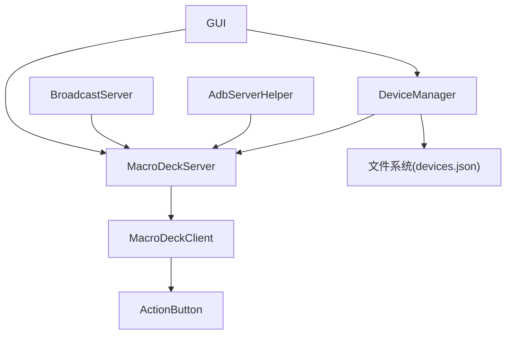

图表来源
- [DeviceManager.cs:12-278](file://src/MacroDeck/Device/DeviceManager.cs#L12-L278)
- [MacroDeckServer.cs:16-376](file://src/MacroDeck/Server/MacroDeckServer.cs#L16-L376)
- [MacroDeckClient.cs:8-53](file://src/MacroDeck/Server/MacroDeckClient.cs#L8-L53)
- [AdbServerHelper.cs:11-221](file://src/MacroDeck/Server/AdbServerHelper.cs#L11-L221)
- [BroadcastServer.cs:8-79](file://src/MacroDeck/Server/BroadcastServer.cs#L8-L79)

章节来源
- [DeviceManager.cs:12-278](file://src/MacroDeck/Device/DeviceManager.cs#L12-L278)
- [MacroDeckServer.cs:16-376](file://src/MacroDeck/Server/MacroDeckServer.cs#L16-L376)
- [MacroDeckClient.cs:8-53](file://src/MacroDeck/Server/MacroDeckClient.cs#L8-L53)
- [AdbServerHelper.cs:11-221](file://src/MacroDeck/Server/AdbServerHelper.cs#L11-L221)
- [BroadcastServer.cs:8-79](file://src/MacroDeck/Server/BroadcastServer.cs#L8-L79)

## 性能考虑
- 设备清单持久化采用临时文件写入+原子替换，避免并发写入冲突
- 服务器消息处理异步化，按键事件与动作执行分离，降低阻塞风险
- ADB 设备在线检测带超时等待，避免长时间阻塞
- GUI 更新通过事件驱动，减少不必要的刷新

## 故障排除指南
- 设备不可用
  - 检查 MacroDeckServer 会话是否存在且可用
  - 确认设备未被阻断
  - 若设备在线但不可用，尝试重新授权或重启服务

- 连接被拒
  - 若启用“询问新连接”，请在弹窗中确认或勾选阻断
  - 若设置为“阻断全部新连接”，需调整行为模式

- ADB 自动化失败
  - 确认 ADB 服务已正确初始化且 adb.exe 存在
  - 检查设备是否在线，必要时手动唤醒设备
  - 反向转发失败时查看日志并重试

- 配置未生效
  - 确认设备处于在线状态，配置会自动下发
  - 如未在线，设备上线后将自动同步最新配置

章节来源
- [MacroDeckDevice.cs:11-24](file://src/MacroDeck/Device/MacroDeckDevice.cs#L11-L24)
- [DeviceManager.cs:131-149](file://src/MacroDeck/Device/DeviceManager.cs#L131-L149)
- [NewConnectionDialog.cs:19-71](file://src/MacroDeck/GUI/Dialogs/NewConnectionDialog.cs#L19-L71)
- [AdbServerHelper.cs:31-57](file://src/MacroDeck/Server/AdbServerHelper.cs#L31-L57)
- [AdbServerHelper.cs:128-149](file://src/MacroDeck/Server/AdbServerHelper.cs#L128-L149)

## 结论
Macro-Deck 的设备管理系统以清晰的模型与职责划分实现了设备连接、配置与状态管理的闭环：设备模型与管理器负责持久化与策略控制，服务器负责会话与消息分发，GUI 提供直观的操作入口，ADB 与广播服务完善了自动化与发现能力。通过完善的导入导出与错误处理机制，系统既满足使用者的日常配置需求，也为开发者提供了扩展接口与动作集成点。

## 附录

### 使用者连接配置指导
- 行为模式
  - 允许全部新连接：无需确认，适合信任环境
  - 询问新连接：首次连接弹窗确认，可选择阻断
  - 阻断全部新连接：拒绝所有新连接，适合严格安全场景

- ADB 自动化
  - 确保 ADB 服务开启，设备连接后自动启动客户端并建立反向转发
  - 若失败，请检查 ADB 路径与设备在线状态

- 网络发现
  - 启用广播服务后，设备可定期发现主机并连接

章节来源
- [DeviceManagerView.cs:23-84](file://src/MacroDeck/GUI/MainWindowViews/DeviceManagerView.cs#L23-L84)
- [AdbServerHelper.cs:31-57](file://src/MacroDeck/Server/AdbServerHelper.cs#L31-L57)
- [BroadcastServer.cs:13-77](file://src/MacroDeck/Server/BroadcastServer.cs#L13-L77)

### 开发者扩展接口
- 设备类型与类别
  - 通过 DeviceType/DeviceClass 扩展设备类型与消息通道实现
  - 在 MacroDeckClient.DeviceType setter 中增加映射逻辑

- 设备动作
  - 通过 DevicePlugin 注册设备级动作（如设置亮度/配置）
  - 在动作中调用 MacroDeckServer 的配置下发与按钮更新接口

- 设备配置
  - 在 DeviceConfiguration 中新增字段，并在 DeviceConfigurator 中提供 UI 控件
  - 在 DeviceManager.SaveKnownDevices 中确保序列化兼容

章节来源
- [DeviceType.cs:3-10](file://src/MacroDeck/Device/DeviceType.cs#L3-L10)
- [DeviceClass.cs:3-7](file://src/MacroDeck/Device/DeviceClass.cs#L3-L7)
- [MacroDeckClient.cs:31-49](file://src/MacroDeck/Server/MacroDeckClient.cs#L31-L49)
- [DevicePlugin.cs:7-22](file://src/MacroDeck/InternalPlugins/DevicePlugin/DevicePlugin.cs#L7-L22)
- [DeviceConfigurator.cs:24-134](file://src/MacroDeck/GUI/Dialogs/DeviceConfigurator.cs#L24-L134)
- [DeviceManager.cs:53-81](file://src/MacroDeck/Device/DeviceManager.cs#L53-L81)