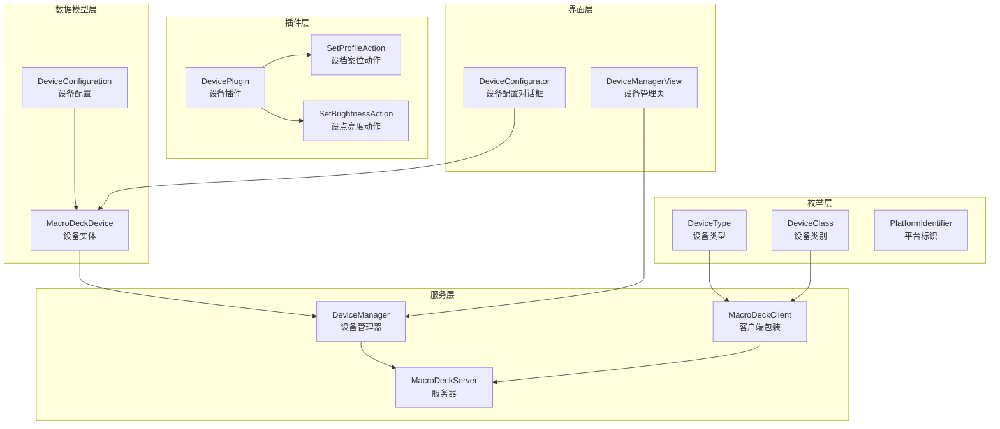
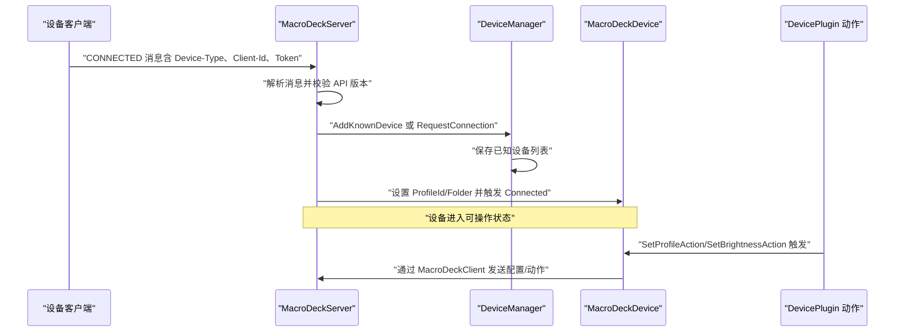
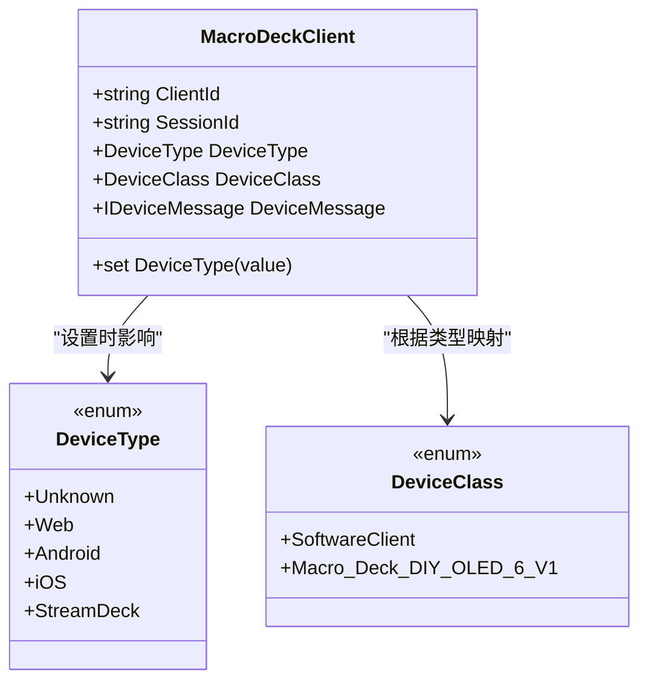
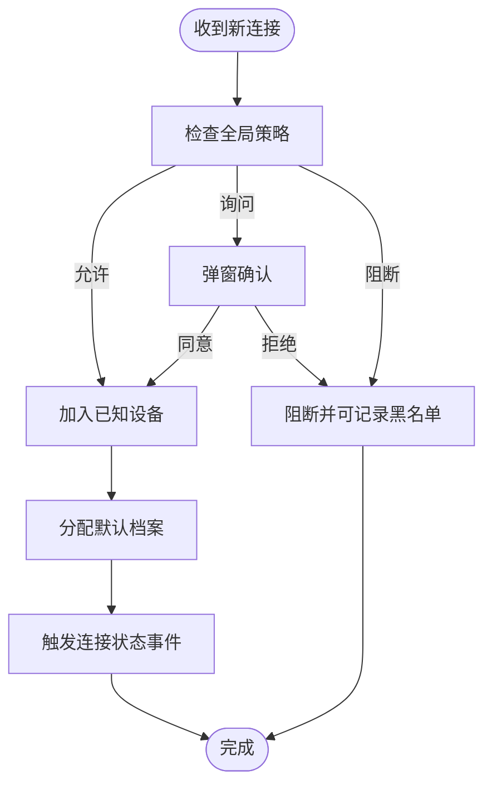
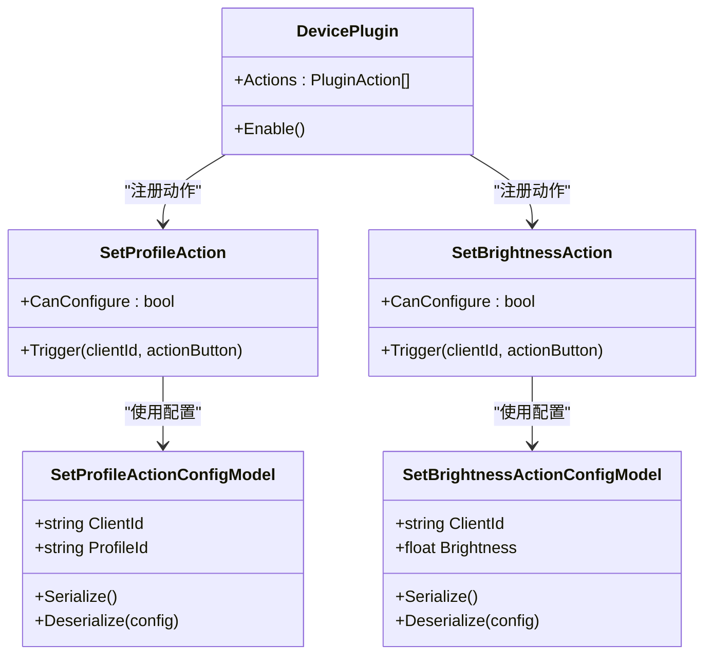
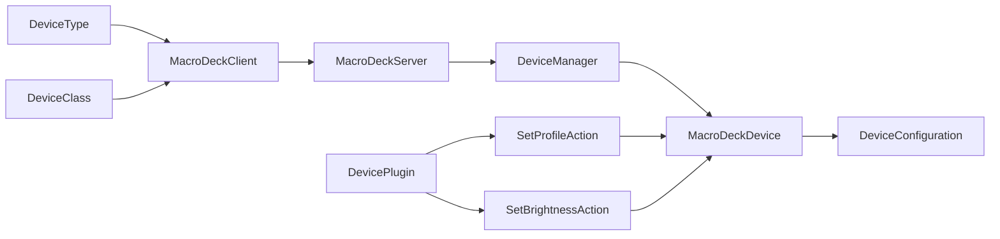

# 设备类型系统

<cite>
**本文引用的文件**
- [DeviceClass.cs](file://src/MacroDeck/Device/DeviceClass.cs)
- [DeviceType.cs](file://src/MacroDeck/Device/DeviceType.cs)
- [DeviceConfiguration.cs](file://src/MacroDeck/Device/DeviceConfiguration.cs)
- [MacroDeckDevice.cs](file://src/MacroDeck/Device/MacroDeckDevice.cs)
- [DeviceManager.cs](file://src/MacroDeck/Device/DeviceManager.cs)
- [PlatformIdentifier.cs](file://src/MacroDeck/Enums/PlatformIdentifier.cs)
- [MacroDeckClient.cs](file://src/MacroDeck/Server/MacroDeckClient.cs)
- [MacroDeckServer.cs](file://src/MacroDeck/Server/MacroDeckServer.cs)
- [DeviceConfigurator.cs](file://src/MacroDeck/GUI/Dialogs/DeviceConfigurator.cs)
- [DeviceManagerView.cs](file://src/MacroDeck/GUI/MainWindowViews/DeviceManagerView.cs)
- [DevicePlugin.cs](file://src/MacroDeck/InternalPlugins/DevicePlugin/DevicePlugin.cs)
- [SetProfileAction.cs](file://src/MacroDeck/InternalPlugins/DevicePlugin/Actions/SetProfileAction.cs)
- [SetBrightnessAction.cs](file://src/MacroDeck/InternalPlugins/DevicePlugin/Actions/SetBrightnessAction.cs)
- [SetProfileActionConfigModel.cs](file://src/MacroDeck/InternalPlugins/DevicePlugin/Models/SetProfileActionConfigModel.cs)
- [SetBrightnessActionConfigModel.cs](file://src/MacroDeck/InternalPlugins/DevicePlugin/Models/SetBrightnessActionConfigModel.cs)
- [SetProfileActionConfigView.cs](file://src/MacroDeck/InternalPlugins/DevicePlugin/Views/SetProfileActionConfigView.cs)
- [SetBrightnessActionConfigView.cs](file://src/MacroDeck/InternalPlugins/DevicePlugin/Views/SetBrightnessActionConfigView.cs)
</cite>

## 目录
1. [简介](#简介)
2. [项目结构](#项目结构)
3. [核心组件](#核心组件)
4. [架构总览](#架构总览)
5. [详细组件分析](#详细组件分析)
6. [依赖关系分析](#依赖关系分析)
7. [性能考量](#性能考量)
8. [故障排查指南](#故障排查指南)
9. [结论](#结论)
10. [附录](#附录)

## 简介
本文件系统化梳理 Macro-Deck 的“设备类型系统”，围绕设备类别（DeviceClass）、设备类型（DeviceType）、平台标识（PlatformIdentifier）与功能特性展开，解释不同设备类型的属性与行为差异（软件客户端、硬件设备、混合设备），并记录设备类型与功能特性的映射关系（支持的操作、可用插件与配置项）。同时，说明设备类型检测与识别机制（自动识别与手动配置）、扩展接口与开发规范，并给出用户选择建议与开发者最佳实践。

## 项目结构
设备类型系统主要由以下模块构成：
- 枚举层：设备类型与类别、平台标识
- 数据模型层：设备实体与配置
- 服务层：设备管理与连接处理
- 插件层：设备相关内置插件与动作
- 界面层：设备管理视图与配置对话框
- 服务器层：设备连接建立与消息路由



图表来源
- [DeviceType.cs:1-10](file://src/MacroDeck/Device/DeviceType.cs#L1-L10)
- [DeviceClass.cs:1-7](file://src/MacroDeck/Device/DeviceClass.cs#L1-L7)
- [PlatformIdentifier.cs:1-11](file://src/MacroDeck/Enums/PlatformIdentifier.cs#L1-L11)
- [MacroDeckDevice.cs:1-33](file://src/MacroDeck/Device/MacroDeckDevice.cs#L1-L33)
- [DeviceConfiguration.cs:1-16](file://src/MacroDeck/Device/DeviceConfiguration.cs#L1-L16)
- [DeviceManager.cs:1-278](file://src/MacroDeck/Device/DeviceManager.cs#L1-L278)
- [MacroDeckClient.cs:1-52](file://src/MacroDeck/Server/MacroDeckClient.cs#L1-L52)
- [MacroDeckServer.cs:1-376](file://src/MacroDeck/Server/MacroDeckServer.cs#L1-L376)
- [DevicePlugin.cs:1-22](file://src/MacroDeck/InternalPlugins/DevicePlugin/DevicePlugin.cs#L1-L22)
- [SetProfileAction.cs:1-37](file://src/MacroDeck/InternalPlugins/DevicePlugin/Actions/SetProfileAction.cs#L1-L37)
- [SetBrightnessAction.cs:1-39](file://src/MacroDeck/InternalPlugins/DevicePlugin/Actions/SetBrightnessAction.cs#L1-L39)
- [DeviceManagerView.cs:1-86](file://src/MacroDeck/GUI/MainWindowViews/DeviceManagerView.cs#L1-L86)
- [DeviceConfigurator.cs:1-136](file://src/MacroDeck/GUI/Dialogs/DeviceConfigurator.cs#L1-L136)

章节来源
- [DeviceType.cs:1-10](file://src/MacroDeck/Device/DeviceType.cs#L1-L10)
- [DeviceClass.cs:1-7](file://src/MacroDeck/Device/DeviceClass.cs#L1-L7)
- [PlatformIdentifier.cs:1-11](file://src/MacroDeck/Enums/PlatformIdentifier.cs#L1-L11)
- [MacroDeckDevice.cs:1-33](file://src/MacroDeck/Device/MacroDeckDevice.cs#L1-L33)
- [DeviceConfiguration.cs:1-16](file://src/MacroDeck/Device/DeviceConfiguration.cs#L1-L16)
- [DeviceManager.cs:1-278](file://src/MacroDeck/Device/DeviceManager.cs#L1-L278)
- [MacroDeckClient.cs:1-52](file://src/MacroDeck/Server/MacroDeckClient.cs#L1-L52)
- [MacroDeckServer.cs:1-376](file://src/MacroDeck/Server/MacroDeckServer.cs#L1-L376)
- [DevicePlugin.cs:1-22](file://src/MacroDeck/InternalPlugins/DevicePlugin/DevicePlugin.cs#L1-L22)
- [SetProfileAction.cs:1-37](file://src/MacroDeck/InternalPlugins/DevicePlugin/Actions/SetProfileAction.cs#L1-L37)
- [SetBrightnessAction.cs:1-39](file://src/MacroDeck/InternalPlugins/DevicePlugin/Actions/SetBrightnessAction.cs#L1-L39)
- [DeviceManagerView.cs:1-86](file://src/MacroDeck/GUI/MainWindowViews/DeviceManagerView.cs#L1-L86)
- [DeviceConfigurator.cs:1-136](file://src/MacroDeck/GUI/Dialogs/DeviceConfigurator.cs#L1-L136)

## 核心组件
- 设备类型（DeviceType）
  - 支持 Unknown、Web、Android、iOS、StreamDeck 等类型，用于区分客户端来源与能力边界。
- 设备类别（DeviceClass）
  - 当前包含 SoftwareClient 与 Macro_Deck_DIY_OLED_6_V1，用于进一步细分设备家族或硬件形态。
- 平台标识（PlatformIdentifier）
  - WinX64、MacX64、MacArm64、LinuxX64、LinuxArm64、LinuxArm32，用于跨平台兼容与资源分发。
- 设备实体（MacroDeckDevice）
  - 关键字段：ClientId、DisplayName、Blocked、ProfileId、Configuration、DeviceType、Available（只读）。
- 设备配置（DeviceConfiguration）
  - 包含亮度、自动连接、唤醒锁策略等。
- 设备管理器（DeviceManager）
  - 负责已知设备的持久化、增删改查、连接请求处理、阻断与重命名等。
- 客户端包装（MacroDeckClient）
  - 封装会话信息、设备类型与类别、消息通道；根据设备类型设置消息实现。
- 服务器（MacroDeckServer）
  - 处理连接建立、消息解析、设备注册与默认档案分配。
- 内置设备插件（DevicePlugin）
  - 提供“设档案位”“设点亮度”等动作，支持对指定或当前设备执行。

章节来源
- [DeviceType.cs:1-10](file://src/MacroDeck/Device/DeviceType.cs#L1-L10)
- [DeviceClass.cs:1-7](file://src/MacroDeck/Device/DeviceClass.cs#L1-L7)
- [PlatformIdentifier.cs:1-11](file://src/MacroDeck/Enums/PlatformIdentifier.cs#L1-L11)
- [MacroDeckDevice.cs:1-33](file://src/MacroDeck/Device/MacroDeckDevice.cs#L1-L33)
- [DeviceConfiguration.cs:1-16](file://src/MacroDeck/Device/DeviceConfiguration.cs#L1-L16)
- [DeviceManager.cs:1-278](file://src/MacroDeck/Device/DeviceManager.cs#L1-L278)
- [MacroDeckClient.cs:1-52](file://src/MacroDeck/Server/MacroDeckClient.cs#L1-L52)
- [MacroDeckServer.cs:1-376](file://src/MacroDeck/Server/MacroDeckServer.cs#L1-L376)
- [DevicePlugin.cs:1-22](file://src/MacroDeck/InternalPlugins/DevicePlugin/DevicePlugin.cs#L1-L22)

## 架构总览
设备类型系统贯穿“连接建立—设备登记—配置下发—动作执行”的主链路。下图展示了从客户端连接到设备配置生效的关键交互：



图表来源
- [MacroDeckServer.cs:123-200](file://src/MacroDeck/Server/MacroDeckServer.cs#L123-L200)
- [DeviceManager.cs:185-238](file://src/MacroDeck/Device/DeviceManager.cs#L185-L238)
- [MacroDeckDevice.cs:1-33](file://src/MacroDeck/Device/MacroDeckDevice.cs#L1-L33)
- [SetProfileAction.cs:1-37](file://src/MacroDeck/InternalPlugins/DevicePlugin/Actions/SetProfileAction.cs#L1-L37)
- [SetBrightnessAction.cs:1-39](file://src/MacroDeck/InternalPlugins/DevicePlugin/Actions/SetBrightnessAction.cs#L1-L39)

## 详细组件分析

### 设备类型与类别映射
- 设备类型（DeviceType）决定设备类别（DeviceClass）与消息实现：
  - 所有已定义的设备类型（Unknown/Web/Android/iOS/StreamDeck）均映射为 SoftwareClient 类别，并使用 SoftwareClientMessage 进行通信。
- 设备类别（DeviceClass）目前还包含 Macro_Deck_DIY_OLED_6_V1，可用于未来扩展硬件类设备的消息实现与差异化行为。



图表来源
- [MacroDeckClient.cs:31-49](file://src/MacroDeck/Server/MacroDeckClient.cs#L31-L49)
- [DeviceType.cs:1-10](file://src/MacroDeck/Device/DeviceType.cs#L1-L10)
- [DeviceClass.cs:1-7](file://src/MacroDeck/Device/DeviceClass.cs#L1-L7)

章节来源
- [MacroDeckClient.cs:1-52](file://src/MacroDeck/Server/MacroDeckClient.cs#L1-L52)
- [DeviceType.cs:1-10](file://src/MacroDeck/Device/DeviceType.cs#L1-L10)
- [DeviceClass.cs:1-7](file://src/MacroDeck/Device/DeviceClass.cs#L1-L7)

### 设备实体与配置
- 设备实体（MacroDeckDevice）承载设备标识、显示名、可用性、阻断标记、档案绑定、配置对象与设备类型。
- 可用性（Available）通过服务器侧会话状态判断，避免重复查询。
- 配置（DeviceConfiguration）包含：
  - 亮度（0~1）
  - 自动连接（布尔）
  - 唤醒锁策略（Always/Connected/Never）

```mermaid
classDiagram
class MacroDeckDevice {
+string ClientId
+string DisplayName
+bool Blocked
+string ProfileId
+DeviceConfiguration Configuration
+DeviceType DeviceType
+bool Available
}
class DeviceConfiguration {
+float Brightness
+bool AutoConnect
+WakeLockMethod WakeLockMethod
}
enum WakeLockMethod {
+Always
+Connected
+Never
}
MacroDeckDevice --> DeviceConfiguration : "组合"
```

图表来源
- [MacroDeckDevice.cs:1-33](file://src/MacroDeck/Device/MacroDeckDevice.cs#L1-L33)
- [DeviceConfiguration.cs:1-16](file://src/MacroDeck/Device/DeviceConfiguration.cs#L1-L16)

章节来源
- [MacroDeckDevice.cs:1-33](file://src/MacroDeck/Device/MacroDeckDevice.cs#L1-L33)
- [DeviceConfiguration.cs:1-16](file://src/MacroDeck/Device/DeviceConfiguration.cs#L1-L16)

### 设备管理与连接流程
- 已知设备持久化：以 JSON 文件存储，带类型元数据与容错处理。
- 新连接请求：
  - 若开启“询问新连接”，则弹窗确认或阻断；否则直接加入或拒绝。
  - 快速设置 Token 可绕过确认直接登记。
- 设备状态变更事件：连接/断开、设备列表变化。
- 设备配置对话框：实时调整亮度、自动连接与唤醒锁策略，并通过消息通道下发。



图表来源
- [DeviceManager.cs:185-238](file://src/MacroDeck/Device/DeviceManager.cs#L185-L238)
- [MacroDeckServer.cs:141-199](file://src/MacroDeck/Server/MacroDeckServer.cs#L141-L199)
- [DeviceConfigurator.cs:53-134](file://src/MacroDeck/GUI/Dialogs/DeviceConfigurator.cs#L53-L134)

章节来源
- [DeviceManager.cs:1-278](file://src/MacroDeck/Device/DeviceManager.cs#L1-L278)
- [MacroDeckServer.cs:1-376](file://src/MacroDeck/Server/MacroDeckServer.cs#L1-L376)
- [DeviceConfigurator.cs:1-136](file://src/MacroDeck/GUI/Dialogs/DeviceConfigurator.cs#L1-L136)

### 设备类型与功能特性映射
- 软件客户端（Web/Android/iOS/StreamDeck/Unknown）统一归类为 SoftwareClient，具备以下通用能力：
  - 可被服务器识别并登记为 MacroDeckDevice
  - 支持通过内置设备插件执行动作（如设档案位、设点亮度）
  - 支持设备级配置（亮度、自动连接、唤醒锁）
- 硬件设备（示例：Macro_Deck_DIY_OLED_6_V1）当前作为独立类别预留，未来可扩展专用消息实现与差异化行为。

章节来源
- [MacroDeckClient.cs:31-49](file://src/MacroDeck/Server/MacroDeckClient.cs#L31-L49)
- [DeviceClass.cs:1-7](file://src/MacroDeck/Device/DeviceClass.cs#L1-L7)
- [DevicePlugin.cs:1-22](file://src/MacroDeck/InternalPlugins/DevicePlugin/DevicePlugin.cs#L1-L22)

### 设备类型检测与识别机制
- 自动识别：
  - 服务器在 CONNECTED 方法中解析 Device-Type 字段并写入 MacroDeckClient。
  - 根据设备类型自动设置设备类别与消息实现。
- 手动配置：
  - 全局策略：允许全部新连接、询问新连接、阻断全部新连接。
  - 单个设备：可阻断特定设备、重命名、移除、修改配置。
  - 设备配置对话框：实时调整亮度、自动连接与唤醒锁策略。

章节来源
- [MacroDeckServer.cs:141-199](file://src/MacroDeck/Server/MacroDeckServer.cs#L141-L199)
- [MacroDeckClient.cs:31-49](file://src/MacroDeck/Server/MacroDeckClient.cs#L31-L49)
- [DeviceManagerView.cs:79-84](file://src/MacroDeck/GUI/MainWindowViews/DeviceManagerView.cs#L79-L84)
- [DeviceConfigurator.cs:24-134](file://src/MacroDeck/GUI/Dialogs/DeviceConfigurator.cs#L24-L134)

### 设备类型扩展接口与开发规范
- 扩展步骤（开发者参考）：
  1. 在 DeviceType 中新增类型值（如 HardwareXXX）。
  2. 在 DeviceClass 中新增对应类别（如 HardwareXXX）。
  3. 在 MacroDeckClient 中为新类型增加 DeviceClass 映射与消息实现选择。
  4. 如需硬件差异化行为，新增专用 IDeviceMessage 实现并在客户端侧配套支持。
  5. 在插件层（如 DevicePlugin）新增针对该设备类型的动作或配置项。
  6. 在界面层（设备管理页/配置对话框）补充该类型相关的 UI 与逻辑。
- 最佳实践：
  - 保持 DeviceType 与 DeviceClass 的一一映射清晰，避免交叉混淆。
  - 新类型尽量复用现有消息协议与动作框架，减少协议差异。
  - 对硬件设备，优先提供稳定的配置下发与状态反馈机制。

章节来源
- [DeviceType.cs:1-10](file://src/MacroDeck/Device/DeviceType.cs#L1-L10)
- [DeviceClass.cs:1-7](file://src/MacroDeck/Device/DeviceClass.cs#L1-L7)
- [MacroDeckClient.cs:31-49](file://src/MacroDeck/Server/MacroDeckClient.cs#L31-L49)
- [DevicePlugin.cs:1-22](file://src/MacroDeck/InternalPlugins/DevicePlugin/DevicePlugin.cs#L1-L22)

### 插件系统兼容性与适配方案
- 内置设备插件（DevicePlugin）提供两类动作：
  - 设档案位（SetProfileAction）：可对当前设备或固定设备切换档案。
  - 设点亮度（SetBrightnessAction）：可对当前设备或固定设备设置亮度。
- 配置模型与视图：
  - SetProfileActionConfigModel/SetBrightnessActionConfigModel：序列化配置。
  - SetProfileActionConfigView/SetBrightnessActionConfigView：UI 选择设备与参数。
- 适配要点：
  - 设备类型统一走 SoftwareClient 消息通道，动作参数中携带目标设备 ClientId 即可。
  - 硬件设备若采用独立消息实现，需在插件层增加条件分支或专用动作。



图表来源
- [DevicePlugin.cs:1-22](file://src/MacroDeck/InternalPlugins/DevicePlugin/DevicePlugin.cs#L1-L22)
- [SetProfileAction.cs:1-37](file://src/MacroDeck/InternalPlugins/DevicePlugin/Actions/SetProfileAction.cs#L1-L37)
- [SetBrightnessAction.cs:1-39](file://src/MacroDeck/InternalPlugins/DevicePlugin/Actions/SetBrightnessAction.cs#L1-L39)
- [SetProfileActionConfigModel.cs:1-21](file://src/MacroDeck/InternalPlugins/DevicePlugin/Models/SetProfileActionConfigModel.cs#L1-L21)
- [SetBrightnessActionConfigModel.cs:1-21](file://src/MacroDeck/InternalPlugins/DevicePlugin/Models/SetBrightnessActionConfigModel.cs#L1-L21)

章节来源
- [DevicePlugin.cs:1-22](file://src/MacroDeck/InternalPlugins/DevicePlugin/DevicePlugin.cs#L1-L22)
- [SetProfileAction.cs:1-37](file://src/MacroDeck/InternalPlugins/DevicePlugin/Actions/SetProfileAction.cs#L1-L37)
- [SetBrightnessAction.cs:1-39](file://src/MacroDeck/InternalPlugins/DevicePlugin/Actions/SetBrightnessAction.cs#L1-L39)
- [SetProfileActionConfigModel.cs:1-21](file://src/MacroDeck/InternalPlugins/DevicePlugin/Models/SetProfileActionConfigModel.cs#L1-L21)
- [SetBrightnessActionConfigModel.cs:1-21](file://src/MacroDeck/InternalPlugins/DevicePlugin/Models/SetBrightnessActionConfigModel.cs#L1-L21)
- [SetProfileActionConfigView.cs:1-40](file://src/MacroDeck/InternalPlugins/DevicePlugin/Views/SetProfileActionConfigView.cs#L1-L40)
- [SetBrightnessActionConfigView.cs:1-43](file://src/MacroDeck/InternalPlugins/DevicePlugin/Views/SetBrightnessActionConfigView.cs#L1-L43)

## 依赖关系分析
- 设备类型与客户端包装耦合：DeviceType 决定 DeviceClass 与消息实现。
- 服务器与设备管理器耦合：服务器负责连接建立与设备登记，管理器负责持久化与策略控制。
- 插件与设备配置耦合：动作通过配置模型访问设备 ClientId 与参数，再经消息通道下发。



图表来源
- [DeviceType.cs:1-10](file://src/MacroDeck/Device/DeviceType.cs#L1-L10)
- [DeviceClass.cs:1-7](file://src/MacroDeck/Device/DeviceClass.cs#L1-L7)
- [MacroDeckClient.cs:1-52](file://src/MacroDeck/Server/MacroDeckClient.cs#L1-L52)
- [MacroDeckServer.cs:1-376](file://src/MacroDeck/Server/MacroDeckServer.cs#L1-L376)
- [DeviceManager.cs:1-278](file://src/MacroDeck/Device/DeviceManager.cs#L1-L278)
- [MacroDeckDevice.cs:1-33](file://src/MacroDeck/Device/MacroDeckDevice.cs#L1-L33)
- [DeviceConfiguration.cs:1-16](file://src/MacroDeck/Device/DeviceConfiguration.cs#L1-L16)
- [DevicePlugin.cs:1-22](file://src/MacroDeck/InternalPlugins/DevicePlugin/DevicePlugin.cs#L1-L22)
- [SetProfileAction.cs:1-37](file://src/MacroDeck/InternalPlugins/DevicePlugin/Actions/SetProfileAction.cs#L1-L37)
- [SetBrightnessAction.cs:1-39](file://src/MacroDeck/InternalPlugins/DevicePlugin/Actions/SetBrightnessAction.cs#L1-L39)

章节来源
- [DeviceType.cs:1-10](file://src/MacroDeck/Device/DeviceType.cs#L1-L10)
- [DeviceClass.cs:1-7](file://src/MacroDeck/Device/DeviceClass.cs#L1-L7)
- [MacroDeckClient.cs:1-52](file://src/MacroDeck/Server/MacroDeckClient.cs#L1-L52)
- [MacroDeckServer.cs:1-376](file://src/MacroDeck/Server/MacroDeckServer.cs#L1-L376)
- [DeviceManager.cs:1-278](file://src/MacroDeck/Device/DeviceManager.cs#L1-L278)
- [MacroDeckDevice.cs:1-33](file://src/MacroDeck/Device/MacroDeckDevice.cs#L1-L33)
- [DeviceConfiguration.cs:1-16](file://src/MacroDeck/Device/DeviceConfiguration.cs#L1-L16)
- [DevicePlugin.cs:1-22](file://src/MacroDeck/InternalPlugins/DevicePlugin/DevicePlugin.cs#L1-L22)
- [SetProfileAction.cs:1-37](file://src/MacroDeck/InternalPlugins/DevicePlugin/Actions/SetProfileAction.cs#L1-L37)
- [SetBrightnessAction.cs:1-39](file://src/MacroDeck/InternalPlugins/DevicePlugin/Actions/SetBrightnessAction.cs#L1-L39)

## 性能考量
- 设备列表持久化采用临时文件+原子移动方式，降低并发写入风险。
- 设备可用性判断仅基于会话状态，避免频繁网络往返。
- 配置更新通过消息通道批量下发，减少无效刷新。
- 建议：对大量设备场景，避免在 UI 层频繁重建控件，可采用虚拟化或延迟加载策略。

## 故障排查指南
- 连接失败
  - 检查服务器启动日志与证书生成是否成功。
  - 确认客户端发送的 Device-Type 是否在服务端枚举范围内。
- 设备未出现在设备管理页
  - 查看已知设备 JSON 是否损坏，必要时删除后重试。
  - 确认设备是否被阻断或未通过确认流程。
- 配置不生效
  - 确认设备处于 Available 状态。
  - 检查配置对话框是否正确下发了消息。
- 插件动作无效
  - 确认动作目标设备 ClientId 是否正确。
  - 检查动作配置模型序列化/反序列化是否正常。

章节来源
- [MacroDeckServer.cs:40-54](file://src/MacroDeck/Server/MacroDeckServer.cs#L40-L54)
- [DeviceManager.cs:28-51](file://src/MacroDeck/Device/DeviceManager.cs#L28-L51)
- [DeviceConfigurator.cs:53-134](file://src/MacroDeck/GUI/Dialogs/DeviceConfigurator.cs#L53-L134)
- [SetProfileAction.cs:20-39](file://src/MacroDeck/InternalPlugins/DevicePlugin/Actions/SetProfileAction.cs#L20-L39)
- [SetBrightnessAction.cs:20-39](file://src/MacroDeck/InternalPlugins/DevicePlugin/Actions/SetBrightnessAction.cs#L20-L39)

## 结论
Macro-Deck 的设备类型系统以“类型—类别—消息实现”为核心，统一了软件客户端的行为边界，并为未来硬件设备预留了扩展空间。通过设备管理器与服务器协作，实现了自动识别、手动配置与插件动作的闭环。开发者可按本文规范扩展新设备类型，并确保与插件系统和配置界面的兼容性。

## 附录
- 用户选择指导
  - 软件客户端（Web/Android/iOS/StreamDeck/Unknown）：通用性强，适合大多数场景。
  - 硬件设备（如 Macro_Deck_DIY_OLED_6_V1）：若存在专用消息实现，可获得更优性能与体验。
- 开发者最佳实践
  - 明确类型与类别的职责边界，避免混用。
  - 优先复用现有消息协议与动作框架，减少协议碎片化。
  - 为新类型编写配套的配置项与 UI，保证易用性。
  - 注重错误处理与日志输出，便于问题定位。