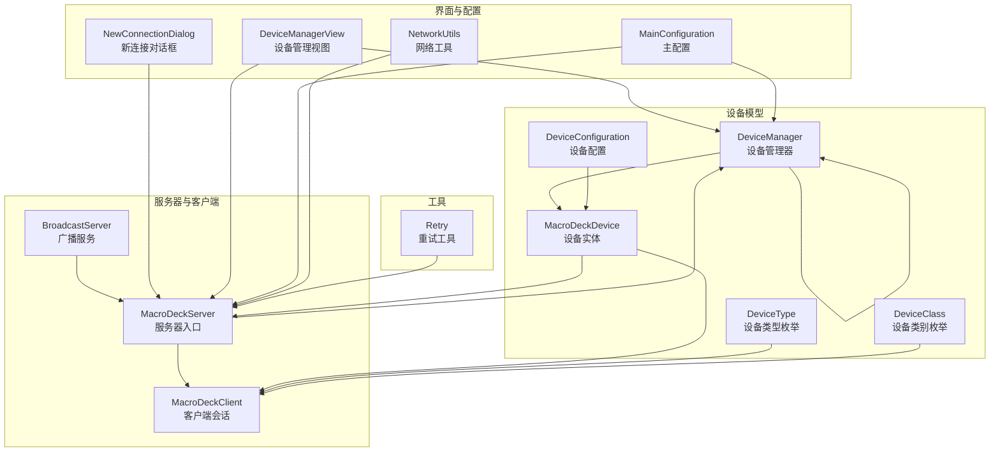
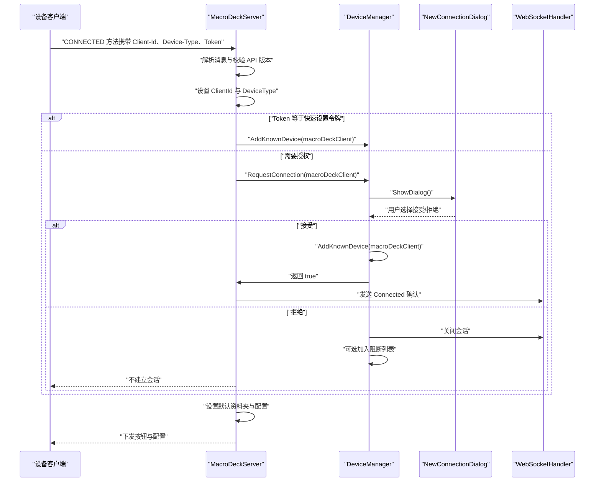
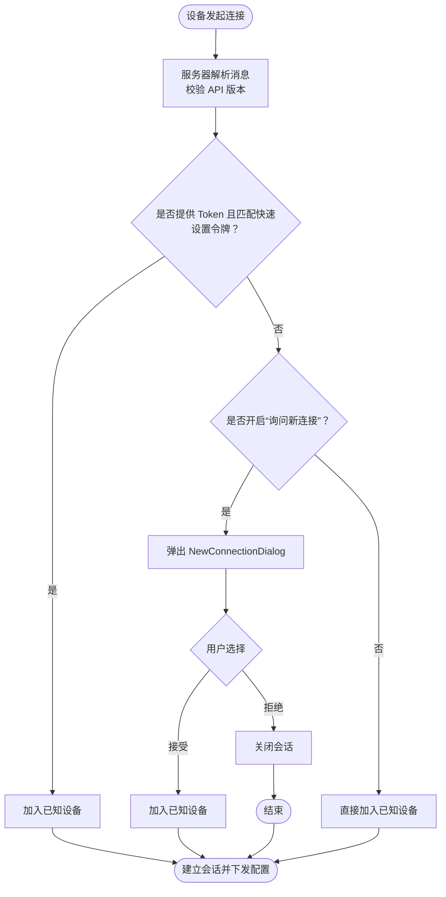
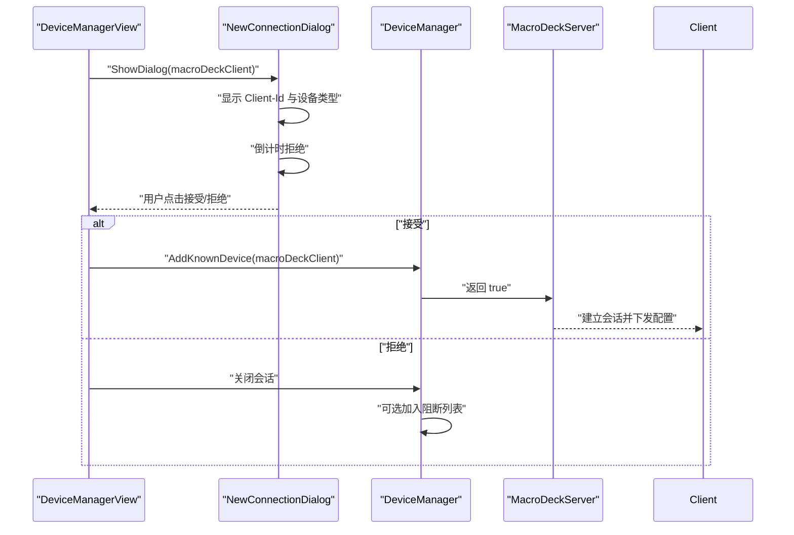
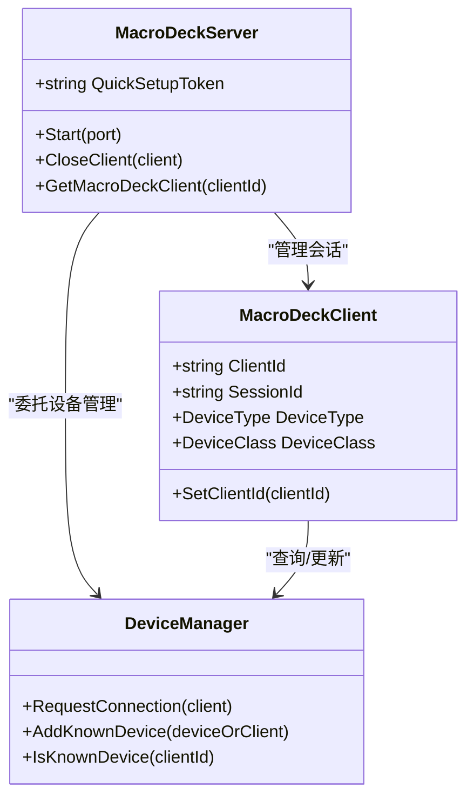
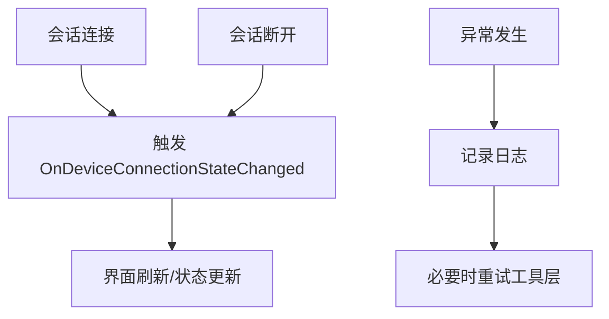
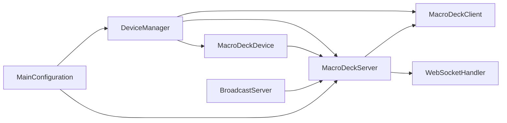

# 设备连接管理

<cite>
**本文引用的文件**
- [DeviceManager.cs](file://src/MacroDeck/Device/DeviceManager.cs)
- [MacroDeckDevice.cs](file://src/MacroDeck/Device/MacroDeckDevice.cs)
- [DeviceConfiguration.cs](file://src/MacroDeck/Device/DeviceConfiguration.cs)
- [DeviceClass.cs](file://src/MacroDeck/Device/DeviceClass.cs)
- [DeviceType.cs](file://src/MacroDeck/Device/DeviceType.cs)
- [MacroDeckServer.cs](file://src/MacroDeck/Server/MacroDeckServer.cs)
- [MacroDeckClient.cs](file://src/MacroDeck/Server/MacroDeckClient.cs)
- [BroadcastServer.cs](file://src/MacroDeck/Server/BroadcastServer.cs)
- [NewConnectionDialog.cs](file://src/MacroDeck/GUI/Dialogs/NewConnectionDialog.cs)
- [DeviceManagerView.cs](file://src/MacroDeck/GUI/MainWindowViews/DeviceManagerView.cs)
- [MainConfiguration.cs](file://src/MacroDeck/Configuration/MainConfiguration.cs)
- [NetworkUtils.cs](file://src/MacroDeck/Utils/NetworkUtils.cs)
- [Retry.cs](file://src/MacroDeck/Utils/Retry.cs)
</cite>

## 目录
1. [简介](#简介)
2. [项目结构](#项目结构)
3. [核心组件](#核心组件)
4. [架构总览](#架构总览)
5. [详细组件分析](#详细组件分析)
6. [依赖关系分析](#依赖关系分析)
7. [性能考量](#性能考量)
8. [故障排除指南](#故障排除指南)
9. [结论](#结论)
10. [附录](#附录)

## 简介
本文件系统性梳理 Macro-Deck 的设备连接管理系统，覆盖自动发现、手动添加、连接验证、认证与安全、连接状态监控、错误处理与重试、配置项（自动连接、超时等）、与服务器的通信协议以及故障排除与扩展接口建议。目标是帮助用户理解如何正确添加与管理设备，同时为开发者提供清晰的实现参考与扩展点。

## 项目结构
围绕“设备连接管理”的关键代码分布在以下模块：
- 设备模型与管理：DeviceManager、MacroDeckDevice、DeviceConfiguration、DeviceType、DeviceClass
- 服务器与客户端：MacroDeckServer、MacroDeckClient、BroadcastServer
- 用户界面：NewConnectionDialog、DeviceManagerView
- 配置与网络：MainConfiguration、NetworkUtils
- 工具与重试：Retry

图表来源
- [DeviceManager.cs:1-278](file://src/MacroDeck/Device/DeviceManager.cs#L1-L278)
- [MacroDeckDevice.cs:1-34](file://src/MacroDeck/Device/MacroDeckDevice.cs#L1-L34)
- [DeviceConfiguration.cs:1-16](file://src/MacroDeck/Device/DeviceConfiguration.cs#L1-L16)
- [DeviceType.cs:1-11](file://src/MacroDeck/Device/DeviceType.cs#L1-L11)
- [DeviceClass.cs:1-8](file://src/MacroDeck/Device/DeviceClass.cs#L1-L8)
- [MacroDeckServer.cs:1-376](file://src/MacroDeck/Server/MacroDeckServer.cs#L1-L376)
- [MacroDeckClient.cs:1-53](file://src/MacroDeck/Server/MacroDeckClient.cs#L1-L53)
- [BroadcastServer.cs:1-79](file://src/MacroDeck/Server/BroadcastServer.cs#L1-L79)
- [NewConnectionDialog.cs:1-71](file://src/MacroDeck/GUI/Dialogs/NewConnectionDialog.cs#L1-L71)
- [DeviceManagerView.cs:1-31](file://src/MacroDeck/GUI/MainWindowViews/DeviceManagerView.cs#L1-L31)
- [MainConfiguration.cs:1-103](file://src/MacroDeck/Configuration/MainConfiguration.cs#L1-L103)
- [NetworkUtils.cs:1-30](file://src/MacroDeck/Utils/NetworkUtils.cs#L1-L30)
- [Retry.cs:36-63](file://src/MacroDeck/Utils/Retry.cs#L36-L63)

章节来源
- [DeviceManager.cs:1-278](file://src/MacroDeck/Device/DeviceManager.cs#L1-L278)
- [MacroDeckServer.cs:1-376](file://src/MacroDeck/Server/MacroDeckServer.cs#L1-L376)
- [NewConnectionDialog.cs:1-71](file://src/MacroDeck/GUI/Dialogs/NewConnectionDialog.cs#L1-L71)
- [DeviceManagerView.cs:1-31](file://src/MacroDeck/GUI/MainWindowViews/DeviceManagerView.cs#L1-L31)
- [MainConfiguration.cs:1-103](file://src/MacroDeck/Configuration/MainConfiguration.cs#L1-L103)

## 核心组件
- 设备管理器（DeviceManager）
  - 负责已知设备的加载、保存、增删改查、连接请求处理与阻断逻辑。
  - 提供“快速设置令牌”直连与“用户授权对话框”两种路径。
- 宏命令设备（MacroDeckDevice）
  - 表示一个已登记的设备实例，包含可用性判断、阻断标记、默认配置与所属资料夹等。
- 服务器（MacroDeckServer）
  - WebSocket 服务器入口，负责会话接入、消息分发、连接状态事件、按钮事件执行与配置下发。
- 客户端（MacroDeckClient）
  - 封装单个会话的客户端信息，含设备类型、设备类、消息通道等。
- 新连接对话框（NewConnectionDialog）
  - 展示新设备连接请求、倒计时拒绝、阻断选项，并与服务器交互完成授权或拒绝。
- 广播服务（BroadcastServer）
  - 周期性向局域网广播主机名、IP 与端口，辅助设备发现。
- 主配置（MainConfiguration）
  - 控制是否询问新连接、是否阻止新连接、主机地址与端口、SSL 开关等。
- 设备配置（DeviceConfiguration）
  - 单个设备的亮度、自动连接、唤醒锁策略等。

章节来源
- [DeviceManager.cs:1-278](file://src/MacroDeck/Device/DeviceManager.cs#L1-L278)
- [MacroDeckDevice.cs:1-34](file://src/MacroDeck/Device/MacroDeckDevice.cs#L1-L34)
- [MacroDeckServer.cs:1-376](file://src/MacroDeck/Server/MacroDeckServer.cs#L1-L376)
- [MacroDeckClient.cs:1-53](file://src/MacroDeck/Server/MacroDeckClient.cs#L1-L53)
- [NewConnectionDialog.cs:1-71](file://src/MacroDeck/GUI/Dialogs/NewConnectionDialog.cs#L1-L71)
- [BroadcastServer.cs:1-79](file://src/MacroDeck/Server/BroadcastServer.cs#L1-L79)
- [MainConfiguration.cs:1-103](file://src/MacroDeck/Configuration/MainConfiguration.cs#L1-L103)
- [DeviceConfiguration.cs:1-16](file://src/MacroDeck/Device/DeviceConfiguration.cs#L1-L16)

## 架构总览
下图展示了从设备发起连接到授权、建立会话与状态同步的总体流程。

图表来源
- [MacroDeckServer.cs:123-244](file://src/MacroDeck/Server/MacroDeckServer.cs#L123-L244)
- [DeviceManager.cs:185-276](file://src/MacroDeck/Device/DeviceManager.cs#L185-L276)
- [NewConnectionDialog.cs:33-71](file://src/MacroDeck/GUI/Dialogs/NewConnectionDialog.cs#L33-L71)

## 详细组件分析

### 设备连接流程与自动发现
- 自动发现
  - 服务器启动后，周期性通过 UDP 广播主机名、IP 与端口，设备侧可据此连接。
- 手动添加
  - 通过界面“设备管理”页设置行为（允许全部、询问新连接、阻止全部），影响后续授权策略。
- 连接验证
  - 服务器在收到连接请求时，校验 API 版本、提取 Client-Id 与设备类型；若提供快速设置令牌则直接信任并加入已知设备。

图表来源
- [MacroDeckServer.cs:123-244](file://src/MacroDeck/Server/MacroDeckServer.cs#L123-L244)
- [DeviceManager.cs:185-276](file://src/MacroDeck/Device/DeviceManager.cs#L185-L276)
- [NewConnectionDialog.cs:33-71](file://src/MacroDeck/GUI/Dialogs/NewConnectionDialog.cs#L33-L71)
- [BroadcastServer.cs:58-77](file://src/MacroDeck/Server/BroadcastServer.cs#L58-L77)

章节来源
- [BroadcastServer.cs:13-79](file://src/MacroDeck/Server/BroadcastServer.cs#L13-L79)
- [MacroDeckServer.cs:123-244](file://src/MacroDeck/Server/MacroDeckServer.cs#L123-L244)
- [DeviceManager.cs:185-276](file://src/MacroDeck/Device/DeviceManager.cs#L185-L276)
- [DeviceManagerView.cs:23-31](file://src/MacroDeck/GUI/MainWindowViews/DeviceManagerView.cs#L23-L31)

### 新设备连接请求处理（对话框、授权与建立）
- 对话框显示
  - 弹窗展示 Client-Id 与设备类型，提供“接受/拒绝”，并支持“阻断此设备”。
  - 拒绝具有倒计时，默认超时后自动关闭。
- 用户授权
  - 接受后加入已知设备；拒绝则关闭会话，可选加入阻断列表。
- 连接建立
  - 服务器设置默认资料夹与配置，随后下发按钮与配置给客户端。

图表来源
- [DeviceManagerView.cs:23-31](file://src/MacroDeck/GUI/MainWindowViews/DeviceManagerView.cs#L23-L31)
- [NewConnectionDialog.cs:33-71](file://src/MacroDeck/GUI/Dialogs/NewConnectionDialog.cs#L33-L71)
- [DeviceManager.cs:253-276](file://src/MacroDeck/Device/DeviceManager.cs#L253-L276)
- [MacroDeckServer.cs:195-199](file://src/MacroDeck/Server/MacroDeckServer.cs#L195-L199)

章节来源
- [NewConnectionDialog.cs:1-71](file://src/MacroDeck/GUI/Dialogs/NewConnectionDialog.cs#L1-L71)
- [DeviceManager.cs:253-276](file://src/MacroDeck/Device/DeviceManager.cs#L253-L276)
- [MacroDeckServer.cs:195-199](file://src/MacroDeck/Server/MacroDeckServer.cs#L195-L199)

### 认证与安全机制（客户端 ID 验证、快速设置令牌）
- 客户端 ID 验证
  - 服务器在连接阶段提取 Client-Id 并绑定到会话对象，后续所有操作基于该标识。
- 快速设置令牌
  - 服务器生成一次性随机令牌，设备若携带该令牌可直接信任并加入已知设备，无需用户确认。
- 设备类型与类别的映射
  - 根据设备类型动态选择消息通道与设备类别（如软件客户端）。

图表来源
- [MacroDeckClient.cs:1-53](file://src/MacroDeck/Server/MacroDeckClient.cs#L1-L53)
- [MacroDeckServer.cs:26-32](file://src/MacroDeck/Server/MacroDeckServer.cs#L26-L32)
- [MacroDeckServer.cs:158-169](file://src/MacroDeck/Server/MacroDeckServer.cs#L158-L169)
- [DeviceManager.cs:185-251](file://src/MacroDeck/Device/DeviceManager.cs#L185-L251)

章节来源
- [MacroDeckServer.cs:26-32](file://src/MacroDeck/Server/MacroDeckServer.cs#L26-L32)
- [MacroDeckServer.cs:158-169](file://src/MacroDeck/Server/MacroDeckServer.cs#L158-L169)
- [MacroDeckClient.cs:31-49](file://src/MacroDeck/Server/MacroDeckClient.cs#L31-L49)

### 连接状态监控与错误处理
- 连接状态事件
  - 服务器在会话连接/断开时触发事件，驱动界面与业务刷新。
- 可用性判断
  - 设备实体通过服务器会话与 WebSocket 可用性判断当前在线状态。
- 错误处理与重试
  - 服务器启动与消息处理中捕获异常并记录日志；工具层提供通用重试机制以应对瞬时失败场景。

图表来源
- [MacroDeckServer.cs:74-110](file://src/MacroDeck/Server/MacroDeckServer.cs#L74-L110)
- [MacroDeckDevice.cs:11-24](file://src/MacroDeck/Device/MacroDeckDevice.cs#L11-L24)
- [Retry.cs:36-63](file://src/MacroDeck/Utils/Retry.cs#L36-L63)

章节来源
- [MacroDeckServer.cs:74-110](file://src/MacroDeck/Server/MacroDeckServer.cs#L74-L110)
- [MacroDeckDevice.cs:11-24](file://src/MacroDeck/Device/MacroDeckDevice.cs#L11-L24)
- [Retry.cs:36-63](file://src/MacroDeck/Utils/Retry.cs#L36-L63)

### 设备连接配置选项（自动连接、超时等）
- 全局行为
  - “询问新连接”、“阻止全部新连接”由主配置控制，影响 DeviceManager 的授权策略。
- 设备级配置
  - 设备配置包含亮度、自动连接开关、唤醒锁策略等。
- 服务器监听
  - 主配置包含主机地址与端口，用于广播与连接。

章节来源
- [MainConfiguration.cs:66-71](file://src/MacroDeck/Configuration/MainConfiguration.cs#L66-L71)
- [DeviceConfiguration.cs:5-8](file://src/MacroDeck/Device/DeviceConfiguration.cs#L5-L8)
- [BroadcastServer.cs:64-69](file://src/MacroDeck/Server/BroadcastServer.cs#L64-L69)

### 与服务器系统的交互（连接建立后的通信协议）
- 方法与字段
  - 服务器根据消息中的 Method 字段分派处理，如 CONNECTED、BUTTON_PRESS、GET_BUTTONS 等。
- 按钮事件
  - 解析行列坐标定位对应按钮，按按键类型执行动作集合。
- 配置下发
  - 连接成功后下发按钮与配置，确保设备界面与主机一致。

章节来源
- [MacroDeckServer.cs:123-244](file://src/MacroDeck/Server/MacroDeckServer.cs#L123-L244)
- [MacroDeckServer.cs:246-277](file://src/MacroDeck/Server/MacroDeckServer.cs#L246-L277)
- [MacroDeckServer.cs:320-333](file://src/MacroDeck/Server/MacroDeckServer.cs#L320-L333)

## 依赖关系分析
- 组件耦合
  - DeviceManager 与 MacroDeckServer、MacroDeckClient、WebSocketHandler 存在直接交互。
  - MacroDeckDevice 通过服务器会话进行可用性判断。
- 外部依赖
  - 广播服务依赖 UDP 与网络接口枚举；主配置依赖注册表与文件系统持久化。
- 循环依赖
  - 未见明显循环依赖；各模块职责清晰。

图表来源
- [DeviceManager.cs:1-278](file://src/MacroDeck/Device/DeviceManager.cs#L1-L278)
- [MacroDeckServer.cs:1-376](file://src/MacroDeck/Server/MacroDeckServer.cs#L1-L376)
- [MacroDeckDevice.cs:1-34](file://src/MacroDeck/Device/MacroDeckDevice.cs#L1-L34)
- [BroadcastServer.cs:1-79](file://src/MacroDeck/Server/BroadcastServer.cs#L1-L79)
- [MainConfiguration.cs:1-103](file://src/MacroDeck/Configuration/MainConfiguration.cs#L1-L103)

章节来源
- [DeviceManager.cs:1-278](file://src/MacroDeck/Device/DeviceManager.cs#L1-L278)
- [MacroDeckServer.cs:1-376](file://src/MacroDeck/Server/MacroDeckServer.cs#L1-L376)
- [MacroDeckDevice.cs:1-34](file://src/MacroDeck/Device/MacroDeckDevice.cs#L1-L34)
- [BroadcastServer.cs:1-79](file://src/MacroDeck/Server/BroadcastServer.cs#L1-L79)
- [MainConfiguration.cs:1-103](file://src/MacroDeck/Configuration/MainConfiguration.cs#L1-L103)

## 性能考量
- 广播频率
  - 广播周期固定为 5 秒，建议在高并发或弱网环境下评估频率对带宽的影响。
- 会话数量限制
  - 服务器在特定条件下会拒绝新连接（如超过最大会话数），避免资源耗尽。
- 序列化与 I/O
  - 设备列表采用临时文件写入并原子替换，降低损坏风险；注意磁盘 I/O 对启动时间的影响。
- 重试策略
  - 工具层提供指数退避式重试，建议结合具体场景调整间隔与次数。

章节来源
- [BroadcastServer.cs:19-23](file://src/MacroDeck/Server/BroadcastServer.cs#L19-L23)
- [MacroDeckServer.cs:82-88](file://src/MacroDeck/Server/MacroDeckServer.cs#L82-L88)
- [DeviceManager.cs:63-81](file://src/MacroDeck/Device/DeviceManager.cs#L63-L81)
- [Retry.cs:39-62](file://src/MacroDeck/Utils/Retry.cs#L39-L62)

## 故障排除指南
- 无法发现服务器
  - 检查广播服务是否启动、端口是否被防火墙拦截、网络接口是否正确枚举。
- 连接被拒绝
  - 若启用“阻止全部新连接”或会话数已达上限，服务器会直接关闭连接。
- 授权对话框未出现
  - 确认“询问新连接”已开启；检查主窗口句柄与 UI 线程调用。
- 设备不可用
  - 检查设备实体的可用性判断逻辑，确认 WebSocket 会话仍处于活跃状态。
- SSL 相关问题
  - 检查证书生成与加载流程，确保证书有效且与配置一致。
- 日志与重试
  - 关注服务器启动与消息处理日志；对瞬时失败使用重试工具进行恢复。

章节来源
- [BroadcastServer.cs:13-30](file://src/MacroDeck/Server/BroadcastServer.cs#L13-L30)
- [NetworkUtils.cs:11-28](file://src/MacroDeck/Utils/NetworkUtils.cs#L11-L28)
- [MacroDeckServer.cs:82-88](file://src/MacroDeck/Server/MacroDeckServer.cs#L82-L88)
- [DeviceManager.cs:187-238](file://src/MacroDeck/Device/DeviceManager.cs#L187-L238)
- [MacroDeckDevice.cs:11-24](file://src/MacroDeck/Device/MacroDeckDevice.cs#L11-L24)
- [MacroDeckServer.cs:40-54](file://src/MacroDeck/Server/MacroDeckServer.cs#L40-L54)
- [Retry.cs:36-63](file://src/MacroDeck/Utils/Retry.cs#L36-L63)

## 结论
Macro-Deck 的设备连接管理通过“快速设置令牌直连 + 用户授权对话框”的双轨机制，在安全性与易用性之间取得平衡；配合广播发现、会话状态事件与设备配置，形成完整的连接生命周期管理。开发者可在现有架构上扩展设备类型、优化重试策略与日志体系，并通过主配置灵活控制全局行为。

## 附录
- 开发者扩展接口建议
  - 设备类型扩展：在设备类型枚举中新增类型，并在客户端消息通道与设备类别映射处补充分支。
  - 授权策略扩展：在 DeviceManager 的 RequestConnection 中增加新的策略分支（如白名单/黑名单）。
  - 重试策略：针对特定失败场景（如网络抖动）定制重试间隔与上限。
  - 安全增强：引入更严格的令牌校验与会话签名机制。