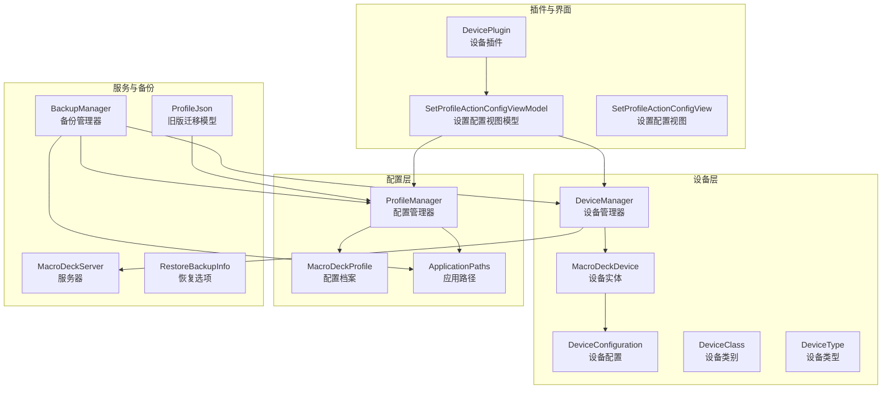
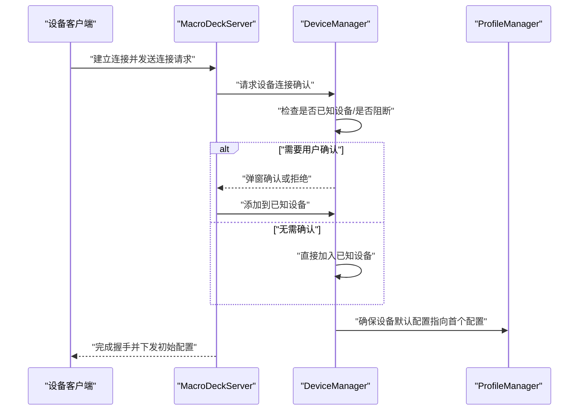
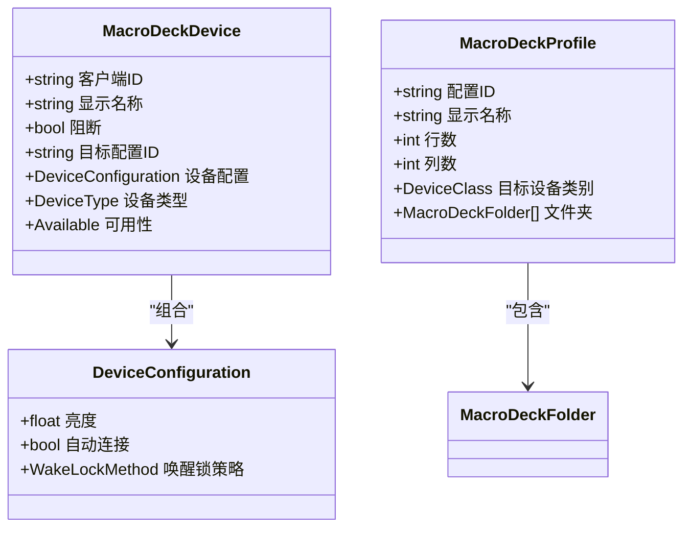
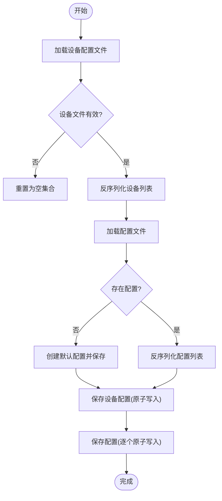
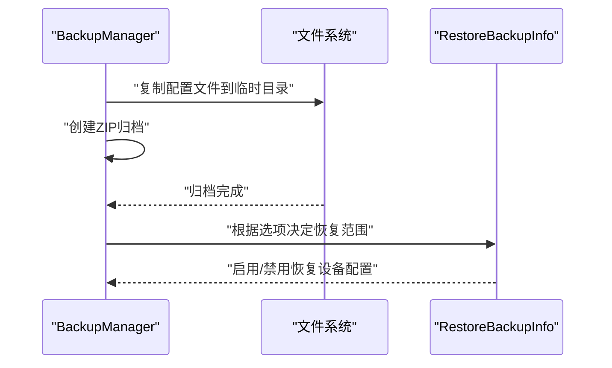
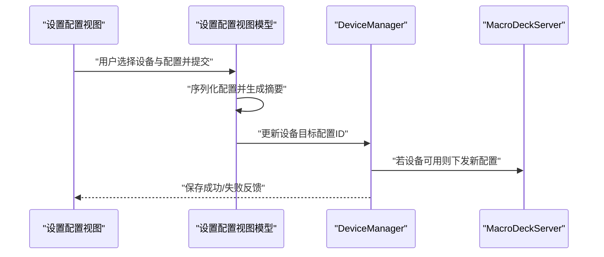
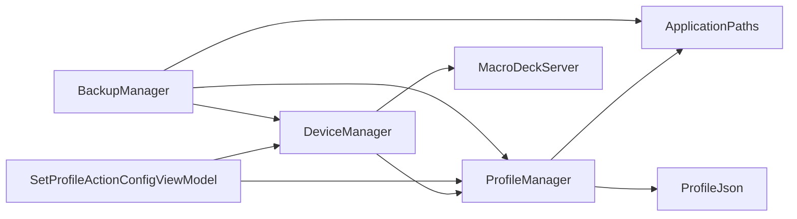

# 设备配置管理

<cite>
**本文引用的文件**
- [DeviceConfiguration.cs](file://src/MacroDeck/Device/DeviceConfiguration.cs)
- [MacroDeckDevice.cs](file://src/MacroDeck/Device/MacroDeckDevice.cs)
- [DeviceManager.cs](file://src/MacroDeck/Device/DeviceManager.cs)
- [DeviceClass.cs](file://src/MacroDeck/Device/DeviceClass.cs)
- [DeviceType.cs](file://src/MacroDeck/Device/DeviceType.cs)
- [MacroDeckProfile.cs](file://src/MacroDeck/Profiles/MacroDeckProfile.cs)
- [ProfileManager.cs](file://src/MacroDeck/Profiles/ProfileManager.cs)
- [ApplicationPaths.cs](file://src/MacroDeck/StartupConfig/ApplicationPaths.cs)
- [ISerializableConfiguration.cs](file://src/MacroDeck/Models/ISerializableConfiguration.cs)
- [SetProfileActionConfigViewModel.cs](file://src/MacroDeck/InternalPlugins/DevicePlugin/ViewModels/SetProfileActionConfigViewModel.cs)
- [SetProfileActionConfigView.cs](file://src/MacroDeck/InternalPlugins/DevicePlugin/Views/SetProfileActionConfigView.cs)
- [DevicePlugin.cs](file://src/MacroDeck/InternalPlugins/DevicePlugin/DevicePlugin.cs)
- [MacroDeckServer.cs](file://src/MacroDeck/Server/MacroDeckServer.cs)
- [BackupManager.cs](file://src/MacroDeck/Backup/BackupManager.cs)
- [RestoreBackupInfo.cs](file://src/MacroDeck/Backup/RestoreBackupInfo.cs)
- [ProfileJson.cs](file://src/MacroDeck/JSON/ProfileJson.cs)
</cite>

## 目录
1. [简介](#简介)
2. [项目结构](#项目结构)
3. [核心组件](#核心组件)
4. [架构总览](#架构总览)
5. [详细组件分析](#详细组件分析)
6. [依赖关系分析](#依赖关系分析)
7. [性能考量](#性能考量)
8. [故障排查指南](#故障排查指南)
9. [结论](#结论)
10. [附录](#附录)

## 简介
本文件系统性阐述 Macro-Deck 的“设备配置管理”能力，覆盖以下方面：
- 设备配置的数据结构与存储机制（含序列化/反序列化）
- 设备配置文件格式与字段定义（客户端 ID、显示名称、配置 ID、状态信息等）
- 配置加载/保存流程、文件读写与并发控制
- 验证与清理机制（无效配置检测与修复）
- 导入/导出与迁移（备份恢复、从旧版数据库迁移）
- 与配置管理系统的集成（配置切换对设备的影响）
- 用户使用指导与开发者扩展接口建议

## 项目结构
围绕设备配置管理的关键代码分布在如下模块：
- 设备模型与管理：DeviceConfiguration、MacroDeckDevice、DeviceManager、DeviceClass、DeviceType
- 配置与配置管理：MacroDeckProfile、ProfileManager、ApplicationPaths
- 序列化与可序列化接口：ISerializableConfiguration
- 设备插件与视图：DevicePlugin、SetProfileActionConfigViewModel、SetProfileActionConfigView
- 服务器端接入：MacroDeckServer
- 备份与恢复：BackupManager、RestoreBackupInfo
- 兼容性迁移：ProfileJson

图表来源
- [DeviceConfiguration.cs:1-16](file://src/MacroDeck/Device/DeviceConfiguration.cs#L1-L16)
- [MacroDeckDevice.cs:1-34](file://src/MacroDeck/Device/MacroDeckDevice.cs#L1-L34)
- [DeviceManager.cs:1-278](file://src/MacroDeck/Device/DeviceManager.cs#L1-L278)
- [MacroDeckProfile.cs:1-75](file://src/MacroDeck/Profiles/MacroDeckProfile.cs#L1-L75)
- [ProfileManager.cs:1-640](file://src/MacroDeck/Profiles/ProfileManager.cs#L1-L640)
- [ApplicationPaths.cs:1-143](file://src/MacroDeck/StartupConfig/ApplicationPaths.cs#L1-L143)
- [DevicePlugin.cs:1-22](file://src/MacroDeck/InternalPlugins/DevicePlugin/DevicePlugin.cs#L1-L22)
- [SetProfileActionConfigViewModel.cs:1-62](file://src/MacroDeck/InternalPlugins/DevicePlugin/ViewModels/SetProfileActionConfigViewModel.cs#L1-L62)
- [SetProfileActionConfigView.cs:82-111](file://src/MacroDeck/InternalPlugins/DevicePlugin/Views/SetProfileActionConfigView.cs#L82-L111)
- [MacroDeckServer.cs:148-181](file://src/MacroDeck/Server/MacroDeckServer.cs#L148-L181)
- [BackupManager.cs:286-315](file://src/MacroDeck/Backup/BackupManager.cs#L286-L315)
- [RestoreBackupInfo.cs:1-13](file://src/MacroDeck/Backup/RestoreBackupInfo.cs#L1-L13)
- [ProfileJson.cs:1-11](file://src/MacroDeck/JSON/ProfileJson.cs#L1-L11)

章节来源
- [DeviceConfiguration.cs:1-16](file://src/MacroDeck/Device/DeviceConfiguration.cs#L1-L16)
- [MacroDeckDevice.cs:1-34](file://src/MacroDeck/Device/MacroDeckDevice.cs#L1-L34)
- [DeviceManager.cs:1-278](file://src/MacroDeck/Device/DeviceManager.cs#L1-L278)
- [MacroDeckProfile.cs:1-75](file://src/MacroDeck/Profiles/MacroDeckProfile.cs#L1-L75)
- [ProfileManager.cs:1-640](file://src/MacroDeck/Profiles/ProfileManager.cs#L1-L640)
- [ApplicationPaths.cs:1-143](file://src/MacroDeck/StartupConfig/ApplicationPaths.cs#L1-L143)
- [DevicePlugin.cs:1-22](file://src/MacroDeck/InternalPlugins/DevicePlugin/DevicePlugin.cs#L1-L22)
- [SetProfileActionConfigViewModel.cs:1-62](file://src/MacroDeck/InternalPlugins/DevicePlugin/ViewModels/SetProfileActionConfigViewModel.cs#L1-L62)
- [SetProfileActionConfigView.cs:82-111](file://src/MacroDeck/InternalPlugins/DevicePlugin/Views/SetProfileActionConfigView.cs#L82-L111)
- [MacroDeckServer.cs:148-181](file://src/MacroDeck/Server/MacroDeckServer.cs#L148-L181)
- [BackupManager.cs:286-315](file://src/MacroDeck/Backup/BackupManager.cs#L286-L315)
- [RestoreBackupInfo.cs:1-13](file://src/MacroDeck/Backup/RestoreBackupInfo.cs#L1-L13)
- [ProfileJson.cs:1-11](file://src/MacroDeck/JSON/ProfileJson.cs#L1-L11)

## 核心组件
- 设备配置数据结构
  - 设备配置对象包含亮度、自动连接、唤醒锁策略等字段；唤醒锁策略枚举支持“总是/连接时/从不”。
  - 设备实体包含客户端 ID、显示名称、可用性（基于会话可用性）、阻断标记、当前配置、目标配置 ID、设备类型等。
- 配置数据结构
  - 配置档案包含唯一 ID、显示名称、按钮网格尺寸、按钮样式参数、目标设备类别、文件夹树等。
  - 配置管理器负责加载、保存、迁移、创建/删除配置，并维护当前配置。
- 路径与持久化
  - 应用路径集中定义了设备配置文件、变量数据库、配置目录、备份目录等位置。
  - 设备配置文件采用 JSON 存储，使用临时文件写入后原子移动覆盖，避免部分写入风险。

章节来源
- [DeviceConfiguration.cs:1-16](file://src/MacroDeck/Device/DeviceConfiguration.cs#L1-L16)
- [MacroDeckDevice.cs:1-34](file://src/MacroDeck/Device/MacroDeckDevice.cs#L1-L34)
- [MacroDeckProfile.cs:1-75](file://src/MacroDeck/Profiles/MacroDeckProfile.cs#L1-L75)
- [ApplicationPaths.cs:43-61](file://src/MacroDeck/StartupConfig/ApplicationPaths.cs#L43-L61)

## 架构总览
设备配置管理贯穿“设备实体—设备配置—配置档案—配置管理器—持久化”的链路，同时通过服务器侧的连接请求处理与设备管理器协作，实现设备与配置的绑定与切换。

图表来源
- [MacroDeckServer.cs:148-181](file://src/MacroDeck/Server/MacroDeckServer.cs#L148-L181)
- [DeviceManager.cs:185-238](file://src/MacroDeck/Device/DeviceManager.cs#L185-L238)
- [ProfileManager.cs:205-278](file://src/MacroDeck/Profiles/ProfileManager.cs#L205-L278)

## 详细组件分析

### 设备配置数据结构与序列化
- 设备配置对象
  - 字段：亮度、自动连接、唤醒锁策略
  - 默认值与策略枚举定义清晰，便于跨平台一致行为
- 设备实体
  - 关键字段：客户端 ID、显示名称、阻断标记、当前配置、目标配置 ID、设备类型
  - 可用性属性通过服务器会话可用性动态计算
- 序列化与反序列化
  - 使用 JSON.NET 进行序列化/反序列化，开启类型处理与忽略空值，错误回调统一记录日志
  - 设备配置文件与配置档案均采用相同策略，保证兼容性

图表来源
- [DeviceConfiguration.cs:1-16](file://src/MacroDeck/Device/DeviceConfiguration.cs#L1-L16)
- [MacroDeckDevice.cs:1-34](file://src/MacroDeck/Device/MacroDeckDevice.cs#L1-L34)
- [MacroDeckProfile.cs:1-75](file://src/MacroDeck/Profiles/MacroDeckProfile.cs#L1-L75)

章节来源
- [DeviceConfiguration.cs:1-16](file://src/MacroDeck/Device/DeviceConfiguration.cs#L1-L16)
- [MacroDeckDevice.cs:1-34](file://src/MacroDeck/Device/MacroDeckDevice.cs#L1-L34)
- [MacroDeckProfile.cs:1-75](file://src/MacroDeck/Profiles/MacroDeckProfile.cs#L1-L75)

### 设备配置文件格式与字段定义
- 设备配置文件（devices.json）
  - 路径由应用路径统一管理
  - 内容为设备实体列表，字段包含：客户端 ID、显示名称、阻断标记、目标配置 ID、设备类型、设备配置对象
  - 加载时进行完整性校验，损坏则重置并清空
- 配置档案文件（profiles/*.json）
  - 每个配置一个独立 JSON 文件，文件名以配置 ID 命名
  - 包含配置 ID、显示名称、布局参数、目标设备类别、文件夹树等
  - 保存采用临时文件写入后原子替换，避免部分写入

章节来源
- [ApplicationPaths.cs:57-60](file://src/MacroDeck/StartupConfig/ApplicationPaths.cs#L57-L60)
- [DeviceManager.cs:21-51](file://src/MacroDeck/Device/DeviceManager.cs#L21-L51)
- [ProfileManager.cs:313-380](file://src/MacroDeck/Profiles/ProfileManager.cs#L313-L380)

### 设备配置的加载与保存流程
- 加载流程
  - 设备：读取 JSON 并反序列化为设备实体列表；异常则记录错误并重置为空集合
  - 配置：遍历配置目录下的 JSON 文件，逐个反序列化；若无配置则生成默认配置并保存
- 保存流程
  - 设备：写入临时文件，再原子移动覆盖；使用锁保护并发写入
  - 配置：逐个序列化为 JSON，写入临时文件后移动覆盖；删除不再活跃的孤儿文件
- 并发控制
  - 设备保存使用全局锁；配置保存使用内部锁，避免多线程竞争导致文件损坏

图表来源
- [DeviceManager.cs:21-81](file://src/MacroDeck/Device/DeviceManager.cs#L21-L81)
- [ProfileManager.cs:205-311](file://src/MacroDeck/Profiles/ProfileManager.cs#L205-L311)
- [ProfileManager.cs:313-380](file://src/MacroDeck/Profiles/ProfileManager.cs#L313-L380)

章节来源
- [DeviceManager.cs:21-81](file://src/MacroDeck/Device/DeviceManager.cs#L21-L81)
- [ProfileManager.cs:205-311](file://src/MacroDeck/Profiles/ProfileManager.cs#L205-L311)
- [ProfileManager.cs:313-380](file://src/MacroDeck/Profiles/ProfileManager.cs#L313-L380)

### 设备配置的验证与清理机制
- 设备配置验证
  - 设备加载失败时记录错误并删除损坏文件，随后初始化空集合，确保系统可用
  - 配置加载失败时跳过该文件并继续处理其他文件，避免单点故障
- 清理机制
  - 配置保存完成后扫描目录，删除不再活跃的孤儿文件，保持磁盘整洁
  - 旧版 SQLite 数据库迁移完成后重命名旧文件，防止重复迁移

章节来源
- [DeviceManager.cs:38-50](file://src/MacroDeck/Device/DeviceManager.cs#L38-L50)
- [ProfileManager.cs:218-246](file://src/MacroDeck/Profiles/ProfileManager.cs#L218-L246)
- [ProfileManager.cs:361-375](file://src/MacroDeck/Profiles/ProfileManager.cs#L361-L375)
- [ProfileManager.cs:382-456](file://src/MacroDeck/Profiles/ProfileManager.cs#L382-L456)

### 设备配置的导入导出与迁移
- 导出
  - 备份管理器将主配置、设备配置、变量数据库、图标包等打包为压缩包，便于整体迁移
- 导入
  - 恢复时根据选项决定是否恢复设备配置、配置档案、变量等
- 迁移
  - 从旧版 SQLite 数据库迁移至新的 JSON 文件体系，自动补全缺失的配置 ID 并写入临时文件后移动覆盖

图表来源
- [BackupManager.cs:286-315](file://src/MacroDeck/Backup/BackupManager.cs#L286-L315)
- [RestoreBackupInfo.cs:1-13](file://src/MacroDeck/Backup/RestoreBackupInfo.cs#L1-L13)

章节来源
- [BackupManager.cs:286-315](file://src/MacroDeck/Backup/BackupManager.cs#L286-L315)
- [RestoreBackupInfo.cs:1-13](file://src/MacroDeck/Backup/RestoreBackupInfo.cs#L1-L13)
- [ProfileJson.cs:1-11](file://src/MacroDeck/JSON/ProfileJson.cs#L1-L11)
- [ProfileManager.cs:382-456](file://src/MacroDeck/Profiles/ProfileManager.cs#L382-L456)

### 与配置管理系统的集成与配置切换影响
- 插件配置与视图
  - 设置配置视图模型负责将用户选择的设备与配置序列化为插件动作配置，并生成摘要文本
  - 视图层在用户选择后触发保存逻辑，确保配置持久化
- 配置切换对设备的影响
  - 设备管理器在设置配置时更新设备的目标配置 ID，并在设备可用时立即下发新配置
  - 若设备被阻断，将关闭其会话以断开连接

图表来源
- [SetProfileActionConfigView.cs:82-111](file://src/MacroDeck/InternalPlugins/DevicePlugin/Views/SetProfileActionConfigView.cs#L82-L111)
- [SetProfileActionConfigViewModel.cs:40-62](file://src/MacroDeck/InternalPlugins/DevicePlugin/ViewModels/SetProfileActionConfigViewModel.cs#L40-L62)
- [DeviceManager.cs:117-129](file://src/MacroDeck/Device/DeviceManager.cs#L117-L129)

章节来源
- [SetProfileActionConfigView.cs:82-111](file://src/MacroDeck/InternalPlugins/DevicePlugin/Views/SetProfileActionConfigView.cs#L82-L111)
- [SetProfileActionConfigViewModel.cs:40-62](file://src/MacroDeck/InternalPlugins/DevicePlugin/ViewModels/SetProfileActionConfigViewModel.cs#L40-L62)
- [DeviceManager.cs:117-129](file://src/MacroDeck/Device/DeviceManager.cs#L117-L129)

### 开发者扩展接口与自定义字段支持
- 可序列化配置接口
  - 提供统一的序列化/反序列化约定，便于扩展插件动作配置
- 扩展建议
  - 在设备配置对象中新增字段时，需考虑默认值与向后兼容
  - 新增配置字段时，应在序列化设置中保留空值处理与错误回调，确保稳健性

章节来源
- [ISerializableConfiguration.cs:1-14](file://src/MacroDeck/Models/ISerializableConfiguration.cs#L1-L14)
- [DeviceConfiguration.cs:1-16](file://src/MacroDeck/Device/DeviceConfiguration.cs#L1-L16)

## 依赖关系分析
- 组件耦合
  - 设备管理器依赖配置管理器以确保设备默认配置正确；依赖服务器侧以判断设备可用性
  - 配置管理器依赖应用路径以定位文件位置；依赖日志系统记录错误
  - 插件视图模型依赖设备管理器与配置管理器以完成配置持久化
- 外部依赖
  - JSON.NET 用于序列化/反序列化
  - SQLite 用于旧版数据库迁移
  - 系统文件 IO 与原子文件移动保障数据一致性

图表来源
- [DeviceManager.cs:1-278](file://src/MacroDeck/Device/DeviceManager.cs#L1-L278)
- [ProfileManager.cs:1-640](file://src/MacroDeck/Profiles/ProfileManager.cs#L1-L640)
- [ApplicationPaths.cs:1-143](file://src/MacroDeck/StartupConfig/ApplicationPaths.cs#L1-L143)
- [SetProfileActionConfigViewModel.cs:1-62](file://src/MacroDeck/InternalPlugins/DevicePlugin/ViewModels/SetProfileActionConfigViewModel.cs#L1-L62)
- [BackupManager.cs:286-315](file://src/MacroDeck/Backup/BackupManager.cs#L286-L315)
- [ProfileJson.cs:1-11](file://src/MacroDeck/JSON/ProfileJson.cs#L1-L11)

章节来源
- [DeviceManager.cs:1-278](file://src/MacroDeck/Device/DeviceManager.cs#L1-L278)
- [ProfileManager.cs:1-640](file://src/MacroDeck/Profiles/ProfileManager.cs#L1-L640)
- [ApplicationPaths.cs:1-143](file://src/MacroDeck/StartupConfig/ApplicationPaths.cs#L1-L143)
- [SetProfileActionConfigViewModel.cs:1-62](file://src/MacroDeck/InternalPlugins/DevicePlugin/ViewModels/SetProfileActionConfigViewModel.cs#L1-L62)
- [BackupManager.cs:286-315](file://src/MacroDeck/Backup/BackupManager.cs#L286-L315)
- [ProfileJson.cs:1-11](file://src/MacroDeck/JSON/ProfileJson.cs#L1-L11)

## 性能考量
- 序列化性能
  - 使用 JSON.NET 的类型处理与忽略空值策略，减少冗余字段；错误回调避免异常传播导致性能下降
- 文件写入
  - 采用临时文件写入+原子移动，降低磁盘竞争与部分写入风险
- 并发控制
  - 设备保存使用全局锁；配置保存使用内部锁，避免高并发场景下的竞态条件
- 迁移效率
  - 旧版数据库一次性读取并批量写入，减少多次 IO 操作

## 故障排查指南
- 设备配置文件损坏
  - 现象：启动时报错并重置设备配置
  - 处理：删除损坏文件，系统将重新初始化空集合
- 配置加载失败
  - 现象：个别配置文件无法加载但不影响其他配置
  - 处理：检查 JSON 格式与字段完整性；必要时删除问题文件
- 保存失败
  - 现象：保存日志报错
  - 处理：检查磁盘权限与路径有效性；确认无其他进程占用文件
- 迁移失败
  - 现象：旧版数据库迁移中断
  - 处理：查看日志定位具体条目；修复后重新运行迁移流程

章节来源
- [DeviceManager.cs:38-50](file://src/MacroDeck/Device/DeviceManager.cs#L38-L50)
- [ProfileManager.cs:218-246](file://src/MacroDeck/Profiles/ProfileManager.cs#L218-L246)
- [ProfileManager.cs:348-353](file://src/MacroDeck/Profiles/ProfileManager.cs#L348-L353)
- [ProfileManager.cs:452-456](file://src/MacroDeck/Profiles/ProfileManager.cs#L452-L456)

## 结论
Macro-Deck 的设备配置管理以清晰的数据结构、稳健的序列化策略与严格的文件写入流程为基础，结合设备与配置的双向联动，实现了可靠的设备配置生命周期管理。通过备份/恢复与旧版迁移机制，系统具备良好的可维护性与可移植性。对于开发者而言，遵循统一的可序列化接口与错误处理约定，可安全地扩展设备配置与插件动作配置。

## 附录
- 用户使用要点
  - 设备首次连接可能需要确认；确认后设备将被加入已知设备列表
  - 修改设备目标配置后，若设备在线将立即收到新配置
  - 备份包含设备配置、配置档案与变量等，便于完整迁移
- 开发者扩展建议
  - 新增字段时提供合理默认值并保持向后兼容
  - 使用统一的序列化设置与错误回调，确保健壮性
  - 对关键写入操作采用临时文件+原子移动策略