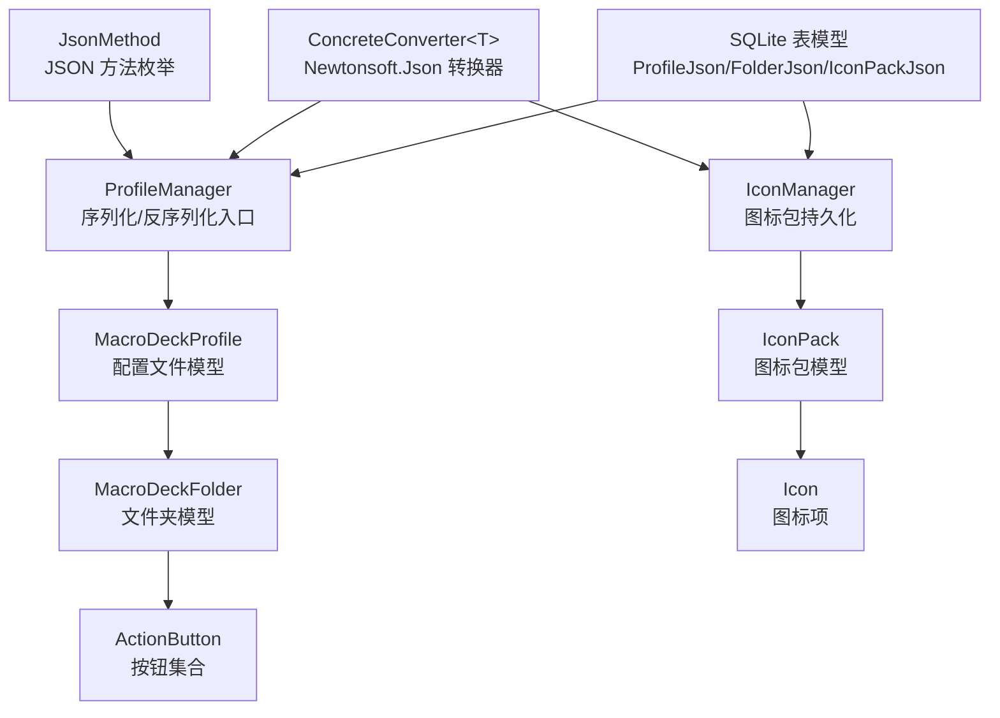
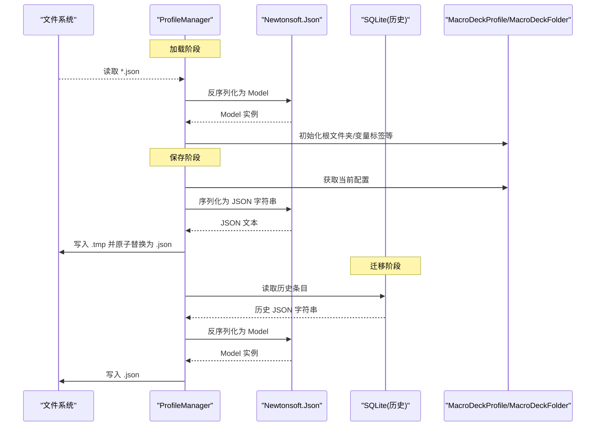
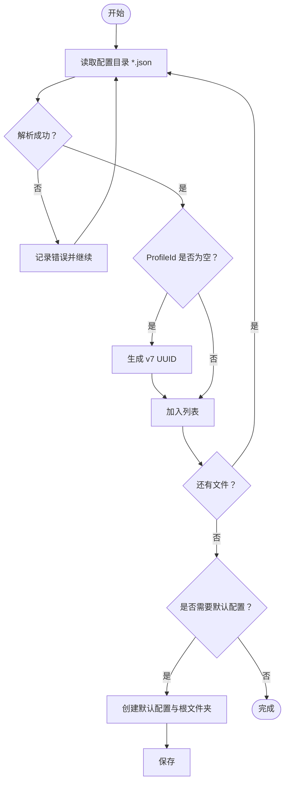
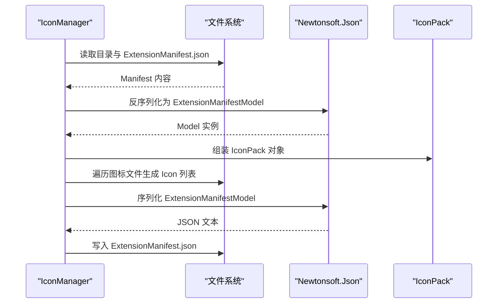
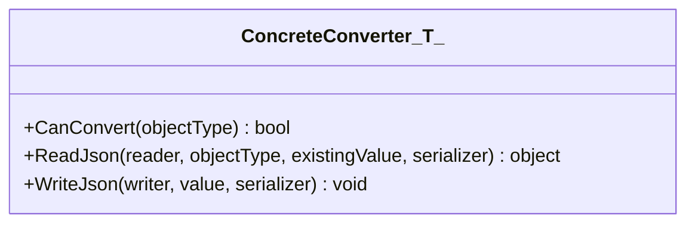
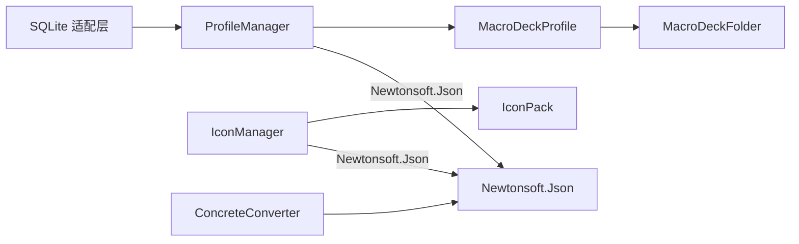

# JSON 序列化处理

<cite>
**本文引用的文件**
- [ProfileManager.cs](file://src/MacroDeck/Profiles/ProfileManager.cs)
- [MacroDeckProfile.cs](file://src/MacroDeck/Profiles/MacroDeckProfile.cs)
- [MacroDeckFolder.cs](file://src/MacroDeck/Folders/MacroDeckFolder.cs)
- [IconManager.cs](file://src/MacroDeck/Icons/IconManager.cs)
- [IconPack.cs](file://src/MacroDeck/Icons/IconPack.cs)
- [FolderJson.cs](file://src/MacroDeck/JSON/FolderJson.cs)
- [IconPackJson.cs](file://src/MacroDeck/JSON/IconPackJson.cs)
- [ProfileJson.cs](file://src/MacroDeck/JSON/ProfileJson.cs)
- [ConcreteConverter.cs](file://src/MacroDeck/JSON/ConcreteConverter.cs)
- [JsonMethod.cs](file://src/MacroDeck/JSON/JsonMethod.cs)
- [MainConfiguration.cs](file://src/MacroDeck/Configuration/MainConfiguration.cs)
- [ISerializableConfiguration.cs](file://src/MacroDeck/Models/ISerializableConfiguration.cs)
</cite>

## 目录
1. [引言](#引言)
2. [项目结构](#项目结构)
3. [核心组件](#核心组件)
4. [架构总览](#架构总览)
5. [详细组件分析](#详细组件分析)
6. [依赖关系分析](#依赖关系分析)
7. [性能考虑](#性能考虑)
8. [故障排查指南](#故障排查指南)
9. [结论](#结论)
10. [附录](#附录)

## 引言
本文件系统性梳理 Macro-Deck 在配置文件、文件夹、配置文件与图标包等实体上的 JSON 序列化与反序列化实现，覆盖以下方面：
- 自定义 JSON 序列化方法与转换器
- 配置文件、文件夹、配置文件与图标包的 JSON 规则与字段命名约定
- 复杂对象（如配置文件与文件夹树）的嵌套序列化/反序列化流程
- JSON Schema 定义与验证建议
- 性能优化与内存管理策略
- 兼容性处理与版本迁移方案
- 开发者自定义序列化器与 JSON 扩展的实践指导

## 项目结构
与 JSON 序列化直接相关的代码主要分布在以下模块：
- 配置与持久化：ProfileManager、MainConfiguration
- 数据模型：MacroDeckProfile、MacroDeckFolder、IconPack
- JSON 存储适配：FolderJson、IconPackJson、ProfileJson
- 序列化工具：ConcreteConverter
- 枚举与常量：JsonMethod
- 模型接口：ISerializableConfiguration

图表来源
- [ProfileManager.cs](file://src/MacroDeck/Profiles/ProfileManager.cs)
- [MacroDeckProfile.cs](file://src/MacroDeck/Profiles/MacroDeckProfile.cs)
- [MacroDeckFolder.cs](file://src/MacroDeck/Folders/MacroDeckFolder.cs)
- [IconManager.cs](file://src/MacroDeck/Icons/IconManager.cs)
- [IconPack.cs](file://src/MacroDeck/Icons/IconPack.cs)
- [ProfileJson.cs](file://src/MacroDeck/JSON/ProfileJson.cs)
- [FolderJson.cs](file://src/MacroDeck/JSON/FolderJson.cs)
- [IconPackJson.cs](file://src/MacroDeck/JSON/IconPackJson.cs)
- [ConcreteConverter.cs](file://src/MacroDeck/JSON/ConcreteConverter.cs)
- [JsonMethod.cs](file://src/MacroDeck/JSON/JsonMethod.cs)

章节来源
- [ProfileManager.cs](file://src/MacroDeck/Profiles/ProfileManager.cs)
- [MacroDeckProfile.cs](file://src/MacroDeck/Profiles/MacroDeckProfile.cs)
- [MacroDeckFolder.cs](file://src/MacroDeck/Folders/MacroDeckFolder.cs)
- [IconManager.cs](file://src/MacroDeck/Icons/IconManager.cs)
- [IconPack.cs](file://src/MacroDeck/Icons/IconPack.cs)
- [ProfileJson.cs](file://src/MacroDeck/JSON/ProfileJson.cs)
- [FolderJson.cs](file://src/MacroDeck/JSON/FolderJson.cs)
- [IconPackJson.cs](file://src/MacroDeck/JSON/IconPackJson.cs)
- [ConcreteConverter.cs](file://src/MacroDeck/JSON/ConcreteConverter.cs)
- [JsonMethod.cs](file://src/MacroDeck/JSON/JsonMethod.cs)

## 核心组件
- 配置文件（Profile）：以 JSON 文件形式存储，使用 Newtonsoft.Json 进行序列化；支持类型名自动处理、忽略空值、错误回调与循环引用跳过；保存时采用临时文件写入后原子替换，避免损坏。
- 文件夹（Folder）：作为配置文件的子节点，通过路径导航与 ID 关联；部分字段在序列化时被忽略以减少冗余。
- 图标包（IconPack）：以目录结构与 ExtensionManifest.json 描述，图标文件为 PNG/GIF；保存时使用独立的序列化器设置，忽略空值并格式化输出。
- SQLite 适配层：历史遗留数据库中的条目通过表模型读取并转换为 JSON 文件；新版本统一使用 JSON 文件存储。

章节来源
- [ProfileManager.cs](file://src/MacroDeck/Profiles/ProfileManager.cs)
- [MacroDeckProfile.cs](file://src/MacroDeck/Profiles/MacroDeckProfile.cs)
- [MacroDeckFolder.cs](file://src/MacroDeck/Folders/MacroDeckFolder.cs)
- [IconManager.cs](file://src/MacroDeck/Icons/IconManager.cs)
- [IconPack.cs](file://src/MacroDeck/Icons/IconPack.cs)
- [ProfileJson.cs](file://src/MacroDeck/JSON/ProfileJson.cs)
- [FolderJson.cs](file://src/MacroDeck/JSON/FolderJson.cs)
- [IconPackJson.cs](file://src/MacroDeck/JSON/IconPackJson.cs)

## 架构总览
下图展示从配置加载到保存的整体流程，以及与 SQLite 历史数据迁移的关系。

图表来源
- [ProfileManager.cs](file://src/MacroDeck/Profiles/ProfileManager.cs)
- [ProfileJson.cs](file://src/MacroDeck/JSON/ProfileJson.cs)

## 详细组件分析

### 配置文件（Profile）序列化与反序列化
- 使用 Newtonsoft.Json，关键设置：
  - 类型名处理：TypeNameHandling.Auto，允许安全地序列化派生类型
  - 空值处理：NullValueHandling.Ignore，减少文件体积
  - 错误处理：全局 Error 回调记录错误并标记已处理，保证健壮性
  - 循环引用：ReferenceLoopHandling.Ignore，避免序列化异常
  - 输出格式：Formatting.Indented，便于人工阅读与版本对比
- 保存策略：
  - 先写入临时文件，再原子移动替换，防止部分写入导致损坏
  - 删除不再活跃的 JSON 文件，保持目录整洁
- 加载策略：
  - 逐个读取 JSON 文件，反序列化为 MacroDeckProfile
  - 若 ProfileId 缺失，生成新的 v7 UUID
  - 默认创建根文件夹与默认配置，确保系统可用
- 历史迁移：
  - 从旧版 SQLite 数据库读取条目，转换为 JSON 文件并重命名原数据库

图表来源
- [ProfileManager.cs](file://src/MacroDeck/Profiles/ProfileManager.cs)

章节来源
- [ProfileManager.cs](file://src/MacroDeck/Profiles/ProfileManager.cs)
- [MacroDeckProfile.cs](file://src/MacroDeck/Profiles/MacroDeckProfile.cs)

### 文件夹（Folder）序列化规则
- 关键点：
  - 根文件夹标识字段在序列化时被忽略，避免污染 JSON
  - 文件夹包含子文件夹 ID 列表、应用聚焦设备列表、触发应用名称等
  - 文件夹内包含 ActionButton 列表，序列化时遵循相同规则
- 用途：
  - 作为配置文件的子节点，形成树形结构
  - 支持动态增删改查与保存

章节来源
- [MacroDeckFolder.cs](file://src/MacroDeck/Folders/MacroDeckFolder.cs)

### 图标包（IconPack）序列化与持久化
- 结构：
  - 目录内包含 ExtensionManifest.json 描述文件
  - 图标文件为 PNG/GIF，按文件名作为图标 ID
  - 预览图按需生成并及时释放，避免长期占用内存
- 保存：
  - 使用独立的序列化器设置，忽略空值并格式化输出
  - 将 Manifest 写入 ExtensionManifest.json
- 导出：
  - 将图标包打包为 .macroDeckIconPack 文件，包含所有资源文件

图表来源
- [IconManager.cs](file://src/MacroDeck/Icons/IconManager.cs)
- [IconPack.cs](file://src/MacroDeck/Icons/IconPack.cs)

章节来源
- [IconManager.cs](file://src/MacroDeck/Icons/IconManager.cs)
- [IconPack.cs](file://src/MacroDeck/Icons/IconPack.cs)

### SQLite 历史数据适配层
- 表模型：
  - ProfileJson：主键自增，存储完整 JSON 字符串
  - FolderJson：同上
  - IconPackJson：同上
- 作用：
  - 作为历史迁移的桥接层，将旧数据库中的 JSON 字符串转换为新格式的 JSON 文件
  - 新版本中仍保留读取逻辑，确保向后兼容

章节来源
- [ProfileJson.cs](file://src/MacroDeck/JSON/ProfileJson.cs)
- [FolderJson.cs](file://src/MacroDeck/JSON/FolderJson.cs)
- [IconPackJson.cs](file://src/MacroDeck/JSON/IconPackJson.cs)
- [ProfileManager.cs](file://src/MacroDeck/Profiles/ProfileManager.cs)

### 自定义 JSON 转换器（ConcreteConverter）
- 设计：
  - 泛型转换器，委托给底层序列化器进行读写
  - CanConvert 返回 true，表示对任意类型均适用
- 用途：
  - 为特定场景提供统一的序列化/反序列化行为
  - 可用于扩展或替换默认行为

图表来源
- [ConcreteConverter.cs](file://src/MacroDeck/JSON/ConcreteConverter.cs)

章节来源
- [ConcreteConverter.cs](file://src/MacroDeck/JSON/ConcreteConverter.cs)

### JSON 方法枚举（JsonMethod）
- 用途：
  - 定义客户端与服务端交互的 JSON 方法名常量
  - 用于协议层的消息分发与处理
- 影响：
  - 保证序列化/反序列化时的键名一致性与可维护性

章节来源
- [JsonMethod.cs](file://src/MacroDeck/JSON/JsonMethod.cs)

### 配置文件（MainConfiguration）序列化
- 使用 System.Text.Json：
  - 保存时忽略空值，格式化输出
  - 从文件加载时直接反序列化为主配置对象
- 作用：
  - 系统级配置的持久化与恢复

章节来源
- [MainConfiguration.cs](file://src/MacroDeck/Configuration/MainConfiguration.cs)

### 可序列化配置接口（ISerializableConfiguration）
- 设计：
  - 提供统一的序列化/反序列化契约
  - 使用 System.Text.Json，支持空字符串安全反序列化
- 作用：
  - 为插件或扩展提供一致的配置序列化规范

章节来源
- [ISerializableConfiguration.cs](file://src/MacroDeck/Models/ISerializableConfiguration.cs)

## 依赖关系分析
- ProfileManager 依赖 Newtonsoft.Json 进行配置文件的序列化/反序列化，并负责历史迁移与保存策略
- MacroDeckProfile 与 MacroDeckFolder 作为数据模型，承载业务状态
- IconManager 依赖 Newtonsoft.Json 与文件系统，负责图标包的加载、保存与导出
- SQLite 适配层为历史兼容提供支撑
- ConcreteConverter 为通用转换器，可扩展至其他模型

图表来源
- [ProfileManager.cs](file://src/MacroDeck/Profiles/ProfileManager.cs)
- [MacroDeckProfile.cs](file://src/MacroDeck/Profiles/MacroDeckProfile.cs)
- [MacroDeckFolder.cs](file://src/MacroDeck/Folders/MacroDeckFolder.cs)
- [IconManager.cs](file://src/MacroDeck/Icons/IconManager.cs)
- [IconPack.cs](file://src/MacroDeck/Icons/IconPack.cs)
- [ProfileJson.cs](file://src/MacroDeck/JSON/ProfileJson.cs)
- [ConcreteConverter.cs](file://src/MacroDeck/JSON/ConcreteConverter.cs)

章节来源
- [ProfileManager.cs](file://src/MacroDeck/Profiles/ProfileManager.cs)
- [MacroDeckProfile.cs](file://src/MacroDeck/Profiles/MacroDeckProfile.cs)
- [MacroDeckFolder.cs](file://src/MacroDeck/Folders/MacroDeckFolder.cs)
- [IconManager.cs](file://src/MacroDeck/Icons/IconManager.cs)
- [IconPack.cs](file://src/MacroDeck/Icons/IconPack.cs)
- [ProfileJson.cs](file://src/MacroDeck/JSON/ProfileJson.cs)
- [ConcreteConverter.cs](file://src/MacroDeck/JSON/ConcreteConverter.cs)

## 性能考虑
- 序列化设置优化
  - 忽略空值：减少文件大小与 IO 压力
  - 格式化输出：便于调试但会增加体积；生产环境可按需关闭
  - 类型名自动处理：启用时会携带类型信息，注意与安全策略配合
- 写入策略
  - 临时文件 + 原子替换：避免部分写入导致的数据损坏
  - 批量删除孤儿文件：保持磁盘整洁，降低后续扫描成本
- 内存管理
  - 图标包预览图按需生成并释放，避免长期持有大对象
  - 配置文件与文件夹对象在生命周期结束时释放非托管资源
- 并发与锁
  - 保存操作使用互斥锁，避免并发写入冲突
- 反序列化健壮性
  - 全局错误回调记录异常并跳过问题项，保证整体流程稳定

[本节为通用性能建议，不直接分析具体文件]

## 故障排查指南
- 无法加载配置文件
  - 检查 JSON 语法与字段完整性
  - 查看错误回调日志，定位具体失败项
  - 如遇循环引用，确认是否启用了忽略策略
- 保存失败或文件损坏
  - 确认临时文件写入权限与磁盘空间
  - 检查原子替换是否成功执行
- 图标包导入失败
  - 确认 ExtensionManifest.json 存在且格式正确
  - 检查图标文件格式与命名是否符合预期
- 历史迁移异常
  - 检查 SQLite 数据库连接与表结构
  - 确认历史条目可被正确反序列化

章节来源
- [ProfileManager.cs](file://src/MacroDeck/Profiles/ProfileManager.cs)
- [IconManager.cs](file://src/MacroDeck/Icons/IconManager.cs)

## 结论
Macro-Deck 的 JSON 序列化体系以 Newtonsoft.Json 为核心，结合 System.Text.Json 的轻量接口，实现了配置文件、文件夹与图标包的稳定持久化。通过严格的错误处理、原子写入与历史迁移机制，系统在功能与可靠性之间取得平衡。开发者可在 ConcreteConverter 与 ISerializableConfiguration 的基础上扩展自定义序列化策略，同时遵循命名约定与数据类型映射，确保跨版本兼容与性能最优。

[本节为总结性内容，不直接分析具体文件]

## 附录

### JSON 字段命名约定与数据类型映射
- 配置文件（Profile）
  - ProfileId：字符串（UUID）
  - DisplayName：字符串
  - Folders：数组（MacroDeckFolder）
  - Rows/Columns/ButtonSpacing/ButtonRadius/ButtonBackground：整数/布尔
  - ProfileTarget：枚举（DeviceClass）
- 文件夹（Folder）
  - FolderId：字符串（UUID）
  - DisplayName：字符串
  - Childs：字符串数组（子文件夹 ID）
  - ActionButtons：数组（ActionButton）
  - ApplicationsFocusDevices：字符串数组（设备 ID）
  - ApplicationToTrigger：字符串（进程名）
  - IsRootFolder：计算属性（序列化时忽略）
- 图标包（IconPack）
  - PackageId/Name/Author/Version：字符串
  - Icons：数组（Icon）
  - IconPackIcon：图像对象（序列化时忽略，按需生成）
  - ExtensionStoreManaged/Hidden：布尔
- SQLite 适配层
  - Id：整数（自增主键）
  - JsonString：字符串（完整 JSON）

章节来源
- [MacroDeckProfile.cs](file://src/MacroDeck/Profiles/MacroDeckProfile.cs)
- [MacroDeckFolder.cs](file://src/MacroDeck/Folders/MacroDeckFolder.cs)
- [IconPack.cs](file://src/MacroDeck/Icons/IconPack.cs)
- [ProfileJson.cs](file://src/MacroDeck/JSON/ProfileJson.cs)
- [FolderJson.cs](file://src/MacroDeck/JSON/FolderJson.cs)
- [IconPackJson.cs](file://src/MacroDeck/JSON/IconPackJson.cs)

### JSON Schema 定义与验证规则（示例建议）
- 配置文件（Profile）
  - 类型：对象
  - 必填字段：ProfileId、DisplayName、Folders、Rows、Columns
  - 可选字段：ButtonSpacing、ButtonRadius、ButtonBackground、ProfileTarget
  - Folders：数组，元素为文件夹对象
- 文件夹（Folder）
  - 类型：对象
  - 必填字段：FolderId、DisplayName、Childs、ActionButtons
  - 可选字段：ApplicationsFocusDevices、ApplicationToTrigger
- 图标包（IconPack）
  - 类型：对象
  - 必填字段：PackageId、Name、Author、Version、Icons
  - 可选字段：ExtensionStoreManaged、Hidden
- 验证建议
  - 使用 JSON Schema 校验必填字段与类型
  - 对数组字段进行长度与元素类型校验
  - 对 UUID 字段进行格式校验

[本节为概念性 Schema 建议，不直接对应具体源码文件]

### 版本升级与兼容性处理
- 向后兼容
  - 保留历史 SQLite 迁移逻辑，确保旧版本数据可读
  - 使用类型名自动处理时，注意安全与版本控制
- 升级策略
  - 在新增字段时保持默认值，避免破坏旧版本配置
  - 对于破坏性变更，提供迁移脚本或提示用户手动处理
- 日志与回滚
  - 记录序列化/反序列化错误，便于定位问题
  - 保存前先写入临时文件，失败时不污染现有文件

章节来源
- [ProfileManager.cs](file://src/MacroDeck/Profiles/ProfileManager.cs)

### 开发者自定义序列化器与 JSON 扩展指南
- 自定义转换器
  - 基于 ConcreteConverter<T>，实现 ReadJson/WriteJson 以覆盖特定类型的序列化行为
  - 注意与全局设置的协同（如类型名处理、空值策略）
- 接口扩展
  - 实现 ISerializableConfiguration，统一插件配置的序列化契约
  - 使用 System.Text.Json 时，确保空字符串安全反序列化
- 最佳实践
  - 明确字段命名约定与数据类型映射
  - 优先使用忽略空值与格式化输出，兼顾体积与可读性
  - 对大对象（如预览图）采用按需生成与释放策略
  - 保存时采用临时文件 + 原子替换，提升可靠性

章节来源
- [ConcreteConverter.cs](file://src/MacroDeck/JSON/ConcreteConverter.cs)
- [ISerializableConfiguration.cs](file://src/MacroDeck/Models/ISerializableConfiguration.cs)