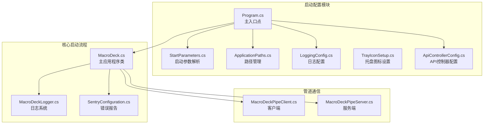
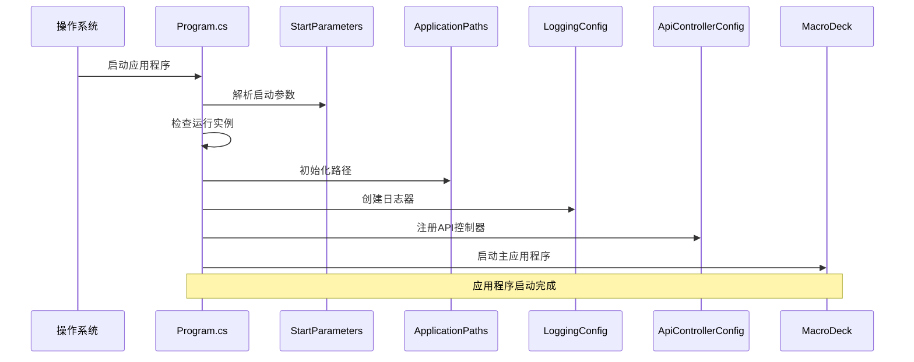
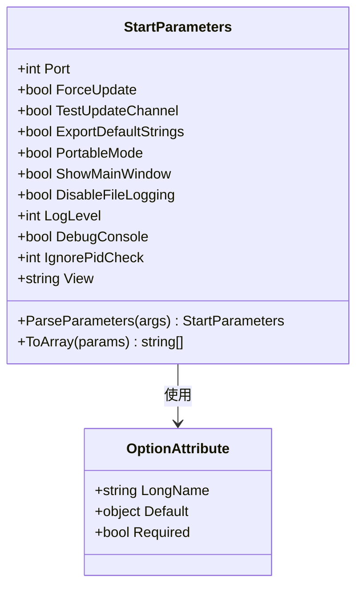
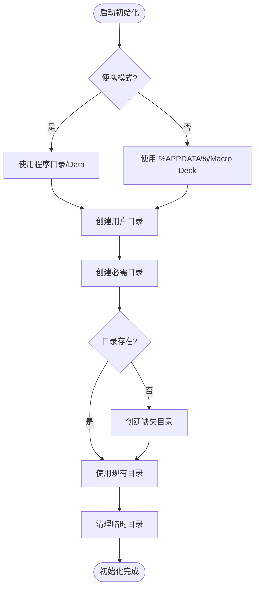
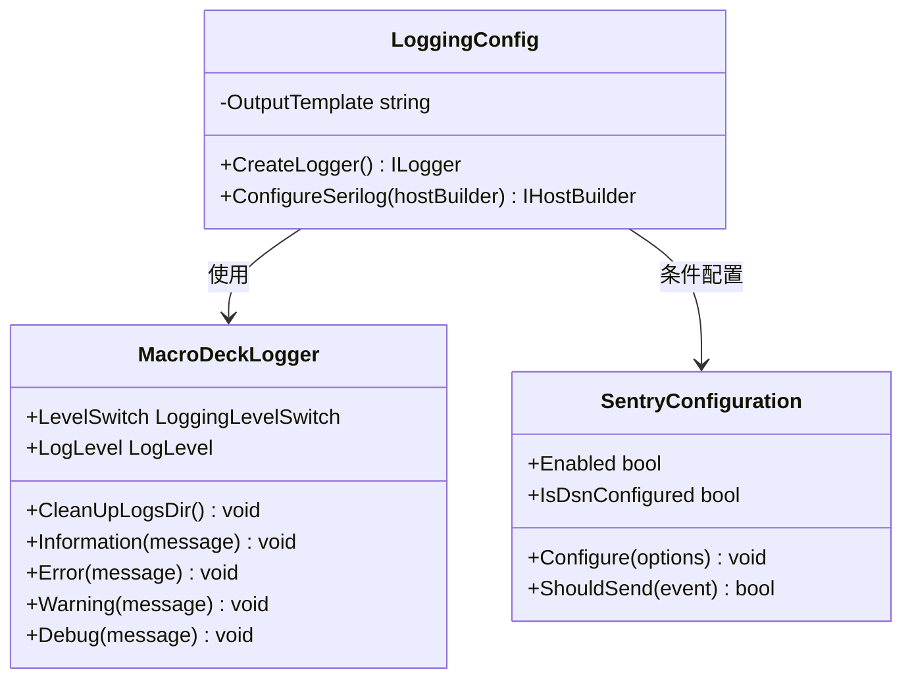
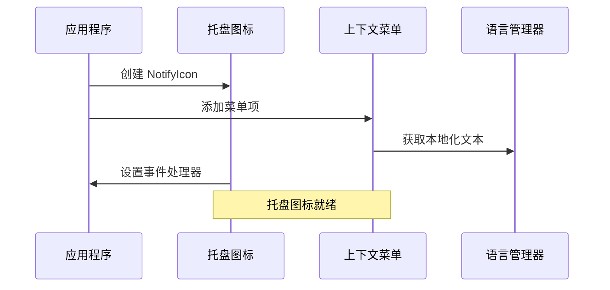
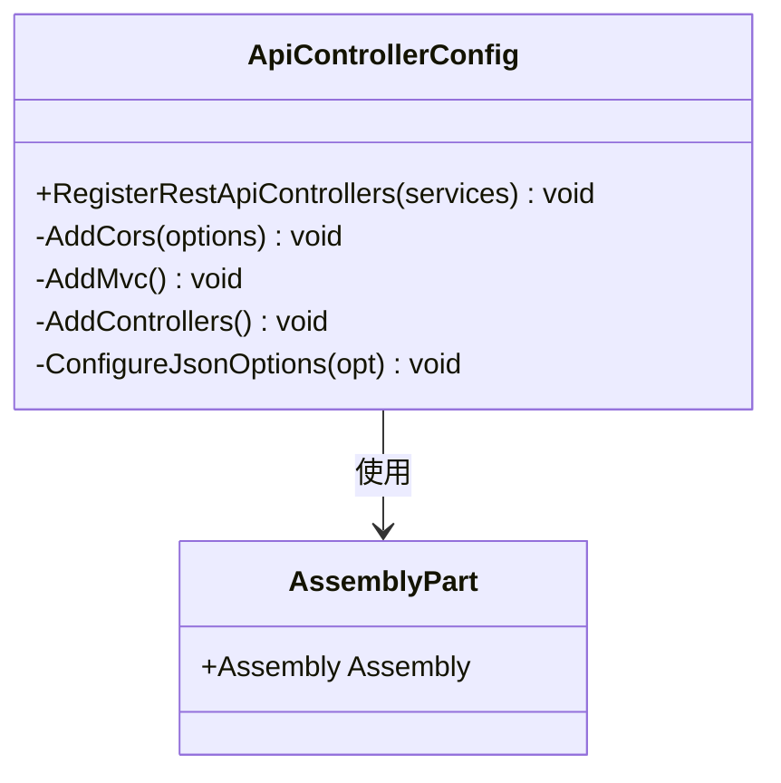
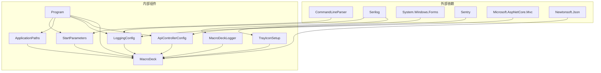
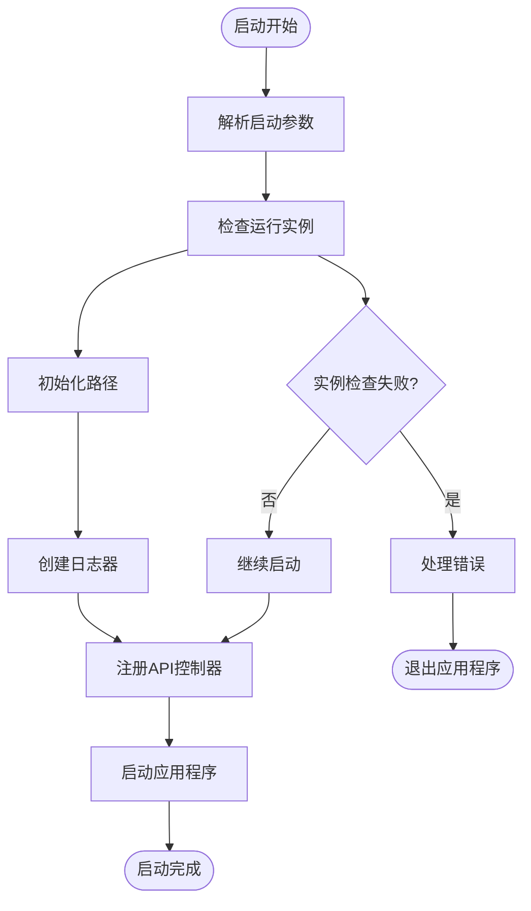

# 启动配置管理

<cite>
**本文档引用的文件**
- [Program.cs](file://src/MacroDeck/Program.cs)
- [MacroDeck.cs](file://src/MacroDeck/MacroDeck.cs)
- [StartParameters.cs](file://src/MacroDeck/StartupConfig/StartParameters.cs)
- [ApplicationPaths.cs](file://src/MacroDeck/StartupConfig/ApplicationPaths.cs)
- [LoggingConfig.cs](file://src/MacroDeck/StartupConfig/LoggingConfig.cs)
- [TrayIconSetup.cs](file://src/MacroDeck/StartupConfig/TrayIconSetup.cs)
- [ApiControllerConfig.cs](file://src/MacroDeck/StartupConfig/ApiControllerConfig.cs)
- [MacroDeckLogger.cs](file://src/MacroDeck/Logging/MacroDeckLogger.cs)
- [SentryConfiguration.cs](file://src/MacroDeck/Logging/SentryConfiguration.cs)
- [MainConfiguration.cs](file://src/MacroDeck/Configuration/MainConfiguration.cs)
- [MacroDeckPipeClient.cs](file://src/MacroDeck/Pipe/MacroDeckPipeClient.cs)
- [MacroDeckPipeServer.cs](file://src/MacroDeck/Pipe/MacroDeckPipeServer.cs)
</cite>

## 更新摘要
**变更内容**
- 新增 API 控制器配置系统，支持 REST API 控制器注册和 CORS 策略配置
- 重构应用路径管理系统，增强路径初始化和临时目录清理功能
- 完善日志配置系统，优化日志级别控制和文件轮转策略
- 扩展启动参数处理，新增视图参数和参数转换功能
- 增强托盘图标设置，改进菜单项本地化和字体管理

## 目录
1. [简介](#简介)
2. [项目结构](#项目结构)
3. [核心组件](#核心组件)
4. [架构概览](#架构概览)
5. [详细组件分析](#详细组件分析)
6. [依赖关系分析](#依赖关系分析)
7. [性能考虑](#性能考虑)
8. [故障排除指南](#故障排除指南)
9. [结论](#结论)
10. [附录](#附录)

## 简介

Macro-Deck 的启动配置管理系统经过全面重构，现在负责应用程序的初始化流程，包括启动参数解析、路径管理、日志配置、托盘图标设置以及 API 控制器配置等关键功能。该系统确保应用程序在不同环境下的正确启动和运行，同时提供了灵活的配置选项以满足各种使用场景。

## 项目结构

启动配置管理相关的代码主要分布在以下模块中：



**图表来源**
- [Program.cs:1-112](file://src/MacroDeck/Program.cs#L1-L112)
- [StartParameters.cs:1-108](file://src/MacroDeck/StartupConfig/StartParameters.cs#L1-L108)
- [ApplicationPaths.cs:1-172](file://src/MacroDeck/StartupConfig/ApplicationPaths.cs#L1-L172)
- [LoggingConfig.cs:1-66](file://src/MacroDeck/StartupConfig/LoggingConfig.cs#L1-L66)
- [TrayIconSetup.cs:1-72](file://src/MacroDeck/StartupConfig/TrayIconSetup.cs#L1-L72)
- [ApiControllerConfig.cs:1-48](file://src/MacroDeck/StartupConfig/ApiControllerConfig.cs#L1-L48)

**章节来源**
- [Program.cs:1-112](file://src/MacroDeck/Program.cs#L1-L112)
- [MacroDeck.cs:1-478](file://src/MacroDeck/MacroDeck.cs#L1-L478)

## 核心组件

启动配置管理系统由以下核心组件构成：

### 启动参数解析器
负责解析命令行参数并提供类型安全的参数访问接口，现已扩展支持视图参数和参数转换功能。

### 应用程序路径管理器
管理所有应用程序相关的目录和文件路径，支持便携模式和标准模式，增强了路径初始化和清理功能。

### 日志配置管理器
配置 Serilog 日志系统，包括控制台输出、文件轮转和错误报告，优化了日志级别控制。

### 托盘图标设置器
配置系统托盘图标及其上下文菜单项，改进了本地化和字体管理。

### API 控制器配置器
负责注册 REST API 控制器、配置 CORS 策略以及 JSON 序列化选项。

**章节来源**
- [StartParameters.cs:5-108](file://src/MacroDeck/StartupConfig/StartParameters.cs#L5-L108)
- [ApplicationPaths.cs:6-172](file://src/MacroDeck/StartupConfig/ApplicationPaths.cs#L6-L172)
- [LoggingConfig.cs:11-66](file://src/MacroDeck/StartupConfig/LoggingConfig.cs#L11-L66)
- [TrayIconSetup.cs:5-72](file://src/MacroDeck/StartupConfig/TrayIconSetup.cs#L5-L72)
- [ApiControllerConfig.cs:7-48](file://src/MacroDeck/StartupConfig/ApiControllerConfig.cs#L7-L48)

## 架构概览

启动配置管理采用分层架构设计，确保各组件职责清晰且相互独立：



**图表来源**
- [Program.cs:22-52](file://src/MacroDeck/Program.cs#L22-L52)
- [MacroDeck.cs:117-235](file://src/MacroDeck/MacroDeck.cs#L117-L235)

## 详细组件分析

### 启动参数解析系统

启动参数解析系统基于 CommandLineParser 库实现，提供类型安全的参数访问，并新增了视图参数和参数转换功能：



**图表来源**
- [StartParameters.cs:5-108](file://src/MacroDeck/StartupConfig/StartParameters.cs#L5-L108)

#### 参数类型说明

| 参数名称 | 类型 | 默认值 | 描述 |
|---------|------|--------|------|
| port | int | -1 | 服务器端口号 |
| force-update | bool | false | 强制更新模式 |
| test-channel | bool | false | 测试更新通道 |
| export-default-strings | bool | false | 导出默认字符串 |
| portable | bool | false | 便携模式 |
| show | bool | false | 显示主窗口 |
| disable-file-logging | bool | false | 禁用文件日志 |
| log-level | int | 0 | 日志级别 |
| debug-console | bool | false | 调试控制台 |
| ignore-pid-check | int | 0 | 忽略PID检查 |
| view | string | "" | 启动后显示的视图名称 |

**章节来源**
- [StartParameters.cs:11-52](file://src/MacroDeck/StartupConfig/StartParameters.cs#L11-L52)

### 应用程序路径管理系统

路径管理系统根据便携模式和标准模式确定不同的目录结构，并增强了路径初始化和清理功能：



**图表来源**
- [ApplicationPaths.cs:61-130](file://src/MacroDeck/StartupConfig/ApplicationPaths.cs#L61-L130)

#### 目录结构对比

| 目录类型 | 便携模式路径 | 标准模式路径 | 用途 |
|---------|-------------|-------------|------|
| 用户目录 | 程序目录/Data | %APPDATA%/Macro Deck | 存储用户数据 |
| 插件目录 | 用户目录/plugins | 用户目录/plugins | 插件存储 |
| 更新目录 | 插件目录/.updates | 插件目录/.updates | 插件更新缓存 |
| 临时目录 | 用户目录/.temp | 用户目录/.temp | 临时文件 |
| 图标包目录 | 用户目录/iconpacks | 用户目录/iconpacks | 图标包 |
| 配置目录 | 用户目录/configs | 用户目录/configs | 插件配置 |
| 凭据目录 | 用户目录/credentials | 用户目录/credentials | 插件凭据 |
| 备份目录 | 用户目录/backups | 用户目录/backups | 数据备份 |
| 日志目录 | 用户目录/logs | 用户目录/logs | 应用程序日志 |
| 主配置文件 | 用户目录/config.json | 用户目录/config.json | 主配置文件 |
| 设备文件 | 用户目录/devices.json | 用户目录/devices.json | 设备配置 |
| 变量文件 | 用户目录/variables.db | 用户目录/variables.db | 变量数据库 |
| 配置文件 | 用户目录/profiles.db | 用户目录/profiles.db | 配置文件 |
| 配置目录 | 用户目录/profiles | 用户目录/profiles | 配置目录 |

**章节来源**
- [ApplicationPaths.cs:70-89](file://src/MacroDeck/StartupConfig/ApplicationPaths.cs#L70-L89)
- [ApplicationPaths.cs:91-130](file://src/MacroDeck/StartupConfig/ApplicationPaths.cs#L91-L130)

### 日志配置系统

日志系统采用 Serilog 实现，提供多目标输出和灵活的配置选项，并优化了日志级别控制：



**图表来源**
- [LoggingConfig.cs:11-66](file://src/MacroDeck/StartupConfig/LoggingConfig.cs#L11-L66)
- [MacroDeckLogger.cs:17-372](file://src/MacroDeck/Logging/MacroDeckLogger.cs#L17-L372)
- [SentryConfiguration.cs:12-186](file://src/MacroDeck/Logging/SentryConfiguration.cs#L12-L186)

#### 日志配置特性

| 特性 | 配置 | 描述 |
|------|------|------|
| 输出模板 | HH:mm:ss} {Level:u3}] | 标准化日志格式 |
| 最小级别 | 受控于 LevelSwitch | 运行时可调整 |
| 控制台输出 | ANSI 主题 | 命令行显示 |
| 文件轮转 | 按天轮转 | 50MB 文件大小限制 |
| 错误报告 | Sentry | 匿名错误收集 |
| 微软框架级别 | 警告级别 | 减少框架噪音 |

**章节来源**
- [LoggingConfig.cs:18-53](file://src/MacroDeck/StartupConfig/LoggingConfig.cs#L18-L53)
- [MacroDeckLogger.cs:21-41](file://src/MacroDeck/Logging/MacroDeckLogger.cs#L21-L41)

### 托盘图标设置系统

托盘图标系统提供完整的系统集成功能，并改进了本地化和字体管理：



**图表来源**
- [TrayIconSetup.cs:16-70](file://src/MacroDeck/StartupConfig/TrayIconSetup.cs#L16-L70)

#### 托盘功能

| 功能 | 触发方式 | 行为描述 |
|------|----------|----------|
| 左键点击 | 鼠标左键 | 显示主窗口 |
| 显示菜单项 | 右键菜单 | 显示/隐藏主窗口 |
| 重启菜单项 | 右键菜单 | 重新启动应用程序 |
| 退出菜单项 | 右键菜单 | 安全退出应用程序 |

**章节来源**
- [TrayIconSetup.cs:22-70](file://src/MacroDeck/StartupConfig/TrayIconSetup.cs#L22-L70)

### API 控制器配置系统

新增的 API 控制器配置系统负责注册 REST API 控制器、配置 CORS 策略以及 JSON 序列化选项：



**图表来源**
- [ApiControllerConfig.cs:11-48](file://src/MacroDeck/StartupConfig/ApiControllerConfig.cs#L11-L48)

#### API 配置特性

| 特性 | 配置 | 描述 |
|------|------|------|
| CORS 策略 | 允许任何来源 | 支持跨域请求 |
| MVC 服务 | 核心服务 | Web API 支持 |
| JSON 序列化 | 字符串枚举 | 枚举值序列化 |
| 允许尾随逗号 | 反序列化选项 | 提高兼容性 |
| 程序集注册 | API 控制器 | 自动发现控制器 |

**章节来源**
- [ApiControllerConfig.cs:18-46](file://src/MacroDeck/StartupConfig/ApiControllerConfig.cs#L18-L46)

## 依赖关系分析

启动配置管理系统的依赖关系如下：



**图表来源**
- [Program.cs:1-6](file://src/MacroDeck/Program.cs#L1-L6)
- [MacroDeck.cs:1-28](file://src/MacroDeck/MacroDeck.cs#L1-L28)

**章节来源**
- [Program.cs:1-112](file://src/MacroDeck/Program.cs#L1-L112)
- [MacroDeck.cs:1-478](file://src/MacroDeck/MacroDeck.cs#L1-L478)

## 性能考虑

启动配置管理系统在性能方面采取了多项优化措施：

### 启动时间优化
- **早期日志初始化**：在应用程序启动初期就配置日志系统，确保从一开始就具备完整的日志能力
- **异步实例检查**：运行实例检测采用异步方式，避免阻塞主启动流程
- **延迟初始化**：非关键组件采用延迟初始化策略
- **API 控制器预注册**：提前注册控制器减少运行时开销

### 内存使用优化
- **静态单例模式**：日志配置和路径管理采用静态单例，减少内存占用
- **条件日志输出**：根据日志级别动态决定输出内容，避免不必要的字符串拼接
- **路径缓存**：路径属性采用静态缓存，避免重复计算

### I/O 性能优化
- **批量路径创建**：路径检查时批量创建目录，减少文件系统调用次数
- **文件轮转策略**：合理的文件大小限制和轮转间隔平衡磁盘空间和性能
- **管道通信优化**：命名管道连接超时设置为2秒，避免长时间阻塞

## 故障排除指南

### 常见启动问题及解决方案

#### 路径权限问题
**症状**：应用程序无法创建或写入配置目录
**原因**：用户权限不足或目录被其他进程占用
**解决方案**：
1. 检查应用程序是否有足够的文件系统权限
2. 关闭可能占用配置目录的其他程序
3. 尝试以管理员身份运行应用程序

#### 日志文件写入失败
**症状**：应用程序启动但日志文件未生成
**原因**：日志目录不可写或磁盘空间不足
**解决方案**：
1. 检查日志目录权限
2. 清理磁盘空间
3. 验证磁盘可用空间

#### 托盘图标不显示
**症状**：应用程序启动但系统托盘中看不到图标
**原因**：Windows 系统托盘设置或应用程序权限问题
**解决方案**：
1. 检查系统托盘设置
2. 以管理员身份运行应用程序
3. 验证应用程序具有必要的系统集成权限

#### API 控制器注册失败
**症状**：REST API 无法访问或控制器未找到
**原因**：程序集注册失败或 CORS 配置错误
**解决方案**：
1. 检查控制器程序集是否正确注册
2. 验证 CORS 策略配置
3. 确认 JSON 序列化选项设置

### 错误处理机制

启动配置系统包含多层次的错误处理：



**图表来源**
- [Program.cs:34-52](file://src/MacroDeck/Program.cs#L34-L52)

**章节来源**
- [Program.cs:59-92](file://src/MacroDeck/Program.cs#L59-L92)
- [ApplicationPaths.cs:96-130](file://src/MacroDeck/StartupConfig/ApplicationPaths.cs#L96-L130)

## 结论

Macro-Deck 的启动配置管理系统经过全面重构，通过精心设计的架构和完善的错误处理机制，为应用程序提供了更加稳定可靠的启动基础。系统支持多种运行模式（便携模式和标准模式），提供了灵活的配置选项，并通过多层日志系统确保了良好的可观测性。

该系统的主要优势包括：
- **模块化设计**：各组件职责明确，便于维护和扩展
- **灵活性**：支持多种配置选项和运行模式
- **可靠性**：完善的错误处理和恢复机制
- **性能优化**：合理的资源管理和启动优化
- **API 支持**：新增的 REST API 控制器配置功能
- **增强功能**：改进的路径管理、日志配置和托盘图标设置

## 附录

### 启动参数完整列表

| 参数名称 | 短参数 | 类型 | 默认值 | 描述 |
|---------|--------|------|--------|------|
| port | -p | int | -1 | 服务器端口号 |
| force-update | -f | bool | false | 强制更新模式 |
| test-channel | -t | bool | false | 测试更新通道 |
| export-default-strings | -e | bool | false | 导出默认字符串 |
| portable | -o | bool | false | 便携模式 |
| show | -s | bool | false | 显示主窗口 |
| disable-file-logging | -d | bool | false | 禁用文件日志 |
| log-level | -l | int | 0 | 日志级别 |
| debug-console | -g | bool | false | 调试控制台 |
| ignore-pid-check | -i | int | 0 | 忽略PID检查 |
| view | -v | string | "" | 启动后显示的视图名称 |

### 使用示例

**基本启动**：
```bash
MacroDeck.exe
```

**便携模式启动**：
```bash
MacroDeck.exe --portable
```

**指定端口启动**：
```bash
MacroDeck.exe --port 8080
```

**调试模式启动**：
```bash
MacroDeck.exe --log-level 1 --debug-console
```

**强制更新启动**：
```bash
MacroDeck.exe --force-update --test-channel
```

**指定视图启动**：
```bash
MacroDeck.exe --view settings
```

### 配置优先级关系

启动配置与用户配置的优先级关系遵循以下规则：

1. **启动参数优先级最高**：命令行参数覆盖用户配置文件中的设置
2. **用户配置文件次之**：配置文件中的设置覆盖默认值
3. **默认值最低**：当没有显式设置时使用内置默认值

这种设计允许用户通过命令行快速覆盖配置，同时保持配置文件的持久性设置。

### 开发者扩展指南

#### 自定义启动行为扩展

要为 Macro-Deck 添加新的启动参数，需要：

1. **添加参数属性**：在 `StartParameters` 类中添加新的 `[Option]` 属性
2. **处理参数逻辑**：在 `MacroDeck.Start` 方法中添加相应的处理逻辑
3. **更新帮助信息**：确保参数的描述信息准确反映其功能
4. **测试新功能**：编写单元测试验证新参数的行为

#### 路径管理扩展

如需扩展路径管理功能：

1. **添加新路径属性**：在 `ApplicationPaths` 类中添加新的路径属性
2. **更新初始化逻辑**：在 `InitializePaths` 方法中设置新路径
3. **添加路径检查**：在 `CheckPaths` 方法中添加新路径的创建逻辑
4. **文档更新**：更新相关文档说明新路径的用途

#### 日志系统扩展

要扩展日志系统功能：

1. **添加日志目标**：在 `LoggingConfig.CreateLogger` 方法中添加新的日志目标
2. **配置日志级别**：根据需要调整日志级别和过滤规则
3. **实现条件日志**：使用 `Conditional` 方法实现按条件的日志输出
4. **测试日志功能**：验证新日志目标的正确性和性能影响

#### API 控制器扩展

要扩展 API 控制器功能：

1. **添加控制器**：创建新的 API 控制器类
2. **注册控制器**：在 `ApiControllerConfig.RegisterRestApiControllers` 方法中注册控制器
3. **配置 CORS**：根据需要调整 CORS 策略
4. **测试 API**：验证控制器的正确性和安全性