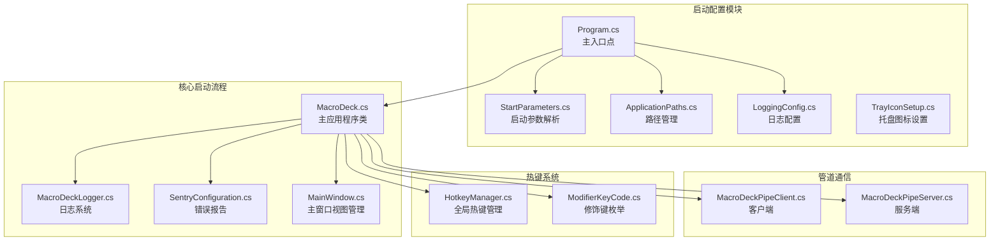
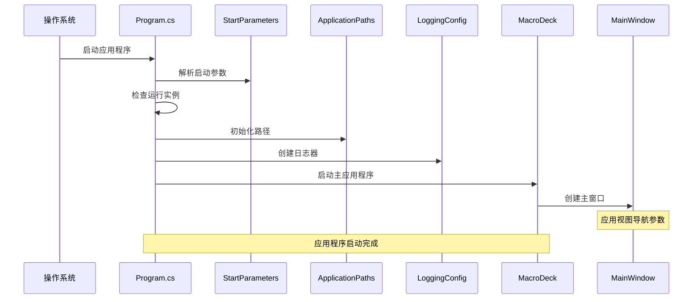
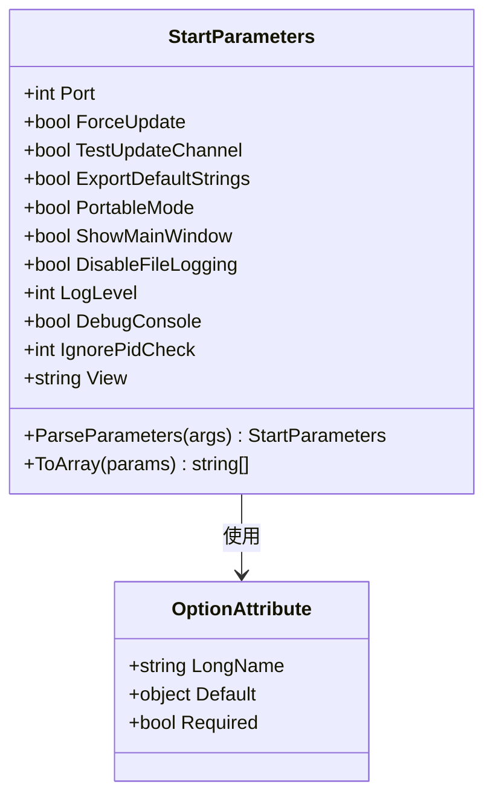
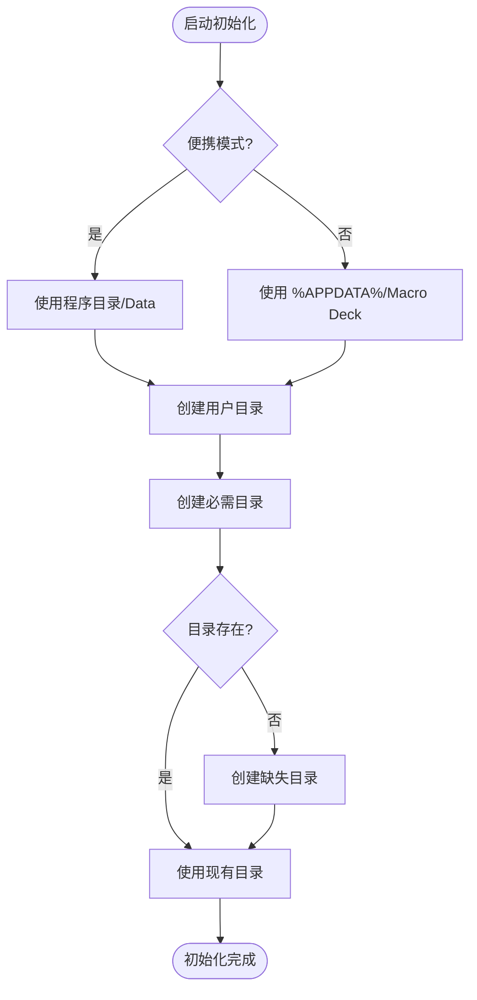
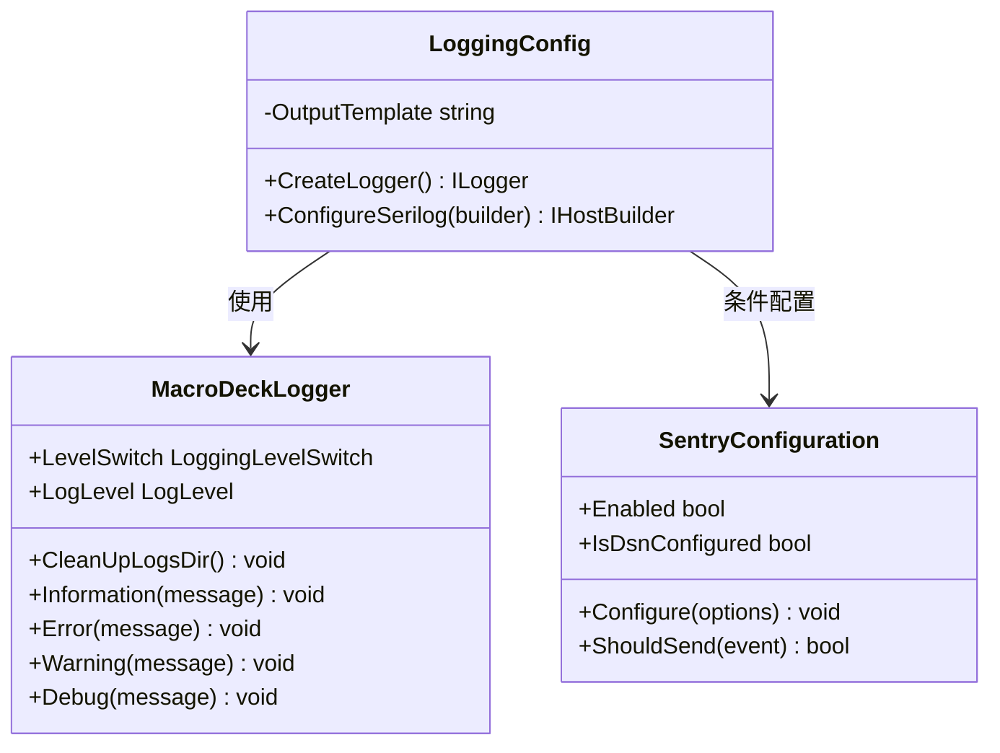
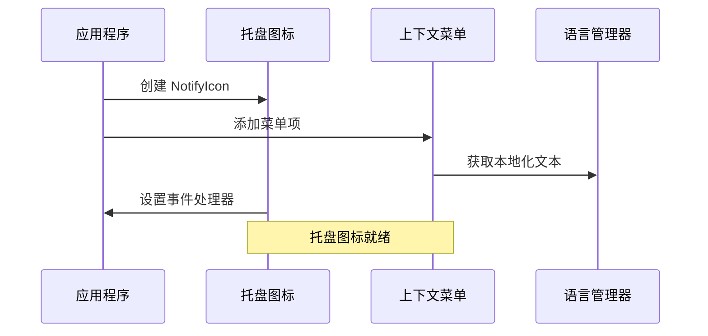
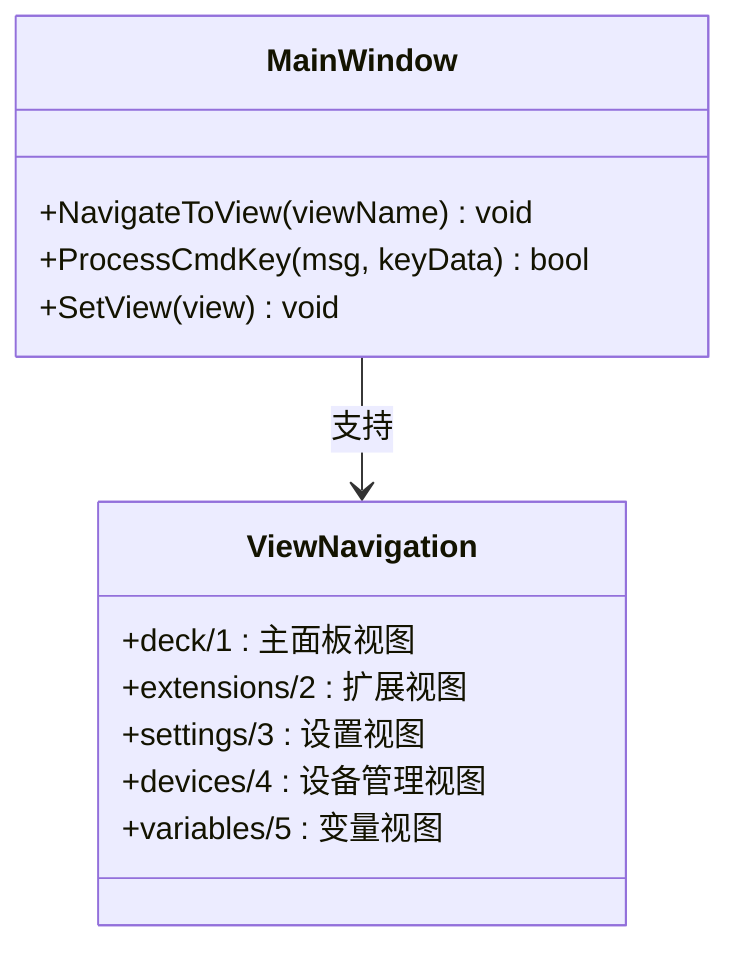
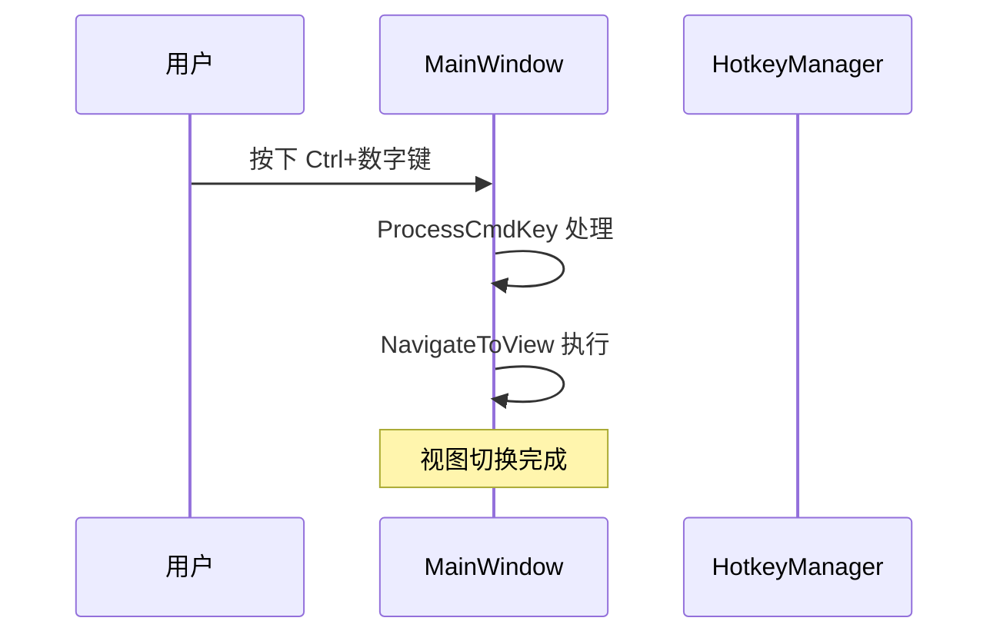
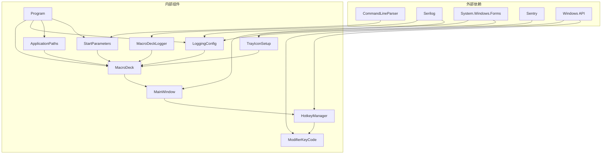
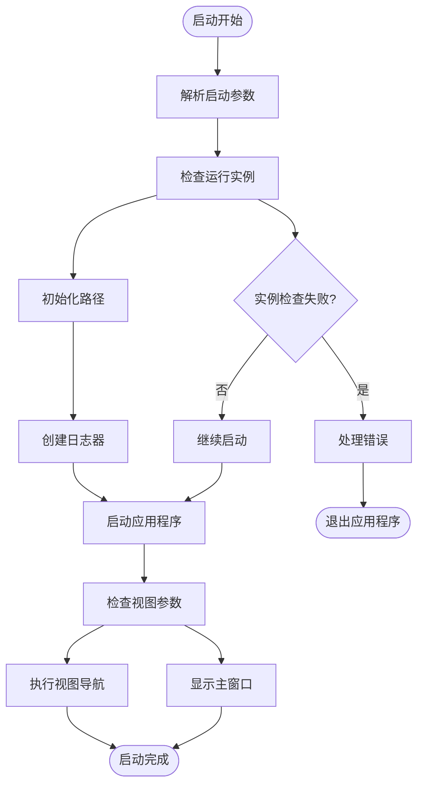

# 启动配置管理

<cite>
**本文档引用的文件**
- [Program.cs](file://src/MacroDeck/Program.cs)
- [MacroDeck.cs](file://src/MacroDeck/MacroDeck.cs)
- [StartParameters.cs](file://src/MacroDeck/StartupConfig/StartParameters.cs)
- [ApplicationPaths.cs](file://src/MacroDeck/StartupConfig/ApplicationPaths.cs)
- [LoggingConfig.cs](file://src/MacroDeck/StartupConfig/LoggingConfig.cs)
- [TrayIconSetup.cs](file://src/MacroDeck/StartupConfig/TrayIconSetup.cs)
- [MacroDeckLogger.cs](file://src/MacroDeck/Logging/MacroDeckLogger.cs)
- [SentryConfiguration.cs](file://src/MacroDeck/Logging/SentryConfiguration.cs)
- [MainConfiguration.cs](file://src/MacroDeck/Configuration/MainConfiguration.cs)
- [MacroDeckPipeClient.cs](file://src/MacroDeck/Pipe/MacroDeckClient.cs)
- [MacroDeckPipeServer.cs](file://src/MacroDeck/Pipe/MacroDeckPipeServer.cs)
- [MainWindow.cs](file://src/MacroDeck/GUI/MainWindow.cs)
- [HotkeyManager.cs](file://src/MacroDeck/Hotkeys/HotkeyManager.cs)
- [ModifierKeyCode.cs](file://src/MacroDeck/Hotkeys/ModifierKeyCode.cs)
</cite>

## 更新摘要
**所做更改**
- 新增View属性启动参数，支持调试便利功能
- 添加键盘快捷键支持，包括Ctrl+1~5视图切换
- 更新启动参数完整列表和使用示例
- 增强调试和开发体验功能说明

## 目录
1. [简介](#简介)
2. [项目结构](#项目结构)
3. [核心组件](#核心组件)
4. [架构概览](#架构概览)
5. [详细组件分析](#详细组件分析)
6. [依赖关系分析](#依赖关系分析)
7. [性能考虑](#性能考虑)
8. [故障排除指南](#故障排除指南)
9. [结论](#结论)
10. [附录](#附录)

## 简介

Macro-Deck 的启动配置管理系统负责应用程序的初始化流程，包括启动参数解析、路径管理、日志配置、托盘图标设置等关键功能。该系统确保应用程序在不同环境下的正确启动和运行，同时提供了灵活的配置选项以满足各种使用场景。

**更新** 新增View属性启动参数，为开发者提供便捷的调试功能，支持直接跳转到指定视图进行测试和验证。

## 项目结构

启动配置管理相关的代码主要分布在以下模块中：



**图表来源**
- [Program.cs:1-112](file://src/MacroDeck/Program.cs#L1-L112)
- [StartParameters.cs:1-81](file://src/MacroDeck/StartupConfig/StartParameters.cs#L1-L81)
- [ApplicationPaths.cs:1-143](file://src/MacroDeck/StartupConfig/ApplicationPaths.cs#L1-L143)
- [LoggingConfig.cs:1-56](file://src/MacroDeck/StartupConfig/LoggingConfig.cs#L1-L56)
- [TrayIconSetup.cs:1-49](file://src/MacroDeck/StartupConfig/TrayIconSetup.cs#L1-L49)
- [MainWindow.cs:1-452](file://src/MacroDeck/GUI/MainWindow.cs#L1-L452)
- [HotkeyManager.cs:1-169](file://src/MacroDeck/Hotkeys/HotkeyManager.cs#L1-L169)

**章节来源**
- [Program.cs:1-112](file://src/MacroDeck/Program.cs#L1-L112)
- [MacroDeck.cs:1-478](file://src/MacroDeck/MacroDeck.cs#L1-L478)

## 核心组件

启动配置管理系统由以下核心组件构成：

### 启动参数解析器
负责解析命令行参数并提供类型安全的参数访问接口。

### 应用程序路径管理器
管理所有应用程序相关的目录和文件路径，支持便携模式和标准模式。

### 日志配置管理器
配置 Serilog 日志系统，包括控制台输出、文件轮转和错误报告。

### 托盘图标设置器
配置系统托盘图标及其上下文菜单项。

### 视图导航控制器
**新增** 支持通过命令行参数和键盘快捷键进行视图导航，增强开发和调试体验。

**章节来源**
- [StartParameters.cs:5-81](file://src/MacroDeck/StartupConfig/StartParameters.cs#L5-L81)
- [ApplicationPaths.cs:6-143](file://src/MacroDeck/StartupConfig/ApplicationPaths.cs#L6-L143)
- [LoggingConfig.cs:11-56](file://src/MacroDeck/StartupConfig/LoggingConfig.cs#L11-L56)
- [TrayIconSetup.cs:5-49](file://src/MacroDeck/StartupConfig/TrayIconSetup.cs#L5-L49)
- [MainWindow.cs:417-452](file://src/MacroDeck/GUI/MainWindow.cs#L417-L452)

## 架构概览

启动配置管理采用分层架构设计，确保各组件职责清晰且相互独立：



**图表来源**
- [Program.cs:22-52](file://src/MacroDeck/Program.cs#L22-L52)
- [MacroDeck.cs:117-235](file://src/MacroDeck/MacroDeck.cs#L117-L235)

## 详细组件分析

### 启动参数解析系统

启动参数解析系统基于 CommandLineParser 库实现，提供类型安全的参数访问：



**图表来源**
- [StartParameters.cs:5-81](file://src/MacroDeck/StartupConfig/StartParameters.cs#L5-L81)

#### 参数类型说明

| 参数名称 | 类型 | 默认值 | 描述 |
|---------|------|--------|------|
| port | int | -1 | 服务器端口号 |
| force-update | bool | false | 强制更新模式 |
| test-channel | bool | false | 测试更新通道 |
| export-default-strings | bool | false | 导出默认字符串 |
| portable | bool | false | 便携模式 |
| show | bool | false | 显示主窗口 |
| disable-file-logging | bool | false | 禁用文件日志 |
| log-level | int | 0 | 日志级别 |
| debug-console | bool | false | 调试控制台 |
| ignore-pid-check | int | 0 | 忽略PID检查 |
| **view** | **string** | **""** | **调试视图导航** |

**更新** 新增View属性，支持调试便利功能，允许直接跳转到指定视图。

**章节来源**
- [StartParameters.cs:7-37](file://src/MacroDeck/StartupConfig/StartParameters.cs#L7-L37)

### 应用程序路径管理系统

路径管理系统根据便携模式和标准模式确定不同的目录结构：



**图表来源**
- [ApplicationPaths.cs:36-102](file://src/MacroDeck/StartupConfig/ApplicationPaths.cs#L36-L102)

#### 目录结构对比

| 目录类型 | 便携模式路径 | 标准模式路径 | 用途 |
|---------|-------------|-------------|------|
| 用户目录 | 程序目录/Data | %APPDATA%/Macro Deck | 存储用户数据 |
| 插件目录 | 用户目录/plugins | 用户目录/plugins | 插件存储 |
| 更新目录 | 插件目录/.updates | 插件目录/.updates | 插件更新缓存 |
| 临时目录 | 用户目录/.temp | 用户目录/.temp | 临时文件 |
| 图标包目录 | 用户目录/iconpacks | 用户目录/iconpacks | 图标包 |
| 配置目录 | 用户目录/configs | 用户目录/configs | 插件配置 |
| 凭据目录 | 用户目录/credentials | 用户目录/credentials | 插件凭据 |
| 备份目录 | 用户目录/backups | 用户目录/backups | 数据备份 |
| 日志目录 | 用户目录/logs | 用户目录/logs | 应用程序日志 |
| 主配置文件 | 用户目录/config.json | 用户目录/config.json | 主配置文件 |
| 设备文件 | 用户目录/devices.json | 用户目录/devices.json | 设备配置 |
| 变量文件 | 用户目录/variables.db | 用户目录/variables.db | 变量数据库 |
| 配置文件 | 用户目录/profiles.db | 用户目录/profiles.db | 配置文件 |
| 配置目录 | 用户目录/profiles | 用户目录/profiles | 配置目录 |

**章节来源**
- [ApplicationPaths.cs:43-61](file://src/MacroDeck/StartupConfig/ApplicationPaths.cs#L43-L61)
- [ApplicationPaths.cs:64-102](file://src/MacroDeck/StartupConfig/ApplicationPaths.cs#L64-L102)

### 日志配置系统

日志系统采用 Serilog 实现，提供多目标输出和灵活的配置选项：



**图表来源**
- [LoggingConfig.cs:11-56](file://src/MacroDeck/StartupConfig/LoggingConfig.cs#L11-L56)
- [MacroDeckLogger.cs:11-361](file://src/MacroDeck/Logging/MacroDeckLogger.cs#L11-L361)
- [SentryConfiguration.cs:7-138](file://src/MacroDeck/Logging/SentryConfiguration.cs#L7-L138)

#### 日志配置特性

| 特性 | 配置 | 描述 |
|------|------|------|
| 输出模板 | HH:mm:ss} {Level:u3}] | 标准化日志格式 |
| 最小级别 | 受控于 LevelSwitch | 运行时可调整 |
| 控制台输出 | ANSI 主题 | 命令行显示 |
| 文件轮转 | 按天轮转 | 50MB 文件大小限制 |
| 错误报告 | Sentry | 匿名错误收集 |
| 微软框架级别 | 警告级别 | 减少框架噪音 |

**章节来源**
- [LoggingConfig.cs:21-49](file://src/MacroDeck/StartupConfig/LoggingConfig.cs#L21-L49)
- [MacroDeckLogger.cs:15-35](file://src/MacroDeck/Logging/MacroDeckLogger.cs#L15-L35)

### 托盘图标设置系统

托盘图标系统提供完整的系统集成功能：



**图表来源**
- [TrayIconSetup.cs:7-47](file://src/MacroDeck/StartupConfig/TrayIconSetup.cs#L7-L47)

#### 托盘功能

| 功能 | 触发方式 | 行为描述 |
|------|----------|----------|
| 左键点击 | 鼠标左键 | 显示主窗口 |
| 显示菜单项 | 右键菜单 | 显示/隐藏主窗口 |
| 重启菜单项 | 右键菜单 | 重新启动应用程序 |
| 退出菜单项 | 右键菜单 | 安全退出应用程序 |

**章节来源**
- [TrayIconSetup.cs:14-46](file://src/MacroDeck/StartupConfig/TrayIconSetup.cs#L14-L46)

### 视图导航系统

**新增** 视图导航系统为开发者提供便捷的调试功能：



**图表来源**
- [MainWindow.cs:417-452](file://src/MacroDeck/GUI/MainWindow.cs#L417-L452)

#### 视图导航功能

| 视图名称 | 快捷键 | 参数值 | 功能描述 |
|---------|--------|--------|----------|
| deck | Ctrl+1 | deck/1 | 主面板视图，显示动作按钮网格 |
| extensions | Ctrl+2 | extensions/2 | 扩展商店视图，管理插件 |
| settings | Ctrl+3 | settings/3 | 设置视图，配置应用程序 |
| devices | Ctrl+4 | devices/4 | 设备管理视图，连接设备 |
| variables | Ctrl+5 | variables/5 | 变量视图，管理变量 |

**章节来源**
- [MainWindow.cs:417-452](file://src/MacroDeck/GUI/MainWindow.cs#L417-L452)

### 键盘快捷键系统

**新增** 键盘快捷键系统提供高效的视图切换功能：



**图表来源**
- [MainWindow.cs:433-450](file://src/MacroDeck/GUI/MainWindow.cs#L433-L450)
- [HotkeyManager.cs:139-167](file://src/MacroDeck/Hotkeys/HotkeyManager.cs#L139-L167)

#### 快捷键映射

| 组合键 | 视图 | 功能 |
|-------|------|------|
| Ctrl+1 | deck | 切换到主面板视图 |
| Ctrl+2 | extensions | 切换到扩展视图 |
| Ctrl+3 | settings | 切换到设置视图 |
| Ctrl+4 | devices | 切换到设备管理视图 |
| Ctrl+5 | variables | 切换到变量视图 |

**章节来源**
- [MainWindow.cs:433-450](file://src/MacroDeck/GUI/MainWindow.cs#L433-L450)
- [HotkeyManager.cs:139-167](file://src/MacroDeck/Hotkeys/HotkeyManager.cs#L139-L167)

## 依赖关系分析

启动配置管理系统的依赖关系如下：



**图表来源**
- [Program.cs:1-5](file://src/MacroDeck/Program.cs#L1-L5)
- [MacroDeck.cs:14-27](file://src/MacroDeck/MacroDeck.cs#L14-L27)

**章节来源**
- [Program.cs:1-112](file://src/MacroDeck/Program.cs#L1-L112)
- [MacroDeck.cs:1-478](file://src/MacroDeck/MacroDeck.cs#L1-L478)

## 性能考虑

启动配置管理系统在性能方面采取了多项优化措施：

### 启动时间优化
- **早期日志初始化**：在应用程序启动初期就配置日志系统，确保从一开始就具备完整的日志能力
- **异步实例检查**：运行实例检测采用异步方式，避免阻塞主启动流程
- **延迟初始化**：非关键组件采用延迟初始化策略

### 内存使用优化
- **静态单例模式**：日志配置和路径管理采用静态单例，减少内存占用
- **条件日志输出**：根据日志级别动态决定输出内容，避免不必要的字符串拼接

### I/O 性能优化
- **批量路径创建**：路径检查时批量创建目录，减少文件系统调用次数
- **文件轮转策略**：合理的文件大小限制和轮转间隔平衡磁盘空间和性能

### 视图导航优化
**新增** 视图导航系统采用高效的字符串匹配算法，支持快速视图切换，不影响应用程序整体性能。

## 故障排除指南

### 常见启动问题及解决方案

#### 路径权限问题
**症状**：应用程序无法创建或写入配置目录
**原因**：用户权限不足或目录被其他进程占用
**解决方案**：
1. 检查应用程序是否有足够的文件系统权限
2. 关闭可能占用配置目录的其他程序
3. 尝试以管理员身份运行应用程序

#### 日志文件写入失败
**症状**：应用程序启动但日志文件未生成
**原因**：日志目录不可写或磁盘空间不足
**解决方案**：
1. 检查日志目录权限
2. 清理磁盘空间
3. 验证磁盘可用空间

#### 托盘图标不显示
**症状**：应用程序启动但系统托盘中看不到图标
**原因**：Windows 系统托盘设置或应用程序权限问题
**解决方案**：
1. 检查系统托盘设置
2. 以管理员身份运行应用程序
3. 验证应用程序具有必要的系统集成权限

#### 视图导航失败
**症状**：使用--view参数或Ctrl+快捷键无法切换视图
**原因**：视图名称不正确或参数格式错误
**解决方案**：
1. 检查视图名称是否正确（deck/extensions/settings/devices/variables）
2. 验证参数格式是否符合要求
3. 确认主窗口已完全加载后再进行视图切换

### 错误处理机制

启动配置系统包含多层次的错误处理：



**图表来源**
- [Program.cs:34-52](file://src/MacroDeck/Program.cs#L34-L52)
- [MacroDeck.cs:117-235](file://src/MacroDeck/MacroDeck.cs#L117-L235)

**章节来源**
- [Program.cs:68-78](file://src/MacroDeck/Program.cs#L68-L78)
- [ApplicationPaths.cs:80-89](file://src/MacroDeck/StartupConfig/ApplicationPaths.cs#L80-L89)

## 结论

Macro-Deck 的启动配置管理系统通过精心设计的架构和完善的错误处理机制，为应用程序提供了稳定可靠的启动基础。系统支持多种运行模式（便携模式和标准模式），提供了灵活的配置选项，并通过多层日志系统确保了良好的可观测性。

**更新** 新增的View属性启动参数和键盘快捷键系统显著提升了开发和调试体验，为开发者提供了更便捷的测试和验证工具。

该系统的主要优势包括：
- **模块化设计**：各组件职责明确，便于维护和扩展
- **灵活性**：支持多种配置选项和运行模式
- **可靠性**：完善的错误处理和恢复机制
- **性能优化**：合理的资源管理和启动优化
- **开发友好**：新增的调试便利功能提升开发效率

## 附录

### 启动参数完整列表

| 参数名称 | 短参数 | 类型 | 默认值 | 描述 |
|---------|--------|------|--------|------|
| port | -p | int | -1 | 服务器端口号 |
| force-update | -f | bool | false | 强制更新模式 |
| test-channel | -t | bool | false | 测试更新通道 |
| export-default-strings | -e | bool | false | 导出默认字符串 |
| portable | -o | bool | false | 便携模式 |
| show | -s | bool | false | 显示主窗口 |
| disable-file-logging | -d | bool | false | 禁用文件日志 |
| log-level | -l | int | 0 | 日志级别 |
| debug-console | -g | bool | false | 调试控制台 |
| ignore-pid-check | -i | int | 0 | 忽略PID检查 |
| **view** | **-v** | **string** | **""** | **调试视图导航** |

**更新** 新增view参数，支持调试便利功能。

### 使用示例

**基本启动**：
```
MacroDeck.exe
```

**便携模式启动**：
```
MacroDeck.exe --portable
```

**指定端口启动**：
```
MacroDeck.exe --port 8080
```

**调试模式启动**：
```
MacroDeck.exe --log-level 1 --debug-console
```

**强制更新启动**：
```
MacroDeck.exe --force-update --test-channel
```

**调试视图导航**：
```
MacroDeck.exe --view deck
MacroDeck.exe --view extensions
MacroDeck.exe --view settings
MacroDeck.exe --view devices
MacroDeck.exe --view variables
```

**快捷键使用**：
- **Ctrl+1**：切换到主面板视图
- **Ctrl+2**：切换到扩展视图  
- **Ctrl+3**：切换到设置视图
- **Ctrl+4**：切换到设备管理视图
- **Ctrl+5**：切换到变量视图

### 配置优先级关系

启动配置与用户配置的优先级关系遵循以下规则：

1. **启动参数优先级最高**：命令行参数覆盖用户配置文件中的设置
2. **用户配置文件次之**：配置文件中的设置覆盖默认值
3. **默认值最低**：当没有显式设置时使用内置默认值

这种设计允许用户通过命令行快速覆盖配置，同时保持配置文件的持久性设置。

### 开发者扩展指南

#### 自定义启动行为扩展

要为 Macro-Deck 添加新的启动参数，需要：

1. **添加参数属性**：在 `StartParameters` 类中添加新的 `[Option]` 属性
2. **处理参数逻辑**：在 `MacroDeck.Start` 方法中添加相应的处理逻辑
3. **更新帮助信息**：确保参数的描述信息准确反映其功能
4. **测试新功能**：编写单元测试验证新参数的行为

#### 路径管理扩展

如需扩展路径管理功能：

1. **添加新路径属性**：在 `ApplicationPaths` 类中添加新的路径属性
2. **更新初始化逻辑**：在 `InitializePaths` 方法中设置新路径
3. **添加路径检查**：在 `CheckPaths` 方法中添加新路径的创建逻辑
4. **文档更新**：更新相关文档说明新路径的用途

#### 日志系统扩展

要扩展日志系统功能：

1. **添加日志目标**：在 `LoggingConfig.CreateLogger` 方法中添加新的日志目标
2. **配置日志级别**：根据需要调整日志级别和过滤规则
3. **实现条件日志**：使用 `Conditional` 方法实现按条件的日志输出
4. **测试日志功能**：验证新日志目标的正确性和性能影响

#### 视图导航扩展

**新增** 如需扩展视图导航功能：

1. **添加新视图支持**：在 `MainWindow.NavigateToView` 方法中添加新视图的处理逻辑
2. **更新快捷键映射**：在 `MainWindow.ProcessCmdKey` 方法中添加对应的快捷键处理
3. **添加视图名称常量**：定义新视图的标准名称以便统一使用
4. **测试导航功能**：验证新视图的导航和快捷键功能正常工作

#### 键盘快捷键扩展

**新增** 如需扩展键盘快捷键功能：

1. **添加快捷键处理**：在 `MainWindow.ProcessCmdKey` 方法中添加新的快捷键映射
2. **更新快捷键枚举**：在 `ModifierKeyCode` 中添加新的修饰键支持
3. **测试快捷键功能**：验证新快捷键的响应和功能正确性
4. **文档更新**：更新快捷键使用说明和帮助文档