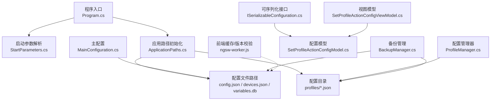
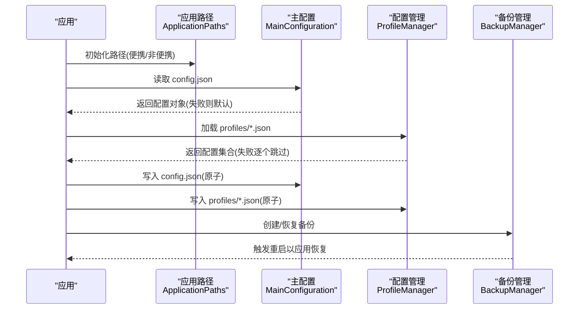
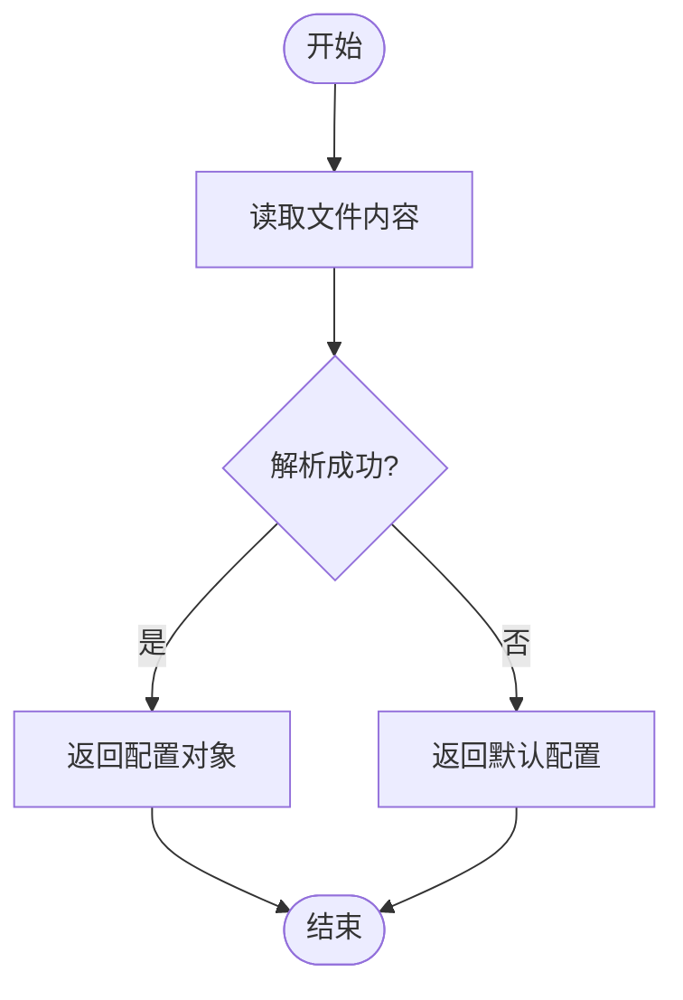
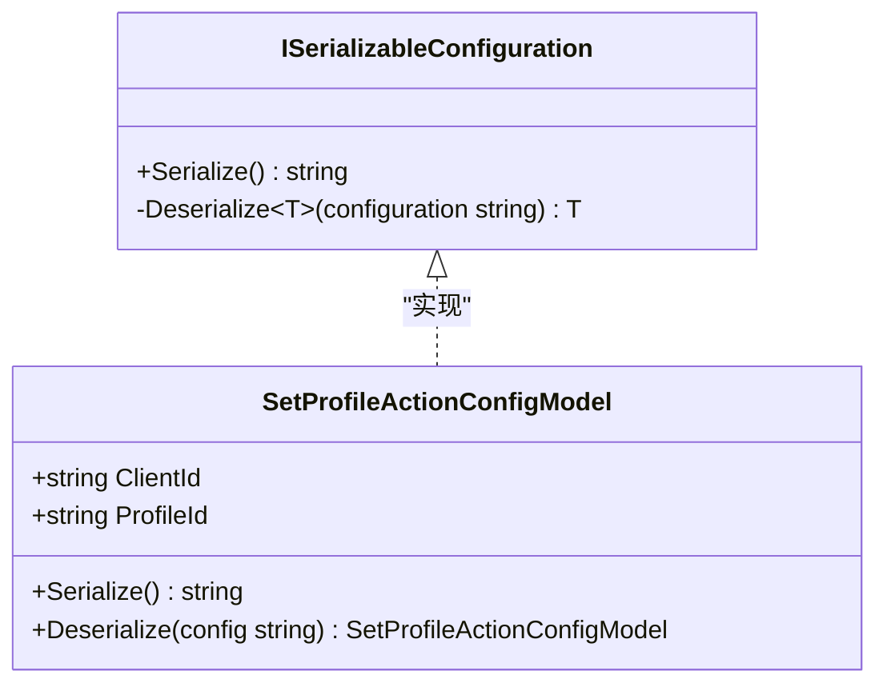
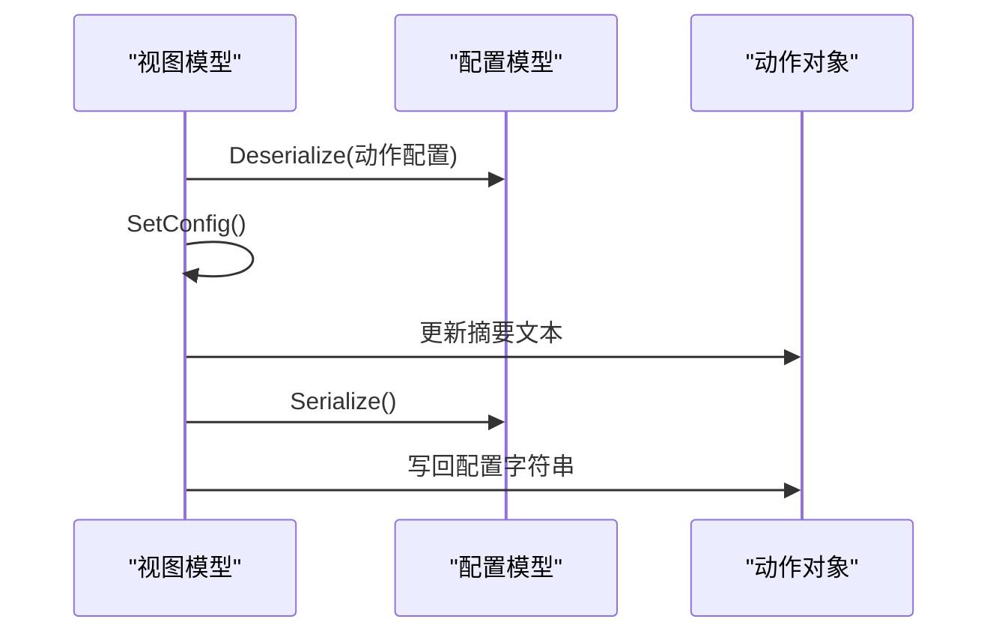
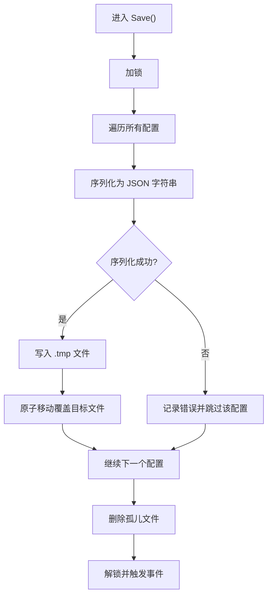
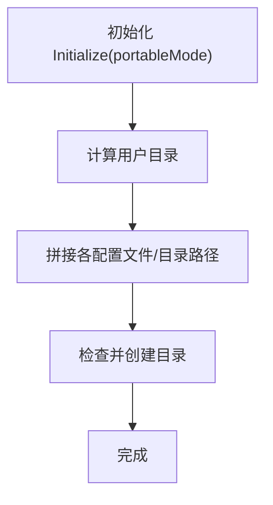
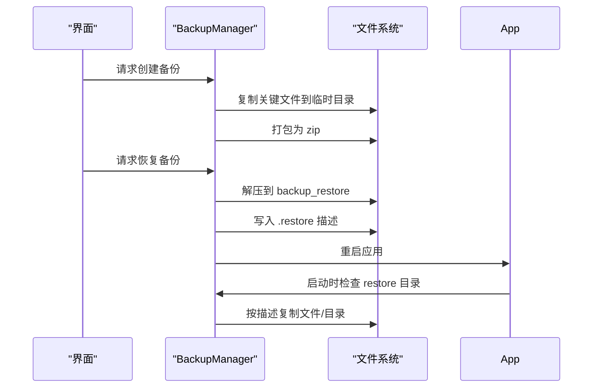
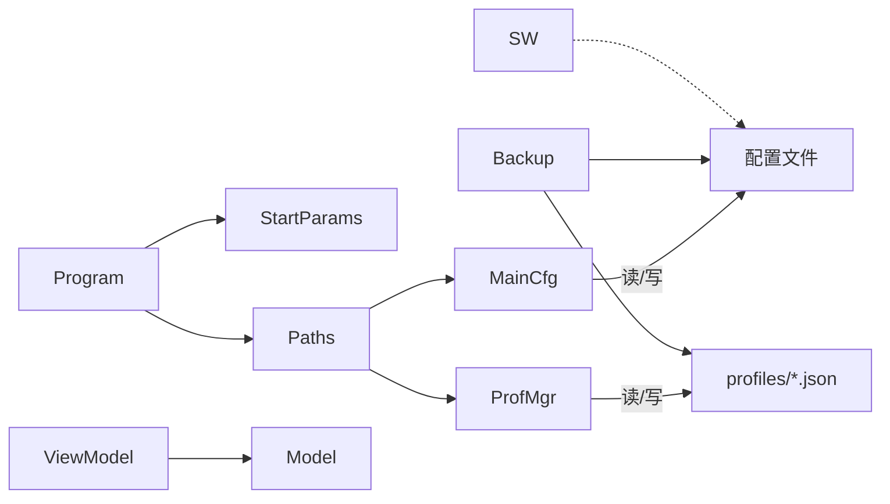

# 配置加载和保存

<cite>
**本文引用的文件**
- [MainConfiguration.cs](file://src/MacroDeck/Configuration/MainConfiguration.cs)
- [ApplicationPaths.cs](file://src/MacroDeck/StartupConfig/ApplicationPaths.cs)
- [ProfileManager.cs](file://src/MacroDeck/Profiles/ProfileManager.cs)
- [ISerializableConfiguration.cs](file://src/MacroDeck/Models/ISerializableConfiguration.cs)
- [SetProfileActionConfigModel.cs](file://src/MacroDeck/InternalPlugins/DevicePlugin/Models/SetProfileActionConfigModel.cs)
- [SetProfileActionConfigViewModel.cs](file://src/MacroDeck/InternalPlugins/DevicePlugin/ViewModels/SetProfileActionConfigViewModel.cs)
- [BackupManager.cs](file://src/MacroDeck/Backup/BackupManager.cs)
- [Program.cs](file://src/MacroDeck/Program.cs)
- [StartParameters.cs](file://src/MacroDeck/StartupConfig/StartParameters.cs)
- [ngsw-worker.js](file://src/MacroDeck/wwwroot/client/ngsw-worker.js)
</cite>

## 目录
1. [简介](#简介)
2. [项目结构](#项目结构)
3. [核心组件](#核心组件)
4. [架构总览](#架构总览)
5. [详细组件分析](#详细组件分析)
6. [依赖关系分析](#依赖关系分析)
7. [性能考虑](#性能考虑)
8. [故障排查指南](#故障排查指南)
9. [结论](#结论)
10. [附录](#附录)

## 简介
本文件系统性梳理 Macro-Deck 的配置加载与保存机制，覆盖以下关键主题：
- 配置文件的读取与写入流程（JSON 反序列化与序列化）
- 存储路径与文件命名规则
- 加载失败时的回退与错误处理策略
- 保存的原子性与并发控制
- 配置文件损坏时的修复与恢复方法
- 配置版本兼容性与迁移策略
- 配置缓存与性能优化
- 开发者扩展与自定义存储后端的指导

## 项目结构
围绕配置与数据持久化的相关模块如下：
- 启动与路径：启动参数解析、应用路径初始化与目录检查
- 主配置：主配置类及其 JSON 序列化/反序列化
- 配置接口：统一可序列化配置接口及模型实现
- 设备/动作配置：具体配置模型与视图模型的序列化与保存
- 配置管理：配置文件的批量保存、原子写入与清理
- 备份与恢复：备份打包、恢复流程与跨组件复制
- 前端缓存：Service Worker 对配置版本的校验与降级

**图表来源**
- [Program.cs:13-35](file://src/MacroDeck/Program.cs#L13-L35)
- [StartParameters.cs:36-55](file://src/MacroDeck/StartupConfig/StartParameters.cs#L36-L55)
- [ApplicationPaths.cs:36-61](file://src/MacroDeck/StartupConfig/ApplicationPaths.cs#L36-L61)
- [MainConfiguration.cs:77-101](file://src/MacroDeck/Configuration/MainConfiguration.cs#L77-L101)
- [ProfileManager.cs:313-380](file://src/MacroDeck/Profiles/ProfileManager.cs#L313-L380)
- [ISerializableConfiguration.cs:5-14](file://src/MacroDeck/Models/ISerializableConfiguration.cs#L5-L14)
- [SetProfileActionConfigModel.cs:6-21](file://src/MacroDeck/InternalPlugins/DevicePlugin/Models/SetProfileActionConfigModel.cs#L6-L21)
- [SetProfileActionConfigViewModel.cs:12-62](file://src/MacroDeck/InternalPlugins/DevicePlugin/ViewModels/SetProfileActionConfigViewModel.cs#L12-L62)
- [BackupManager.cs:270-305](file://src/MacroDeck/Backup/BackupManager.cs#L270-L305)
- [ngsw-worker.js:1615-1625](file://src/MacroDeck/wwwroot/client/ngsw-worker.js#L1615-L1625)

**章节来源**
- [Program.cs:13-35](file://src/MacroDeck/Program.cs#L13-L35)
- [StartParameters.cs:36-55](file://src/MacroDeck/StartupConfig/StartParameters.cs#L36-L55)
- [ApplicationPaths.cs:36-61](file://src/MacroDeck/StartupConfig/ApplicationPaths.cs#L36-L61)

## 核心组件
- 主配置 MainConfiguration：负责应用主要设置的序列化/反序列化与保存；使用 Newtonsoft.Json 进行写入，支持从文件读取并回退到默认实例。
- 配置接口 ISerializableConfiguration：定义统一的 Serialize/Deserialize 模式，便于插件或内部模型遵循一致的序列化契约。
- 配置模型 SetProfileActionConfigModel：实现 ISerializableConfiguration，提供基于 System.Text.Json 的序列化能力。
- 配置视图模型 SetProfileActionConfigViewModel：封装配置编辑与保存逻辑，调用模型的 Serialize 并更新动作摘要。
- 配置管理 ProfileManager：集中管理配置文件的加载、保存、迁移与清理，采用锁与临时文件实现原子写入。
- 应用路径 ApplicationPaths：根据便携模式选择用户目录，生成 config.json、devices.json、variables.db、profiles 目录等路径，并在启动时确保目录存在。
- 备份管理 BackupManager：提供备份打包、恢复流程与跨组件复制，恢复时通过临时目录触发重启以应用变更。

**章节来源**
- [MainConfiguration.cs:77-101](file://src/MacroDeck/Configuration/MainConfiguration.cs#L77-L101)
- [ISerializableConfiguration.cs:5-14](file://src/MacroDeck/Models/ISerializableConfiguration.cs#L5-L14)
- [SetProfileActionConfigModel.cs:6-21](file://src/MacroDeck/InternalPlugins/DevicePlugin/Models/SetProfileActionConfigModel.cs#L6-L21)
- [SetProfileActionConfigViewModel.cs:12-62](file://src/MacroDeck/InternalPlugins/DevicePlugin/ViewModels/SetProfileActionConfigViewModel.cs#L12-L62)
- [ProfileManager.cs:313-380](file://src/MacroDeck/Profiles/ProfileManager.cs#L313-L380)
- [ApplicationPaths.cs:43-61](file://src/MacroDeck/StartupConfig/ApplicationPaths.cs#L43-L61)
- [BackupManager.cs:43-222](file://src/MacroDeck/Backup/BackupManager.cs#L43-L222)

## 架构总览
配置子系统的整体交互如下：

**图表来源**
- [ApplicationPaths.cs:36-61](file://src/MacroDeck/StartupConfig/ApplicationPaths.cs#L36-L61)
- [MainConfiguration.cs:98-101](file://src/MacroDeck/Configuration/MainConfiguration.cs#L98-L101)
- [ProfileManager.cs:205-311](file://src/MacroDeck/Profiles/ProfileManager.cs#L205-L311)
- [ProfileManager.cs:313-380](file://src/MacroDeck/Profiles/ProfileManager.cs#L313-L380)
- [BackupManager.cs:270-267](file://src/MacroDeck/Backup/BackupManager.cs#L270-L267)

## 详细组件分析

### 主配置 MainConfiguration
- 职责：承载应用主要设置项，提供 Save 与 LoadFromFile 方法。
- 序列化：使用 Newtonsoft.Json 的 JsonSerializer 写入 JSON 文件；NullValueHandling.Ignore 用于忽略空值。
- 反序列化：LoadFromFile 使用 JsonConvert.DeserializeObject，若文件为空或解析失败则返回默认实例。
- 错误处理：保存异常被捕获并记录日志；未抛出异常导致 UI 中断。
- 回退策略：反序列化失败时返回新实例，保证应用可用性。

**图表来源**
- [MainConfiguration.cs:98-101](file://src/MacroDeck/Configuration/MainConfiguration.cs#L98-L101)

**章节来源**
- [MainConfiguration.cs:77-101](file://src/MacroDeck/Configuration/MainConfiguration.cs#L77-L101)

### 配置接口与模型 SetProfileActionConfigModel
- 接口 ISerializableConfiguration：定义 Serialize 与受保护的泛型 Deserialize，使用 System.Text.Json。
- 模型 SetProfileActionConfigModel：实现接口，提供 Serialize 与静态 Deserialize，供视图模型使用。
- 优点：统一序列化契约，便于插件与内部模型一致性。

**图表来源**
- [ISerializableConfiguration.cs:5-14](file://src/MacroDeck/Models/ISerializableConfiguration.cs#L5-L14)
- [SetProfileActionConfigModel.cs:6-21](file://src/MacroDeck/InternalPlugins/DevicePlugin/Models/SetProfileActionConfigModel.cs#L6-L21)

**章节来源**
- [ISerializableConfiguration.cs:5-14](file://src/MacroDeck/Models/ISerializableConfiguration.cs#L5-L14)
- [SetProfileActionConfigModel.cs:6-21](file://src/MacroDeck/InternalPlugins/DevicePlugin/Models/SetProfileActionConfigModel.cs#L6-L21)

### 配置视图模型 SetProfileActionConfigViewModel
- 职责：封装配置编辑界面逻辑，调用模型的 Deserialize 初始化，调用 SetConfig 更新摘要并 Serialize 写回。
- 错误处理：保存过程中捕获异常并记录日志，返回布尔值指示是否成功。

**图表来源**
- [SetProfileActionConfigViewModel.cs:34-61](file://src/MacroDeck/InternalPlugins/DevicePlugin/ViewModels/SetProfileActionConfigViewModel.cs#L34-L61)
- [SetProfileActionConfigModel.cs:12-21](file://src/MacroDeck/InternalPlugins/DevicePlugin/Models/SetProfileActionConfigModel.cs#L12-L21)

**章节来源**
- [SetProfileActionConfigViewModel.cs:12-62](file://src/MacroDeck/InternalPlugins/DevicePlugin/ViewModels/SetProfileActionConfigViewModel.cs#L12-L62)

### 配置管理 ProfileManager
- 加载：遍历 profiles 目录下的 JSON 文件，逐个反序列化；遇到错误时记录日志并跳过；若无任何有效配置则创建默认配置并保存。
- 保存：使用 lock(SaveLock) 串行化保存；对每个配置先写入 .tmp 文件，再原子移动覆盖目标文件；删除不再使用的旧文件。
- 迁移：从旧版 SQLite 数据库迁移至 JSON 文件，重命名旧数据库文件。
- 并发控制：全局锁避免多线程同时写入导致冲突；保存完成后触发事件通知外部。

**图表来源**
- [ProfileManager.cs:313-380](file://src/MacroDeck/Profiles/ProfileManager.cs#L313-L380)
- [ProfileManager.cs:382-456](file://src/MacroDeck/Profiles/ProfileManager.cs#L382-L456)

**章节来源**
- [ProfileManager.cs:205-311](file://src/MacroDeck/Profiles/ProfileManager.cs#L205-L311)
- [ProfileManager.cs:313-380](file://src/MacroDeck/Profiles/ProfileManager.cs#L313-L380)
- [ProfileManager.cs:382-456](file://src/MacroDeck/Profiles/ProfileManager.cs#L382-L456)

### 应用路径 ApplicationPaths
- 路径生成：根据便携模式选择用户目录，生成 config.json、devices.json、variables.db、profiles 目录等绝对路径。
- 目录检查：启动时自动创建缺失目录，失败记录日志但不中断启动。
- 便携模式：当 portableMode 为真时，使用程序目录下的 Data 子目录作为用户数据根。

**图表来源**
- [ApplicationPaths.cs:36-61](file://src/MacroDeck/StartupConfig/ApplicationPaths.cs#L36-L61)
- [ApplicationPaths.cs:64-102](file://src/MacroDeck/StartupConfig/ApplicationPaths.cs#L64-L102)

**章节来源**
- [ApplicationPaths.cs:36-61](file://src/MacroDeck/StartupConfig/ApplicationPaths.cs#L36-L61)
- [ApplicationPaths.cs:64-102](file://src/MacroDeck/StartupConfig/ApplicationPaths.cs#L64-L102)

### 备份与恢复 BackupManager
- 备份：将 config.json、devices.json、variables.db、profiles 目录、插件目录、插件配置与凭据、图标包等打包为 zip。
- 恢复：解压到临时目录 backup_restore，写入 .restore 描述文件，然后重启应用以执行恢复流程。
- 恢复流程：按 .restore 描述复制对应文件/目录，成功后提示用户。

**图表来源**
- [BackupManager.cs:270-305](file://src/MacroDeck/Backup/BackupManager.cs#L270-L305)
- [BackupManager.cs:224-267](file://src/MacroDeck/Backup/BackupManager.cs#L224-L267)
- [BackupManager.cs:43-222](file://src/MacroDeck/Backup/BackupManager.cs#L43-L222)

**章节来源**
- [BackupManager.cs:270-305](file://src/MacroDeck/Backup/BackupManager.cs#L270-L305)
- [BackupManager.cs:224-267](file://src/MacroDeck/Backup/BackupManager.cs#L224-L267)
- [BackupManager.cs:43-222](file://src/MacroDeck/Backup/BackupManager.cs#L43-L222)

### 前端缓存与配置版本校验
- Service Worker 在初始化时校验前端配置版本，若不匹配则清空缓存并注销注册，防止因版本不一致导致的运行时问题。

**章节来源**
- [ngsw-worker.js:1615-1625](file://src/MacroDeck/wwwroot/client/ngsw-worker.js#L1615-L1625)

## 依赖关系分析
- 组件耦合：
  - Program 与 StartParameters、ApplicationPaths 协作完成路径初始化与日志配置。
  - MainConfiguration 与 ApplicationPaths 的 MainConfigFilePath 配合使用。
  - ProfileManager 依赖 ApplicationPaths 的 ProfilesDirectoryPath 与 Legacy 数据库路径。
  - SetProfileActionConfigViewModel 依赖 SetProfileActionConfigModel 实现序列化。
  - BackupManager 依赖 ApplicationPaths 的多个路径进行打包与恢复。
- 外部依赖：
  - Newtonsoft.Json 用于主配置与配置管理的序列化/反序列化。
  - System.Text.Json 用于 ISerializableConfiguration 的通用序列化。
  - Serilog 用于统一日志记录。

**图表来源**
- [Program.cs:25-34](file://src/MacroDeck/Program.cs#L25-L34)
- [StartParameters.cs:36-55](file://src/MacroDeck/StartupConfig/StartParameters.cs#L36-L55)
- [ApplicationPaths.cs:56-60](file://src/MacroDeck/StartupConfig/ApplicationPaths.cs#L56-L60)
- [MainConfiguration.cs:98-101](file://src/MacroDeck/Configuration/MainConfiguration.cs#L98-L101)
- [ProfileManager.cs:313-380](file://src/MacroDeck/Profiles/ProfileManager.cs#L313-L380)
- [SetProfileActionConfigViewModel.cs:34-61](file://src/MacroDeck/InternalPlugins/DevicePlugin/ViewModels/SetProfileActionConfigViewModel.cs#L34-L61)
- [SetProfileActionConfigModel.cs:12-21](file://src/MacroDeck/InternalPlugins/DevicePlugin/Models/SetProfileActionConfigModel.cs#L12-L21)
- [BackupManager.cs:270-305](file://src/MacroDeck/Backup/BackupManager.cs#L270-L305)

**章节来源**
- [Program.cs:25-34](file://src/MacroDeck/Program.cs#L25-L34)
- [ApplicationPaths.cs:56-60](file://src/MacroDeck/StartupConfig/ApplicationPaths.cs#L56-L60)
- [ProfileManager.cs:313-380](file://src/MacroDeck/Profiles/ProfileManager.cs#L313-L380)

## 性能考虑
- ProfileManager 保存采用“写 .tmp 再原子移动”的方式，避免部分写入导致的文件损坏风险，同时减少磁盘碎片与多次写入开销。
- 全局 SaveLock 将保存过程串行化，降低并发写入带来的竞争与崩溃概率。
- 加载阶段对单个文件解析失败进行局部跳过与日志记录，避免影响整体加载。
- ApplicationPaths 在启动时一次性创建所需目录，减少后续 IO 异常。
- 前端 Service Worker 的配置版本校验可避免缓存污染，间接提升前端稳定性。

[本节为通用性能讨论，无需列出章节来源]

## 故障排查指南
- 配置文件无法读取/解析
  - 现象：主配置加载返回默认值，或配置管理加载失败。
  - 排查：检查 config.json/devices.json 是否存在且格式正确；查看日志中反序列化错误信息。
  - 处理：使用备份恢复功能还原配置；或手动修复 JSON 格式。
- 配置保存失败
  - 现象：保存日志报错，但 UI 未提示。
  - 排查：确认目标路径权限；检查磁盘空间；查看日志中的异常堆栈。
  - 处理：等待下次自动保存；或手动复制 .tmp 到目标文件名以完成原子写入。
- 配置损坏或版本不兼容
  - 现象：ProfileManager 加载失败或出现异常。
  - 排查：查看 profiles 目录下 JSON 文件是否完整；检查迁移日志。
  - 处理：使用 BackupManager 恢复到上一个备份；或从备份中提取 JSON 文件替换当前文件。
- 前端缓存导致异常
  - 现象：前端资源加载异常或行为异常。
  - 排查：检查 Service Worker 的配置版本校验日志。
  - 处理：清除浏览器缓存或等待 Service Worker 自动注销与重建。

**章节来源**
- [MainConfiguration.cs:98-101](file://src/MacroDeck/Configuration/MainConfiguration.cs#L98-L101)
- [ProfileManager.cs:205-311](file://src/MacroDeck/Profiles/ProfileManager.cs#L205-L311)
- [ProfileManager.cs:313-380](file://src/MacroDeck/Profiles/ProfileManager.cs#L313-L380)
- [BackupManager.cs:43-222](file://src/MacroDeck/Backup/BackupManager.cs#L43-L222)
- [ngsw-worker.js:1615-1625](file://src/MacroDeck/wwwroot/client/ngsw-worker.js#L1615-L1625)

## 结论
Macro-Deck 的配置系统通过明确的职责划分与稳健的错误处理策略，实现了高可靠性的配置加载与保存。主配置与配置管理分别承担应用设置与用户配置的持久化，配合原子写入与并发控制，显著降低了数据损坏风险。备份与恢复机制进一步增强了容灾能力。前端 Service Worker 的配置版本校验则保障了前端资源的一致性与安全性。对于开发者而言，遵循 ISerializableConfiguration 接口与 ProfileManager 的保存模式，即可快速扩展新的配置类型并保持一致的可靠性与性能表现。

[本节为总结性内容，无需列出章节来源]

## 附录

### 配置文件存储路径与命名规则
- 主配置：config.json（位于用户目录）
- 设备配置：devices.json（位于用户目录）
- 变量存储：variables.db（SQLite 文件，位于用户目录）
- 配置目录：profiles（位于用户目录），每个配置文件以配置 ID 命名，如 xxxxxxxx-xxxx-xxxx-xxxx-xxxxxxxxxxxx.json
- 便携模式：用户目录位于程序目录下的 Data 子目录

**章节来源**
- [ApplicationPaths.cs:43-61](file://src/MacroDeck/StartupConfig/ApplicationPaths.cs#L43-L61)

### 配置加载失败的回退机制
- 主配置：反序列化失败时返回默认实例，确保应用可用。
- 配置管理：单个配置文件解析失败时记录日志并跳过，继续加载其他文件；若无任何有效配置，则创建默认配置并保存。

**章节来源**
- [MainConfiguration.cs:98-101](file://src/MacroDeck/Configuration/MainConfiguration.cs#L98-L101)
- [ProfileManager.cs:205-311](file://src/MacroDeck/Profiles/ProfileManager.cs#L205-L311)

### 配置保存的原子性与并发控制
- 原子性：先写入 .tmp 文件，再以覆盖方式移动到目标文件，避免部分写入。
- 并发控制：使用全局锁串行化保存，防止多线程同时写入。
- 清理：删除不再使用的孤儿文件，保持目录整洁。

**章节来源**
- [ProfileManager.cs:313-380](file://src/MacroDeck/Profiles/ProfileManager.cs#L313-L380)

### 配置文件损坏时的修复与恢复
- 使用 BackupManager 创建/恢复备份，恢复时通过临时目录写入 .restore 描述并重启应用，由恢复流程复制对应文件/目录。

**章节来源**
- [BackupManager.cs:224-267](file://src/MacroDeck/Backup/BackupManager.cs#L224-L267)
- [BackupManager.cs:43-222](file://src/MacroDeck/Backup/BackupManager.cs#L43-L222)

### 配置版本兼容性与迁移策略
- 配置版本校验：前端 Service Worker 在初始化时校验配置版本，不匹配则清空缓存并注销注册。
- 数据库迁移：从旧版 SQLite profiles.db 迁移到 JSON 文件，迁移后重命名旧数据库文件。

**章节来源**
- [ngsw-worker.js:1615-1625](file://src/MacroDeck/wwwroot/client/ngsw-worker.js#L1615-L1625)
- [ProfileManager.cs:382-456](file://src/MacroDeck/Profiles/ProfileManager.cs#L382-L456)

### 配置缓存机制与性能优化
- 前端缓存：Service Worker 管理资源缓存与 LRU，结合 maxAge/maxSize 控制缓存生命周期与容量。
- 应用层缓存：ProfileManager 在内存中维护配置集合，避免频繁 IO；保存时采用原子写入与孤儿文件清理。

**章节来源**
- [ProfileManager.cs:313-380](file://src/MacroDeck/Profiles/ProfileManager.cs#L313-L380)
- [ngsw-worker.js:641-860](file://src/MacroDeck/wwwroot/client/ngsw-worker.js#L641-L860)

### 开发者扩展与自定义存储后端指导
- 遵循 ISerializableConfiguration 接口：实现 Serialize 与 Deserialize，确保与现有序列化模式一致。
- 使用 ProfileManager 的保存模式：先写 .tmp 再移动，必要时参考其错误处理与日志记录。
- 自定义存储后端：可在应用层引入新的存储介质（如数据库、云存储），但需提供与现有 JSON 文件等价的读写接口与迁移工具，并在 ApplicationPaths 中注册相应路径。

**章节来源**
- [ISerializableConfiguration.cs:5-14](file://src/MacroDeck/Models/ISerializableConfiguration.cs#L5-L14)
- [SetProfileActionConfigModel.cs:6-21](file://src/MacroDeck/InternalPlugins/DevicePlugin/Models/SetProfileActionConfigModel.cs#L6-L21)
- [ProfileManager.cs:313-380](file://src/MacroDeck/Profiles/ProfileManager.cs#L313-L380)