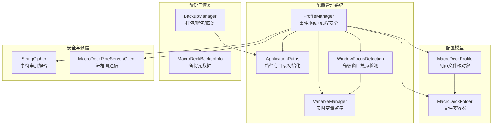
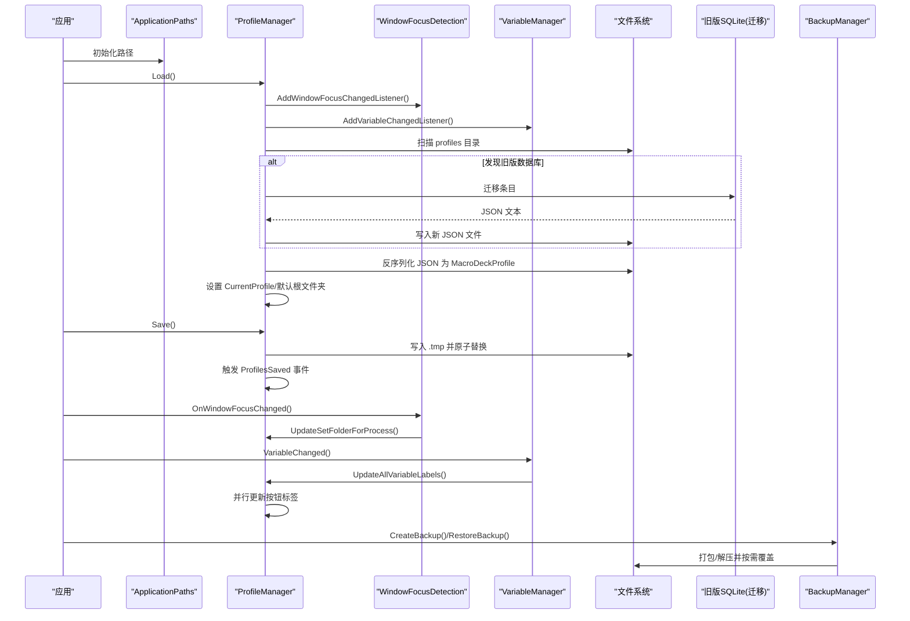
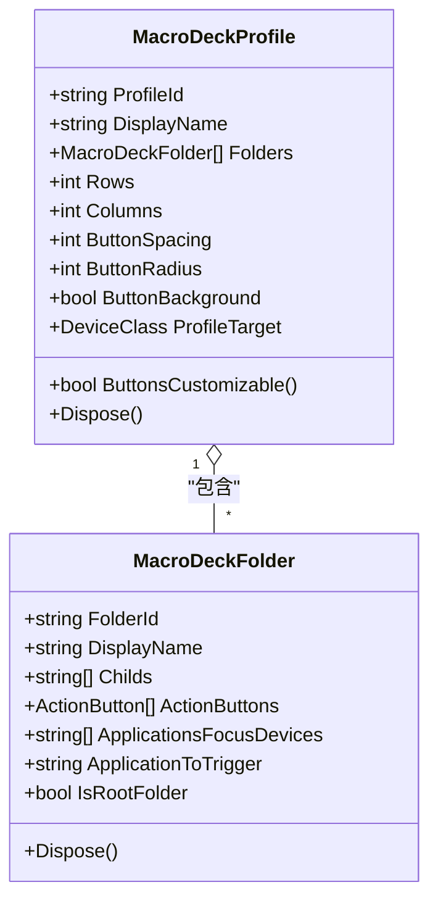
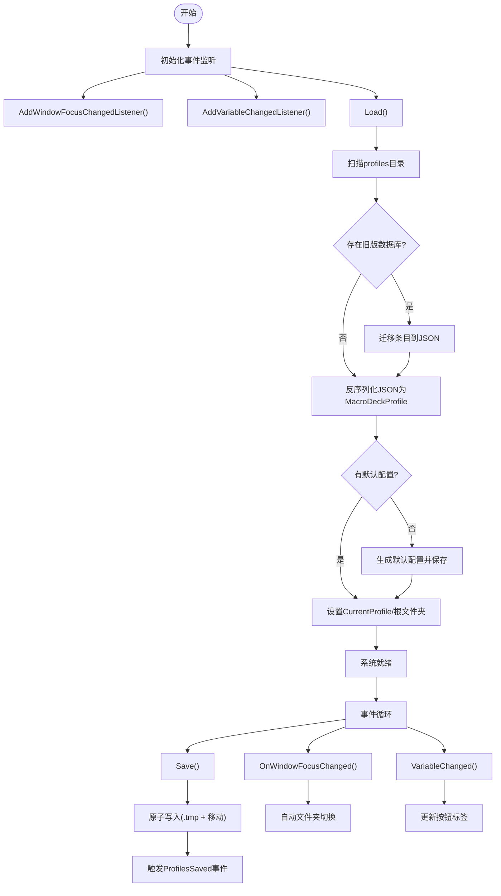
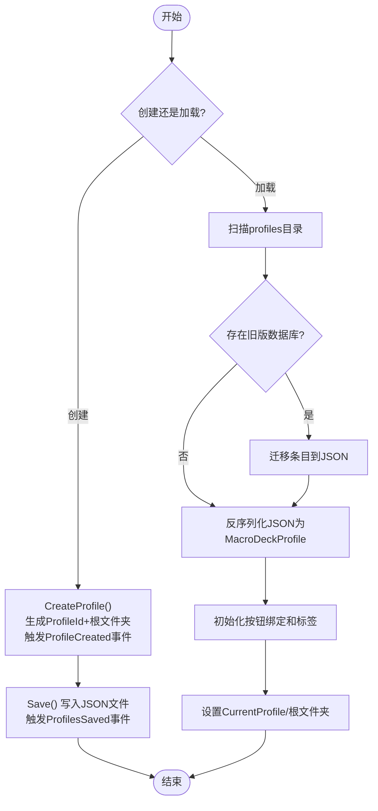
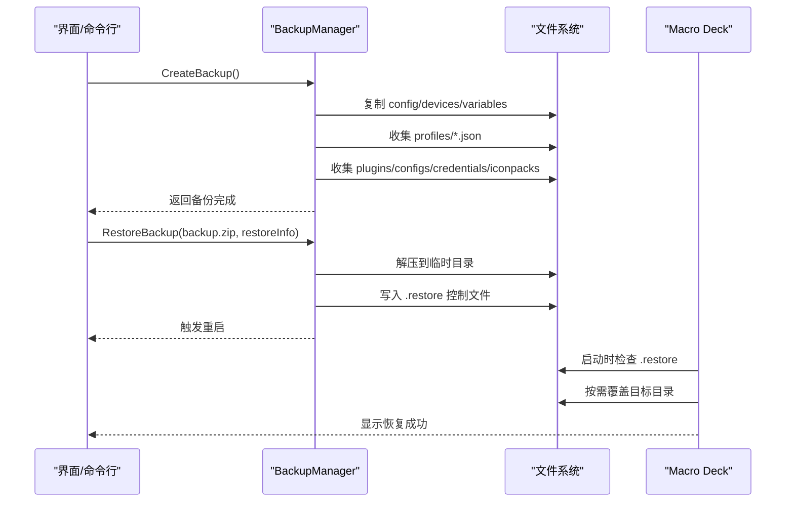
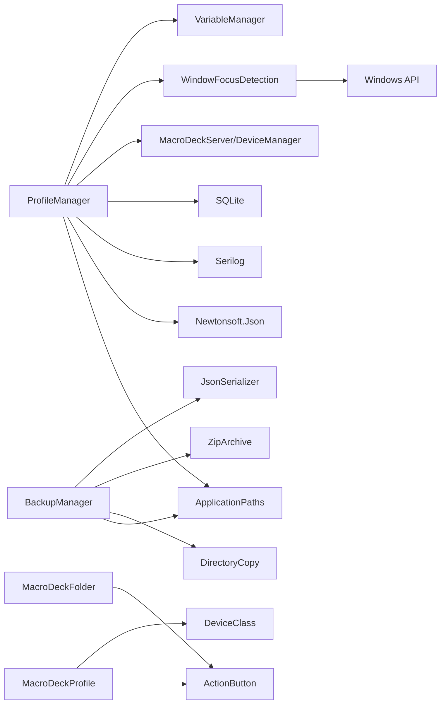

# 配置文件管理

<cite>
**本文引用的文件**
- [MacroDeckProfile.cs](file://src/MacroDeck/Profiles/MacroDeckProfile.cs)
- [ProfileManager.cs](file://src/MacroDeck/Profiles/ProfileManager.cs)
- [MacroDeckFolder.cs](file://src/MacroDeck/Folders/MacroDeckFolder.cs)
- [ProfileJson.cs](file://src/MacroDeck/JSON/ProfileJson.cs)
- [BackupManager.cs](file://src/MacroDeck/Backup/BackupManager.cs)
- [MacroDeckBackupInfo.cs](file://src/MacroDeck/Backup/MacroDeckBackupInfo.cs)
- [ApplicationPaths.cs](file://src/MacroDeck/StartupConfig/ApplicationPaths.cs)
- [StringCipher.cs](file://src/MacroDeck/Utils/StringCipher.cs)
- [MacroDeckPipeServer.cs](file://src/MacroDeck/Pipe/MacroDeckPipeServer.cs)
- [MacroDeckPipeClient.cs](file://src/MacroDeck/Pipe/MacroDeckPipeClient.cs)
- [WindowFocusDetection.cs](file://src/MacroDeck/WindowFocus/WindowFocusDetection.cs)
- [VariableManager.cs](file://src/MacroDeck/Variables/VariableManager.cs)
</cite>

## 更新摘要
**变更内容**
- ProfileManager 从简单工具类重构为完整的配置管理系统
- 新增事件驱动架构（ProfilesSaved 和 ProfileCreated 事件）
- 引入线程安全并发操作（使用锁和并发字典）
- 集成高级窗口焦点检测能力
- 实现自动文件夹切换基于活动窗口进程
- 添加实时变量监控用于动态按钮标签更新
- 完善 CRUD 操作支持

## 目录
1. [简介](#简介)
2. [项目结构](#项目结构)
3. [核心组件](#核心组件)
4. [架构总览](#架构总览)
5. [组件详细分析](#组件详细分析)
6. [依赖关系分析](#依赖关系分析)
7. [性能与可靠性](#性能与可靠性)
8. [故障排查指南](#故障排查指南)
9. [结论](#结论)
10. [附录：扩展与自定义开发指南](#附录扩展与自定义开发指南)

## 简介
本文件系统化梳理 Macro-Deck 的配置文件管理能力，重点围绕重构后的 ProfileManager 完整配置管理系统、MacroDeckProfile 数据模型、配置项组织结构、创建/加载/保存/删除流程、版本迁移与兼容性、导入导出与格式转换、备份与恢复、安全存储（含加密）、以及批量与自动化管理等主题展开，并为开发者提供扩展与自定义配置格式的实践指导。

## 项目结构
配置文件管理涉及以下关键模块：
- 配置模型层：MacroDeckProfile、MacroDeckFolder
- 配置管理器：ProfileManager（重构为完整的配置管理系统）
- 窗口焦点检测：WindowFocusDetection（高级窗口焦点检测）
- 变量管理：VariableManager（实时变量监控）
- 路径与环境：ApplicationPaths（统一管理用户目录、配置文件路径）
- 备份与恢复：BackupManager（打包/解包、恢复流程）
- 工具与安全：StringCipher（字符串加解密工具）
- 进程间通信：MacroDeckPipeServer/Client（用于跨进程同步与自动化）

**图表来源**
- [ProfileManager.cs:25-795](file://src/MacroDeck/Profiles/ProfileManager.cs#L25-L795)
- [WindowFocusDetection.cs:7-112](file://src/MacroDeck/WindowFocus/WindowFocusDetection.cs#L7-L112)
- [VariableManager.cs:10-248](file://src/MacroDeck/Variables/VariableManager.cs#L10-L248)

**章节来源**
- [MacroDeckProfile.cs:1-75](file://src/MacroDeck/Profiles/MacroDeckProfile.cs#L1-L75)
- [MacroDeckFolder.cs:1-99](file://src/MacroDeck/Folders/MacroDeckFolder.cs#L1-L99)
- [ProfileManager.cs:25-795](file://src/MacroDeck/Profiles/ProfileManager.cs#L25-L795)
- [ApplicationPaths.cs:1-143](file://src/MacroDeck/StartupConfig/ApplicationPaths.cs#L1-L143)
- [BackupManager.cs:1-380](file://src/MacroDeck/Backup/BackupManager.cs#L1-L380)
- [MacroDeckBackupInfo.cs:1-9](file://src/MacroDeck/Backup/MacroDeckBackupInfo.cs#L1-L9)

## 核心组件
- 配置文件根对象：MacroDeckProfile
  - 关键属性：ProfileId、DisplayName、Folders、Rows、Columns、ButtonSpacing、ButtonRadius、ButtonBackground、ProfileTarget、ButtonsCustomizable
  - 生命周期：实现 IDisposable，释放托管与非托管资源
- 文件夹容器：MacroDeckFolder
  - 关键属性：FolderId、DisplayName、Childs（子文件夹 ID 列表）、ActionButtons（按钮集合）、ApplicationsFocusDevices（触发设备列表）、ApplicationToTrigger（触发应用名）
  - 根文件夹标识：IsRootFolder
  - 生命周期：实现 IDisposable，释放内部 ActionButton 资源
- **重构后的配置管理器**：ProfileManager
  - **事件驱动架构**：暴露 ProfilesSaved（所有配置文件保存完成后触发）、ProfileCreated（新配置文件创建完成后触发）事件
  - **线程安全并发操作**：使用 SaveLock 互斥锁保护保存操作，使用 ConcurrentDictionary 存储历史记录
  - **高级窗口焦点检测**：集成 WindowFocusDetection 实现实时进程检测和自动文件夹切换
  - **实时变量监控**：监听 VariableManager.OnVariableChanged 事件，动态更新按钮标签
  - **完整的 CRUD 操作**：创建/删除配置、创建/删除文件夹、查找按钮、按名称或 ID 查找
  - **加载与保存**：扫描 profiles 目录，反序列化 JSON；若无文件则生成默认配置；支持从旧版 SQLite 数据库迁移
- 路径与环境：ApplicationPaths
  - 统一管理用户目录、插件、备份、日志、图标包、临时目录、主配置、设备、变量、配置文件、旧版数据库、配置文件目录等
- 备份与恢复：BackupManager
  - 打包：将 config.json、devices.json、variables.db、profiles/*.json、插件、插件配置、插件凭据、图标包等打包为 zip
  - 恢复：解压到临时目录，读取 .restore 控制项，选择性覆盖目标目录，重启应用执行恢复
- 安全与通信：StringCipher、MacroDeckPipeServer/Client
  - 字符串加解密：用于敏感配置字段的安全存储
  - 进程间通信：用于自动化脚本与服务端交互，支持批量操作与远程控制

**章节来源**
- [MacroDeckProfile.cs:7-75](file://src/MacroDeck/Profiles/MacroDeckProfile.cs#L7-L75)
- [MacroDeckFolder.cs:11-99](file://src/MacroDeck/Folders/MacroDeckFolder.cs#L11-L99)
- [ProfileManager.cs:25-795](file://src/MacroDeck/Profiles/ProfileManager.cs#L25-L795)
- [ApplicationPaths.cs:36-102](file://src/MacroDeck/StartupConfig/ApplicationPaths.cs#L36-L102)
- [BackupManager.cs:270-361](file://src/MacroDeck/Backup/BackupManager.cs#L270-L361)
- [BackupManager.cs:224-267](file://src/MacroDeck/Backup/BackupManager.cs#L224-L267)
- [StringCipher.cs](file://src/MacroDeck/Utils/StringCipher.cs)
- [MacroDeckPipeServer.cs](file://src/MacroDeck/Pipe/MacroDeckPipeServer.cs)
- [MacroDeckPipeClient.cs](file://src/MacroDeck/Pipe/MacroDeckPipeClient.cs)

## 架构总览
配置文件管理采用"模型-管理器-路径-备份-安全"的分层设计，经过重构后增加了事件驱动和实时监控能力：
- 模型层：以 JSON 序列化为核心，通过 Newtonsoft.Json 支持类型名自动处理与循环引用忽略
- 管理层：重构后的 ProfileManager 提供集中式 CRUD、迁移、校验与事件通知，支持线程安全并发操作
- 监控层：集成 WindowFocusDetection 实现高级窗口焦点检测，VariableManager 实现实时变量监控
- 存储层：ApplicationPaths 统一路径，ProfileManager 将每个配置以独立 JSON 文件持久化
- 备份层：BackupManager 以 zip 归档多类配置与数据，支持选择性恢复
- 安全层：StringCipher 提供可选的敏感字段加密存储，结合进程间通信实现自动化场景下的安全传输

**图表来源**
- [ProfileManager.cs:286-392](file://src/MacroDeck/Profiles/ProfileManager.cs#L286-L392)
- [ProfileManager.cs:399-466](file://src/MacroDeck/Profiles/ProfileManager.cs#L399-L466)
- [ProfileManager.cs:113-186](file://src/MacroDeck/Profiles/ProfileManager.cs#L113-L186)
- [ProfileManager.cs:194-280](file://src/MacroDeck/Profiles/ProfileManager.cs#L194-L280)
- [WindowFocusDetection.cs:77-111](file://src/MacroDeck/WindowFocus/WindowFocusDetection.cs#L77-L111)
- [VariableManager.cs:54-138](file://src/MacroDeck/Variables/VariableManager.cs#L54-L138)

## 组件详细分析

### 配置文件数据模型：MacroDeckProfile 与 MacroDeckFolder
- MacroDeckProfile
  - 标识与显示：ProfileId、DisplayName
  - 结构与布局：Folders、Rows、Columns、ButtonSpacing、ButtonRadius、ButtonBackground
  - 设备目标：ProfileTarget、ButtonsCustomizable（依据设备类型决定是否允许按钮自定义）
  - 资源管理：构造时分配非托管缓冲区，Dispose 时释放
- MacroDeckFolder
  - 层级结构：FolderId、DisplayName、Childs（子文件夹 ID 列表）
  - 行为绑定：ActionButtons（按钮集合）、ApplicationsFocusDevices（触发设备）、ApplicationToTrigger（触发应用）
  - 根文件夹判定：IsRootFolder
  - 资源管理：构造时分配非托管缓冲区，Dispose 时释放内部 ActionButton

**图表来源**
- [MacroDeckProfile.cs:49-75](file://src/MacroDeck/Profiles/MacroDeckProfile.cs#L49-L75)
- [MacroDeckFolder.cs:81-99](file://src/MacroDeck/Folders/MacroDeckFolder.cs#L81-L99)

**章节来源**
- [MacroDeckProfile.cs:7-75](file://src/MacroDeck/Profiles/MacroDeckProfile.cs#L7-L75)
- [MacroDeckFolder.cs:11-99](file://src/MacroDeck/Folders/MacroDeckFolder.cs#L11-L99)

### 重构后的配置管理系统：ProfileManager 的完整功能
- **事件驱动架构**
  - ProfilesSaved 事件：在所有配置文件保存完成后触发，通知订阅者刷新 UI 或执行后续操作
  - ProfileCreated 事件：在新配置文件创建完成后触发，通知订阅者（如设备管理器）进行初始化
- **线程安全并发操作**
  - SaveLock 互斥锁：确保同一时间只有一个写操作在进行，防止并发写入导致 JSON 文件损坏
  - ConcurrentDictionary History：键为客户端，值为（上一个文件夹, 触发此切换的进程名），用于窗口焦点离开应用时恢复到之前的文件夹状态
- **高级窗口焦点检测**
  - WindowFocusDetection 集成：通过轮询当前活动窗口来触发焦点切换逻辑
  - 自动文件夹切换：根据前台窗口进程名称自动切换设备客户端所显示的文件夹
- **实时变量监控**
  - VariableManager 集成：监听 VariableManager.OnVariableChanged 事件，自动更新所有引用该变量的按钮标签
  - 动态标签更新：遍历所有配置文件->文件夹->按钮，筛选出包含变量名的按钮，然后并行更新它们的标签图像
- **完整的 CRUD 操作**
  - 创建：CreateProfile、CreateFolder
  - 删除：DeleteProfile、DeleteFolder
  - 查找：FindProfileById、FindProfileByDisplayName、FindFolderById、FindFolderByDisplayName、FindActionButton
- **加载与保存**
  - Load：扫描 profiles 目录，反序列化 JSON；若无文件则生成默认配置；支持从旧版 SQLite 迁移
  - Save：并发锁保护；逐个序列化为 JSON，写入 .tmp 后原子替换；清理孤儿文件

**图表来源**
- [ProfileManager.cs:82-117](file://src/MacroDeck/Profiles/ProfileManager.cs#L82-L117)
- [ProfileManager.cs:68-71](file://src/MacroDeck/Profiles/ProfileManager.cs#L68-L71)
- [ProfileManager.cs:286-392](file://src/MacroDeck/Profiles/ProfileManager.cs#L286-L392)
- [ProfileManager.cs:399-466](file://src/MacroDeck/Profiles/ProfileManager.cs#L399-L466)
- [ProfileManager.cs:113-186](file://src/MacroDeck/Profiles/ProfileManager.cs#L113-L186)
- [ProfileManager.cs:194-280](file://src/MacroDeck/Profiles/ProfileManager.cs#L194-L280)

**章节来源**
- [ProfileManager.cs:25-795](file://src/MacroDeck/Profiles/ProfileManager.cs#L25-L795)

### 配置文件生命周期：创建、加载、保存、删除
- 创建
  - ProfileManager.CreateProfile：生成唯一 ProfileId，创建根文件夹，加入 Profiles，立即保存并触发 ProfileCreated 事件
  - ProfileManager.CreateFolder：在指定父文件夹下创建子文件夹，更新父节点 Childs，保存
- 加载
  - ProfileManager.Load：扫描 profiles 目录，反序列化 JSON；若无文件则生成默认配置；支持从旧版 SQLite 迁移
  - 迁移逻辑：读取旧数据库条目，反序列化为 MacroDeckProfile，写入新 JSON 文件，重命名旧数据库
  - 初始化：设置 CurrentProfile、根文件夹、按钮绑定状态、标签初始化
- 保存
  - ProfileManager.Save：并发锁保护；逐个序列化为 JSON，写入 .tmp 后原子替换；清理孤儿文件；触发 ProfilesSaved 事件
- 删除
  - ProfileManager.DeleteProfile：校验数量、解除设备绑定、释放资源、保存
  - ProfileManager.DeleteFolder：递归删除子文件夹、重置在线客户端所在文件夹、保存

**图表来源**
- [ProfileManager.cs:653-699](file://src/MacroDeck/Profiles/ProfileManager.cs#L653-L699)
- [ProfileManager.cs:286-392](file://src/MacroDeck/Profiles/ProfileManager.cs#L286-L392)
- [ProfileManager.cs:399-466](file://src/MacroDeck/Profiles/ProfileManager.cs#L399-L466)

**章节来源**
- [ProfileManager.cs:653-699](file://src/MacroDeck/Profiles/ProfileManager.cs#L653-L699)
- [ProfileManager.cs:609-650](file://src/MacroDeck/Profiles/ProfileManager.cs#L609-L650)
- [ProfileManager.cs:286-392](file://src/MacroDeck/Profiles/ProfileManager.cs#L286-L392)
- [ProfileManager.cs:399-466](file://src/MacroDeck/Profiles/ProfileManager.cs#L399-L466)

### 版本管理与兼容性
- 旧版数据库迁移：当检测到旧版 SQLite 数据库且当前 profiles 目录为空时，读取条目，反序列化为 MacroDeckProfile，写入新 JSON 文件，并将旧数据库重命名为已迁移状态
- 类型兼容：Newtonsoft.Json 的 TypeNameHandling.Auto 自动处理类型信息，避免跨版本类型不匹配导致的反序列化失败
- 循环引用处理：ReferenceLoopHandling.Ignore 避免复杂对象图导致的序列化异常
- 空值处理：NullValueHandling.Ignore 减少冗余字段

**章节来源**
- [ProfileManager.cs:468-547](file://src/MacroDeck/Profiles/ProfileManager.cs#L468-L547)
- [ProfileJson.cs:1-11](file://src/MacroDeck/JSON/ProfileJson.cs#L1-L11)

### 导入导出与格式转换
- 当前实现
  - 导入：通过 ProfileManager.Load 扫描并反序列化 JSON 文件；旧版数据库迁移作为一次性导入
  - 导出：通过 BackupManager.CreateBackup 将 profiles/*.json 与其他配置打包为 zip
- 格式转换建议
  - 若需支持其他格式（如 YAML），可在 ProfileManager 中增加对应转换器，保持 MacroDeckProfile 为中心模型，先转换为该模型，再进行序列化
  - 对于二进制格式，建议保留 JSON 作为人类可读的参考格式，二进制仅用于高性能场景

**章节来源**
- [ProfileManager.cs:286-392](file://src/MacroDeck/Profiles/ProfileManager.cs#L286-L392)
- [ProfileManager.cs:270-361](file://src/MacroDeck/Backup/BackupManager.cs#L270-L361)

### 备份与恢复机制
- 备份内容
  - 主配置：config.json
  - 设备：devices.json
  - 变量：variables.db
  - 配置文件：profiles/*.json
  - 插件：plugins 目录树
  - 插件配置：configs 目录
  - 插件凭据：credentials 目录
  - 图标包：iconpacks 目录树
- 备份流程
  - CreateBackup：复制必要文件到临时目录，调用 CreateBackup(...) 添加各目录/文件到 zip，最终落盘
- 恢复流程
  - RestoreBackup：解压到临时目录，写入 .restore 控制文件，重启应用；应用启动后检查 .restore 并按需覆盖目标目录

**图表来源**
- [BackupManager.cs:270-361](file://src/MacroDeck/Backup/BackupManager.cs#L270-L361)
- [BackupManager.cs:224-267](file://src/MacroDeck/Backup/BackupManager.cs#L224-L267)
- [MacroDeckBackupInfo.cs:3-9](file://src/MacroDeck/Backup/MacroDeckBackupInfo.cs#L3-L9)

**章节来源**
- [BackupManager.cs:270-361](file://src/MacroDeck/Backup/BackupManager.cs#L270-L361)
- [BackupManager.cs:224-267](file://src/MacroDeck/Backup/BackupManager.cs#L224-L267)
- [MacroDeckBackupInfo.cs:1-9](file://src/MacroDeck/Backup/MacroDeckBackupInfo.cs#L1-L9)

### 加密与安全存储
- 敏感字段加密
  - 使用 StringCipher 提供对字符串的加解密能力，可用于存储敏感配置（如令牌、密码）字段
  - 建议仅对必要字段加密，避免影响序列化性能
- 访问控制
  - ApplicationPaths 统一管理用户目录，确保配置文件位于受控位置
  - 备份文件建议使用系统级权限保护，避免被普通用户读取
- 传输安全
  - 通过 MacroDeckPipeServer/Client 实现进程间通信，可在自动化场景中安全传递配置片段

**章节来源**
- [StringCipher.cs](file://src/MacroDeck/Utils/StringCipher.cs)
- [ApplicationPaths.cs:36-102](file://src/MacroDeck/StartupConfig/ApplicationPaths.cs#L36-L102)
- [MacroDeckPipeServer.cs](file://src/MacroDeck/Pipe/MacroDeckPipeServer.cs)
- [MacroDeckPipeClient.cs](file://src/MacroDeck/Pipe/MacroDeckPipeClient.cs)

### 批量操作与自动化管理
- 批量创建/删除配置
  - 通过 ProfileManager.CreateProfile/DeleteProfile 在代码层面批量管理
- 批量文件夹操作
  - CreateFolder/DeleteFolder 支持树形结构的批量维护
- 自动化脚本
  - 使用 MacroDeckPipeServer/Client 与外部脚本交互，实现自动化部署、切换配置、触发动作等
- **事件驱动集成**
  - ProfileManager 暴露 ProfilesSaved、ProfileCreated 等事件，便于自动化流程集成
  - 窗口焦点变化和变量变化事件自动触发相应的配置文件管理操作

**章节来源**
- [ProfileManager.cs:653-699](file://src/MacroDeck/Profiles/ProfileManager.cs#L653-L699)
- [ProfileManager.cs:609-650](file://src/MacroDeck/Profiles/ProfileManager.cs#L609-L650)
- [ProfileManager.cs:286-392](file://src/MacroDeck/Profiles/ProfileManager.cs#L286-L392)
- [MacroDeckPipeServer.cs](file://src/MacroDeck/Pipe/MacroDeckPipeServer.cs)
- [MacroDeckPipeClient.cs](file://src/MacroDeck/Pipe/MacroDeckPipeClient.cs)

## 依赖关系分析
- 组件耦合
  - ProfileManager 依赖 ApplicationPaths（路径）、Newtonsoft.Json（序列化）、Serilog（日志）、SQLite（迁移）、MacroDeckServer/DeviceManager（设备联动）、WindowFocusDetection（窗口焦点检测）、VariableManager（变量监控）
  - MacroDeckProfile/MacroDeckFolder 依赖 ActionButton（按钮模型）、DeviceClass（设备类型）
  - BackupManager 依赖 ApplicationPaths、DirectoryCopy、ZipArchive、JsonSerializer
- 外部依赖
  - Newtonsoft.Json：类型名自动处理、错误回调、循环引用忽略
  - SQLite：旧版数据库迁移
  - System.IO/Compression：备份打包与解包
  - Windows API：窗口焦点检测（SetWinEventHook、UnhookWinEvent、GetWindowThreadProcessId）
- 潜在风险
  - 迁移阶段的异常需捕获并记录，避免中断整体流程
  - 并发保存时的文件覆盖需保证原子性，防止损坏
  - 窗口焦点检测的线程安全性和实时性需要持续监控

**图表来源**
- [ProfileManager.cs:1-17](file://src/MacroDeck/Profiles/ProfileManager.cs#L1-L17)
- [BackupManager.cs:1-18](file://src/MacroDeck/Backup/BackupManager.cs#L1-L18)
- [ApplicationPaths.cs:6-27](file://src/MacroDeck/StartupConfig/ApplicationPaths.cs#L6-L27)
- [WindowFocusDetection.cs:17-33](file://src/MacroDeck/WindowFocus/WindowFocusDetection.cs#L17-L33)

**章节来源**
- [ProfileManager.cs:1-17](file://src/MacroDeck/Profiles/ProfileManager.cs#L1-L17)
- [BackupManager.cs:1-18](file://src/MacroDeck/Backup/BackupManager.cs#L1-L18)
- [ApplicationPaths.cs:6-27](file://src/MacroDeck/StartupConfig/ApplicationPaths.cs#L6-L27)

## 性能与可靠性
- 性能要点
  - 保存时使用 .tmp + 原子替换，避免部分写入导致的损坏
  - 并发保存使用 SaveLock 互斥锁保护，减少竞争条件
  - 变量标签更新采用 Parallel.ForEach 并行处理，提升大配置下的渲染效率
  - 窗口焦点检测使用后台线程 Task.Run 执行，避免阻塞 UI 线程
  - 使用 ConcurrentDictionary 提高并发访问性能
- 可靠性要点
  - 反序列化错误回调与忽略循环引用，提高容错能力
  - 迁移失败不影响现有配置，旧数据库重命名避免重复迁移
  - 备份失败记录日志并通过事件上报
  - 窗口焦点检测的异常处理确保系统稳定性

**章节来源**
- [ProfileManager.cs:399-466](file://src/MacroDeck/Profiles/ProfileManager.cs#L399-L466)
- [ProfileManager.cs:207-280](file://src/MacroDeck/Profiles/ProfileManager.cs#L207-L280)
- [ProfileManager.cs:113-186](file://src/MacroDeck/Profiles/ProfileManager.cs#L113-L186)
- [ProfileManager.cs:468-547](file://src/MacroDeck/Profiles/ProfileManager.cs#L468-L547)

## 故障排查指南
- 无法加载配置
  - 检查 profiles 目录是否存在 JSON 文件；查看日志中的反序列化错误
  - 如存在旧版数据库且未迁移，确认迁移流程是否成功
- 保存失败或文件损坏
  - 确认磁盘空间与权限；检查并发保存是否被中断
  - 查看日志中的序列化错误
- 迁移失败
  - 检查旧版数据库文件是否可读；确认反序列化结果是否为空
- 备份/恢复异常
  - 检查备份文件完整性；确认 .restore 控制文件是否存在且正确
  - 查看日志中的具体异常信息
- **窗口焦点检测问题**
  - 检查 Windows API 调用是否成功；确认 SetWinEventHook 是否返回有效句柄
  - 验证进程名称获取是否正常，检查 GetWindowThreadProcessId 调用
- **变量监控问题**
  - 确认 VariableManager.OnVariableChanged 事件是否正常触发
  - 检查按钮标签更新的模板渲染是否正确

**章节来源**
- [ProfileManager.cs:286-392](file://src/MacroDeck/Profiles/ProfileManager.cs#L286-L392)
- [ProfileManager.cs:399-466](file://src/MacroDeck/Profiles/ProfileManager.cs#L399-L466)
- [ProfileManager.cs:468-547](file://src/MacroDeck/Profiles/ProfileManager.cs#L468-L547)
- [WindowFocusDetection.cs:43-62](file://src/MacroDeck/WindowFocus/WindowFocusDetection.cs#L43-L62)
- [VariableManager.cs:135](file://src/MacroDeck/Variables/VariableManager.cs#L135)

## 结论
Macro-Deck 的配置文件管理经过重构，现已发展为完整的配置管理系统。以 JSON 为核心的数据模型配合 ProfileManager 提供了完善的加载、保存、迁移与 CRUD 能力；新增的事件驱动架构支持自动化流程集成；线程安全并发操作确保了系统的稳定性和性能；高级窗口焦点检测和实时变量监控为用户提供了智能化的配置体验；BackupManager 实现了多维度的备份与恢复；ApplicationPaths 统一路径管理，确保可移植性与一致性。通过 StringCipher 与进程间通信，系统具备基础的安全与自动化能力。建议在生产环境中启用备份策略、对敏感字段进行加密，并在大规模配置场景下关注并行保存与标签渲染的性能优化。

## 附录：扩展与自定义开发指南
- 新增配置字段
  - 在 MacroDeckProfile 或 MacroDeckFolder 中添加属性，保持与 JSON 字段名一致
  - 如需类型安全，使用 Newtonsoft.Json 的 TypeNameHandling.Auto 或自定义转换器
- 自定义导入/导出格式
  - 在 ProfileManager 中新增转换器，将外部格式转换为 MacroDeckProfile，再进行序列化
  - 导出时将 MacroDeckProfile 写入目标格式文件
- 扩展备份范围
  - 在 BackupManager.CreateBackup(...) 中添加新的目录/文件收集逻辑
  - 在恢复流程中按需覆盖目标目录
- 安全增强
  - 对敏感字段使用 StringCipher 进行加解密存储
  - 限制备份文件访问权限，结合操作系统 ACL 管理
- 自动化集成
  - 使用 MacroDeckPipeServer/Client 编写自动化脚本，实现批量配置切换、触发动作、监控状态等
- **事件驱动扩展**
  - 订阅 ProfileManager 的 ProfilesSaved 和 ProfileCreated 事件，实现自定义的配置文件管理逻辑
  - 集成自定义的窗口焦点检测逻辑，扩展自动文件夹切换功能
  - 实现自定义的变量监控逻辑，支持特定场景下的动态配置更新

**章节来源**
- [MacroDeckProfile.cs:49-75](file://src/MacroDeck/Profiles/MacroDeckProfile.cs#L49-L75)
- [MacroDeckFolder.cs:81-99](file://src/MacroDeck/Folders/MacroDeckFolder.cs#L81-L99)
- [ProfileManager.cs:25-795](file://src/MacroDeck/Profiles/ProfileManager.cs#L25-L795)
- [ProfileManager.cs:286-392](file://src/MacroDeck/Profiles/ProfileManager.cs#L286-L392)
- [ProfileManager.cs:270-361](file://src/MacroDeck/Backup/BackupManager.cs#L270-L361)
- [StringCipher.cs](file://src/MacroDeck/Utils/StringCipher.cs)
- [MacroDeckPipeServer.cs](file://src/MacroDeck/Pipe/MacroDeckPipeServer.cs)
- [MacroDeckPipeClient.cs](file://src/MacroDeck/Pipe/MacroDeckPipeClient.cs)