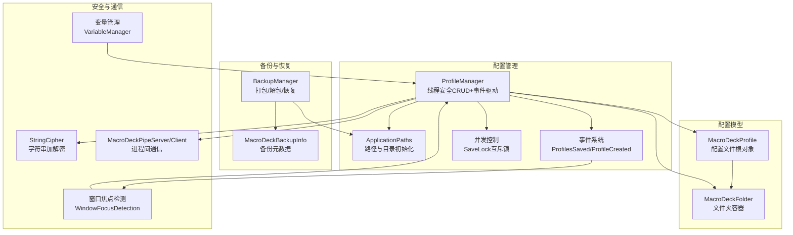
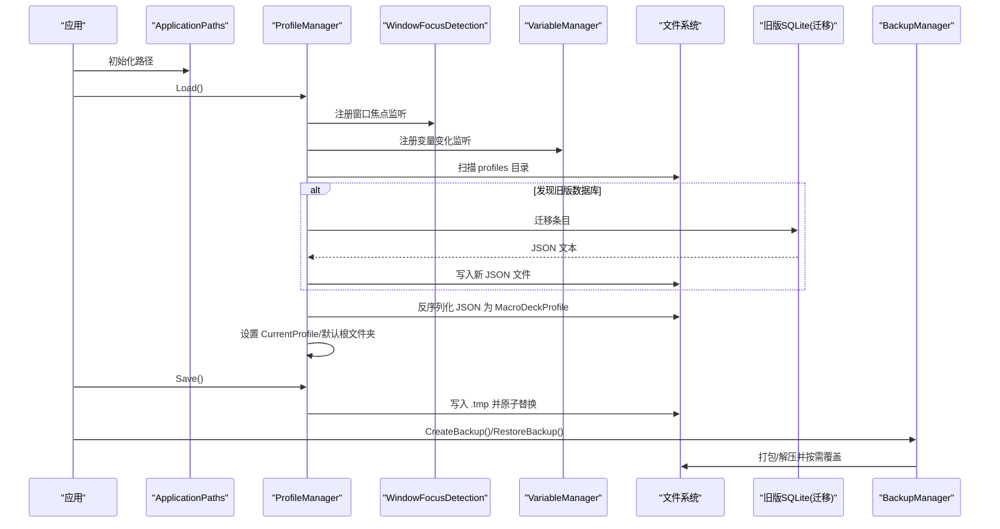
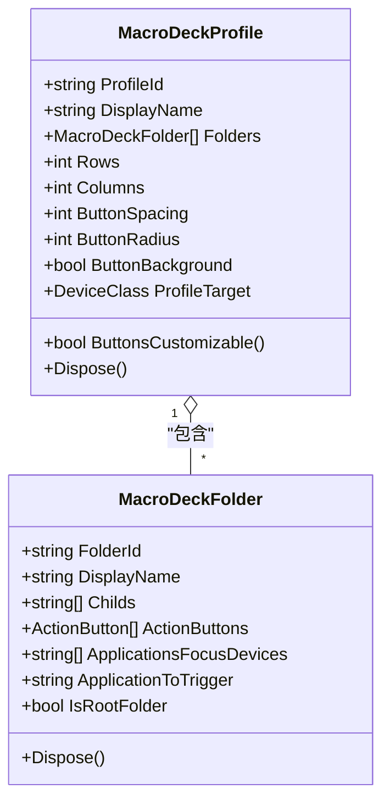
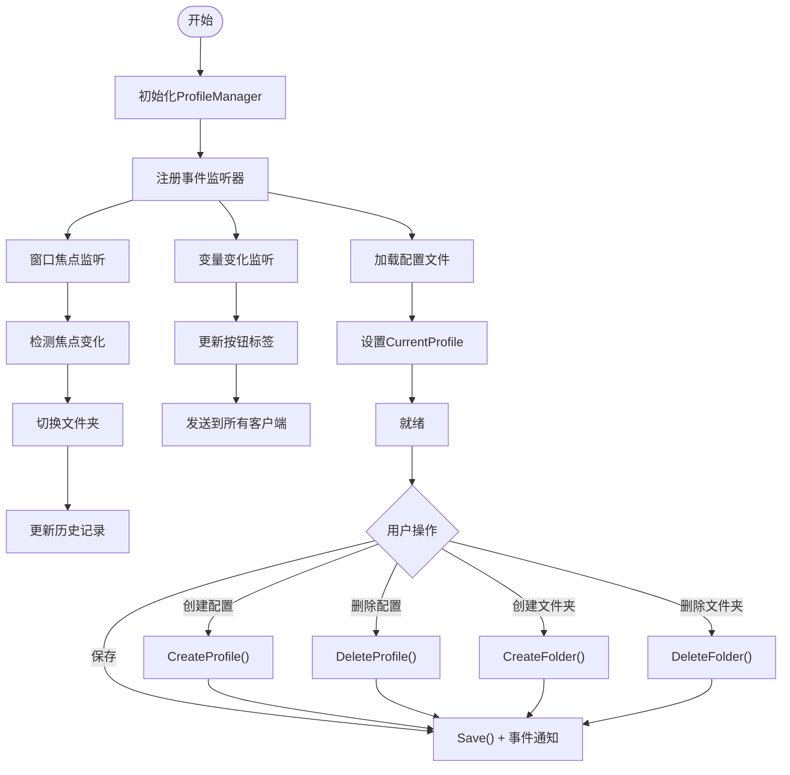
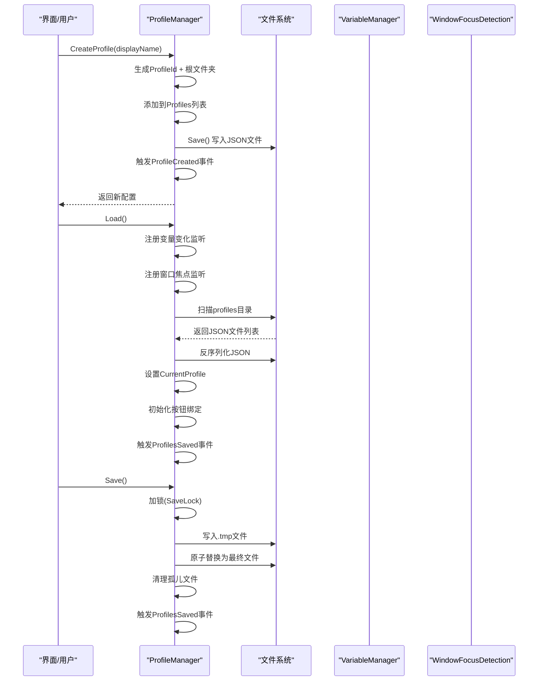
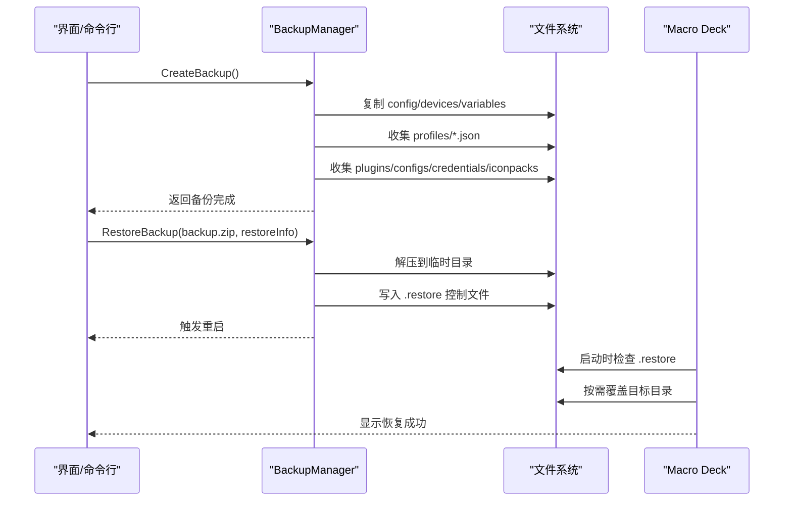
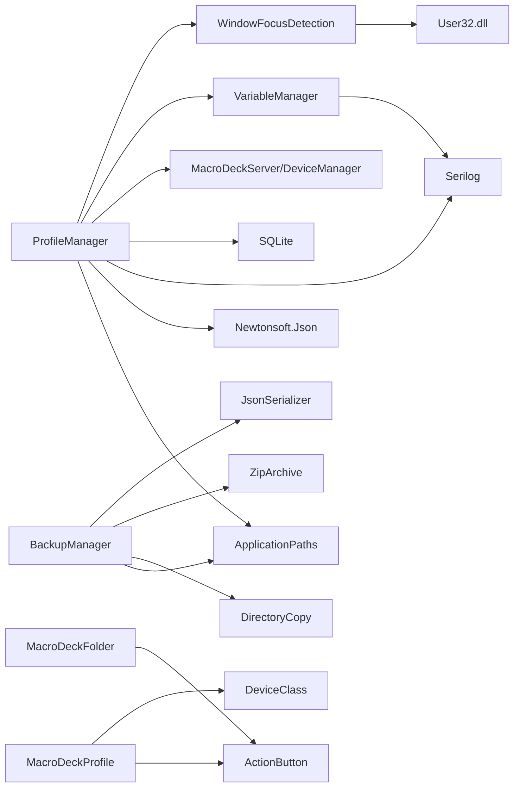

# 配置文件管理

<cite>
**本文引用的文件**
- [MacroDeckProfile.cs](file://src/MacroDeck/Profiles/MacroDeckProfile.cs)
- [ProfileManager.cs](file://src/MacroDeck/Profiles/ProfileManager.cs)
- [MacroDeckFolder.cs](file://src/MacroDeck/Folders/MacroDeckFolder.cs)
- [ProfileJson.cs](file://src/MacroDeck/JSON/ProfileJson.cs)
- [BackupManager.cs](file://src/MacroDeck/Backup/BackupManager.cs)
- [MacroDeckBackupInfo.cs](file://src/MacroDeck/Backup/MacroDeckBackupInfo.cs)
- [ApplicationPaths.cs](file://src/MacroDeck/StartupConfig/ApplicationPaths.cs)
- [StringCipher.cs](file://src/MacroDeck/Utils/StringCipher.cs)
- [MacroDeckPipeServer.cs](file://src/MacroDeck/Pipe/MacroDeckPipeServer.cs)
- [MacroDeckPipeClient.cs](file://src/MacroDeck/Pipe/MacroDeckPipeClient.cs)
- [WindowFocusDetection.cs](file://src/MacroDeck/WindowFocus/WindowFocusDetection.cs)
- [WindowChangedEventArgs.cs](file://src/MacroDeck/WindowFocus/WindowChangedEventArgs.cs)
- [VariableManager.cs](file://src/MacroDeck/Variables/VariableManager.cs)
- [Variable.cs](file://src/MacroDeck/Variables/Variable.cs)
- [VariableType.cs](file://src/MacroDeck/Variables/VariableType.cs)
</cite>

## 更新摘要
**变更内容**
- 新增完整的ProfileManager类，提供线程安全的配置文件CRUD操作
- 引入事件驱动架构，支持ProfilesSaved和ProfileCreated事件
- 新增变量变化监听功能，自动更新按钮标签
- 实现窗口焦点切换功能，支持基于应用程序的自动文件夹切换
- 增强并发安全性，使用互斥锁保护保存操作
- 扩展配置管理器的功能，包括历史记录管理和设备联动

## 目录
1. [简介](#简介)
2. [项目结构](#项目结构)
3. [核心组件](#核心组件)
4. [架构总览](#架构总览)
5. [组件详细分析](#组件详细分析)
6. [依赖关系分析](#依赖关系分析)
7. [性能与可靠性](#性能与可靠性)
8. [故障排查指南](#故障排查指南)
9. [结论](#结论)
10. [附录：扩展与自定义开发指南](#附录扩展与自定义开发指南)

## 简介
本文件系统化梳理 Macro-Deck 的配置文件管理能力，重点围绕重构后的 MacroDeckProfile 数据模型、配置项组织结构、创建/加载/保存/删除流程、版本迁移与兼容性、导入导出与格式转换、备份与恢复、安全存储（含加密）、以及批量与自动化管理等主题展开。重构后的系统引入了全新的ProfileManager类，提供线程安全的配置文件CRUD操作、事件驱动架构、变量变化监听、窗口焦点切换等功能。

## 项目结构
配置文件管理涉及以下关键模块：
- 配置模型层：MacroDeckProfile、MacroDeckFolder
- 配置管理器：ProfileManager（负责加载、保存、迁移、增删改查，支持事件驱动和并发安全）
- 路径与环境：ApplicationPaths（统一管理用户目录、配置文件路径）
- 备份与恢复：BackupManager（打包/解包、恢复流程）
- 工具与安全：StringCipher（字符串加解密工具）
- 进程间通信：MacroDeckPipeServer/Client（用于跨进程同步与自动化）
- 窗口焦点管理：WindowFocusDetection（监听窗口焦点变化）
- 变量管理：VariableManager（管理变量变化事件）

**图表来源**
- [MacroDeckProfile.cs:1-75](file://src/MacroDeck/Profiles/MacroDeckProfile.cs#L1-L75)
- [MacroDeckFolder.cs:1-60](file://src/MacroDeck/Folders/MacroDeckFolder.cs#L1-L60)
- [ProfileManager.cs:1-796](file://src/MacroDeck/Profiles/ProfileManager.cs#L1-L796)
- [ApplicationPaths.cs:1-143](file://src/MacroDeck/StartupConfig/ApplicationPaths.cs#L1-L143)
- [BackupManager.cs:1-380](file://src/MacroDeck/Backup/BackupManager.cs#L1-L380)
- [MacroDeckBackupInfo.cs:1-9](file://src/MacroDeck/Backup/MacroDeckBackupInfo.cs#L1-L9)
- [StringCipher.cs](file://src/MacroDeck/Utils/StringCipher.cs)
- [MacroDeckPipeServer.cs](file://src/MacroDeck/Pipe/MacroDeckPipeServer.cs)
- [MacroDeckPipeClient.cs](file://src/MacroDeck/Pipe/MacroDeckPipeClient.cs)
- [WindowFocusDetection.cs:1-113](file://src/MacroDeck/WindowFocus/WindowFocusDetection.cs#L1-L113)
- [VariableManager.cs:1-249](file://src/MacroDeck/Variables/VariableManager.cs#L1-L249)

**章节来源**
- [MacroDeckProfile.cs:1-75](file://src/MacroDeck/Profiles/MacroDeckProfile.cs#L1-L75)
- [MacroDeckFolder.cs:1-60](file://src/MacroDeck/Folders/MacroDeckFolder.cs#L1-L60)
- [ProfileManager.cs:1-796](file://src/MacroDeck/Profiles/ProfileManager.cs#L1-L796)
- [ApplicationPaths.cs:1-143](file://src/MacroDeck/StartupConfig/ApplicationPaths.cs#L1-L143)
- [BackupManager.cs:1-380](file://src/MacroDeck/Backup/BackupManager.cs#L1-L380)
- [MacroDeckBackupInfo.cs:1-9](file://src/MacroDeck/Backup/MacroDeckBackupInfo.cs#L1-L9)

## 核心组件
- 配置文件根对象：MacroDeckProfile
  - 关键属性：ProfileId、DisplayName、Folders、Rows、Columns、ButtonSpacing、ButtonRadius、ButtonBackground、ProfileTarget、ButtonsCustomizable
  - 生命周期：实现 IDisposable，释放托管与非托管资源
- 文件夹容器：MacroDeckFolder
  - 关键属性：FolderId、DisplayName、Childs（子文件夹 ID 列表）、ActionButtons（按钮集合）、ApplicationsFocusDevices（触发设备列表）、ApplicationToTrigger（触发应用名）
  - 根文件夹标识：IsRootFolder
  - 生命周期：实现 IDisposable，释放内部 ActionButton 资源
- 配置管理器：ProfileManager（重构后）
  - **线程安全**：使用互斥锁保护保存操作，防止并发写入导致文件损坏
  - **事件驱动**：提供 ProfilesSaved 和 ProfileCreated 事件，支持订阅者模式
  - **变量监听**：注册 VariableManager.OnVariableChanged 事件，自动更新按钮标签
  - **窗口焦点**：集成 WindowFocusDetection，支持基于应用程序的自动文件夹切换
  - **历史记录**：使用 ConcurrentDictionary 管理客户端历史状态
  - 加载：扫描 profiles 目录，反序列化 JSON；若无文件则生成默认配置；支持从旧版 SQLite 数据库迁移
  - 保存：并发安全写入，先写临时文件再原子移动覆盖；清理孤儿文件
  - 增删改查：创建/删除配置、创建/删除文件夹、查找按钮、按名称或 ID 查找
  - 其他：变量标签更新、窗口焦点联动、事件通知
- 路径与环境：ApplicationPaths
  - 统一管理用户目录、插件、备份、日志、图标包、临时目录、主配置、设备、变量、配置文件、旧版数据库、配置文件目录等
- 备份与恢复：BackupManager
  - 打包：将 config.json、devices.json、variables.db、profiles/*.json、插件、插件配置、插件凭据、图标包等打包为 zip
  - 恢复：解压到临时目录，读取 .restore 控制项，选择性覆盖目标目录，重启应用执行恢复
- 窗口焦点管理：WindowFocusDetection
  - 使用 Windows API 监听系统焦点变化事件
  - 通过 SetWinEventHook 和 UnhookWinEvent 实现底层事件钩子
  - 提供 OnWindowFocusChanged 事件，包含新旧进程名称信息
- 变量管理：VariableManager
  - 管理变量的创建、更新、删除和查询
  - 提供 OnVariableChanged 和 OnVariableRemoved 事件
  - 支持多种变量类型（Integer、Float、String、Bool）
  - 集成 SQLite 数据库存储

**章节来源**
- [MacroDeckProfile.cs:7-75](file://src/MacroDeck/Profiles/MacroDeckProfile.cs#L7-L75)
- [MacroDeckFolder.cs:6-60](file://src/MacroDeck/Folders/MacroDeckFolder.cs#L6-L60)
- [ProfileManager.cs:205-311](file://src/MacroDeck/Profiles/ProfileManager.cs#L205-L311)
- [ProfileManager.cs:313-380](file://src/MacroDeck/Profiles/ProfileManager.cs#L313-L380)
- [ProfileManager.cs:68-105](file://src/MacroDeck/Profiles/ProfileManager.cs#L68-L105)
- [ApplicationPaths.cs:36-102](file://src/MacroDeck/StartupConfig/ApplicationPaths.cs#L36-L102)
- [BackupManager.cs:270-361](file://src/MacroDeck/Backup/BackupManager.cs#L270-L361)
- [BackupManager.cs:224-267](file://src/MacroDeck/Backup/BackupManager.cs#L224-L267)
- [WindowFocusDetection.cs:7-113](file://src/MacroDeck/WindowFocus/WindowFocusDetection.cs#L7-L113)
- [VariableManager.cs:10-249](file://src/MacroDeck/Variables/VariableManager.cs#L10-L249)

## 架构总览
配置文件管理采用"模型-管理器-路径-备份-安全-事件驱动"的分层设计：
- 模型层：以 JSON 序列化为核心，通过 Newtonsoft.Json 支持类型名自动处理与循环引用忽略
- 管理层：重构后的 ProfileManager 提供集中式 CRUD、迁移、校验、事件通知和并发控制
- 存储层：ApplicationPaths 统一路径，ProfileManager 将每个配置以独立 JSON 文件持久化
- 备份层：BackupManager 以 zip 归档多类配置与数据，支持选择性恢复
- 安全层：StringCipher 提供可选的敏感字段加密存储，结合进程间通信实现自动化场景下的安全传输
- 事件层：通过事件驱动架构实现松耦合的组件通信，支持变量变化监听和窗口焦点切换

**图表来源**
- [ProfileManager.cs:205-311](file://src/MacroDeck/Profiles/ProfileManager.cs#L205-L311)
- [ProfileManager.cs:313-380](file://src/MacroDeck/Profiles/ProfileManager.cs#L313-L380)
- [ProfileManager.cs:68-105](file://src/MacroDeck/Profiles/ProfileManager.cs#L68-L105)
- [ApplicationPaths.cs:36-102](file://src/MacroDeck/StartupConfig/ApplicationPaths.cs#L36-L102)
- [BackupManager.cs:270-361](file://src/MacroDeck/Backup/BackupManager.cs#L270-L361)

## 组件详细分析

### 配置文件数据模型：MacroDeckProfile 与 MacroDeckFolder
- MacroDeckProfile
  - 标识与显示：ProfileId、DisplayName
  - 结构与布局：Folders、Rows、Columns、ButtonSpacing、ButtonRadius、ButtonBackground
  - 设备目标：ProfileTarget、ButtonsCustomizable（依据设备类型决定是否允许按钮自定义）
  - 资源管理：构造时分配非托管缓冲区，Dispose 时释放
- MacroDeckFolder
  - 层级结构：FolderId、DisplayName、Childs（子文件夹 ID 列表）
  - 行为绑定：ActionButtons（按钮集合）、ApplicationsFocusDevices（触发设备）、ApplicationToTrigger（触发应用）
  - 根文件夹判定：IsRootFolder
  - 资源管理：构造时分配非托管缓冲区，Dispose 时释放内部 ActionButton

**图表来源**
- [MacroDeckProfile.cs:49-75](file://src/MacroDeck/Profiles/MacroDeckProfile.cs#L49-L75)
- [MacroDeckFolder.cs:50-60](file://src/MacroDeck/Folders/MacroDeckFolder.cs#L50-L60)

**章节来源**
- [MacroDeckProfile.cs:7-75](file://src/MacroDeck/Profiles/MacroDeckProfile.cs#L7-L75)
- [MacroDeckFolder.cs:6-60](file://src/MacroDeck/Folders/MacroDeckFolder.cs#L6-L60)

### 重构后的配置管理器：线程安全与事件驱动
- **线程安全的保存操作**
  - 使用 SaveLock 互斥锁确保同一时间只有一个写操作在进行
  - 采用原子写入策略：先写 .tmp 文件，再原子移动覆盖
  - 清理孤儿文件，防止磁盘空间浪费
- **事件驱动架构**
  - ProfilesSaved 事件：在所有配置文件保存完成后触发
  - ProfileCreated 事件：在新配置文件创建完成后触发
  - 支持订阅者模式，便于设备管理器等组件响应配置变化
- **变量变化监听**
  - AddVariableChangedListener() 注册 VariableManager.OnVariableChanged 事件
  - 自动更新所有引用该变量的按钮标签
  - 使用并行处理提升大配置下的渲染效率
- **窗口焦点切换**
  - AddWindowFocusChangedListener() 注册 WindowFocusDetection 事件
  - 基于前台窗口进程名称自动切换设备客户端显示的文件夹
  - 使用历史记录字典管理客户端状态，支持恢复到之前的状态
- **历史记录管理**
  - 使用 ConcurrentDictionary<MacroDeckClient, (MacroDeckFolder, string)> 管理历史状态
  - 键为客户端，值为（上一个文件夹, 触发切换的进程名）
  - 支持多线程并发访问

**图表来源**
- [ProfileManager.cs:68-105](file://src/MacroDeck/Profiles/ProfileManager.cs#L68-L105)
- [ProfileManager.cs:207-280](file://src/MacroDeck/Profiles/ProfileManager.cs#L207-L280)
- [ProfileManager.cs:127-186](file://src/MacroDeck/Profiles/ProfileManager.cs#L127-L186)
- [ProfileManager.cs:399-466](file://src/MacroDeck/Profiles/ProfileManager.cs#L399-L466)

**章节来源**
- [ProfileManager.cs:51-62](file://src/MacroDeck/Profiles/ProfileManager.cs#L51-L62)
- [ProfileManager.cs:35-39](file://src/MacroDeck/Profiles/ProfileManager.cs#L35-L39)
- [ProfileManager.cs:68-105](file://src/MacroDeck/Profiles/ProfileManager.cs#L68-L105)
- [ProfileManager.cs:207-280](file://src/MacroDeck/Profiles/ProfileManager.cs#L207-L280)
- [ProfileManager.cs:127-186](file://src/MacroDeck/Profiles/ProfileManager.cs#L127-L186)

### 配置文件生命周期：创建、加载、保存、删除
- 创建
  - ProfileManager.CreateProfile：生成唯一 ProfileId，创建根文件夹，加入 Profiles，立即保存并触发 ProfileCreated 事件
  - ProfileManager.CreateFolder：在指定父文件夹下创建子文件夹，更新父节点 Childs，保存
- 加载
  - ProfileManager.Load：扫描 profiles 目录，反序列化 JSON；若无文件则生成默认配置；支持从旧版 SQLite 迁移
  - 迁移逻辑：读取旧数据库条目，反序列化为 MacroDeckProfile，写入新 JSON 文件，重命名旧数据库
  - 初始化事件监听器：注册变量变化监听和窗口焦点监听
- 保存
  - ProfileManager.Save：使用 SaveLock 互斥锁保护；逐个序列化为 JSON，写入 .tmp 后原子替换；清理孤儿文件；触发 ProfilesSaved 事件
- 删除
  - ProfileManager.DeleteProfile：校验数量、解除设备绑定、释放资源、保存
  - ProfileManager.DeleteFolder：递归删除子文件夹、重置在线客户端所在文件夹、保存

**图表来源**
- [ProfileManager.cs:653-699](file://src/MacroDeck/Profiles/ProfileManager.cs#L653-L699)
- [ProfileManager.cs:286-392](file://src/MacroDeck/Profiles/ProfileManager.cs#L286-L392)
- [ProfileManager.cs:399-466](file://src/MacroDeck/Profiles/ProfileManager.cs#L399-L466)
- [ProfileManager.cs:707-737](file://src/MacroDeck/Profiles/ProfileManager.cs#L707-L737)

**章节来源**
- [ProfileManager.cs:539-578](file://src/MacroDeck/Profiles/ProfileManager.cs#L539-L578)
- [ProfileManager.cs:458-485](file://src/MacroDeck/Profiles/ProfileManager.cs#L458-L485)
- [ProfileManager.cs:205-311](file://src/MacroDeck/Profiles/ProfileManager.cs#L205-L311)
- [ProfileManager.cs:313-380](file://src/MacroDeck/Profiles/ProfileManager.cs#L313-L380)
- [ProfileManager.cs:580-610](file://src/MacroDeck/Profiles/ProfileManager.cs#L580-L610)

### 版本管理与兼容性
- 旧版数据库迁移：当检测到旧版 SQLite 数据库且当前 profiles 目录为空时，读取条目，反序列化为 MacroDeckProfile，写入新 JSON 文件，并将旧数据库重命名为已迁移状态
- 类型兼容：Newtonsoft.Json 的 TypeNameHandling.Auto 自动处理类型信息，避免跨版本类型不匹配导致的反序列化失败
- 循环引用处理：ReferenceLoopHandling.Ignore 避免复杂对象图导致的序列化异常
- 空值处理：NullValueHandling.Ignore 减少冗余字段

**章节来源**
- [ProfileManager.cs:382-456](file://src/MacroDeck/Profiles/ProfileManager.cs#L382-L456)
- [ProfileJson.cs:1-11](file://src/MacroDeck/JSON/ProfileJson.cs#L1-L11)

### 导入导出与格式转换
- 当前实现
  - 导入：通过 ProfileManager.Load 扫描并反序列化 JSON 文件；旧版数据库迁移作为一次性导入
  - 导出：通过 BackupManager.CreateBackup 将 profiles/*.json 与其他配置打包为 zip
- 格式转换建议
  - 若需支持其他格式（如 YAML），可在 ProfileManager 中增加对应转换器，保持 MacroDeckProfile 为中心模型，先转换为该模型，再进行序列化
  - 对于二进制格式，建议保留 JSON 作为人类可读的参考格式，二进制仅用于高性能场景

**章节来源**
- [ProfileManager.cs:205-311](file://src/MacroDeck/Profiles/ProfileManager.cs#L205-L311)
- [ProfileManager.cs:270-361](file://src/MacroDeck/Backup/BackupManager.cs#L270-L361)

### 备份与恢复机制
- 备份内容
  - 主配置：config.json
  - 设备：devices.json
  - 变量：variables.db
  - 配置文件：profiles/*.json
  - 插件：plugins 目录树
  - 插件配置：configs 目录
  - 插件凭据：credentials 目录
  - 图标包：iconpacks 目录树
- 备份流程
  - CreateBackup：复制必要文件到临时目录，调用 CreateBackup(...) 添加各目录/文件到 zip，最终落盘
- 恢复流程
  - RestoreBackup：解压到临时目录，写入 .restore 控制文件，重启应用；应用启动后检查 .restore 并按需覆盖目标目录

**图表来源**
- [BackupManager.cs:270-361](file://src/MacroDeck/Backup/BackupManager.cs#L270-L361)
- [BackupManager.cs:224-267](file://src/MacroDeck/Backup/BackupManager.cs#L224-L267)
- [MacroDeckBackupInfo.cs:3-9](file://src/MacroDeck/Backup/MacroDeckBackupInfo.cs#L3-L9)

**章节来源**
- [BackupManager.cs:270-361](file://src/MacroDeck/Backup/BackupManager.cs#L270-L361)
- [BackupManager.cs:224-267](file://src/MacroDeck/Backup/BackupManager.cs#L224-L267)
- [MacroDeckBackupInfo.cs:1-9](file://src/MacroDeck/Backup/MacroDeckBackupInfo.cs#L1-L9)

### 加密与安全存储
- 敏感字段加密
  - 使用 StringCipher 提供对字符串的加解密能力，可用于存储敏感配置（如令牌、密码）字段
  - 建议仅对必要字段加密，避免影响序列化性能
- 访问控制
  - ApplicationPaths 统一管理用户目录，确保配置文件位于受控位置
  - 备份文件建议使用系统级权限保护，避免被普通用户读取
- 传输安全
  - 通过 MacroDeckPipeServer/Client 实现进程间通信，可在自动化场景中安全传递配置片段

**章节来源**
- [StringCipher.cs](file://src/MacroDeck/Utils/StringCipher.cs)
- [ApplicationPaths.cs:36-102](file://src/MacroDeck/StartupConfig/ApplicationPaths.cs#L36-L102)
- [MacroDeckPipeServer.cs](file://src/MacroDeck/Pipe/MacroDeckPipeServer.cs)
- [MacroDeckPipeClient.cs](file://src/MacroDeck/Pipe/MacroDeckPipeClient.cs)

### 批量操作与自动化管理
- 批量创建/删除配置
  - 通过 ProfileManager.CreateProfile/DeleteProfile 在代码层面批量管理
- 批量文件夹操作
  - CreateFolder/DeleteFolder 支持树形结构的批量维护
- 自动化脚本
  - 使用 MacroDeckPipeServer/Client 与外部脚本交互，实现自动化部署、切换配置、触发动作等
- 事件驱动
  - ProfileManager 暴露 ProfilesSaved、ProfileCreated 等事件，便于自动化流程集成
- 变量驱动的自动化
  - 通过 VariableManager.SetValue 设置变量值，自动触发相关按钮的标签更新
- 窗口焦点驱动的自动化
  - WindowFocusDetection 监听系统焦点变化，自动切换设备显示的文件夹

**章节来源**
- [ProfileManager.cs:539-578](file://src/MacroDeck/Profiles/ProfileManager.cs#L539-L578)
- [ProfileManager.cs:580-610](file://src/MacroDeck/Profiles/ProfileManager.cs#L580-L610)
- [ProfileManager.cs:458-485](file://src/MacroDeck/Profiles/ProfileManager.cs#L458-L485)
- [ProfileManager.cs:68-105](file://src/MacroDeck/Profiles/ProfileManager.cs#L68-L105)
- [VariableManager.cs:150-167](file://src/MacroDeck/Variables/VariableManager.cs#L150-L167)
- [WindowFocusDetection.cs:77-112](file://src/MacroDeck/WindowFocus/WindowFocusDetection.cs#L77-L112)

## 依赖关系分析
- 组件耦合
  - ProfileManager 依赖 ApplicationPaths（路径）、Newtonsoft.Json（序列化）、Serilog（日志）、SQLite（迁移）、MacroDeckServer/DeviceManager（设备联动）
  - **新增依赖**：VariableManager（变量变化监听）、WindowFocusDetection（窗口焦点监听）
  - MacroDeckProfile/MacroDeckFolder 依赖 ActionButton（按钮模型）、DeviceClass（设备类型）
  - BackupManager 依赖 ApplicationPaths、DirectoryCopy、ZipArchive、JsonSerializer
- 外部依赖
  - Newtonsoft.Json：类型名自动处理、错误回调、循环引用忽略
  - SQLite：旧版数据库迁移
  - System.IO/Compression：备份打包与解包
  - **新增外部依赖**：Windows API（User32.dll）用于窗口焦点检测
- 潜在风险
  - 迁移阶段的异常需捕获并记录，避免中断整体流程
  - 并发保存时的文件覆盖需保证原子性，防止损坏
  - **新增风险**：事件订阅的内存泄漏，需要在应用程序退出时正确清理

**图表来源**
- [ProfileManager.cs:1-18](file://src/MacroDeck/Profiles/ProfileManager.cs#L1-L18)
- [BackupManager.cs:1-18](file://src/MacroDeck/Backup/BackupManager.cs#L1-L18)
- [ApplicationPaths.cs:6-27](file://src/MacroDeck/StartupConfig/ApplicationPaths.cs#L6-L27)
- [WindowFocusDetection.cs:17-27](file://src/MacroDeck/WindowFocus/WindowFocusDetection.cs#L17-L27)
- [VariableManager.cs:1-7](file://src/MacroDeck/Variables/VariableManager.cs#L1-L7)

**章节来源**
- [ProfileManager.cs:1-18](file://src/MacroDeck/Profiles/ProfileManager.cs#L1-L18)
- [BackupManager.cs:1-18](file://src/MacroDeck/Backup/BackupManager.cs#L1-L18)
- [ApplicationPaths.cs:6-27](file://src/MacroDeck/StartupConfig/ApplicationPaths.cs#L6-L27)

## 性能与可靠性
- 性能要点
  - 保存时使用 .tmp + 原子替换，避免部分写入导致的损坏
  - **新增**：SaveLock 互斥锁保护，减少竞争条件
  - 变量标签更新采用并行处理，提升大配置下的渲染效率
  - **新增**：使用 ConcurrentDictionary 支持多线程并发访问
- 可靠性要点
  - 反序列化错误回调与忽略循环引用，提高容错能力
  - 迁移失败不影响现有配置，旧数据库重命名避免重复迁移
  - 备份失败记录日志并通过事件上报
  - **新增**：应用程序退出时自动清理事件订阅和资源
  - **新增**：窗口焦点检测使用本地委托避免垃圾回收问题

**章节来源**
- [ProfileManager.cs:313-380](file://src/MacroDeck/Profiles/ProfileManager.cs#L313-L380)
- [ProfileManager.cs:218-228](file://src/MacroDeck/Profiles/ProfileManager.cs#L218-L228)
- [ProfileManager.cs:415-421](file://src/MacroDeck/Profiles/ProfileManager.cs#L415-L421)
- [ProfileManager.cs:94-105](file://src/MacroDeck/Profiles/ProfileManager.cs#L94-L105)
- [WindowFocusDetection.cs:39-41](file://src/MacroDeck/WindowFocus/WindowFocusDetection.cs#L39-L41)

## 故障排查指南
- 无法加载配置
  - 检查 profiles 目录是否存在 JSON 文件；查看日志中的反序列化错误
  - 如存在旧版数据库且未迁移，确认迁移流程是否成功
- 保存失败或文件损坏
  - 确认磁盘空间与权限；检查并发保存是否被中断
  - 查看日志中的序列化错误
  - **新增**：检查 SaveLock 是否被长时间占用
- 迁移失败
  - 检查旧版数据库文件是否可读；确认反序列化结果是否为空
- 备份/恢复异常
  - 检查备份文件完整性；确认 .restore 控制文件是否存在且正确
  - 查看日志中的具体异常信息
- **新增**：变量标签不更新
  - 确认 VariableManager.OnVariableChanged 事件是否正常触发
  - 检查按钮的标签模板是否包含正确的变量名
- **新增**：窗口焦点切换失效
  - 确认 WindowFocusDetection 是否正确初始化
  - 检查应用程序的焦点变化事件是否正常触发
  - 验证设备客户端与文件夹的 ApplicationToTrigger 匹配

**章节来源**
- [ProfileManager.cs:242-246](file://src/MacroDeck/Profiles/ProfileManager.cs#L242-L246)
- [ProfileManager.cs:349-353](file://src/MacroDeck/Profiles/ProfileManager.cs#L349-L353)
- [ProfileManager.cs:452-456](file://src/MacroDeck/Profiles/ProfileManager.cs#L452-L456)
- [BackupManager.cs:296-300](file://src/MacroDeck/Backup/BackupManager.cs#L296-L300)
- [BackupManager.cs:96-100](file://src/MacroDeck/Backup/BackupManager.cs#L96-L100)

## 结论
Macro-Deck 的配置文件管理经过重构后，以 JSON 为核心，配合全新的 ProfileManager 提供了完善的线程安全加载、保存、迁移与 CRUD 能力。新增的事件驱动架构支持变量变化监听和窗口焦点切换，大大增强了系统的自动化能力。BackupManager 实现了多维度的备份与恢复；ApplicationPaths 统一路径管理，确保可移植性与一致性。通过 StringCipher 与进程间通信，系统具备基础的安全与自动化能力。建议在生产环境中启用备份策略、对敏感字段进行加密，并在大规模配置场景下关注并行保存与标签渲染的性能优化。新增的事件系统为未来的功能扩展提供了良好的基础。

## 附录：扩展与自定义开发指南
- 新增配置字段
  - 在 MacroDeckProfile 或 MacroDeckFolder 中添加属性，保持与 JSON 字段名一致
  - 如需类型安全，使用 Newtonsoft.Json 的 TypeNameHandling.Auto 或自定义转换器
- 自定义导入/导出格式
  - 在 ProfileManager 中新增转换器，将外部格式转换为 MacroDeckProfile，再进行序列化
  - 导出时将 MacroDeckProfile 写入目标格式文件
- 扩展备份范围
  - 在 BackupManager.CreateBackup(...) 中添加新的目录/文件收集逻辑
  - 在恢复流程中按需覆盖目标目录
- 安全增强
  - 对敏感字段使用 StringCipher 进行加解密存储
  - 限制备份文件访问权限，结合操作系统 ACL 管理
- 自动化集成
  - 使用 MacroDeckPipeServer/Client 编写自动化脚本，实现批量配置切换、触发动作、监控状态等
- **新增**：事件驱动扩展
  - 订阅 ProfileManager 的 ProfilesSaved 和 ProfileCreated 事件
  - 实现自定义的变量监听器，响应特定变量的变化
  - 集成窗口焦点检测，实现基于应用程序的自动化切换
- **新增**：并发安全编程
  - 在自定义扩展中使用 ProfileManager 的 SaveLock 互斥锁
  - 避免在事件处理程序中执行长时间操作，使用异步模式
  - 正确处理资源清理，避免内存泄漏

**章节来源**
- [MacroDeckProfile.cs:49-75](file://src/MacroDeck/Profiles/MacroDeckProfile.cs#L49-L75)
- [MacroDeckFolder.cs:50-60](file://src/MacroDeck/Folders/MacroDeckFolder.cs#L50-L60)
- [ProfileManager.cs:205-311](file://src/MacroDeck/Profiles/ProfileManager.cs#L205-L311)
- [ProfileManager.cs:270-361](file://src/MacroDeck/Backup/BackupManager.cs#L270-L361)
- [StringCipher.cs](file://src/MacroDeck/Utils/StringCipher.cs)
- [MacroDeckPipeServer.cs](file://src/MacroDeck/Pipe/MacroDeckPipeServer.cs)
- [MacroDeckPipeClient.cs](file://src/MacroDeck/Pipe/MacroDeckPipeClient.cs)
- [ProfileManager.cs:35-39](file://src/MacroDeck/Profiles/ProfileManager.cs#L35-L39)
- [ProfileManager.cs:68-105](file://src/MacroDeck/Profiles/ProfileManager.cs#L68-L105)
- [VariableManager.cs:150-167](file://src/MacroDeck/Variables/VariableManager.cs#L150-L167)
- [WindowFocusDetection.cs:77-112](file://src/MacroDeck/WindowFocus/WindowFocusDetection.cs#L77-L112)