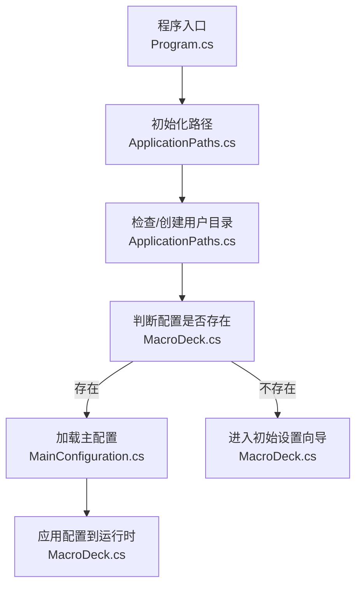
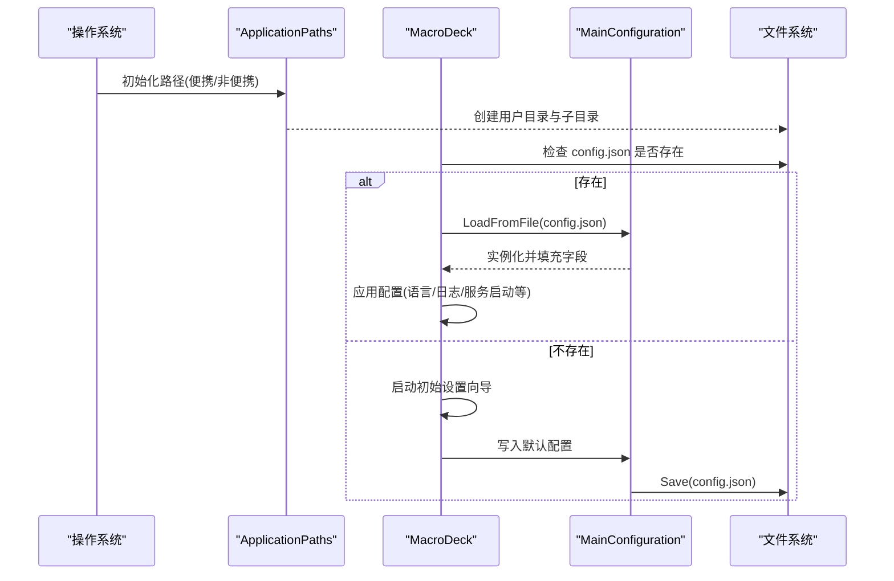
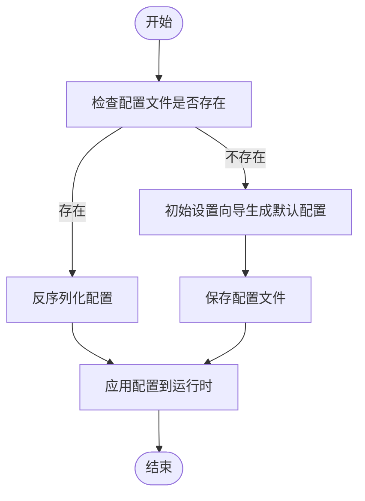
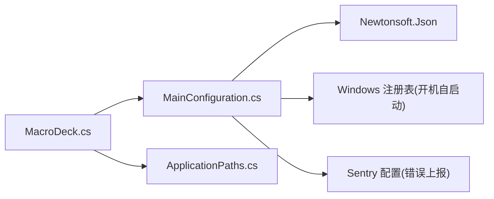

# 配置文件结构

<cite>
**本文引用的文件**
- [MainConfiguration.cs](file://src/MacroDeck/Configuration/MainConfiguration.cs)
- [MacroDeck.cs](file://src/MacroDeck/MacroDeck.cs)
- [ApplicationPaths.cs](file://src/MacroDeck/StartupConfig/ApplicationPaths.cs)
- [Program.cs](file://src/MacroDeck/Program.cs)
- [DeviceConfiguration.cs](file://src/MacroDeck/Device/DeviceConfiguration.cs)
- [ISerializableConfiguration.cs](file://src/MacroDeck/Models/ISerializableConfiguration.cs)
</cite>

## 目录
1. [简介](#简介)
2. [项目结构](#项目结构)
3. [核心组件](#核心组件)
4. [架构总览](#架构总览)
5. [详细组件分析](#详细组件分析)
6. [依赖关系分析](#依赖关系分析)
7. [性能与可靠性考量](#性能与可靠性考量)
8. [故障排查指南](#故障排查指南)
9. [结论](#结论)
10. [附录：配置项参考与示例](#附录配置项参考与示例)

## 简介
本文件面向开发者与高级用户，系统化阐述 Macro-Deck 主配置文件的数据模型与 JSON 结构，重点围绕 MainConfiguration 类进行解析。内容涵盖：
- 数据模型与字段映射（JSON 属性名与 C# 成员）
- 默认值与有效范围
- 字段间的依赖关系与约束
- 配置文件的保存与加载流程
- 分类说明（系统配置、连接配置、安全配置等）
- 扩展新配置项的指导原则
- 完整的 JSON 示例与逐项注释

## 项目结构
主配置文件位于用户数据目录下的 config.json，默认路径由 ApplicationPaths 提供；应用启动时根据是否首次运行决定加载或引导初始设置流程。

图表来源
- [Program.cs:32](file://src/MacroDeck/Program.cs#L32)
- [ApplicationPaths.cs:36-61](file://src/MacroDeck/StartupConfig/ApplicationPaths.cs#L36-L61)
- [MacroDeck.cs:96-105](file://src/MacroDeck/MacroDeck.cs#L96-L105)
- [MainConfiguration.cs:77-101](file://src/MacroDeck/Configuration/MainConfiguration.cs#L77-L101)

章节来源
- [ApplicationPaths.cs:56](file://src/MacroDeck/StartupConfig/ApplicationPaths.cs#L56)
- [MacroDeck.cs:96-105](file://src/MacroDeck/MacroDeck.cs#L96-L105)

## 核心组件
- MainConfiguration：主配置数据模型，负责序列化/反序列化与关键字段的业务逻辑（如开机自启动写入注册表）。
- MacroDeck：应用生命周期管理，负责在启动阶段加载配置并将其应用于运行时行为。
- ApplicationPaths：提供用户数据目录与各文件路径（含 config.json 路径）。
- DeviceConfiguration：设备侧配置模型，用于设备连接与显示亮度等参数（与主配置同属“配置”范畴但作用域不同）。
- ISerializableConfiguration：通用序列化接口（用于其他可序列化配置类型），体现统一的序列化/反序列化模式。

章节来源
- [MainConfiguration.cs:9-102](file://src/MacroDeck/Configuration/MainConfiguration.cs#L9-L102)
- [MacroDeck.cs:42](file://src/MacroDeck/MacroDeck.cs#L42)
- [ApplicationPaths.cs:23-27](file://src/MacroDeck/StartupConfig/ApplicationPaths.cs#L23-L27)
- [DeviceConfiguration.cs:3-15](file://src/MacroDeck/Device/DeviceConfiguration.cs#L3-L15)
- [ISerializableConfiguration.cs:5-14](file://src/MacroDeck/Models/ISerializableConfiguration.cs#L5-L14)

## 架构总览
下图展示配置文件从磁盘到运行时的流转：

图表来源
- [ApplicationPaths.cs:36-61](file://src/MacroDeck/StartupConfig/ApplicationPaths.cs#L36-L61)
- [MacroDeck.cs:96-105](file://src/MacroDeck/MacroDeck.cs#L96-L105)
- [MainConfiguration.cs:77-101](file://src/MacroDeck/Configuration/MainConfiguration.cs#L77-L101)

## 详细组件分析

### MainConfiguration 数据模型与字段说明
- JSON 属性名约定
  - 使用点号分隔层级，例如 "Connection.Host.Address"、"Connection.Ssl.Enabled"。
  - 命名风格采用驼峰到点分隔的映射，便于层次化组织。
- 关键字段与默认值
  - 自动启动：AutoStart，默认 true；写入 Windows 注册表 Run 键。
  - 更新设置：Update.Auto（默认 true）、Update.InstallBeta（默认 false）。
  - ADB 连接：Connection.Adb.Enabled（默认 true）、Connection.Adb.AutoStartApp（默认 true）。
  - SSL 安全：Connection.Ssl.Enabled（默认 false）、Connection.Ssl.Certificate.Pem、Connection.Ssl.Certificate.KeyEncrypted（可空）。
  - 主机与端口：Connection.Host.Address（默认 "127.0.0.1"）、Connection.Host.Port（默认 8191）。
  - 连接策略：Connection.AskOnNewConnections（默认 true）、Connection.BlockNewConnections（默认 false）。
  - 语言：Language（默认 "English"）。
  - 隐私：Privacy.SendAnonymousErrorReports（默认 true）。
- 保存与加载
  - Save(path)：使用 Newtonsoft.Json 序列化，忽略空值。
  - LoadFromFile(path)：反序列化，失败时回退到默认实例。
- 行为特性
  - AutoStart 属性在 setter 中实现开机自启动逻辑，通过注册表操作实现/移除自启动项。
  - Sentry 报告开关由配置项 Privacy.SendAnonymousErrorReports 控制。

章节来源
- [MainConfiguration.cs:13-101](file://src/MacroDeck/Configuration/MainConfiguration.cs#L13-L101)
- [MacroDeck.cs:104-105](file://src/MacroDeck/MacroDeck.cs#L104-L105)

### 配置项分类与依赖关系
- 系统配置
  - AutoStart：影响系统启动行为，需管理员权限写入注册表。
  - Language：影响界面语言加载。
  - Privacy.SendAnonymousErrorReports：影响错误上报服务启用状态。
- 连接配置
  - Connection.AskOnNewConnections / Connection.BlockNewConnections：控制新连接的交互策略。
  - Connection.Host.Address / Connection.Host.Port：服务器监听地址与端口，影响网络可达性。
  - Connection.Adb.Enabled / Connection.Adb.AutoStartApp：控制 ADB 服务与应用自动启动。
- 安全配置
  - Connection.Ssl.Enabled：启用 HTTPS 时生效。
  - Connection.Ssl.Certificate.Pem / Connection.Ssl.Certificate.KeyEncrypted：证书 PEM 与加密密钥（可空）。
- 更新配置
  - Update.Auto：自动检查更新。
  - Update.InstallBeta：允许安装测试版更新。

依赖与约束
- 当 Connection.Ssl.Enabled 为 true 时，建议同时提供证书 PEM 与密钥信息以确保 TLS 正常工作。
- Connection.BlockNewConnections 与 Connection.AskOnNewConnections 共同决定新连接处理策略，通常二者互斥或配合使用。
- AutoStart 仅在 Windows 上有效，且需要注册表写入权限。
- HostPort 必须为可用端口范围内的整数，避免与系统/其他进程冲突。

章节来源
- [MainConfiguration.cs:42-75](file://src/MacroDeck/Configuration/MainConfiguration.cs#L42-L75)

### 保存与加载流程
- 加载：应用启动时检查 config.json 是否存在，存在则反序列化为主配置对象；否则进入初始设置向导。
- 保存：调用 Save 方法将当前配置写回 JSON 文件，忽略空值字段。

图表来源
- [MacroDeck.cs:96-105](file://src/MacroDeck/MacroDeck.cs#L96-L105)
- [MainConfiguration.cs:77-101](file://src/MacroDeck/Configuration/MainConfiguration.cs#L77-L101)

## 依赖关系分析
- MainConfiguration 依赖于 Newtonsoft.Json 进行序列化/反序列化。
- MacroDeck 在启动阶段依赖 ApplicationPaths 提供的 MainConfigFilePath，并在加载后应用配置。
- AutoStart 字段依赖 Windows 注册表 API（通过 Registry.CurrentUser）。
- Sentry 报告开关依赖 Privacy.SendAnonymousErrorReports。

图表来源
- [MainConfiguration.cs:1-6](file://src/MacroDeck/Configuration/MainConfiguration.cs#L1-L6)
- [MacroDeck.cs:42](file://src/MacroDeck/MacroDeck.cs#L42)
- [ApplicationPaths.cs:23-27](file://src/MacroDeck/StartupConfig/ApplicationPaths.cs#L23-L27)

章节来源
- [MainConfiguration.cs:1-6](file://src/MacroDeck/Configuration/MainConfiguration.cs#L1-L6)
- [MacroDeck.cs:42](file://src/MacroDeck/MacroDeck.cs#L42)

## 性能与可靠性考量
- 配置文件体积小，读写开销低；建议在配置变更后异步保存，避免阻塞 UI。
- AutoStart 写入注册表为一次性操作，频繁修改可能带来注册表写入压力，应避免在热路径中反复触发。
- SSL 证书加载与验证在启用 TLS 时会增加启动时间，建议提前准备有效的证书文件。
- 若配置文件损坏，LoadFromFile 将回退到默认实例，保障应用可用性。

## 故障排查指南
- 配置无法保存
  - 检查用户数据目录写权限；确认 ApplicationPaths.UserDirectoryPath 可写。
  - 查看日志输出中的保存失败错误信息。
- 开机自启动无效
  - 确认 AutoStart 为 true；检查注册表项是否成功写入。
  - 在便携模式下，注册表写入可能受限。
- 新连接被拒绝或未提示
  - 检查 Connection.BlockNewConnections 与 Connection.AskOnNewConnections 的组合。
- 无法访问 Web 界面
  - 检查 HostAddress 与 HostPort 是否正确；确认防火墙放行端口。
- SSL 连接失败
  - 确认 Connection.Ssl.Enabled 已启用，并提供了有效的证书 PEM 与密钥。
  - 检查证书链完整性与域名匹配。

章节来源
- [MainConfiguration.cs:77-96](file://src/MacroDeck/Configuration/MainConfiguration.cs#L77-L96)
- [ApplicationPaths.cs:64-102](file://src/MacroDeck/StartupConfig/ApplicationPaths.cs#L64-L102)

## 结论
MainConfiguration 作为 Macro-Deck 的核心配置载体，采用清晰的层级化 JSON 命名与强类型的 C# 映射，结合应用启动流程实现了从磁盘到内存的可靠流转。通过合理的默认值与约束，开发者可在不破坏兼容性的前提下扩展配置项，同时保持良好的用户体验与安全性。

## 附录：配置项参考与示例

### 字段清单与默认值
- AutoStart：布尔，true/false，默认 true
- Update.Auto：布尔，默认 true
- Update.InstallBeta：布尔，默认 false
- Connection.Adb.Enabled：布尔，默认 true
- Connection.Adb.AutoStartApp：布尔，默认 true
- Connection.Ssl.Enabled：布尔，默认 false
- Connection.Ssl.Certificate.Pem：字符串（可空）
- Connection.Ssl.Certificate.KeyEncrypted：字符串（可空）
- Connection.Host.Address：字符串，默认 "127.0.0.1"
- Connection.Host.Port：整数，默认 8191
- Connection.AskOnNewConnections：布尔，默认 true
- Connection.BlockNewConnections：布尔，默认 false
- Language：字符串，默认 "English"
- Privacy.SendAnonymousErrorReports：布尔，默认 true

章节来源
- [MainConfiguration.cs:13-75](file://src/MacroDeck/Configuration/MainConfiguration.cs#L13-L75)

### JSON 结构示例（带注释）
以下为一个完整示例的结构示意（仅展示字段与注释，不包含具体值）：
{
  // 系统配置
  "AutoStart": true, // 是否开机自启动
  "Language": "English", // 界面语言
  "Privacy.SendAnonymousErrorReports": true, // 是否发送匿名错误报告

  // 连接配置
  "Connection.AskOnNewConnections": true, // 新连接是否询问
  "Connection.BlockNewConnections": false, // 是否阻止新连接
  "Connection.Host.Address": "127.0.0.1", // 监听地址
  "Connection.Host.Port": 8191, // 监听端口
  "Connection.Adb.Enabled": true, // 是否启用 ADB 服务
  "Connection.Adb.AutoStartApp": true, // 是否自动启动目标应用

  // 安全配置
  "Connection.Ssl.Enabled": false, // 是否启用 SSL/TLS
  "Connection.Ssl.Certificate.Pem": null, // PEM 证书内容（可空）
  "Connection.Ssl.Certificate.KeyEncrypted": null, // 加密后的私钥（可空）

  // 更新配置
  "Update.Auto": true, // 是否自动检查更新
  "Update.InstallBeta": false // 是否安装测试版更新
}

说明
- 以上字段均来自 MainConfiguration 的 JSON 映射。
- 未显式提供的字段将使用默认值。
- SSL 相关字段为空时，表示不启用 TLS。

章节来源
- [MainConfiguration.cs:13-75](file://src/MacroDeck/Configuration/MainConfiguration.cs#L13-L75)

### 扩展配置项指导原则
- 命名规范
  - 使用点号分隔层级，语义清晰（如 "Category.Subcategory.Property"）。
  - 保持与现有命名风格一致，避免混用下划线或驼峰。
- 默认值与可空性
  - 为每个新增字段提供明确的默认值，减少运行时分支。
  - 对于可选资源（如证书），允许为 null，并在使用前做空值检查。
- 序列化策略
  - 使用 Newtonsoft.Json 的 [JsonProperty] 特性标注，确保跨版本兼容。
  - 如需自定义序列化逻辑，可参考 ISerializableConfiguration 的模式。
- 依赖与约束
  - 明确字段间依赖关系（如启用 SSL 需要证书）并在加载时校验。
  - 对于系统级功能（如注册表、端口占用），在 setter 或加载阶段进行容错处理。
- 生命周期集成
  - 在 MacroDeck 启动流程中尽早加载并应用配置，必要时提供热重载能力。
  - 记录关键配置变更的日志，便于排障。

章节来源
- [MainConfiguration.cs:77-101](file://src/MacroDeck/Configuration/MainConfiguration.cs#L77-L101)
- [ISerializableConfiguration.cs:5-14](file://src/MacroDeck/Models/ISerializableConfiguration.cs#L5-L14)
- [MacroDeck.cs:103-105](file://src/MacroDeck/MacroDeck.cs#L103-L105)