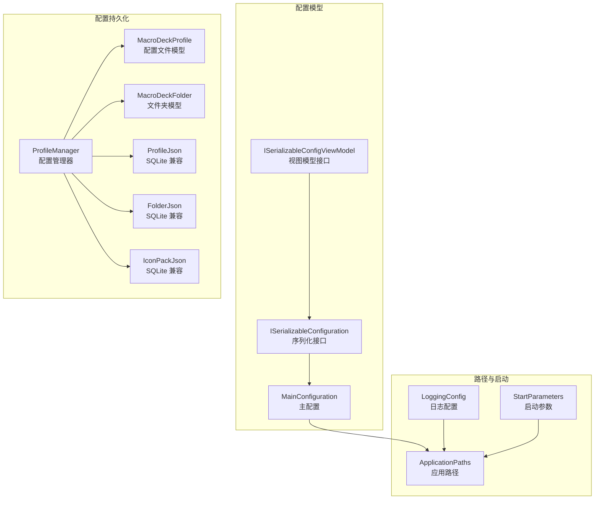
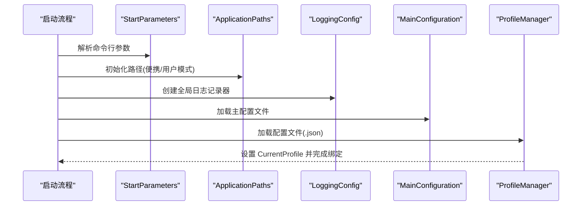
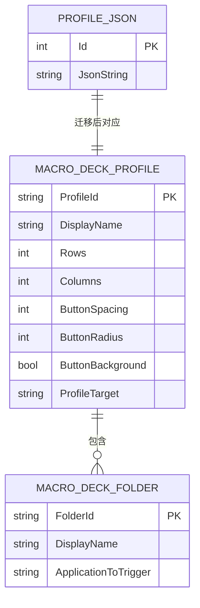
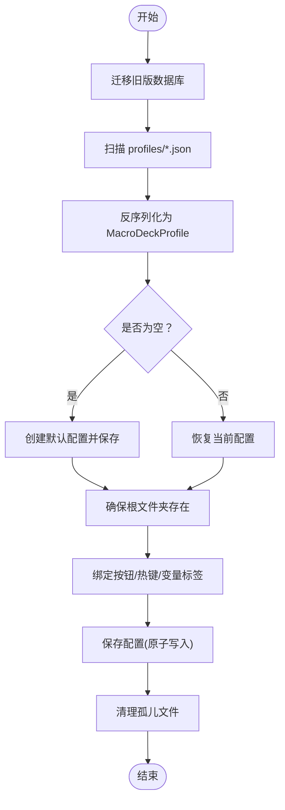
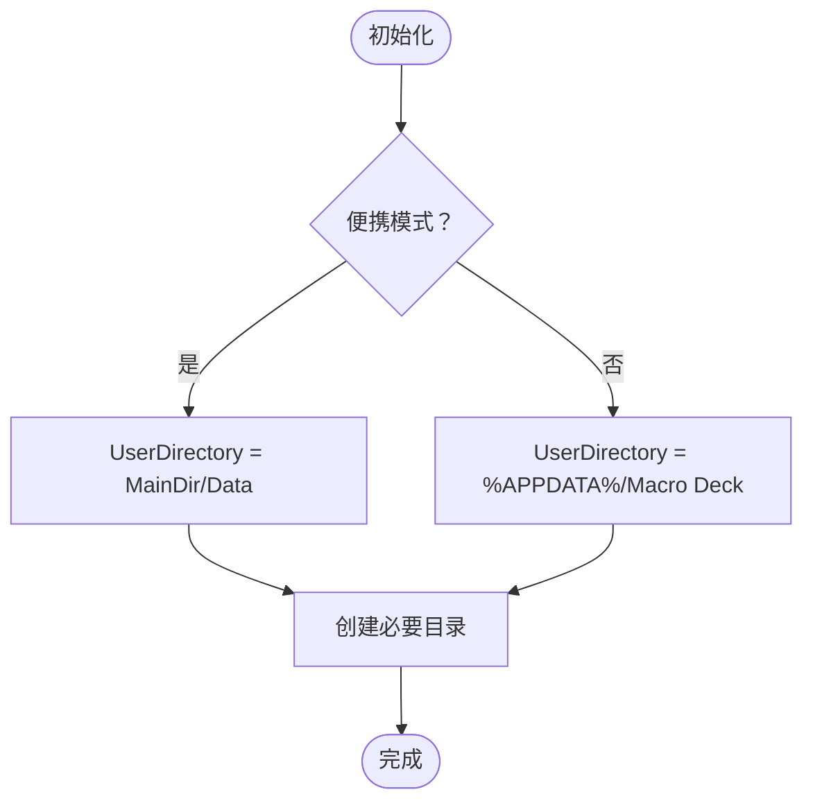
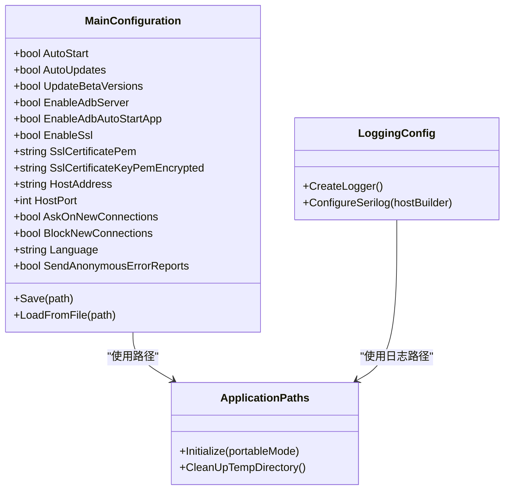
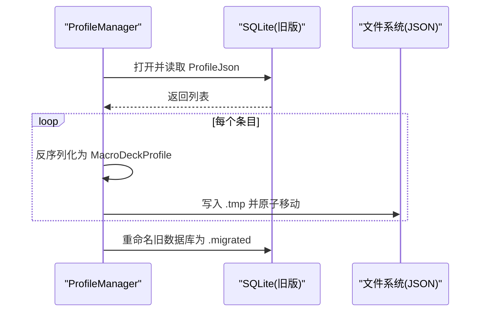
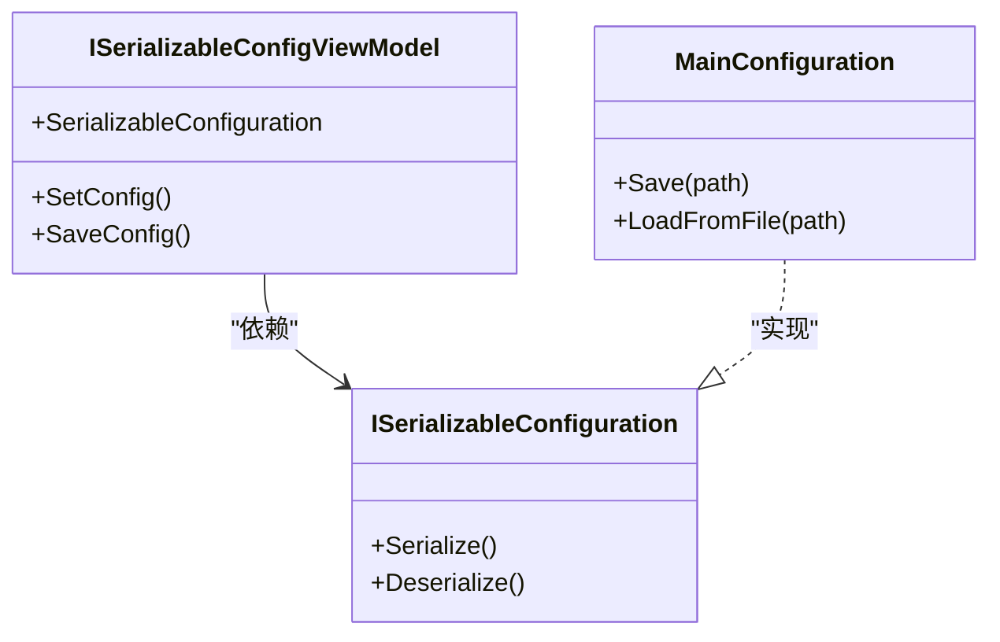
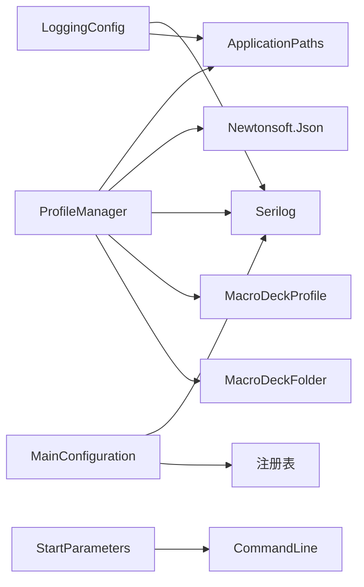

# 配置管理系统

<cite>
**本文引用的文件**
- [MacroDeckProfile.cs](file://src/MacroDeck/Profiles/MacroDeckProfile.cs)
- [ProfileManager.cs](file://src/MacroDeck/Profiles/ProfileManager.cs)
- [MacroDeckFolder.cs](file://src/MacroDeck/Folders/MacroDeckFolder.cs)
- [MainConfiguration.cs](file://src/MacroDeck/Configuration/MainConfiguration.cs)
- [ApplicationPaths.cs](file://src/MacroDeck/StartupConfig/ApplicationPaths.cs)
- [LoggingConfig.cs](file://src/MacroDeck/StartupConfig/LoggingConfig.cs)
- [StartParameters.cs](file://src/MacroDeck/StartupConfig/StartParameters.cs)
- [ProfileJson.cs](file://src/MacroDeck/JSON/ProfileJson.cs)
- [FolderJson.cs](file://src/MacroDeck/JSON/FolderJson.cs)
- [IconPackJson.cs](file://src/MacroDeck/JSON/IconPackJson.cs)
- [ISerializableConfiguration.cs](file://src/MacroDeck/Models/ISerializableConfiguration.cs)
- [ISerializableConfigViewModel.cs](file://src/MacroDeck/ViewModels/ISerializableConfigViewModel.cs)
</cite>

## 目录
1. [简介](#简介)
2. [项目结构](#项目结构)
3. [核心组件](#核心组件)
4. [架构总览](#架构总览)
5. [详细组件分析](#详细组件分析)
6. [依赖分析](#依赖分析)
7. [性能考虑](#性能考虑)
8. [故障排除指南](#故障排除指南)
9. [结论](#结论)
10. [附录](#附录)

## 简介
本文件系统性梳理 Macro-Deck 的配置管理系统，覆盖以下主题：
- 配置文件结构与路径管理策略
- 配置加载与保存机制（含 JSON 序列化/反序列化）
- 启动配置（应用路径、日志、网络等）管理
- 配置迁移与版本兼容
- 配置验证与错误处理
- 配置缓存与性能优化
- 配置与用户界面的绑定关系
- 开发者扩展与用户定制指南

## 项目结构
配置相关代码主要分布在以下命名空间与文件中：
- 配置模型与序列化：Configuration、Models、ViewModels
- 路径与启动参数：StartupConfig
- 配置持久化与迁移：Profiles、JSON
- 日志与运行时行为：Logging、StartupConfig

**图表来源**
- [MainConfiguration.cs:1-103](file://src/MacroDeck/Configuration/MainConfiguration.cs#L1-L103)
- [ApplicationPaths.cs:1-143](file://src/MacroDeck/StartupConfig/ApplicationPaths.cs#L1-L143)
- [LoggingConfig.cs:1-56](file://src/MacroDeck/StartupConfig/LoggingConfig.cs#L1-L56)
- [StartParameters.cs:1-78](file://src/MacroDeck/StartupConfig/StartParameters.cs#L1-L78)
- [ProfileManager.cs:1-640](file://src/MacroDeck/Profiles/ProfileManager.cs#L1-L640)
- [MacroDeckProfile.cs:1-75](file://src/MacroDeck/Profiles/MacroDeckProfile.cs#L1-L75)
- [MacroDeckFolder.cs:1-60](file://src/MacroDeck/Folders/MacroDeckFolder.cs#L1-L60)
- [ProfileJson.cs:1-11](file://src/MacroDeck/JSON/ProfileJson.cs#L1-L11)
- [FolderJson.cs:1-11](file://src/MacroDeck/JSON/FolderJson.cs#L1-L11)
- [IconPackJson.cs:1-11](file://src/MacroDeck/JSON/IconPackJson.cs#L1-L11)
- [ISerializableConfiguration.cs:1-15](file://src/MacroDeck/Models/ISerializableConfiguration.cs#L1-L15)
- [ISerializableConfigViewModel.cs:1-13](file://src/MacroDeck/ViewModels/ISerializableConfigViewModel.cs#L1-L13)

**章节来源**
- [ApplicationPaths.cs:36-102](file://src/MacroDeck/StartupConfig/ApplicationPaths.cs#L36-L102)
- [ProfileManager.cs:205-311](file://src/MacroDeck/Profiles/ProfileManager.cs#L205-L311)

## 核心组件
- 主配置 MainConfiguration：集中管理自动启动、更新策略、连接与 SSL、主机地址与端口、语言、隐私选项等；支持从文件读取与写入。
- 配置管理器 ProfileManager：负责配置文件的加载、保存、迁移、默认配置生成、当前配置选择、文件夹与按钮的绑定与更新。
- 配置模型 MacroDeckProfile：描述一个配置文件的顶层结构，包含标识、显示名、网格布局、按钮样式、目标设备类型及可定制性判断。
- 文件夹模型 MacroDeckFolder：描述配置中的文件夹层级与按钮集合，支持根目录识别与设备触发逻辑。
- 路径管理 ApplicationPaths：根据便携模式或用户模式确定各子目录位置，并在启动时检查与创建缺失目录。
- 日志配置 LoggingConfig：统一构建 Serilog 记录器，输出到控制台、文件与调试控制台，并按需集成匿名错误上报。
- 启动参数 StartParameters：解析命令行参数，支持端口、更新通道、便携模式、日志级别等。

**章节来源**
- [MainConfiguration.cs:9-102](file://src/MacroDeck/Configuration/MainConfiguration.cs#L9-L102)
- [ProfileManager.cs:20-640](file://src/MacroDeck/Profiles/ProfileManager.cs#L20-L640)
- [MacroDeckProfile.cs:7-75](file://src/MacroDeck/Profiles/MacroDeckProfile.cs#L7-L75)
- [MacroDeckFolder.cs:6-60](file://src/MacroDeck/Folders/MacroDeckFolder.cs#L6-L60)
- [ApplicationPaths.cs:6-143](file://src/MacroDeck/StartupConfig/ApplicationPaths.cs#L6-L143)
- [LoggingConfig.cs:11-56](file://src/MacroDeck/StartupConfig/LoggingConfig.cs#L11-L56)
- [StartParameters.cs:5-78](file://src/MacroDeck/StartupConfig/StartParameters.cs#L5-L78)

## 架构总览
配置系统的运行流程如下：
- 启动阶段：解析启动参数，初始化路径，创建日志记录器，加载主配置与配置文件。
- 运行阶段：根据当前配置渲染按钮标签、响应变量变化、维护窗口焦点切换与文件夹切换。
- 关闭阶段：保存所有配置，清理临时目录。

**图表来源**
- [StartParameters.cs:36-55](file://src/MacroDeck/StartupConfig/StartParameters.cs#L36-L55)
- [ApplicationPaths.cs:36-102](file://src/MacroDeck/StartupConfig/ApplicationPaths.cs#L36-L102)
- [LoggingConfig.cs:21-49](file://src/MacroDeck/StartupConfig/LoggingConfig.cs#L21-L49)
- [MainConfiguration.cs:98-101](file://src/MacroDeck/Configuration/MainConfiguration.cs#L98-L101)
- [ProfileManager.cs:205-311](file://src/MacroDeck/Profiles/ProfileManager.cs#L205-L311)

## 详细组件分析

### 配置文件结构与 JSON 模型
- 配置文件采用 JSON 格式存储，每个配置文件以配置 ID 命名，位于用户目录下的 profiles 子目录。
- 配置文件由 ProfileManager 负责加载与保存，使用 Newtonsoft.Json 进行序列化/反序列化。
- 旧版使用 SQLite 存储，通过 ProfileJson 实体承载 JSON 字符串，迁移后转换为独立 JSON 文件。

**图表来源**
- [ProfileJson.cs:5-11](file://src/MacroDeck/JSON/ProfileJson.cs#L5-L11)
- [MacroDeckProfile.cs:49-57](file://src/MacroDeck/Profiles/MacroDeckProfile.cs#L49-L57)
- [MacroDeckFolder.cs:52-58](file://src/MacroDeck/Folders/MacroDeckFolder.cs#L52-L58)

**章节来源**
- [ProfileManager.cs:205-311](file://src/MacroDeck/Profiles/ProfileManager.cs#L205-L311)
- [ProfileManager.cs:382-456](file://src/MacroDeck/Profiles/ProfileManager.cs#L382-L456)
- [ProfileJson.cs:5-11](file://src/MacroDeck/JSON/ProfileJson.cs#L5-L11)

### 配置加载与保存机制
- 加载流程：
  - 迁移旧版 SQLite 数据库至 JSON 文件（若存在且目标目录为空）。
  - 扫描 profiles 目录下所有 .json 文件，逐个反序列化为 MacroDeckProfile。
  - 若无配置，创建默认配置并保存。
  - 从用户设置中恢复当前选中的配置，否则选择首个配置。
  - 确保当前配置至少包含一个根文件夹，否则创建并保存。
  - 对所有按钮执行绑定状态、热键与变量标签更新。
- 保存流程：
  - 使用锁保证并发安全。
  - 将每个配置序列化为 JSON，先写入 .tmp 再原子移动覆盖，避免部分写入。
  - 删除已不存在的配置文件，保持磁盘与内存一致。
  - 触发“已保存”事件。

**图表来源**
- [ProfileManager.cs:205-311](file://src/MacroDeck/Profiles/ProfileManager.cs#L205-L311)
- [ProfileManager.cs:313-380](file://src/MacroDeck/Profiles/ProfileManager.cs#L313-L380)
- [ProfileManager.cs:382-456](file://src/MacroDeck/Profiles/ProfileManager.cs#L382-L456)

**章节来源**
- [ProfileManager.cs:205-380](file://src/MacroDeck/Profiles/ProfileManager.cs#L205-L380)

### 路径管理策略
- 便携模式：用户目录指向程序主目录下的 Data 子目录。
- 用户模式：用户目录指向 %APPDATA%\Macro Deck。
- 自动创建缺失目录：包括 logs、plugins、configs、credentials、iconpacks、backups、profiles、.temp 等。
- 清理临时目录：启动时清空 .temp 下的文件与子目录。

**图表来源**
- [ApplicationPaths.cs:36-102](file://src/MacroDeck/StartupConfig/ApplicationPaths.cs#L36-L102)

**章节来源**
- [ApplicationPaths.cs:36-143](file://src/MacroDeck/StartupConfig/ApplicationPaths.cs#L36-L143)

### 启动配置管理（应用路径、日志、网络）
- 应用路径与主目录：通过进程路径与基目录确定可执行文件与主目录。
- 日志配置：控制台、滚动文件、调试控制台输出；可选集成 Sentry 匿名错误上报。
- 网络设置：主机地址、端口、SSL 开关与证书、ADB 服务器开关与自动启动应用、新连接提示与阻断策略。
- 自动启动：通过注册表 HKCU\Software\Microsoft\Windows\CurrentVersion\Run 控制开机自启。

**图表来源**
- [MainConfiguration.cs:9-102](file://src/MacroDeck/Configuration/MainConfiguration.cs#L9-L102)
- [LoggingConfig.cs:11-56](file://src/MacroDeck/StartupConfig/LoggingConfig.cs#L11-L56)
- [ApplicationPaths.cs:6-143](file://src/MacroDeck/StartupConfig/ApplicationPaths.cs#L6-L143)

**章节来源**
- [MainConfiguration.cs:13-76](file://src/MacroDeck/Configuration/MainConfiguration.cs#L13-L76)
- [LoggingConfig.cs:21-49](file://src/MacroDeck/StartupConfig/LoggingConfig.cs#L21-L49)
- [ApplicationPaths.cs:12-61](file://src/MacroDeck/StartupConfig/ApplicationPaths.cs#L12-L61)

### 配置迁移与版本兼容
- 旧版 SQLite 迁移：检测 legacy 文件是否存在且目标 JSON 目录为空；读取 ProfileJson 列表，逐条反序列化为 MacroDeckProfile 并写回 JSON 文件；完成后重命名旧数据库文件。
- 版本兼容：反序列化时启用 TypeNameHandling.Auto 与忽略循环引用，错误回调统一记录并跳过损坏条目。

**图表来源**
- [ProfileManager.cs:382-456](file://src/MacroDeck/Profiles/ProfileManager.cs#L382-L456)
- [ProfileJson.cs:5-11](file://src/MacroDeck/JSON/ProfileJson.cs#L5-L11)

**章节来源**
- [ProfileManager.cs:382-456](file://src/MacroDeck/Profiles/ProfileManager.cs#L382-L456)

### 配置验证规则与错误处理
- 反序列化错误处理：对单个配置文件的反序列化错误进行捕获并标记为已处理，避免中断整体加载。
- 序列化错误处理：对单个配置的序列化异常进行记录并跳过，继续处理其他配置。
- 迁移错误处理：对单条迁移记录失败进行记录并继续迁移。
- 默认值与健壮性：未指定 ProfileId 时自动生成；无配置时创建默认配置；无根文件夹时自动创建。

**章节来源**
- [ProfileManager.cs:218-246](file://src/MacroDeck/Profiles/ProfileManager.cs#L218-L246)
- [ProfileManager.cs:338-353](file://src/MacroDeck/Profiles/ProfileManager.cs#L338-L353)
- [ProfileManager.cs:415-443](file://src/MacroDeck/Profiles/ProfileManager.cs#L415-L443)

### 配置缓存策略与性能优化
- 内存缓存：ProfileManager 在内存中维护 Profiles 与 CurrentProfile，避免频繁 IO。
- 原子写入：保存时先写入 .tmp 再移动覆盖，降低部分写入风险。
- 锁保护：使用互斥锁保证并发保存不冲突。
- 并行更新：变量变更时并行更新相关按钮标签，提升响应速度。
- 资源释放：MacroDeckProfile 与 MacroDeckFolder 使用非托管缓冲区并在 Dispose 中释放，减少内存碎片。

**章节来源**
- [ProfileManager.cs:313-380](file://src/MacroDeck/Profiles/ProfileManager.cs#L313-L380)
- [ProfileManager.cs:135-203](file://src/MacroDeck/Profiles/ProfileManager.cs#L135-L203)
- [MacroDeckProfile.cs:13-47](file://src/MacroDeck/Profiles/MacroDeckProfile.cs#L13-L47)
- [MacroDeckFolder.cs:12-48](file://src/MacroDeck/Folders/MacroDeckFolder.cs#L12-L48)

### 配置与用户界面的绑定关系
- 配置到视图模型：ISerializableConfigViewModel 定义了配置设置与保存的契约，便于 UI 层调用。
- 配置到模型：ISerializableConfiguration 提供序列化与反序列化能力，配合 System.Text.Json 或 Newtonsoft.Json。
- 按钮与动作：ProfileManager 在加载后为每个 ActionButton 更新绑定状态、热键与变量标签，确保 UI 即时反映配置。

**图表来源**
- [ISerializableConfigViewModel.cs:5-12](file://src/MacroDeck/ViewModels/ISerializableConfigViewModel.cs#L5-L12)
- [ISerializableConfiguration.cs:5-14](file://src/MacroDeck/Models/ISerializableConfiguration.cs#L5-L14)
- [MainConfiguration.cs:77-101](file://src/MacroDeck/Configuration/MainConfiguration.cs#L77-L101)

**章节来源**
- [ISerializableConfigViewModel.cs:5-12](file://src/MacroDeck/ViewModels/ISerializableConfigViewModel.cs#L5-L12)
- [ISerializableConfiguration.cs:5-14](file://src/MacroDeck/Models/ISerializableConfiguration.cs#L5-L14)
- [ProfileManager.cs:295-308](file://src/MacroDeck/Profiles/ProfileManager.cs#L295-L308)

### 开发者扩展与用户定制指南
- 开发者扩展：
  - 新增配置项：在 MainConfiguration 中添加属性，并在 Save/Load 流程中保持兼容。
  - 新增配置文件：遵循 ProfileManager 的加载/保存模式，使用 JSON 文件并确保唯一 ID。
  - 插件配置：通过插件配置目录与凭据目录进行隔离管理。
- 用户定制：
  - 通过 UI 创建/删除配置与文件夹，系统自动保存。
  - 修改网络与 SSL 设置、语言与自动更新策略，重启生效或即时生效（取决于具体项）。
  - 使用命令行参数调整运行行为（如便携模式、日志级别、端口等）。

**章节来源**
- [MainConfiguration.cs:13-76](file://src/MacroDeck/Configuration/MainConfiguration.cs#L13-L76)
- [ProfileManager.cs:539-578](file://src/MacroDeck/Profiles/ProfileManager.cs#L539-L578)
- [StartParameters.cs:36-77](file://src/MacroDeck/StartupConfig/StartParameters.cs#L36-L77)

## 依赖分析
- ProfileManager 依赖 ApplicationPaths 获取路径、依赖 Serilog 记录日志、依赖 Newtonsoft.Json 处理序列化。
- MainConfiguration 依赖 Serilog 记录日志、依赖注册表实现自动启动。
- MacroDeckProfile 与 MacroDeckFolder 作为数据容器，被 ProfileManager 管理。
- LoggingConfig 依赖 Serilog 与 ApplicationPaths 的日志目录。
- StartParameters 依赖 CommandLine 解析命令行。

**图表来源**
- [ProfileManager.cs:1-17](file://src/MacroDeck/Profiles/ProfileManager.cs#L1-L17)
- [MainConfiguration.cs:1-6](file://src/MacroDeck/Configuration/MainConfiguration.cs#L1-L6)
- [LoggingConfig.cs:1-8](file://src/MacroDeck/StartupConfig/LoggingConfig.cs#L1-L8)
- [StartParameters.cs:1](file://src/MacroDeck/StartupConfig/StartParameters.cs#L1)

**章节来源**
- [ProfileManager.cs:1-17](file://src/MacroDeck/Profiles/ProfileManager.cs#L1-L17)
- [MainConfiguration.cs:1-6](file://src/MacroDeck/Configuration/MainConfiguration.cs#L1-L6)
- [LoggingConfig.cs:1-8](file://src/MacroDeck/StartupConfig/LoggingConfig.cs#L1-L8)
- [StartParameters.cs:1](file://src/MacroDeck/StartupConfig/StartParameters.cs#L1)

## 性能考虑
- 使用锁保护保存操作，避免并发写入导致的数据损坏。
- 采用原子写入（.tmp + 移动）减少部分写入风险。
- 变量标签更新使用并行处理，提高响应速度。
- 非托管缓冲区用于大对象，及时释放避免内存泄漏。
- 日志滚动与大小限制，平衡可观测性与磁盘占用。

[本节为通用建议，无需特定文件引用]

## 故障排除指南
- 配置无法加载：
  - 检查 profiles 目录权限与磁盘空间。
  - 查看日志文件定位反序列化错误。
  - 如存在旧版数据库，尝试删除 .migrated 文件并重新迁移。
- 保存失败：
  - 确认 .tmp 写入权限与磁盘空间。
  - 检查是否有其他进程占用配置文件。
- 日志不输出：
  - 检查日志目录创建与写入权限。
  - 确认日志级别设置与控制台输出。
- 窗口焦点切换异常：
  - 检查变量变更监听与模板渲染是否正常。
  - 确认设备连接状态与客户端会话。

**章节来源**
- [ProfileManager.cs:218-246](file://src/MacroDeck/Profiles/ProfileManager.cs#L218-L246)
- [ProfileManager.cs:338-353](file://src/MacroDeck/Profiles/ProfileManager.cs#L338-L353)
- [ApplicationPaths.cs:64-102](file://src/MacroDeck/StartupConfig/ApplicationPaths.cs#L64-L102)
- [LoggingConfig.cs:21-49](file://src/MacroDeck/StartupConfig/LoggingConfig.cs#L21-L49)

## 结论
Macro-Deck 的配置管理系统以 JSON 文件为核心，结合路径管理、日志与启动参数，实现了稳定可靠的配置加载、保存与迁移。通过锁保护、原子写入与资源释放等机制，保障了性能与可靠性。开发者可通过接口扩展配置项，用户可通过 UI 便捷地定制配置。

[本节为总结，无需特定文件引用]

## 附录
- 配置文件命名规范：以配置 ID 命名的 .json 文件。
- 旧版实体映射：ProfileJson、FolderJson、IconPackJson 用于承载旧版 JSON 字符串。
- 序列化策略：Newtonsoft.Json 的 TypeNameHandling.Auto 与 NullValueHandling.Ignore，错误回调统一处理。

**章节来源**
- [ProfileJson.cs:5-11](file://src/MacroDeck/JSON/ProfileJson.cs#L5-L11)
- [FolderJson.cs:5-11](file://src/MacroDeck/JSON/FolderJson.cs#L5-L11)
- [IconPackJson.cs:5-11](file://src/MacroDeck/JSON/IconPackJson.cs#L5-L11)
- [ProfileManager.cs:218-228](file://src/MacroDeck/Profiles/ProfileManager.cs#L218-L228)
- [ProfileManager.cs:333-347](file://src/MacroDeck/Profiles/ProfileManager.cs#L333-L347)