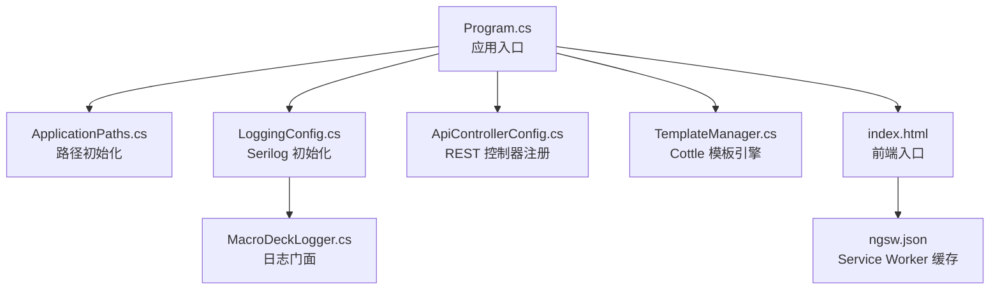
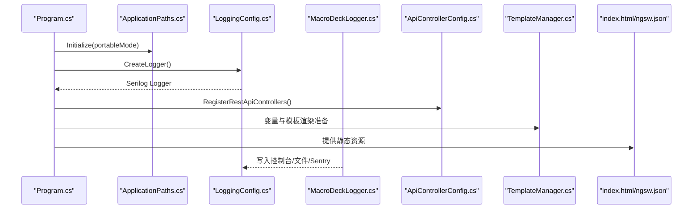
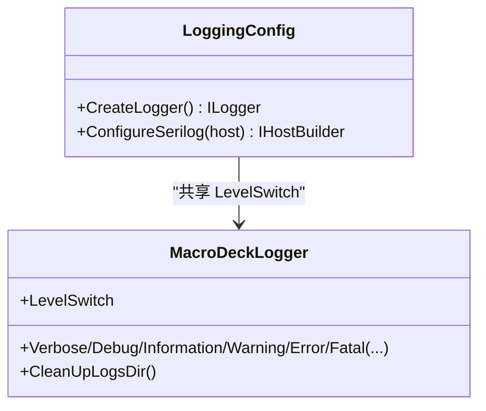
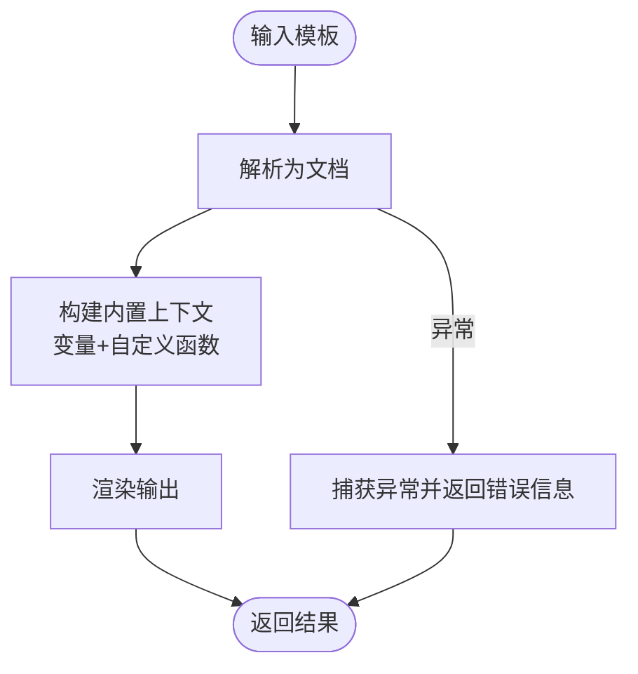
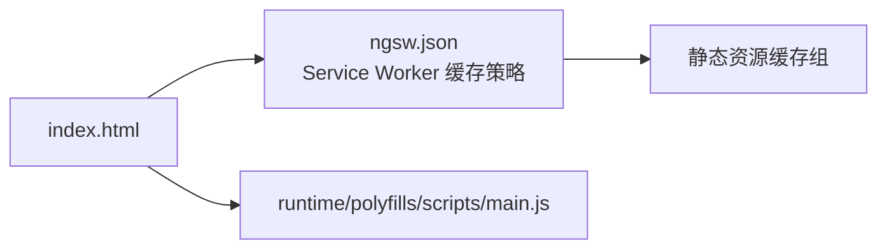
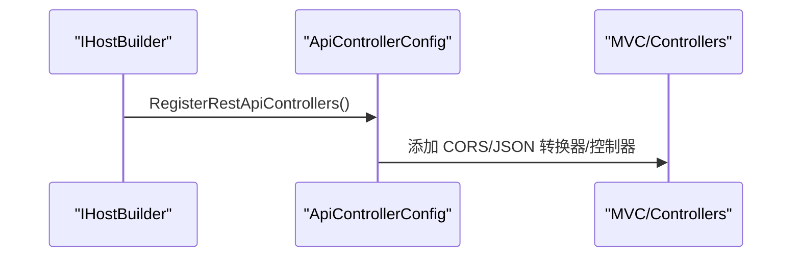
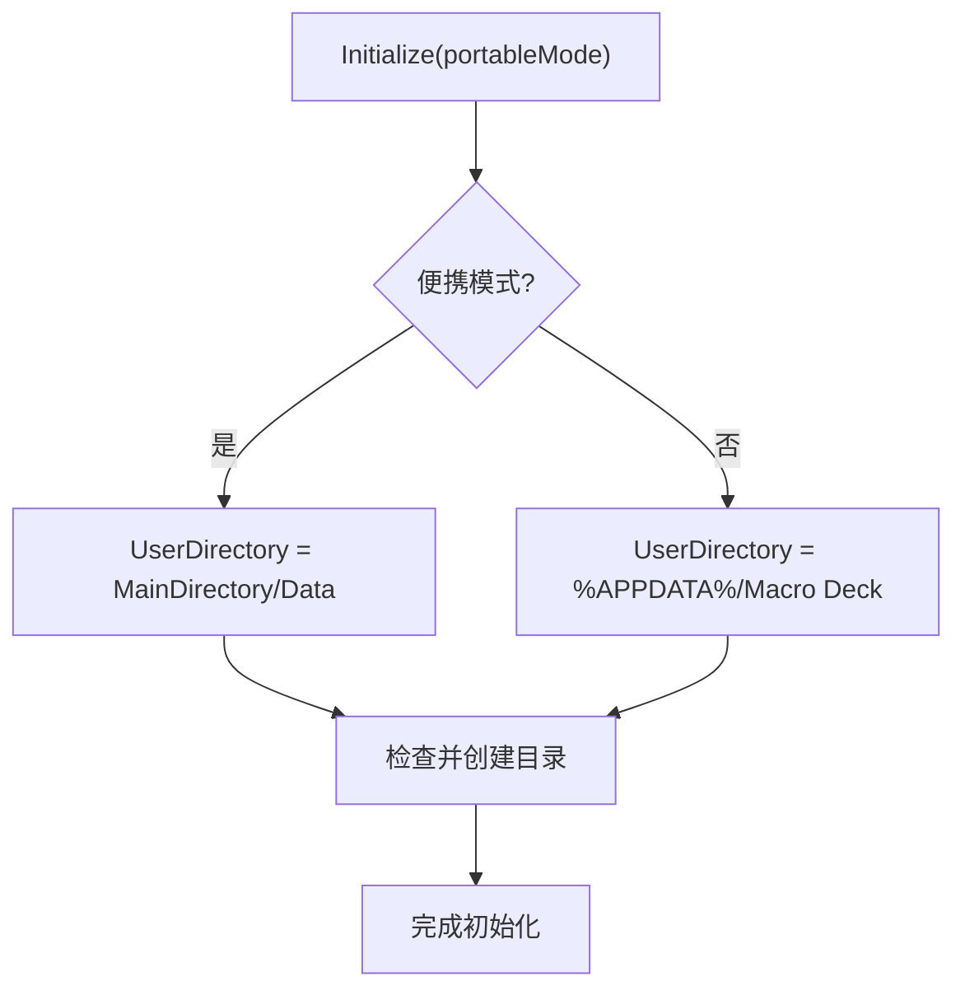
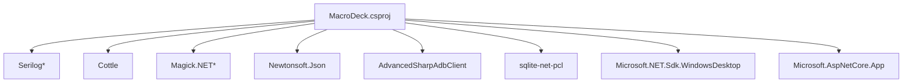

# 技术栈

<cite>
**本文引用的文件**
- [MacroDeck.csproj](file://src/MacroDeck/MacroDeck.csproj)
- [Directory.Packages.props](file://Directory.Packages.props)
- [Program.cs](file://src/MacroDeck/Program.cs)
- [launchSettings.json](file://src/MacroDeck/Properties/launchSettings.json)
- [MacroDeckLogger.cs](file://src/MacroDeck/Logging/MacroDeckLogger.cs)
- [LoggingConfig.cs](file://src/MacroDeck/StartupConfig/LoggingConfig.cs)
- [ApplicationPaths.cs](file://src/MacroDeck/StartupConfig/ApplicationPaths.cs)
- [TemplateManager.cs](file://src/MacroDeck/CottleIntegration/TemplateManager.cs)
- [index.html](file://src/MacroDeck/wwwroot/client/index.html)
- [ngsw.json](file://src/MacroDeck/wwwroot/client/ngsw.json)
- [ApiControllerConfig.cs](file://src/MacroDeck/StartupConfig/ApiControllerConfig.cs)
- [Constants.cs](file://src/MacroDeck/Constants.cs)
</cite>

## 目录
1. [简介](#简介)
2. [项目结构](#项目结构)
3. [核心组件](#核心组件)
4. [架构总览](#架构总览)
5. [详细组件分析](#详细组件分析)
6. [依赖关系分析](#依赖关系分析)
7. [性能考量](#性能考量)
8. [故障排查指南](#故障排查指南)
9. [结论](#结论)
10. [附录](#附录)

## 简介
本文件面向 Macro-Deck 项目的开发者与维护者，系统梳理其技术栈与实现要点，覆盖后端（.NET Desktop/WPF/WinForms）、日志体系（Serilog/Sentry）、模板渲染（Cottle）、前端静态资源与缓存策略（Angular/Service Worker），以及关键第三方库与版本管理方式。文档同时给出技术选型理由、版本兼容性与最低系统要求、开发工具链与构建配置建议。

## 项目结构
项目采用“单解决方案多模块”组织方式：核心应用位于 src/MacroDeck，包含 WinForms/WPF 前端界面、服务端（ASP.NET Core）与客户端静态资源；测试位于 tests/MacroDeck.Tests；打包与安装脚本位于 setup；CI/CD 配置位于 .github。

- 后端核心
  - 应用入口与异常处理：Program.cs
  - 路径与目录初始化：ApplicationPaths.cs
  - 日志系统：LoggingConfig.cs、MacroDeckLogger.cs
  - 模板引擎集成：TemplateManager.cs
  - API 控制器注册：ApiControllerConfig.cs
  - 常量定义：Constants.cs
- 前端静态资源
  - 客户端入口页面：index.html
  - Service Worker 缓存清单：ngsw.json
- 构建与依赖
  - 项目文件：MacroDeck.csproj
  - 中央包版本：Directory.Packages.props
  - 启动参数与调试：launchSettings.json

图表来源
- [Program.cs:1-80](file://src/MacroDeck/Program.cs#L1-L80)
- [ApplicationPaths.cs:1-143](file://src/MacroDeck/StartupConfig/ApplicationPaths.cs#L1-L143)
- [LoggingConfig.cs:1-56](file://src/MacroDeck/StartupConfig/LoggingConfig.cs#L1-L56)
- [MacroDeckLogger.cs:1-361](file://src/MacroDeck/Logging/MacroDeckLogger.cs#L1-L361)
- [ApiControllerConfig.cs:1-32](file://src/MacroDeck/StartupConfig/ApiControllerConfig.cs#L1-L32)
- [TemplateManager.cs:1-181](file://src/MacroDeck/CottleIntegration/TemplateManager.cs#L1-L181)
- [index.html:1-36](file://src/MacroDeck/wwwroot/client/index.html#L1-L36)
- [ngsw.json:1-169](file://src/MacroDeck/wwwroot/client/ngsw.json#L1-L169)

章节来源
- [MacroDeck.csproj:1-363](file://src/MacroDeck/MacroDeck.csproj#L1-L363)
- [Directory.Packages.props:1-35](file://Directory.Packages.props#L1-L35)
- [Program.cs:1-80](file://src/MacroDeck/Program.cs#L1-L80)
- [launchSettings.json:1-9](file://src/MacroDeck/Properties/launchSettings.json#L1-L9)

## 核心组件
- .NET Desktop 与 UI 技术
  - SDK 类型：Microsoft.NET.Sdk.WindowsDesktop
  - 启用 WPF 与 WinForms，输出类型为 WinExe，目标平台为 win-x64
  - 使用 Microsoft.Extensions.Hosting/DependencyInjection 进行主机化与依赖注入
- 日志系统
  - Serilog 作为核心日志框架，结合 Console/File/Sentry sinks
  - 提供可运行时调整的日志级别开关，支持插件源上下文增强
- 模板引擎
  - Cottle 用于变量与表达式渲染，内置函数与关键字集合
- 前端静态资源
  - Angular 应用产物通过 wwwroot/client 提供，包含入口页、样式与脚本
  - 使用 Service Worker（ngsw.json）进行离线缓存与渐进式更新
- API 层
  - ASP.NET Core MVC 注册，启用 CORS 允许任意来源，枚举序列化为字符串
- 路径与配置
  - ApplicationPaths 统一管理用户数据目录、日志、插件、备份等路径
  - 支持便携模式与标准模式两种部署形态

章节来源
- [MacroDeck.csproj:1-363](file://src/MacroDeck/MacroDeck.csproj#L1-L363)
- [LoggingConfig.cs:1-56](file://src/MacroDeck/StartupConfig/LoggingConfig.cs#L1-L56)
- [MacroDeckLogger.cs:1-361](file://src/MacroDeck/Logging/MacroDeckLogger.cs#L1-L361)
- [TemplateManager.cs:1-181](file://src/MacroDeck/CottleIntegration/TemplateManager.cs#L1-L181)
- [index.html:1-36](file://src/MacroDeck/wwwroot/client/index.html#L1-L36)
- [ngsw.json:1-169](file://src/MacroDeck/wwwroot/client/ngsw.json#L1-L169)
- [ApiControllerConfig.cs:1-32](file://src/MacroDeck/StartupConfig/ApiControllerConfig.cs#L1-L32)
- [ApplicationPaths.cs:1-143](file://src/MacroDeck/StartupConfig/ApplicationPaths.cs#L1-L143)

## 架构总览
下图展示从应用启动到日志、模板、API 与前端资源的整体交互流程。

图表来源
- [Program.cs:1-80](file://src/MacroDeck/Program.cs#L1-L80)
- [ApplicationPaths.cs:1-143](file://src/MacroDeck/StartupConfig/ApplicationPaths.cs#L1-L143)
- [LoggingConfig.cs:1-56](file://src/MacroDeck/StartupConfig/LoggingConfig.cs#L1-L56)
- [MacroDeckLogger.cs:1-361](file://src/MacroDeck/Logging/MacroDeckLogger.cs#L1-L361)
- [ApiControllerConfig.cs:1-32](file://src/MacroDeck/StartupConfig/ApiControllerConfig.cs#L1-L32)
- [TemplateManager.cs:1-181](file://src/MacroDeck/CottleIntegration/TemplateManager.cs#L1-L181)
- [index.html:1-36](file://src/MacroDeck/wwwroot/client/index.html#L1-L36)
- [ngsw.json:1-169](file://src/MacroDeck/wwwroot/client/ngsw.json#L1-L169)

## 详细组件分析

### 组件一：日志系统（Serilog + Sentry）
- 设计要点
  - 在应用启动早期即创建全局 Logger，确保从进程开始就具备日志能力
  - 通过 LoggingLevelSwitch 实现运行时日志级别动态调整
  - 插件事件与宿主事件区分记录，便于 Sentry 条件上报
  - 控制对常见框架命名空间的日志级别，降低噪音
- 关键类与职责
  - LoggingConfig：构建 Serilog 配置，绑定控制台、文件与可选 Sentry sink
  - MacroDeckLogger：统一日志 API，封装插件上下文与异常结构化写入
- 性能与可靠性
  - 文件滚动按天，单文件上限 50MB，避免磁盘占用过大
  - 异常捕获在应用域与 UI 线程层面均处理，防止崩溃未记录

图表来源
- [LoggingConfig.cs:1-56](file://src/MacroDeck/StartupConfig/LoggingConfig.cs#L1-L56)
- [MacroDeckLogger.cs:1-361](file://src/MacroDeck/Logging/MacroDeckLogger.cs#L1-L361)

章节来源
- [LoggingConfig.cs:1-56](file://src/MacroDeck/StartupConfig/LoggingConfig.cs#L1-L56)
- [MacroDeckLogger.cs:1-361](file://src/MacroDeck/Logging/MacroDeckLogger.cs#L1-L361)

### 组件二：模板引擎（Cottle）
- 设计要点
  - 提供操作符、函数、命令与特殊标记的完整关键字集
  - 将变量管理器中的变量映射为模板符号，并注入自定义函数（时间戳、定时器等）
  - 支持模板预处理与空白裁剪选项
- 处理流程
  - 解析模板为文档对象
  - 构建内置上下文（变量+函数）
  - 渲染输出或捕获错误并返回提示

图表来源
- [TemplateManager.cs:53-88](file://src/MacroDeck/CottleIntegration/TemplateManager.cs#L53-L88)

章节来源
- [TemplateManager.cs:1-181](file://src/MacroDeck/CottleIntegration/TemplateManager.cs#L1-L181)

### 组件三：前端静态资源与缓存（Angular + Service Worker）
- 设计要点
  - index.html 作为 SPA 入口，加载运行时、polyfills、脚本与主应用 bundle
  - ngsw.json 定义缓存组与更新策略，支持预取与后台更新
  - 通过 manifest.webmanifest 提升移动端体验
- 与后端协作
  - 前端资源随应用打包输出，由后端统一提供静态内容

图表来源
- [index.html:1-36](file://src/MacroDeck/wwwroot/client/index.html#L1-L36)
- [ngsw.json:1-169](file://src/MacroDeck/wwwroot/client/ngsw.json#L1-L169)

章节来源
- [index.html:1-36](file://src/MacroDeck/wwwroot/client/index.html#L1-L36)
- [ngsw.json:1-169](file://src/MacroDeck/wwwroot/client/ngsw.json#L1-L169)

### 组件四：API 控制器与跨域
- 设计要点
  - 注册 MVC 并添加枚举字符串转换器，允许尾随逗号
  - 配置 CORS 策略允许任意来源、方法与头部，并允许凭据
  - 通过程序集部件将控制器注册到 PartManager

图表来源
- [ApiControllerConfig.cs:1-32](file://src/MacroDeck/StartupConfig/ApiControllerConfig.cs#L1-L32)

章节来源
- [ApiControllerConfig.cs:1-32](file://src/MacroDeck/StartupConfig/ApiControllerConfig.cs#L1-L32)

### 组件五：应用路径与便携模式
- 设计要点
  - 便携模式将用户数据目录置于应用目录下的 Data 子目录
  - 标准模式使用 Windows 应用数据目录
  - 自动创建缺失目录并记录日志
- 清理策略
  - 定期清理临时目录与旧日志文件，保持磁盘健康

图表来源
- [ApplicationPaths.cs:36-102](file://src/MacroDeck/StartupConfig/ApplicationPaths.cs#L36-L102)

章节来源
- [ApplicationPaths.cs:1-143](file://src/MacroDeck/StartupConfig/ApplicationPaths.cs#L1-L143)

## 依赖关系分析
- 包管理与版本
  - 采用中央包版本管理，确保依赖一致性
  - 关键依赖包括：Serilog 生态、Cottle、Magick.NET、Newtonsoft.Json、AdvancedSharpAdbClient、SQLite 等
- 项目文件中的引用
  - 启用 WPF/WinForms，引用 ASP.NET Core 框架参考
  - 嵌入资源与 wwwroot 输出策略

图表来源
- [MacroDeck.csproj:42-67](file://src/MacroDeck/MacroDeck.csproj#L42-L67)
- [Directory.Packages.props:5-25](file://Directory.Packages.props#L5-L25)

章节来源
- [MacroDeck.csproj:1-363](file://src/MacroDeck/MacroDeck.csproj#L1-L363)
- [Directory.Packages.props:1-35](file://Directory.Packages.props#L1-L35)

## 性能考量
- 日志
  - 文件滚动与大小限制，避免频繁 IO 与大文件读写
  - 对常见框架命名空间设置较高阈值，减少噪声
- 模板渲染
  - 文档解析与上下文构建为纯内存操作，复杂模板需注意变量数量与函数调用开销
- 前端缓存
  - Service Worker 预取策略提升首开速度，但需关注缓存更新与存储占用
- 路径与清理
  - 定期清理临时目录与日志，避免磁盘压力

## 故障排查指南
- 启动异常
  - 应用域与 UI 线程异常均已捕获并记录，优先查看日志文件与调试控制台
- 日志级别
  - 通过运行参数或配置调整日志级别，必要时切换到更详细级别定位问题
- 路径权限
  - 若便携模式或标准模式目录无法创建，请检查当前用户权限与磁盘空间
- 前端资源
  - 若页面空白或资源加载失败，检查 index.html 的 base href 与静态资源路径是否正确

章节来源
- [Program.cs:68-79](file://src/MacroDeck/Program.cs#L68-L79)
- [LoggingConfig.cs:21-49](file://src/MacroDeck/StartupConfig/LoggingConfig.cs#L21-L49)
- [ApplicationPaths.cs:64-102](file://src/MacroDeck/StartupConfig/ApplicationPaths.cs#L64-L102)
- [index.html:8](file://src/MacroDeck/wwwroot/client/index.html#L8)

## 结论
Macro-Deck 的技术栈围绕 .NET Desktop/WPF/WinForms 构建，配合 Serilog 的强大日志生态、Cottle 的轻量模板能力与 Angular 前端产物及 Service Worker 缓存策略，形成稳定、可扩展且易于维护的桌面应用架构。通过中央包版本管理与清晰的启动与路径初始化逻辑，项目在可维护性与一致性方面表现良好。

## 附录

### 技术选型与优势
- .NET Desktop + WPF/WinForms
  - 优势：原生桌面体验、丰富的 UI 控件、与 Windows 深度集成
- Serilog + Sentry
  - 优势：结构化日志、多 sink 扩展、可选匿名错误上报
- Cottle
  - 优势：语法简洁、内置函数丰富、适合变量与条件渲染
- Angular + Service Worker
  - 优势：现代前端开发体验、离线缓存与渐进式更新

### 版本兼容性与最低系统要求
- 运行时与平台
  - 目标：win-x64，输出类型为 WinExe
  - 启用 WPF/WinForms，使用 Microsoft.Extensions.Hosting/DependencyInjection
- 建议的最低系统
  - Windows 10/11（桌面版），.NET 桌面运行时（随应用自包含分发）

章节来源
- [MacroDeck.csproj:1-30](file://src/MacroDeck/MacroDeck.csproj#L1-L30)
- [MacroDeck.csproj:66](file://src/MacroDeck/MacroDeck.csproj#L66)

### 开发工具链与构建配置
- 开发环境
  - Visual Studio 或 VS Code + .NET SDK
  - 启动参数示例：导出默认字符串、显示窗口、日志等级、测试通道、调试控制台
- 构建与打包
  - 使用 MSBuild 与 NuGet 中央版本管理
  - 自包含分发，目标平台为 win-x64

章节来源
- [launchSettings.json:1-9](file://src/MacroDeck/Properties/launchSettings.json#L1-L9)
- [Directory.Packages.props:1-35](file://Directory.Packages.props#L1-L35)
- [MacroDeck.csproj:20-25](file://src/MacroDeck/MacroDeck.csproj#L20-L25)