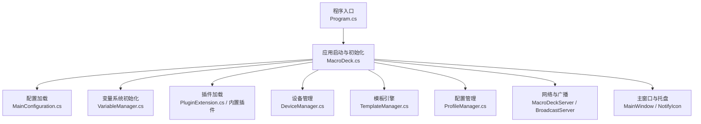
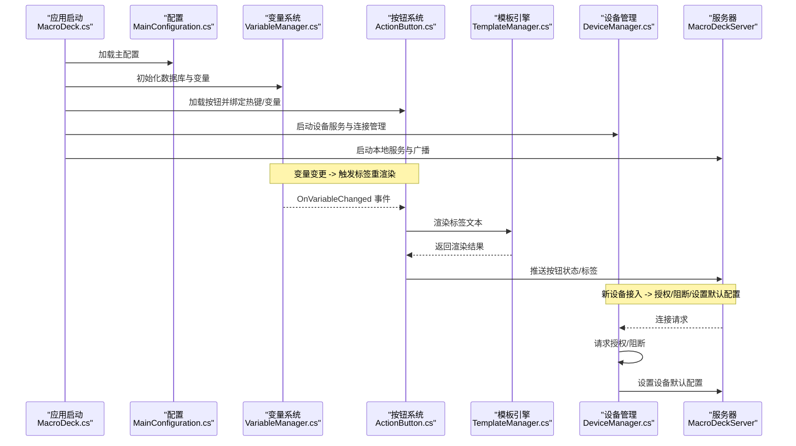
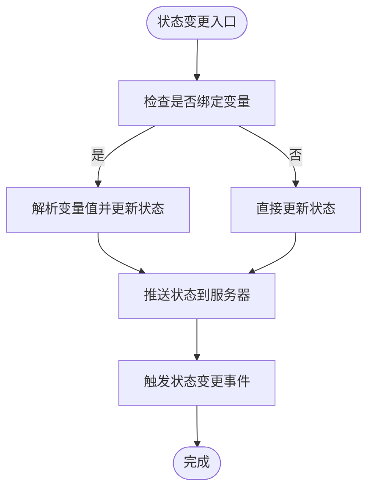
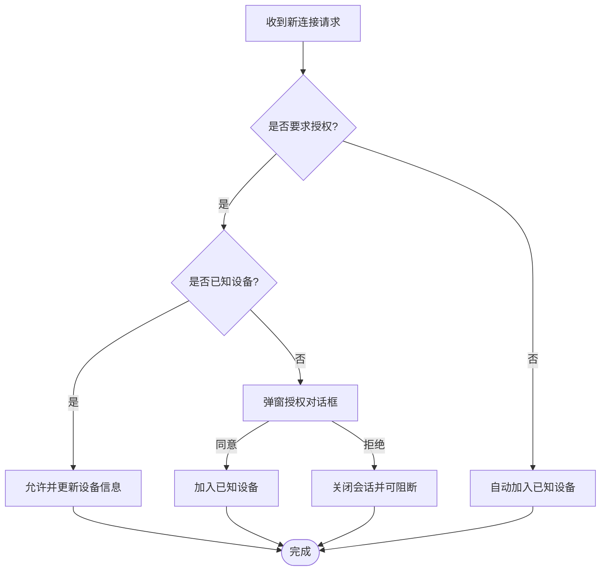
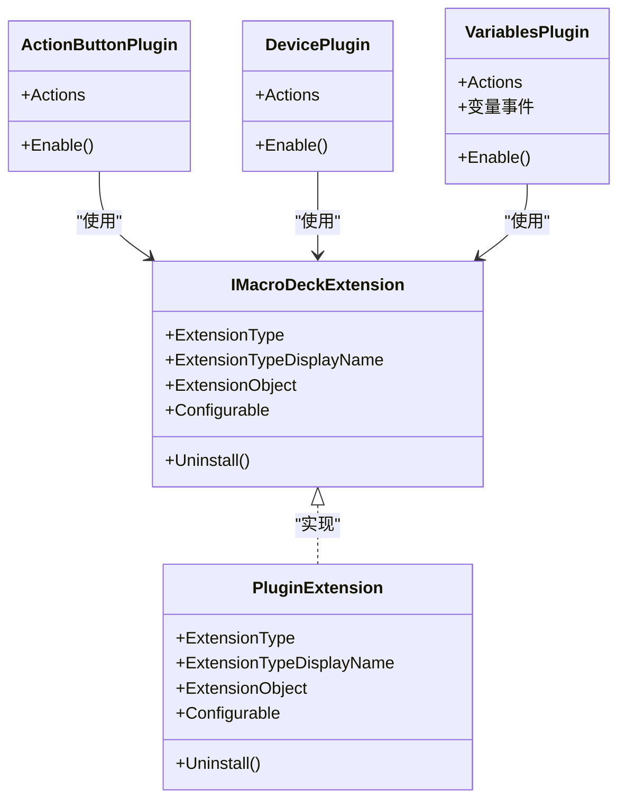
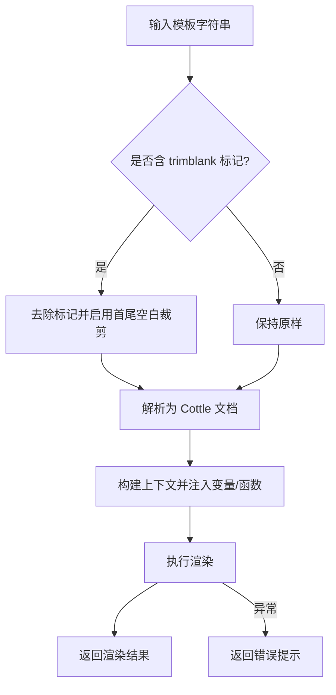
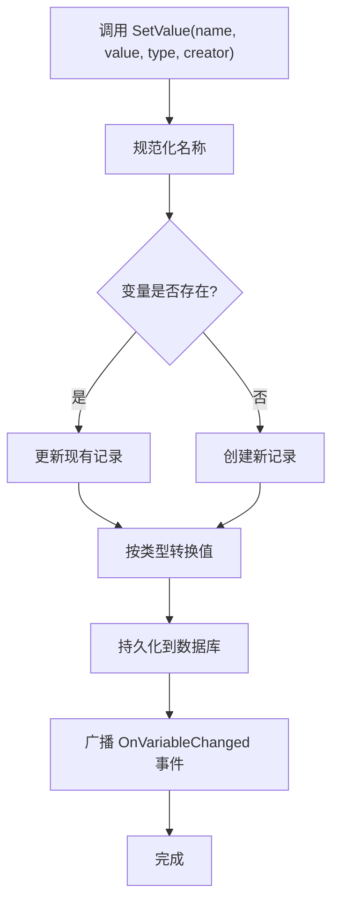
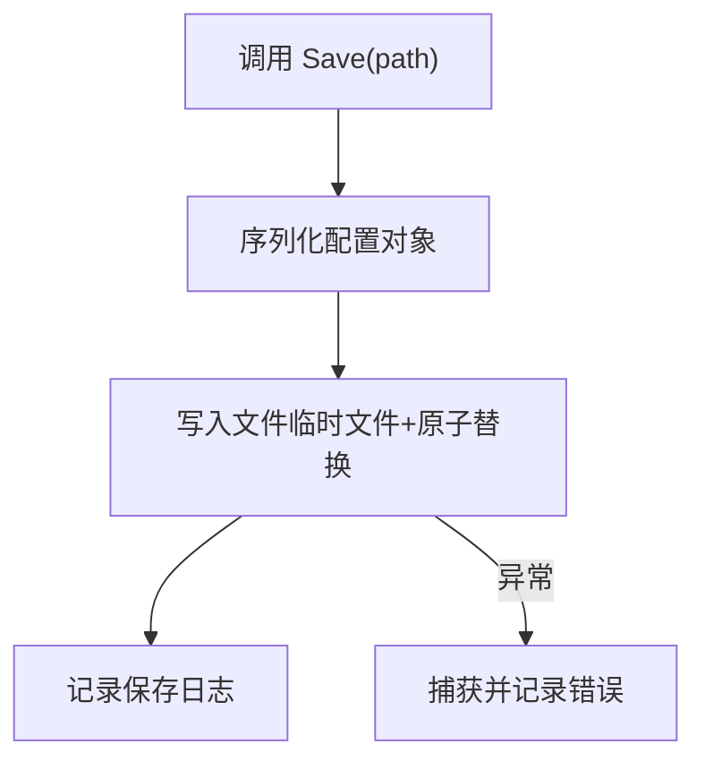
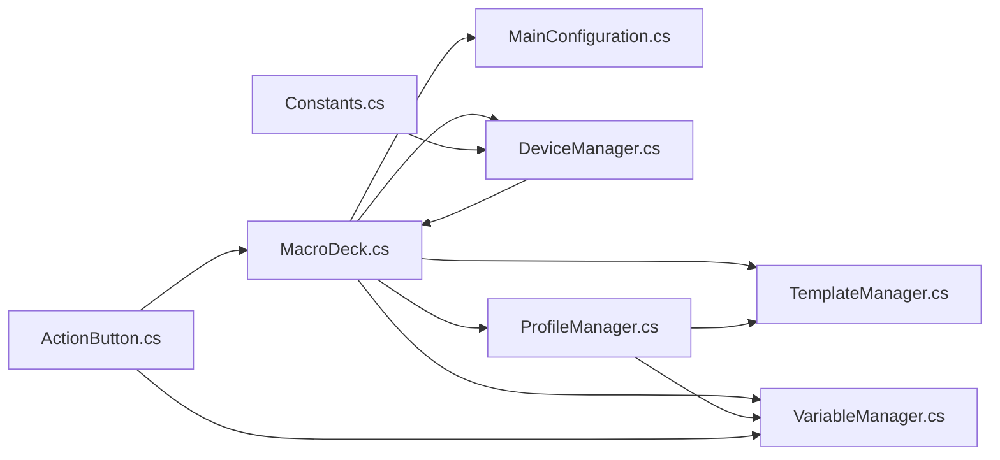

# 核心功能

<cite>
**本文引用的文件**
- [Program.cs](file://src/MacroDeck/Program.cs)
- [MacroDeck.cs](file://src/MacroDeck/MacroDeck.cs)
- [Constants.cs](file://src/MacroDeck/Constants.cs)
- [ActionButton.cs](file://src/MacroDeck/ActionButton/ActionButton.cs)
- [DeviceManager.cs](file://src/MacroDeck/Device/DeviceManager.cs)
- [TemplateManager.cs](file://src/MacroDeck/CottleIntegration/TemplateManager.cs)
- [VariableManager.cs](file://src/MacroDeck/Variables/VariableManager.cs)
- [MainConfiguration.cs](file://src/MacroDeck/Configuration/MainConfiguration.cs)
- [IMacroDeckExtension.cs](file://src/MacroDeck/Extension/IMacroDeckExtension.cs)
- [PluginExtension.cs](file://src/MacroDeck/Extension/PluginExtension.cs)
- [ActionButtonPlugin.cs](file://src/MacroDeck/InternalPlugins/ActionButtonPlugin/ActionButtonPlugin.cs)
- [DevicePlugin.cs](file://src/MacroDeck/InternalPlugins/DevicePlugin/DevicePlugin.cs)
- [VariablesPlugin.cs](file://src/MacroDeck/InternalPlugins/Variables/VariablesPlugin.cs)
- [ProfileManager.cs](file://src/MacroDeck/Profiles/ProfileManager.cs)
</cite>

## 目录
1. [简介](#简介)
2. [项目结构](#项目结构)
3. [核心组件](#核心组件)
4. [架构总览](#架构总览)
5. [详细组件分析](#详细组件分析)
6. [依赖分析](#依赖分析)
7. [性能考虑](#性能考虑)
8. [故障排查指南](#故障排查指南)
9. [结论](#结论)
10. [附录](#附录)

## 简介
本文件面向初学者与进阶用户，系统性梳理 Macro-Deck 的核心功能与模块关系，重点覆盖以下方面：
- 可编程按钮系统：事件绑定、状态联动、热键支持、标签渲染
- 实时设备连接：设备发现、配对授权、会话管理、远程控制
- 插件扩展机制：扩展接口、插件生命周期、内置插件示例
- 模板渲染系统：Cottle 引擎集成、变量注入、自定义函数、渲染流程
- 变量管理系统：类型化变量、持久化存储、变更广播、模板中使用
- 配置管理：主配置项、自动启动、SSL、主机地址端口、连接策略

通过“功能导航”帮助快速定位能力；通过“使用场景与价值”说明各模块如何协同提升自动化效率；通过“功能对比与优势”给出与同类工具的差异化亮点。

## 项目结构
宏观上，应用入口负责初始化日志、路径、语言、配置与服务；随后加载插件、图标、变量、配置文件与设备信息，并启动服务器与广播服务，最后呈现主界面。GUI 与业务逻辑分层清晰，核心数据流围绕“配置—变量—模板—按钮—设备—服务器”的闭环展开。

图示来源
- [Program.cs:13-35](file://src/MacroDeck/Program.cs#L13-L35)
- [MacroDeck.cs:68-151](file://src/MacroDeck/MacroDeck.cs#L68-L151)
- [MainConfiguration.cs:98-102](file://src/MacroDeck/Configuration/MainConfiguration.cs#L98-L102)
- [VariableManager.cs:204-212](file://src/MacroDeck/Variables/VariableManager.cs#L204-L212)
- [DeviceManager.cs:21-51](file://src/MacroDeck/Device/DeviceManager.cs#L21-L51)
- [TemplateManager.cs:53-88](file://src/MacroDeck/CottleIntegration/TemplateManager.cs#L53-L88)
- [ProfileManager.cs:205-311](file://src/MacroDeck/Profiles/ProfileManager.cs#L205-L311)

章节来源
- [Program.cs:13-35](file://src/MacroDeck/Program.cs#L13-L35)
- [MacroDeck.cs:68-151](file://src/MacroDeck/MacroDeck.cs#L68-L151)

## 核心组件
- 可编程按钮系统（ActionButton）
  - 支持状态切换、图标与背景色联动、热键绑定、事件监听器、变量状态绑定
  - 关键点：状态变更触发服务器推送、变量变化驱动标签重渲染
- 实时设备连接（DeviceManager）
  - 设备发现、配对授权、显示名管理、阻断与断开、默认配置
  - 关键点：新连接请求弹窗确认或自动接受；已知设备持久化
- 插件扩展机制（IMacroDeckExtension / PluginExtension / 内置插件）
  - 扩展接口统一抽象；插件生命周期由宿主加载；内置插件提供常用动作
  - 关键点：扩展类型、可配置性、卸载接口
- 模板渲染系统（TemplateManager）
  - 基于 Cottle 文档与上下文，注入变量与自定义函数，支持 trimblank 特殊标记
  - 关键点：变量类型转换、错误兜底、关键字集合
- 变量管理系统（VariableManager）
  - SQLite 存储、类型安全赋值、变更事件广播、名称规范化、模板渲染桥接
  - 关键点：命名规则、数值区域化处理、批量更新与并发安全
- 配置管理（MainConfiguration）
  - 自动启动、更新策略、ADB/SSL、主机地址与端口、连接策略、隐私设置
  - 关键点：注册表写入、序列化保存、异常容错

章节来源
- [ActionButton.cs:10-198](file://src/MacroDeck/ActionButton/ActionButton.cs#L10-L198)
- [DeviceManager.cs:12-278](file://src/MacroDeck/Device/DeviceManager.cs#L12-L278)
- [IMacroDeckExtension.cs:5-13](file://src/MacroDeck/Extension/IMacroDeckExtension.cs#L5-L13)
- [PluginExtension.cs:7-24](file://src/MacroDeck/Extension/PluginExtension.cs#L7-L24)
- [ActionButtonPlugin.cs:10-26](file://src/MacroDeck/InternalPlugins/ActionButtonPlugin/ActionButtonPlugin.cs#L10-L26)
- [DevicePlugin.cs:7-23](file://src/MacroDeck/InternalPlugins/DevicePlugin/DevicePlugin.cs#L7-L23)
- [VariablesPlugin.cs:22-88](file://src/MacroDeck/InternalPlugins/Variables/VariablesPlugin.cs#L22-L88)
- [TemplateManager.cs:8-181](file://src/MacroDeck/CottleIntegration/TemplateManager.cs#L8-L181)
- [VariableManager.cs:10-249](file://src/MacroDeck/Variables/VariableManager.cs#L10-L249)
- [MainConfiguration.cs:9-103](file://src/MacroDeck/Configuration/MainConfiguration.cs#L9-L103)

## 架构总览
下图展示从应用启动到按钮状态更新、变量变更、模板渲染与设备同步的关键交互路径。

图示来源
- [MacroDeck.cs:103-120](file://src/MacroDeck/MacroDeck.cs#L103-L120)
- [VariableManager.cs:135-138](file://src/MacroDeck/Variables/VariableManager.cs#L135-L138)
- [ActionButton.cs:80-107](file://src/MacroDeck/ActionButton/ActionButton.cs#L80-L107)
- [TemplateManager.cs:59-88](file://src/MacroDeck/CottleIntegration/TemplateManager.cs#L59-L88)
- [DeviceManager.cs:185-238](file://src/MacroDeck/Device/DeviceManager.cs#L185-L238)

## 详细组件分析

### 可编程按钮系统（ActionButton）
- 功能要点
  - 状态与图标：支持 on/off 两套外观，状态变更后推送至设备
  - 热键绑定：按键组合触发按钮行为
  - 事件监听：支持事件监听器与按钮动作链
  - 变量绑定：根据外部变量动态更新按钮状态
- 数据与事件
  - 状态变更事件用于通知服务器与订阅者
  - 图标变更事件用于刷新显示
- 典型流程（按钮状态变更）

图示来源
- [ActionButton.cs:80-107](file://src/MacroDeck/ActionButton/ActionButton.cs#L80-L107)
- [ActionButton.cs:111-128](file://src/MacroDeck/ActionButton/ActionButton.cs#L111-L128)

章节来源
- [ActionButton.cs:10-198](file://src/MacroDeck/ActionButton/ActionButton.cs#L10-L198)

### 实时设备连接（DeviceManager）
- 功能要点
  - 已知设备持久化：devices.json 自动序列化/反序列化，带锁与临时文件保护
  - 新连接授权：可配置是否弹窗确认；支持阻断与关闭会话
  - 设备操作：重命名、设置默认配置、阻断后断开会话
- 关键流程（新连接请求）

图示来源
- [DeviceManager.cs:185-238](file://src/MacroDeck/Device/DeviceManager.cs#L185-L238)
- [DeviceManager.cs:253-276](file://src/MacroDeck/Device/DeviceManager.cs#L253-L276)

章节来源
- [DeviceManager.cs:12-278](file://src/MacroDeck/Device/DeviceManager.cs#L12-L278)

### 插件扩展机制（IMacroDeckExtension / PluginExtension / 内置插件）
- 接口与实现
  - IMacroDeckExtension：统一扩展类型、显示名、对象、可配置性、卸载
  - PluginExtension：封装 MacroDeckPlugin，暴露可配置性判断
- 内置插件示例
  - ActionButtonPlugin：提供按钮状态切换与背景色设置等动作
  - DevicePlugin：提供设备配置相关动作（如设置亮度/配置文件）
  - VariablesPlugin：提供变量读写、文件读写、时间日期变量、事件广播
- 生命周期
  - 宿主在启动阶段加载插件，插件在 Enable 中注册动作与事件

图示来源
- [IMacroDeckExtension.cs:5-13](file://src/MacroDeck/Extension/IMacroDeckExtension.cs#L5-L13)
- [PluginExtension.cs:7-24](file://src/MacroDeck/Extension/PluginExtension.cs#L7-L24)
- [ActionButtonPlugin.cs:10-26](file://src/MacroDeck/InternalPlugins/ActionButtonPlugin/ActionButtonPlugin.cs#L10-L26)
- [DevicePlugin.cs:7-23](file://src/MacroDeck/InternalPlugins/DevicePlugin/DevicePlugin.cs#L7-L23)
- [VariablesPlugin.cs:22-88](file://src/MacroDeck/InternalPlugins/Variables/VariablesPlugin.cs#L22-L88)

章节来源
- [IMacroDeckExtension.cs:5-13](file://src/MacroDeck/Extension/IMacroDeckExtension.cs#L5-L13)
- [PluginExtension.cs:7-24](file://src/MacroDeck/Extension/PluginExtension.cs#L7-L24)
- [ActionButtonPlugin.cs:10-26](file://src/MacroDeck/InternalPlugins/ActionButtonPlugin/ActionButtonPlugin.cs#L10-L26)
- [DevicePlugin.cs:7-23](file://src/MacroDeck/InternalPlugins/DevicePlugin/DevicePlugin.cs#L7-L23)
- [VariablesPlugin.cs:22-88](file://src/MacroDeck/InternalPlugins/Variables/VariablesPlugin.cs#L22-L88)

### 模板渲染系统（TemplateManager）
- 能力概述
  - 解析 Cottle 文档，构建上下文，注入变量与自定义函数
  - 支持特殊标记 trimblank，按需裁剪空白行
  - 提供关键字集合与错误兜底
- 关键流程（模板渲染）

图示来源
- [TemplateManager.cs:31-57](file://src/MacroDeck/CottleIntegration/TemplateManager.cs#L31-L57)
- [TemplateManager.cs:59-88](file://src/MacroDeck/CottleIntegration/TemplateManager.cs#L59-L88)
- [TemplateManager.cs:90-124](file://src/MacroDeck/CottleIntegration/TemplateManager.cs#L90-L124)
- [TemplateManager.cs:134-153](file://src/MacroDeck/CottleIntegration/TemplateManager.cs#L134-L153)

章节来源
- [TemplateManager.cs:8-181](file://src/MacroDeck/CottleIntegration/TemplateManager.cs#L8-L181)

### 变量管理系统（VariableManager）
- 能力概述
  - SQLite 持久化，类型安全赋值（布尔/整数/浮点/字符串），命名规范化
  - 广播变量变更事件，供按钮标签重渲染与事件监听使用
  - 与模板系统协作，作为渲染上下文的一部分
- 关键流程（变量赋值与广播）

图示来源
- [VariableManager.cs:54-138](file://src/MacroDeck/Variables/VariableManager.cs#L54-L138)
- [VariableManager.cs:204-212](file://src/MacroDeck/Variables/VariableManager.cs#L204-L212)

章节来源
- [VariableManager.cs:10-249](file://src/MacroDeck/Variables/VariableManager.cs#L10-L249)

### 配置管理（MainConfiguration）
- 能力概述
  - 自动启动、更新策略（稳定版/测试版）、ADB/SSL 开关与证书、主机地址与端口
  - 连接策略（新连接是否询问、是否阻断）、语言、隐私设置
  - 序列化保存，异常容错
- 关键流程（保存配置）

图示来源
- [MainConfiguration.cs:77-96](file://src/MacroDeck/Configuration/MainConfiguration.cs#L77-L96)

章节来源
- [MainConfiguration.cs:9-103](file://src/MacroDeck/Configuration/MainConfiguration.cs#L9-L103)

## 依赖分析
- 组件耦合
  - MacroDeck.cs 作为中枢，串联配置、变量、插件、设备、模板与服务器
  - ProfileManager 依赖变量与模板，驱动按钮标签渲染与设备切换
  - ActionButton 依赖变量与服务器，实现状态与显示的双向同步
  - DeviceManager 依赖 MacroDeckServer 与 GUI 对话框，实现连接授权与断开
- 外部依赖
  - Cottle：模板渲染
  - SQLite：变量持久化
  - Serilog：日志
  - Newtonsoft.Json：配置与模型序列化

图示来源
- [MacroDeck.cs:103-120](file://src/MacroDeck/MacroDeck.cs#L103-L120)
- [Constants.cs:5](file://src/MacroDeck/Constants.cs#L5)

章节来源
- [MacroDeck.cs:103-120](file://src/MacroDeck/MacroDeck.cs#L103-L120)
- [Constants.cs:5](file://src/MacroDeck/Constants.cs#L5)

## 性能考虑
- 模板渲染
  - 使用一次性上下文构建，避免重复创建；对异常进行局部捕获，保证渲染稳定性
- 变量系统
  - SQLite 访问加锁与原子写入，减少并发冲突；批量更新时注意避免频繁 IO
- 按钮标签渲染
  - 并行更新受影响按钮，降低 UI 卡顿；对异常进行吞吐，确保不影响整体流程
- 设备连接
  - 新连接授权采用异步对话框与会话关闭，避免阻塞主线程

## 故障排查指南
- 日志与异常
  - 应用级未处理异常与线程异常均被集中记录，便于定位问题
- 配置损坏
  - 配置保存失败会记录错误；devices.json 损坏会尝试删除并重置
- 变量异常
  - 变量更新异常会被记录并忽略，避免影响其他变量
- 模板渲染异常
  - 渲染过程中抛出的异常会被捕获并返回错误提示，避免崩溃

章节来源
- [Program.cs:68-79](file://src/MacroDeck/Program.cs#L68-L79)
- [DeviceManager.cs:38-50](file://src/MacroDeck/Device/DeviceManager.cs#L38-L50)
- [VariableManager.cs:130-134](file://src/MacroDeck/Variables/VariableManager.cs#L130-L134)
- [TemplateManager.cs:82-87](file://src/MacroDeck/CottleIntegration/TemplateManager.cs#L82-L87)

## 结论
Macro-Deck 以“可编程按钮 + 模板渲染 + 变量系统 + 插件扩展 + 实时设备连接 + 配置管理”为核心能力矩阵，形成从桌面自动化到移动设备控制的完整闭环。其优势在于：
- 模板系统与变量系统的深度整合，使 UI 与逻辑高度解耦
- 插件机制开放且内置丰富动作，满足多样化场景
- 设备连接策略灵活，兼顾易用性与安全性
- 配置与持久化设计稳健，具备良好的可维护性

## 附录

### 功能导航（初学者快速了解）
- 按钮与动作
  - 在“配置”中新建或编辑按钮，设置动作链（如切换状态、设置背景色、设备配置）
  - 使用“变量”动作读取/写入变量，结合模板实现动态标签
- 设备连接
  - 首次连接会弹窗确认；可在“设备管理”中重命名、阻断或设置默认配置
- 插件与扩展
  - “扩展商店”安装第三方插件；内置插件提供常用动作与事件
- 模板与变量
  - 在标签或动作参数中使用模板语法；变量变更会自动刷新标签
- 配置
  - 在设置中调整自动启动、更新策略、主机端口、SSL 与连接策略

### 使用场景与价值
- 场景一：桌面快捷操作
  - 通过按钮动作链一键切换应用、调节音量、打开常用文件夹
- 场景二：跨设备联动
  - 通过设备连接与变量共享，在软件客户端与硬件设备间传递状态
- 场景三：动态界面
  - 利用模板与变量，实现随时间/状态变化的按钮标签与颜色
- 场景四：自动化流水线
  - 插件动作与事件监听配合，构建复杂的自动化工作流

### 功能对比与竞争优势
- 与传统遥控器/按键映射工具相比
  - 更强的可视化与可编程性；支持模板与变量，表达力更强
- 与通用自动化平台相比
  - 面向“按钮+设备”的轻量化方案，学习曲线更低；插件生态完善
- 与纯脚本方案相比
  - 提供图形化配置与实时预览，适合非技术用户快速上手