# 系统架构

<cite>
**本文引用的文件**
- [Program.cs](file://src/MacroDeck/Program.cs)
- [MacroDeck.cs](file://src/MacroDeck/MacroDeck.cs)
- [ServerStartup.cs](file://src/MacroDeck/ServerStartup.cs)
- [WebSocketHandler.cs](file://src/MacroDeck/WebSocketHandler.cs)
- [WebSocketController.cs](file://src/MacroDeck/Controllers/WebSocketController.cs)
- [MacroDeckServer.cs](file://src/MacroDeck/Server/MacroDeckServer.cs)
- [BroadcastServer.cs](file://src/MacroDeck/Server/BroadcastServer.cs)
- [PluginManager.cs](file://src/MacroDeck/Plugins/PluginManager.cs)
- [MainWindow.cs](file://src/MacroDeck/GUI/MainWindow.cs)
- [ProfileManager.cs](file://src/MacroDeck/Profiles/ProfileManager.cs)
- [DeviceManager.cs](file://src/MacroDeck/Device/DeviceManager.cs)
- [VariableManager.cs](file://src/MacroDeck/Variables/VariableManager.cs)
- [IconManager.cs](file://src/MacroDeck/Icons/IconManager.cs)
- [MainConfiguration.cs](file://src/MacroDeck/Configuration/MainConfiguration.cs)
- [ApplicationPaths.cs](file://src/MacroDeck/StartupConfig/ApplicationPaths.cs)
</cite>

## 目录
1. [引言](#引言)
2. [项目结构](#项目结构)
3. [核心组件](#核心组件)
4. [架构总览](#架构总览)
5. [详细组件分析](#详细组件分析)
6. [依赖分析](#依赖分析)
7. [性能考虑](#性能考虑)
8. [故障排查指南](#故障排查指南)
9. [结论](#结论)
10. [附录](#附录)

## 引言
本文件面向 Macro-Deck 项目的系统架构文档，聚焦高层设计与架构模式，包括分层架构、事件驱动架构与插件架构；并深入解析核心组件（主程序、WebSocket 服务器、GUI 界面、插件系统、配置管理等）之间的交互关系、数据流与控制流，阐释设计决策与权衡，并给出系统边界与外部集成点、可扩展性与性能建议。

## 项目结构
Macro-Deck 采用 WinForms 桌面应用与 ASP.NET Core 轻量 Web 堆栈结合的方式组织代码：
- 启动入口负责进程单例、日志初始化、路径初始化与主程序启动
- 核心服务在后台线程中运行，提供 WebSocket 通信、设备管理、插件加载、变量与图标管理、配置持久化等能力
- GUI 提供桌面界面，承载视图切换、通知、更新提示等功能
- 配置与路径管理模块统一管理用户数据目录、配置文件与数据库位置

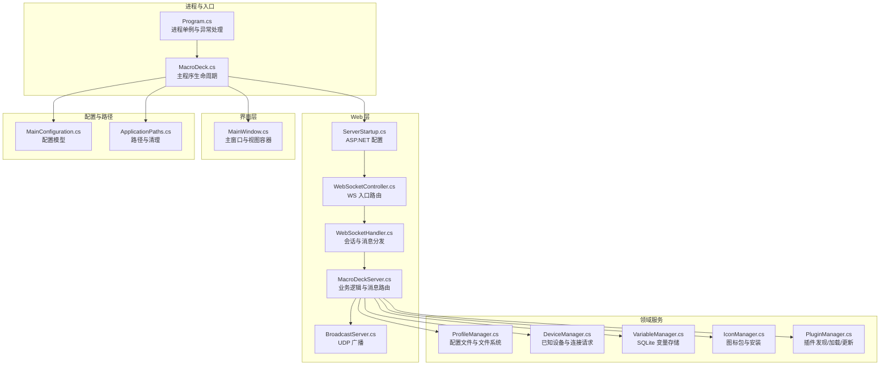

**图表来源**
- [Program.cs:1-80](file://src/MacroDeck/Program.cs#L1-L80)
- [MacroDeck.cs:68-151](file://src/MacroDeck/MacroDeck.cs#L68-L151)
- [ServerStartup.cs:8-31](file://src/MacroDeck/ServerStartup.cs#L8-L31)
- [WebSocketController.cs:5-20](file://src/MacroDeck/Controllers/WebSocketController.cs#L5-L20)
- [WebSocketHandler.cs:6-91](file://src/MacroDeck/WebSocketHandler.cs#L6-L91)
- [MacroDeckServer.cs:16-376](file://src/MacroDeck/Server/MacroDeckServer.cs#L16-L376)
- [BroadcastServer.cs:8-79](file://src/MacroDeck/Server/BroadcastServer.cs#L8-L79)
- [ProfileManager.cs:20-640](file://src/MacroDeck/Profiles/ProfileManager.cs#L20-L640)
- [DeviceManager.cs:12-278](file://src/MacroDeck/Device/DeviceManager.cs#L12-L278)
- [VariableManager.cs:10-249](file://src/MacroDeck/Variables/VariableManager.cs#L10-L249)
- [IconManager.cs:14-404](file://src/MacroDeck/Icons/IconManager.cs#L14-L404)
- [PluginManager.cs:20-479](file://src/MacroDeck/Plugins/PluginManager.cs#L20-L479)
- [MainWindow.cs:19-290](file://src/MacroDeck/GUI/MainWindow.cs#L19-L290)
- [MainConfiguration.cs:9-103](file://src/MacroDeck/Configuration/MainConfiguration.cs#L9-L103)
- [ApplicationPaths.cs:6-143](file://src/MacroDeck/StartupConfig/ApplicationPaths.cs#L6-L143)

**章节来源**
- [Program.cs:1-80](file://src/MacroDeck/Program.cs#L1-L80)
- [MacroDeck.cs:68-151](file://src/MacroDeck/MacroDeck.cs#L68-L151)
- [ApplicationPaths.cs:36-102](file://src/MacroDeck/StartupConfig/ApplicationPaths.cs#L36-L102)

## 核心组件
- 主程序与生命周期
  - 进程单例与异常捕获、Serilog 初始化、路径与配置加载、初始设置向导、托盘图标与主窗体生命周期
- WebSocket 与通信
  - ASP.NET Core 中间件配置、WS 控制器、会话处理器、消息路由与客户端管理
- 设备与连接
  - 已知设备持久化、连接请求确认、阻断策略、设备与客户端映射
- 配置与文件系统
  - 配置模型、JSON 配置文件、旧版 SQLite 迁移、文件保存与清理
- 插件系统
  - 清单解析、动态加载、启用/禁用、更新检测、卸载标记
- 变量与模板
  - SQLite 存储、类型转换、变更广播、标签渲染
- 图标包
  - ZIP 安装、清单校验、预览生成、导出打包
- GUI 界面
  - 视图容器、通知计数、语言切换、更新提示、扩展与插件状态刷新

**章节来源**
- [MacroDeck.cs:68-151](file://src/MacroDeck/MacroDeck.cs#L68-L151)
- [WebSocketHandler.cs:6-91](file://src/MacroDeck/WebSocketHandler.cs#L6-L91)
- [MacroDeckServer.cs:16-376](file://src/MacroDeck/Server/MacroDeckServer.cs#L16-L376)
- [DeviceManager.cs:12-278](file://src/MacroDeck/Device/DeviceManager.cs#L12-L278)
- [MainConfiguration.cs:9-103](file://src/MacroDeck/Configuration/MainConfiguration.cs#L9-L103)
- [PluginManager.cs:20-479](file://src/MacroDeck/Plugins/PluginManager.cs#L20-L479)
- [VariableManager.cs:10-249](file://src/MacroDeck/Variables/VariableManager.cs#L10-L249)
- [IconManager.cs:14-404](file://src/MacroDeck/Icons/IconManager.cs#L14-L404)
- [MainWindow.cs:19-290](file://src/MacroDeck/GUI/MainWindow.cs#L19-L290)

## 架构总览
Macro-Deck 采用“桌面应用 + 内嵌 Web 服务器”的混合架构：
- 分层架构：UI 层（WinForms）、服务层（配置、设备、插件、变量、图标）、网络层（ASP.NET Core + WebSocket）
- 事件驱动：通过事件总线与回调实现模块解耦（如设备连接状态、变量变更、插件变更）
- 插件架构：基于清单与反射的动态加载机制，支持内部与外部插件，具备更新检测与安全模式降级

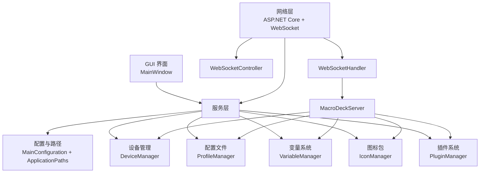

**图表来源**
- [MainWindow.cs:19-290](file://src/MacroDeck/GUI/MainWindow.cs#L19-L290)
- [ServerStartup.cs:8-31](file://src/MacroDeck/ServerStartup.cs#L8-L31)
- [WebSocketController.cs:5-20](file://src/MacroDeck/Controllers/WebSocketController.cs#L5-L20)
- [WebSocketHandler.cs:6-91](file://src/MacroDeck/WebSocketHandler.cs#L6-L91)
- [MacroDeckServer.cs:16-376](file://src/MacroDeck/Server/MacroDeckServer.cs#L16-L376)
- [DeviceManager.cs:12-278](file://src/MacroDeck/Device/DeviceManager.cs#L12-L278)
- [ProfileManager.cs:20-640](file://src/MacroDeck/Profiles/ProfileManager.cs#L20-L640)
- [VariableManager.cs:10-249](file://src/MacroDeck/Variables/VariableManager.cs#L10-L249)
- [IconManager.cs:14-404](file://src/MacroDeck/Icons/IconManager.cs#L14-L404)
- [PluginManager.cs:20-479](file://src/MacroDeck/Plugins/PluginManager.cs#L20-L479)
- [MainConfiguration.cs:9-103](file://src/MacroDeck/Configuration/MainConfiguration.cs#L9-L103)
- [ApplicationPaths.cs:6-143](file://src/MacroDeck/StartupConfig/ApplicationPaths.cs#L6-L143)

## 详细组件分析

### 组件 A：主程序与生命周期（MacroDeck）
职责与行为
- 解析启动参数、日志级别、调试控制台
- 初始设置向导或加载现有配置
- 初始化语言、热键、变量、插件、图标、配置文件
- 启动 WebSocket 服务器、广播服务、ADB 辅助服务
- 托盘图标与主窗体生命周期管理
- 更新检查与扩展商店更新检测
- 进程重启与退出

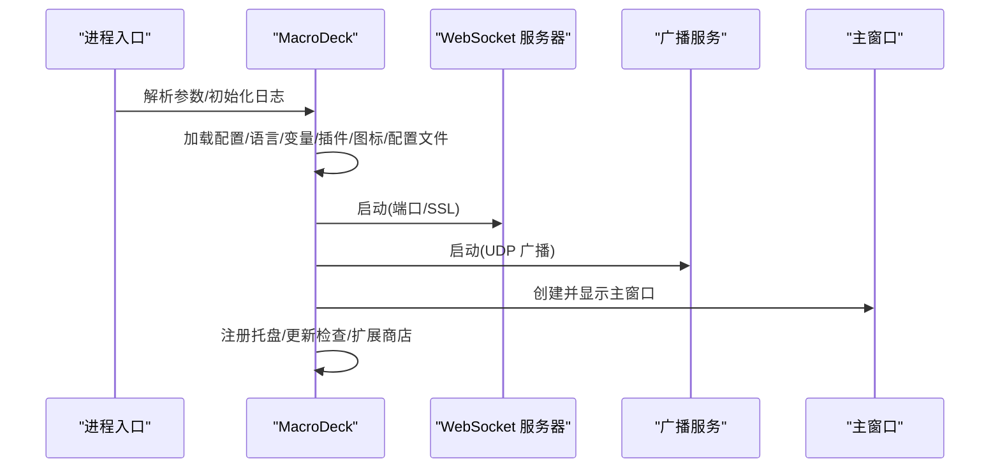

**图表来源**
- [MacroDeck.cs:68-151](file://src/MacroDeck/MacroDeck.cs#L68-L151)
- [Program.cs:13-35](file://src/MacroDeck/Program.cs#L13-L35)

**章节来源**
- [MacroDeck.cs:68-151](file://src/MacroDeck/MacroDeck.cs#L68-L151)
- [Program.cs:13-35](file://src/MacroDeck/Program.cs#L13-L35)

### 组件 B：WebSocket 通信（ServerStartup + WebSocketController + WebSocketHandler + MacroDeckServer）
职责与行为
- ServerStartup：注册控制器、CORS、HTTPS、静态文件、WS 中间件、路由
- WebSocketController：HTTP GET 升级为 WS，交由处理器接管
- WebSocketHandler：维护会话列表、消息广播、连接/断开事件
- MacroDeckServer：连接接入、鉴权与令牌校验、按钮事件路由、动作执行、客户端状态同步

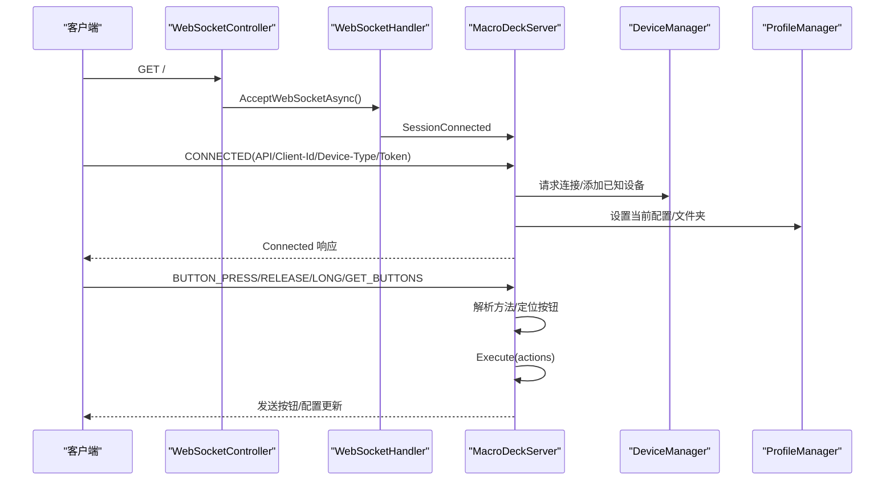

**图表来源**
- [ServerStartup.cs:15-30](file://src/MacroDeck/ServerStartup.cs#L15-L30)
- [WebSocketController.cs:7-19](file://src/MacroDeck/Controllers/WebSocketController.cs#L7-L19)
- [WebSocketHandler.cs:37-49](file://src/MacroDeck/WebSocketHandler.cs#L37-L49)
- [MacroDeckServer.cs:57-244](file://src/MacroDeck/Server/MacroDeckServer.cs#L57-L244)
- [DeviceManager.cs:185-238](file://src/MacroDeck/Device/DeviceManager.cs#L185-L238)
- [ProfileManager.cs:205-311](file://src/MacroDeck/Profiles/ProfileManager.cs#L205-L311)

**章节来源**
- [ServerStartup.cs:8-31](file://src/MacroDeck/ServerStartup.cs#L8-L31)
- [WebSocketController.cs:5-20](file://src/MacroDeck/Controllers/WebSocketController.cs#L5-L20)
- [WebSocketHandler.cs:6-91](file://src/MacroDeck/WebSocketHandler.cs#L6-L91)
- [MacroDeckServer.cs:16-376](file://src/MacroDeck/Server/MacroDeckServer.cs#L16-L376)
- [DeviceManager.cs:12-278](file://src/MacroDeck/Device/DeviceManager.cs#L12-L278)
- [ProfileManager.cs:20-640](file://src/MacroDeck/Profiles/ProfileManager.cs#L20-L640)

### 组件 C：插件系统（PluginManager）
职责与行为
- 插件目录扫描、清单解析、Assembly.Load 动态加载
- 插件启用、禁用、删除（带“.delete”标记）、更新检测
- 内部插件（ActionButton/Variables/Folder/Device）默认启用
- 安装/更新流程：ZIP 解压 -> 目录复制 -> 清单校验 -> 加载启用

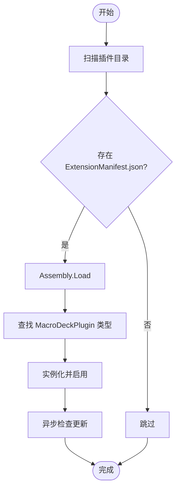

**图表来源**
- [PluginManager.cs:39-202](file://src/MacroDeck/Plugins/PluginManager.cs#L39-L202)

**章节来源**
- [PluginManager.cs:20-479](file://src/MacroDeck/Plugins/PluginManager.cs#L20-L479)

### 组件 D：配置与文件系统（MainConfiguration + ApplicationPaths + ProfileManager）
职责与行为
- MainConfiguration：自动启动、SSL、主机地址/端口、连接策略、语言、错误上报等配置项
- ApplicationPaths：便携/非便携模式下的用户数据目录、文件路径、目录创建与清理
- ProfileManager：JSON 配置文件读写、旧版 SQLite 迁移、文件夹/按钮绑定、变量模板渲染、窗口焦点触发

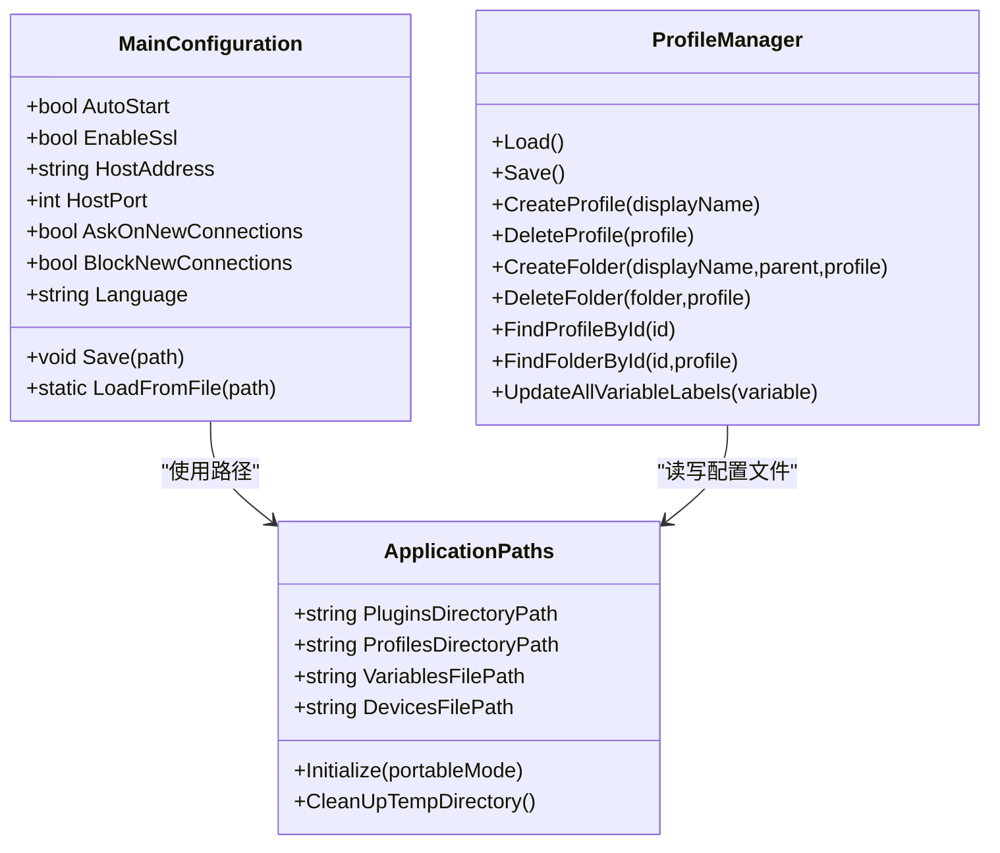

**图表来源**
- [MainConfiguration.cs:9-103](file://src/MacroDeck/Configuration/MainConfiguration.cs#L9-L103)
- [ApplicationPaths.cs:36-102](file://src/MacroDeck/StartupConfig/ApplicationPaths.cs#L36-L102)
- [ProfileManager.cs:205-380](file://src/MacroDeck/Profiles/ProfileManager.cs#L205-L380)

**章节来源**
- [MainConfiguration.cs:9-103](file://src/MacroDeck/Configuration/MainConfiguration.cs#L9-L103)
- [ApplicationPaths.cs:36-102](file://src/MacroDeck/StartupConfig/ApplicationPaths.cs#L36-L102)
- [ProfileManager.cs:205-380](file://src/MacroDeck/Profiles/ProfileManager.cs#L205-L380)

### 组件 E：设备与连接（DeviceManager）
职责与行为
- 已知设备持久化（devices.json），支持重命名、设置配置、阻断
- 新连接请求：询问用户或自动接受；未知设备加入白名单
- 连接建立后与 MacroDeckServer 同步配置与文件夹

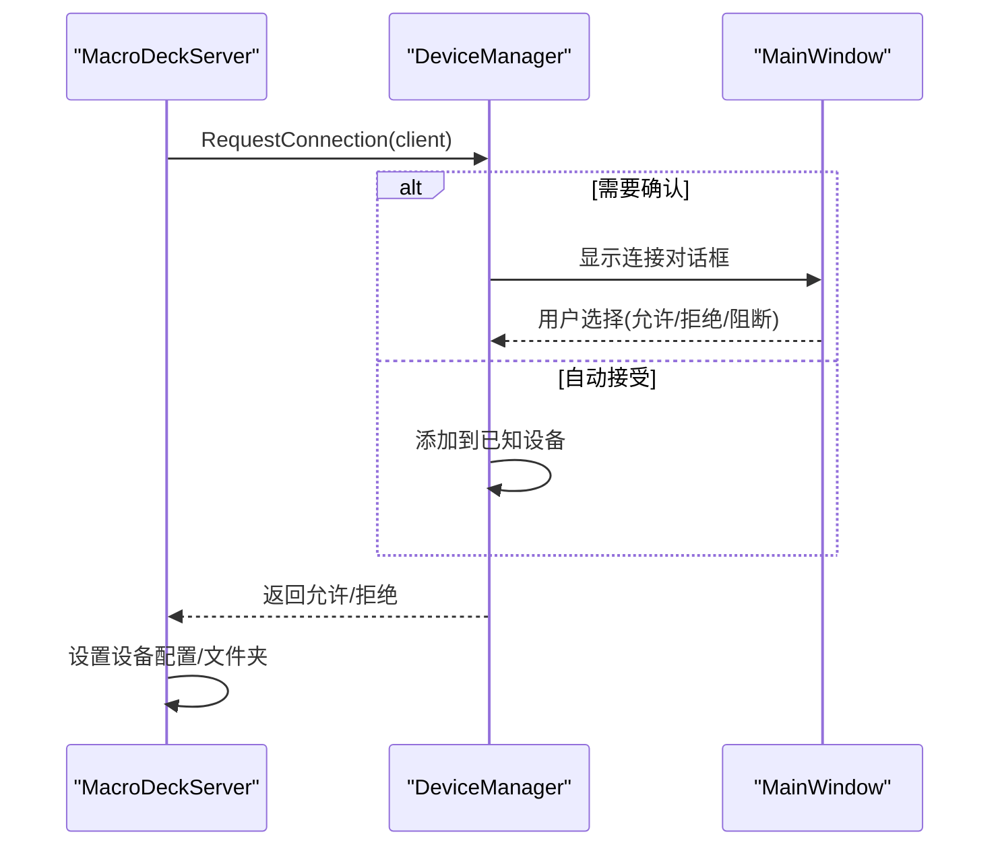

**图表来源**
- [DeviceManager.cs:185-238](file://src/MacroDeck/Device/DeviceManager.cs#L185-L238)
- [MacroDeckServer.cs:141-200](file://src/MacroDeck/Server/MacroDeckServer.cs#L141-L200)
- [MainWindow.cs:147-163](file://src/MacroDeck/GUI/MainWindow.cs#L147-L163)

**章节来源**
- [DeviceManager.cs:12-278](file://src/MacroDeck/Device/DeviceManager.cs#L12-L278)
- [MacroDeckServer.cs:141-200](file://src/MacroDeck/Server/MacroDeckServer.cs#L141-L200)
- [MainWindow.cs:147-163](file://src/MacroDeck/GUI/MainWindow.cs#L147-L163)

### 组件 F：变量与模板（VariableManager + ProfileManager）
职责与行为
- VariableManager：SQLite 存储、类型转换、变更事件、模板渲染委托
- ProfileManager：变量变更时批量更新按钮标签、并发渲染、跨客户端推送

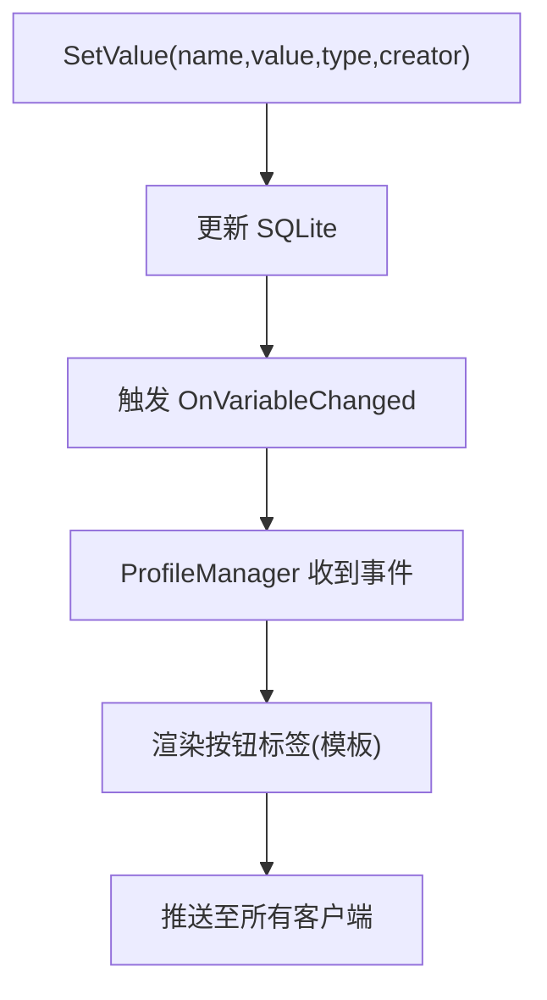

**图表来源**
- [VariableManager.cs:54-138](file://src/MacroDeck/Variables/VariableManager.cs#L54-L138)
- [ProfileManager.cs:127-203](file://src/MacroDeck/Profiles/ProfileManager.cs#L127-L203)

**章节来源**
- [VariableManager.cs:10-249](file://src/MacroDeck/Variables/VariableManager.cs#L10-L249)
- [ProfileManager.cs:127-203](file://src/MacroDeck/Profiles/ProfileManager.cs#L127-L203)

### 组件 G：图标包（IconManager）
职责与行为
- ZIP 安装、清单校验、图标导入、导出打包、更新检测、隐藏与扩展商店标记

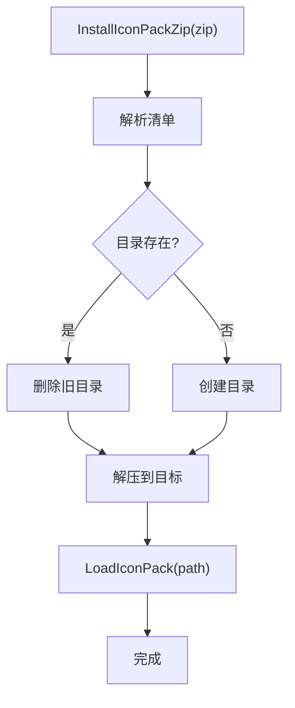

**图表来源**
- [IconManager.cs:327-402](file://src/MacroDeck/Icons/IconManager.cs#L327-L402)

**章节来源**
- [IconManager.cs:14-404](file://src/MacroDeck/Icons/IconManager.cs#L14-L404)

### 组件 H：GUI 界面（MainWindow）
职责与行为
- 视图容器：Deck/Device/Extensions/Settings/Variables
- 通知计数、语言切换、更新提示、插件/图标更新状态刷新
- 与服务层事件联动（设备连接数、通知、扩展安装）

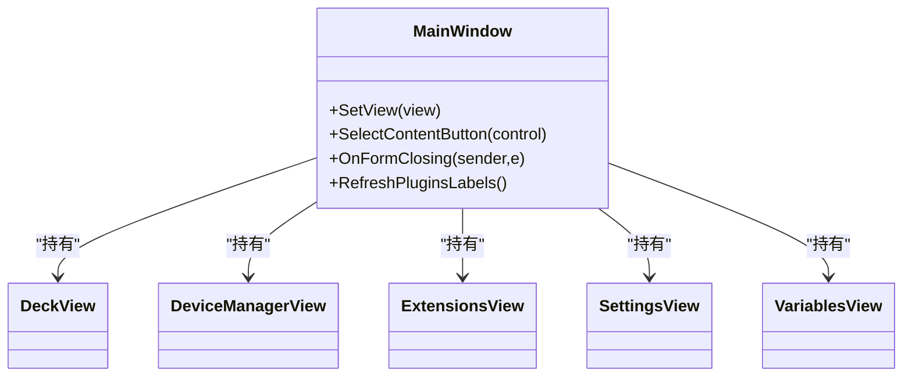

**图表来源**
- [MainWindow.cs:19-290](file://src/MacroDeck/GUI/MainWindow.cs#L19-L290)

**章节来源**
- [MainWindow.cs:19-290](file://src/MacroDeck/GUI/MainWindow.cs#L19-L290)

## 依赖分析
- 组件内聚与耦合
  - MacroDeck 作为编排者，向上依赖 UI，向下依赖服务层与网络层
  - WebSocketHandler 与 MacroDeckServer 通过事件与会话 ID 解耦
  - ProfileManager 与 VariableManager 通过事件解耦，避免直接耦合
- 外部依赖
  - ASP.NET Core（Kestrel）、Newtonsoft.Json、SQLite、Serilog、System.Net.WebSockets
- 循环依赖
  - 未见直接循环；事件回调链路可控

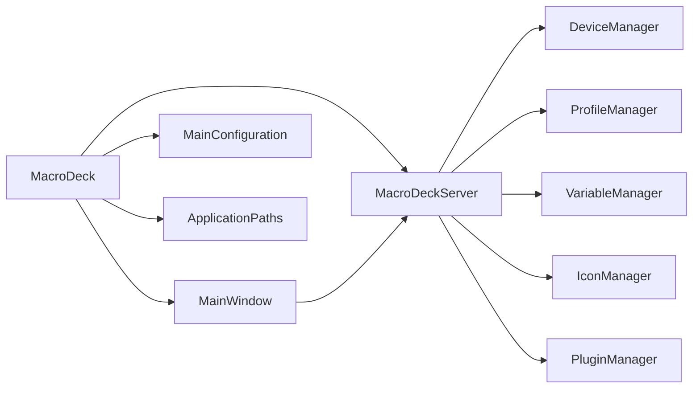

**图表来源**
- [MacroDeck.cs:68-151](file://src/MacroDeck/MacroDeck.cs#L68-L151)
- [MainWindow.cs:19-290](file://src/MacroDeck/GUI/MainWindow.cs#L19-L290)
- [MacroDeckServer.cs:16-376](file://src/MacroDeck/Server/MacroDeckServer.cs#L16-L376)
- [DeviceManager.cs:12-278](file://src/MacroDeck/Device/DeviceManager.cs#L12-L278)
- [ProfileManager.cs:20-640](file://src/MacroDeck/Profiles/ProfileManager.cs#L20-L640)
- [VariableManager.cs:10-249](file://src/MacroDeck/Variables/VariableManager.cs#L10-L249)
- [IconManager.cs:14-404](file://src/MacroDeck/Icons/IconManager.cs#L14-L404)
- [PluginManager.cs:20-479](file://src/MacroDeck/Plugins/PluginManager.cs#L20-L479)
- [MainConfiguration.cs:9-103](file://src/MacroDeck/Configuration/MainConfiguration.cs#L9-L103)
- [ApplicationPaths.cs:6-143](file://src/MacroDeck/StartupConfig/ApplicationPaths.cs#L6-L143)

**章节来源**
- [MacroDeck.cs:68-151](file://src/MacroDeck/MacroDeck.cs#L68-L151)
- [MacroDeckServer.cs:16-376](file://src/MacroDeck/Server/MacroDeckServer.cs#L16-L376)

## 性能考虑
- 并发与异步
  - 客户端消息广播使用并行发送任务聚合；按钮渲染与变量更新采用并行遍历
- 序列化与 IO
  - 配置文件与图标包操作采用临时文件与原子替换，减少锁竞争
- 网络与资源
  - WS 会话列表增删使用锁保护；广播周期固定，避免频繁网络负载
- 插件加载
  - 使用异步检查更新，避免阻塞主线程；失败进入安全模式，保证稳定性

[本节为通用性能建议，不直接分析具体文件]

## 故障排查指南
- 无法启动服务器
  - 检查端口占用与 SSL 证书；查看日志输出与错误对话框
- 插件加载失败
  - 查看清单完整性、DLL 版本兼容性；关注安全模式提示
- 连接被拒绝
  - 检查“阻止新连接”策略、最大连接数限制、设备是否被阻断
- 变量更新未生效
  - 确认变量类型转换与模板渲染；检查事件是否触发与客户端推送

**章节来源**
- [MacroDeckServer.cs:40-54](file://src/MacroDeck/Server/MacroDeckServer.cs#L40-L54)
- [PluginManager.cs:179-199](file://src/MacroDeck/Plugins/PluginManager.cs#L179-L199)
- [DeviceManager.cs:185-238](file://src/MacroDeck/Device/DeviceManager.cs#L185-L238)
- [VariableManager.cs:126-138](file://src/MacroDeck/Variables/VariableManager.cs#L126-L138)

## 结论
Macro-Deck 以清晰的分层与事件驱动为核心，结合内嵌 Web 服务器与插件架构，实现了桌面端与移动客户端的协同工作。通过配置与路径管理、设备与连接控制、变量与模板渲染、图标包与插件系统的协同，系统在可扩展性与可用性之间取得平衡。建议持续优化序列化与 IO 的并发策略，完善错误恢复与可观测性，以进一步提升稳定性与用户体验。

## 附录
- 系统边界与外部集成
  - 外部客户端通过 WS 协议接入；扩展商店用于插件与图标包更新；ADB 服务用于移动设备连接
- 关键配置项
  - 主机地址/端口、SSL 开关、连接策略、自动启动、语言、错误上报

[本节为概览性内容，不直接分析具体文件]