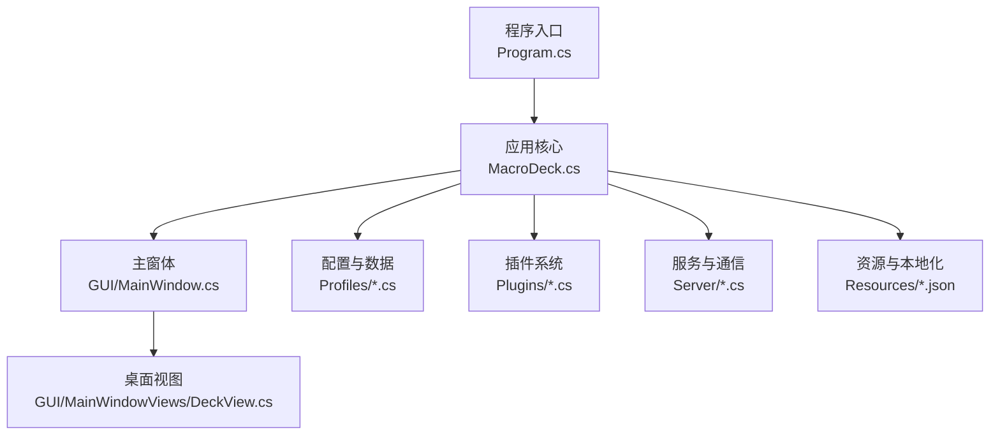
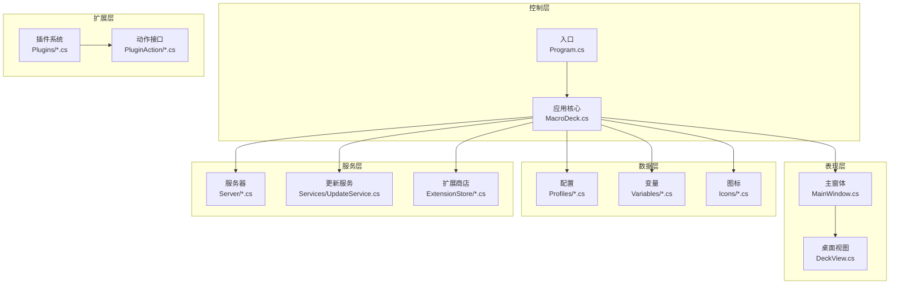
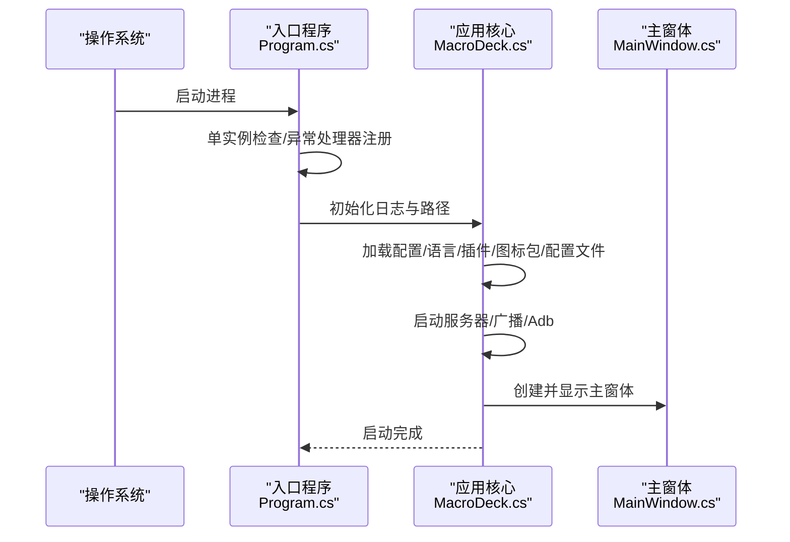
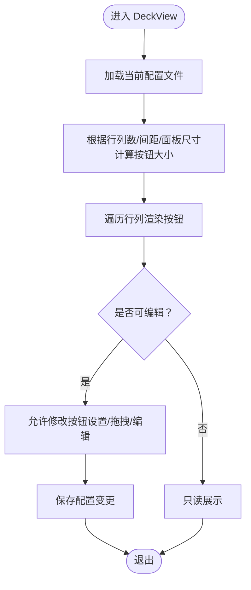
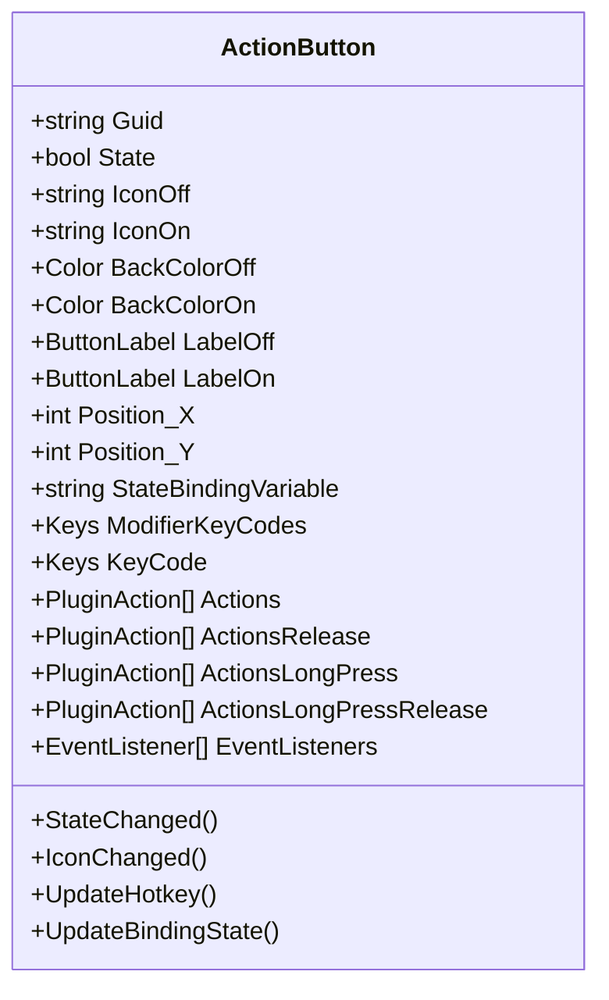
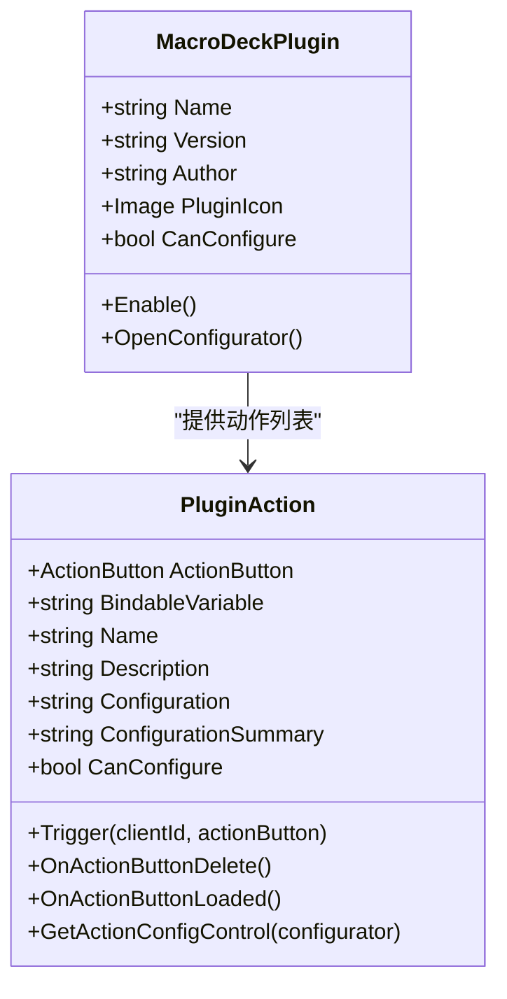
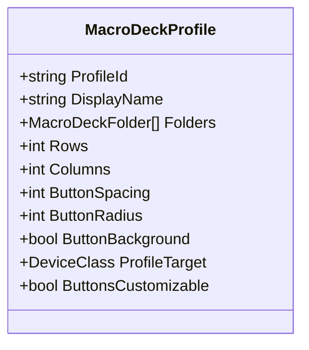
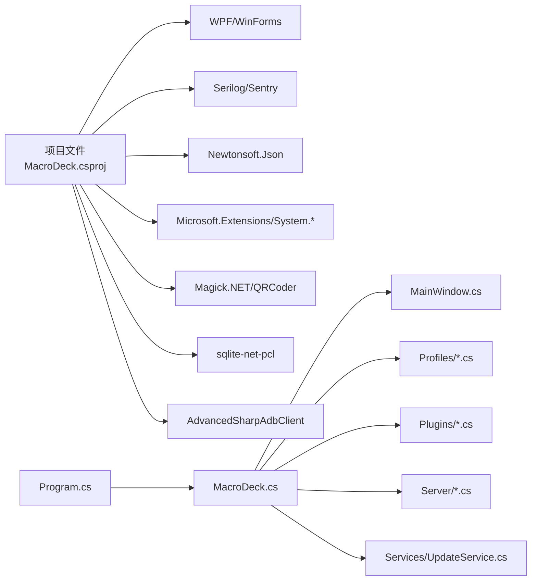

# 项目介绍

<cite>
**本文档引用的文件**
- [README.md](file://README.md)
- [src/MacroDeck/README.md](file://src/MacroDeck/README.md)
- [src/MacroDeck/MacroDeck.csproj](file://src/MacroDeck/MacroDeck.csproj)
- [src/MacroDeck/Program.cs](file://src/MacroDeck/Program.cs)
- [src/MacroDeck/MacroDeck.cs](file://src/MacroDeck/MacroDeck.cs)
- [src/MacroDeck/GUI/MainWindow.cs](file://src/MacroDeck/GUI/MainWindow.cs)
- [src/MacroDeck/Profiles/MacroDeckProfile.cs](file://src/MacroDeck/Profiles/MacroDeckProfile.cs)
- [src/MacroDeck/ActionButton/ActionButton.cs](file://src/MacroDeck/ActionButton/ActionButton.cs)
- [src/MacroDeck/Plugins/MacroDeckPlugin.cs](file://src/MacroDeck/Plugins/MacroDeckPlugin.cs)
- [src/MacroDeck/Constants.cs](file://src/MacroDeck/Constants.cs)
- [LICENSE](file://LICENSE)
- [.github/FUNDING.yml](file://.github/FUNDING.yml)
</cite>

## 目录
1. [引言](#引言)
2. [项目结构](#项目结构)
3. [核心组件](#核心组件)
4. [架构总览](#架构总览)
5. [详细组件分析](#详细组件分析)
6. [依赖关系分析](#依赖关系分析)
7. [性能考量](#性能考量)
8. [故障排查指南](#故障排查指南)
9. [结论](#结论)
10. [附录](#附录)

## 引言
Macro-Deck 是一款基于 .NET Framework 的桌面应用程序，专为创建可编程的虚拟按钮界面而设计。其核心价值在于通过直观的图形界面，帮助用户轻松创建、配置与管理虚拟按钮，从而实现对各类设备与应用的统一控制。项目强调易用性与扩展性，提供多语言支持、变量系统、模板引擎、插件生态以及内置包管理器等能力，适用于桌面自动化、媒体控制、开发工具集成等多种场景。

项目的发展历程体现了从单一宏键设备到跨平台、可扩展的自动化控制中心的演进：初期聚焦于硬件设备（如 Macro Deck DIY OLED），逐步扩展到软件客户端、Web 客户端与移动客户端，并通过插件机制引入丰富的第三方扩展与图标包，形成完整的生态系统。

在定位上，Macro-Deck 不仅是一个“宏键垫”，更是一个可编程的桌面自动化中枢，适合需要频繁操作不同应用与设备的用户，以及希望构建自定义工作流的专业人士。

## 项目结构
项目采用分层与功能模块化组织方式：
- 应用入口与启动：Program.cs 负责进程单例检查、异常处理与日志初始化；MacroDeck.cs 提供应用生命周期管理与主窗口调度。
- 图形界面：GUI 子目录包含主窗体、视图与对话框，DeckView 作为核心按钮展示与编辑区域。
- 配置与数据：Profiles 管理配置文件与按钮布局；Variables 提供变量系统；Icons 管理图标与图标包。
- 插件体系：Plugins 定义插件基类与动作接口；内部插件提供设备控制、文件夹切换、变量操作等能力。
- 服务与通信：Server 模块负责设备连接、广播与消息传输；更新与扩展商店服务提供在线资源获取。
- 资源与国际化：Resources 包含多语言文件；StartupConfig 管理路径与日志配置。

图表来源
- [src/MacroDeck/Program.cs:1-80](file://src/MacroDeck/Program.cs#L1-L80)
- [src/MacroDeck/MacroDeck.cs:68-151](file://src/MacroDeck/MacroDeck.cs#L68-L151)
- [src/MacroDeck/GUI/MainWindow.cs:39-49](file://src/MacroDeck/GUI/MainWindow.cs#L39-L49)

章节来源
- [src/MacroDeck/MacroDeck.csproj:1-363](file://src/MacroDeck/MacroDeck.csproj#L1-L363)
- [src/MacroDeck/Program.cs:1-80](file://src/MacroDeck/Program.cs#L1-L80)

## 核心组件
- 应用入口与生命周期
  - Program.cs：设置 UI 样式、注册未处理异常处理器、解析启动参数、检查运行实例并初始化日志与路径，随后调用 MacroDeck.Start 启动应用。
  - MacroDeck.cs：定义应用版本、API 版本、托盘图标、主窗体生命周期事件，负责加载配置、语言、插件、图标包、配置文件与网络环境，启动服务器与广播服务，并提供重启、显示主窗体等能力。
- 主窗体与视图
  - MainWindow.cs：承载导航按钮与内容面板，动态切换 DeckView、设备管理、扩展商店、设置与变量视图；处理通知计数、插件更新提示与客户端连接状态显示。
- 配置与布局
  - MacroDeckProfile.cs：描述一个配置文件的结构，包括行列数、间距、圆角半径、背景开关、目标设备类型及按钮是否可定制等属性。
- 按钮模型与交互
  - ActionButton.cs：抽象一个可编程按钮，包含状态、图标、背景色、标签、热键绑定、事件监听、变量绑定与动作集合等，负责状态变更与服务器同步。
- 插件系统
  - MacroDeckPlugin.cs：定义插件基类与动作接口，提供启用、配置、序列化复制、触发执行等机制，支撑扩展生态。

章节来源
- [src/MacroDeck/Program.cs:12-35](file://src/MacroDeck/Program.cs#L12-L35)
- [src/MacroDeck/MacroDeck.cs:68-151](file://src/MacroDeck/MacroDeck.cs#L68-L151)
- [src/MacroDeck/GUI/MainWindow.cs:39-145](file://src/MacroDeck/GUI/MainWindow.cs#L39-L145)
- [src/MacroDeck/Profiles/MacroDeckProfile.cs:7-74](file://src/MacroDeck/Profiles/MacroDeckProfile.cs#L7-L74)
- [src/MacroDeck/ActionButton/ActionButton.cs:10-198](file://src/MacroDeck/ActionButton/ActionButton.cs#L10-L198)
- [src/MacroDeck/Plugins/MacroDeckPlugin.cs:9-184](file://src/MacroDeck/Plugins/MacroDeckPlugin.cs#L9-L184)

## 架构总览
Macro-Deck 采用桌面应用 + 服务端 + 插件扩展的分层架构：
- 表现层：WPF/WinForms 界面，提供 DeckView、设置、设备管理、扩展商店等视图。
- 控制层：主控制器负责应用生命周期、托盘交互、主窗体显示与事件分发。
- 数据层：配置文件、变量系统、图标包与扩展商店元数据。
- 服务层：设备连接、广播、更新检测、ADB 辅助、SSL 证书生成、日志与错误上报。
- 扩展层：插件与动作接口，支持第三方开发者扩展功能。

图表来源
- [src/MacroDeck/Program.cs:12-35](file://src/MacroDeck/Program.cs#L12-L35)
- [src/MacroDeck/MacroDeck.cs:68-151](file://src/MacroDeck/MacroDeck.cs#L68-L151)
- [src/MacroDeck/GUI/MainWindow.cs:39-145](file://src/MacroDeck/GUI/MainWindow.cs#L39-L145)
- [src/MacroDeck/Profiles/MacroDeckProfile.cs:7-74](file://src/MacroDeck/Profiles/MacroDeckProfile.cs#L7-L74)
- [src/MacroDeck/Plugins/MacroDeckPlugin.cs:9-184](file://src/MacroDeck/Plugins/MacroDeckPlugin.cs#L9-L184)

## 详细组件分析

### 应用启动流程
应用启动时序从进程单例检查开始，随后初始化日志、路径与配置，加载语言与插件，启动服务器与广播，最后创建并显示主窗体。

图表来源
- [src/MacroDeck/Program.cs:12-35](file://src/MacroDeck/Program.cs#L12-L35)
- [src/MacroDeck/MacroDeck.cs:68-151](file://src/MacroDeck/MacroDeck.cs#L68-L151)
- [src/MacroDeck/GUI/MainWindow.cs:39-49](file://src/MacroDeck/GUI/MainWindow.cs#L39-L49)

章节来源
- [src/MacroDeck/Program.cs:12-35](file://src/MacroDeck/Program.cs#L12-L35)
- [src/MacroDeck/MacroDeck.cs:68-151](file://src/MacroDeck/MacroDeck.cs#L68-L151)

### 桌面视图与按钮布局
DeckView 负责根据当前配置文件的行列数、间距与圆角半径计算按钮尺寸并渲染；同时支持按钮设置修改与文件夹切换。

图表来源
- [src/MacroDeck/GUI/MainWindowViews/DeckView.cs:181-200](file://src/MacroDeck/GUI/MainWindowViews/DeckView.cs#L181-L200)
- [src/MacroDeck/Profiles/MacroDeckProfile.cs:52-73](file://src/MacroDeck/Profiles/MacroDeckProfile.cs#L52-L73)

章节来源
- [src/MacroDeck/GUI/MainWindowViews/DeckView.cs:181-200](file://src/MacroDeck/GUI/MainWindowViews/DeckView.cs#L181-L200)
- [src/MacroDeck/Profiles/MacroDeckProfile.cs:52-73](file://src/MacroDeck/Profiles/MacroDeckProfile.cs#L52-L73)

### 按钮模型与状态管理
ActionButton 抽象了按钮的状态、图标、颜色、标签、热键与变量绑定，并在状态变化时通知服务器进行同步。

图表来源
- [src/MacroDeck/ActionButton/ActionButton.cs:10-198](file://src/MacroDeck/ActionButton/ActionButton.cs#L10-L198)

章节来源
- [src/MacroDeck/ActionButton/ActionButton.cs:10-198](file://src/MacroDeck/ActionButton/ActionButton.cs#L10-L198)

### 插件系统与动作接口
插件系统通过基类与动作接口实现扩展能力，支持启用、配置、序列化复制与触发执行。

图表来源
- [src/MacroDeck/Plugins/MacroDeckPlugin.cs:9-184](file://src/MacroDeck/Plugins/MacroDeckPlugin.cs#L9-L184)

章节来源
- [src/MacroDeck/Plugins/MacroDeckPlugin.cs:9-184](file://src/MacroDeck/Plugins/MacroDeckPlugin.cs#L9-L184)

### 配置文件与目标设备
配置文件包含按钮布局参数与目标设备类型，决定按钮是否可定制。

图表来源
- [src/MacroDeck/Profiles/MacroDeckProfile.cs:7-74](file://src/MacroDeck/Profiles/MacroDeckProfile.cs#L7-L74)

章节来源
- [src/MacroDeck/Profiles/MacroDeckProfile.cs:7-74](file://src/MacroDeck/Profiles/MacroDeckProfile.cs#L7-L74)

## 依赖关系分析
- 外部库与框架
  - 前端与静态资源：Angular 应用打包产物（wwwroot/client）与清单文件，提供 Web 客户端体验。
  - 日志与监控：Serilog、Sentry.Serilog。
  - JSON 序列化：Newtonsoft.Json。
  - 系统与网络：Microsoft.Extensions.*、System.Drawing.Common、Microsoft.Win32.Registry、网络接口枚举。
  - 设备与多媒体：Magick.NET、QRCoder、sqlite-net-pcl。
  - ADB 支持：AdvancedSharpAdbClient。
- 内部模块耦合
  - Program.cs 依赖 MacroDeck 启动流程与日志配置。
  - MacroDeck.cs 依赖配置、语言、插件、图标包、变量、服务器与更新服务。
  - MainWindow.cs 依赖 DeckView、扩展视图、设置视图与通知系统。
  - ActionButton 与插件系统、变量系统、服务器之间存在事件与状态同步关系。

图表来源
- [src/MacroDeck/MacroDeck.csproj:42-67](file://src/MacroDeck/MacroDeck.csproj#L42-L67)
- [src/MacroDeck/Program.cs:12-35](file://src/MacroDeck/Program.cs#L12-L35)
- [src/MacroDeck/MacroDeck.cs:68-151](file://src/MacroDeck/MacroDeck.cs#L68-L151)

章节来源
- [src/MacroDeck/MacroDeck.csproj:42-67](file://src/MacroDeck/MacroDeck.csproj#L42-L67)
- [src/MacroDeck/MacroDeck.cs:68-151](file://src/MacroDeck/MacroDeck.cs#L68-L151)

## 性能考量
- 启动时间与日志清理：应用启动阶段会记录耗时并清理日志目录，有助于诊断启动瓶颈。
- UI 刷新与事件派发：DeckView 在渲染按钮时按行列计算尺寸，避免过度重绘；MainWindow 使用同步上下文确保 UI 线程安全。
- 插件与动作：插件启用时按需初始化动作列表，避免不必要的开销；动作触发通过序列化复制与配置摘要减少 UI 占用。
- 服务器与广播：启动服务器与广播服务，配合网络接口搜索，确保设备发现与连接效率。

章节来源
- [src/MacroDeck/MacroDeck.cs:68-151](file://src/MacroDeck/MacroDeck.cs#L68-L151)
- [src/MacroDeck/GUI/MainWindowViews/DeckView.cs:181-200](file://src/MacroDeck/GUI/MainWindowViews/DeckView.cs#L181-L200)
- [src/MacroDeck/Plugins/MacroDeckPlugin.cs:59-64](file://src/MacroDeck/Plugins/MacroDeckPlugin.cs#L59-L64)

## 故障排查指南
- 未处理异常捕获：入口程序注册线程与域级异常处理器，记录错误以便定位问题。
- 进程单实例：若启动后无响应，可能是另一个实例已激活；程序会尝试向现有实例发送显示主窗体的消息。
- 网络接口：启动时扫描网络接口并记录结果，若无可用接口，会在日志中提示。
- 更新与通知：应用启动后检查更新并在有新版本时弹出提示；扩展商店也会提示安装或更新。

章节来源
- [src/MacroDeck/Program.cs:68-79](file://src/MacroDeck/Program.cs#L68-L79)
- [src/MacroDeck/MacroDeck.cs:171-205](file://src/MacroDeck/MacroDeck.cs#L171-L205)
- [src/MacroDeck/MacroDeck.cs:153-169](file://src/MacroDeck/MacroDeck.cs#L153-L169)

## 结论
Macro-Deck 以直观的图形界面与强大的扩展能力，为桌面自动化提供了高效、易用且可定制的解决方案。其基于 .NET 的成熟生态与模块化架构，既满足个人用户的日常需求，也为开发者提供了清晰的插件与动作接口。通过持续的更新与社区支持，Macro-Deck 在自动化控制领域占据重要地位。

## 附录
- 开源许可：项目采用 Apache License 2.0，允许商用与再分发，但需保留版权声明与许可证声明。
- 社区与贡献：项目提供 Discord 社区、扩展商店与多种资助渠道，鼓励用户参与讨论与贡献。
- 相关链接：项目主页、NuGet API 包、Web 客户端与移动应用商店页面。

章节来源
- [LICENSE:1-202](file://LICENSE#L1-L202)
- [.github/FUNDING.yml:1-14](file://.github/FUNDING.yml#L1-L14)
- [README.md:1-51](file://README.md#L1-L51)
- [src/MacroDeck/README.md:1-24](file://src/MacroDeck/README.md#L1-L24)
- [src/MacroDeck/Constants.cs:5](file://src/MacroDeck/Constants.cs#L5)