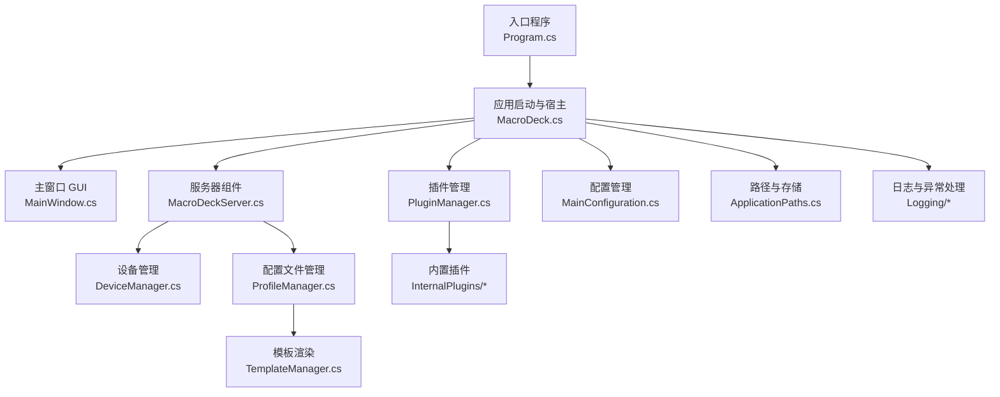
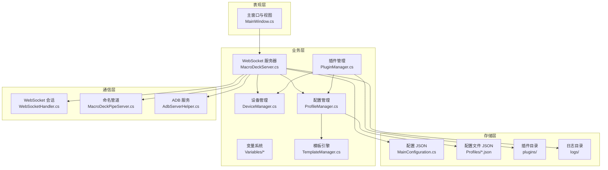
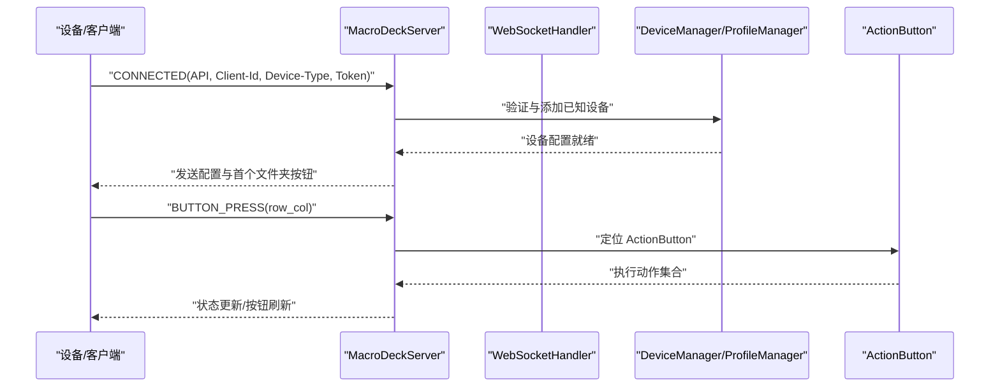
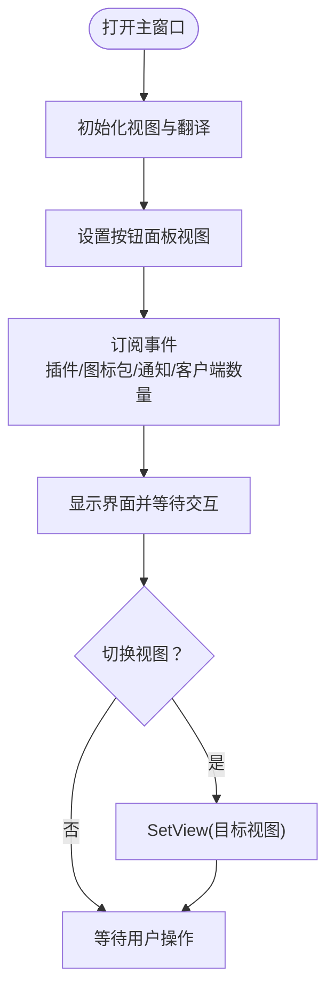
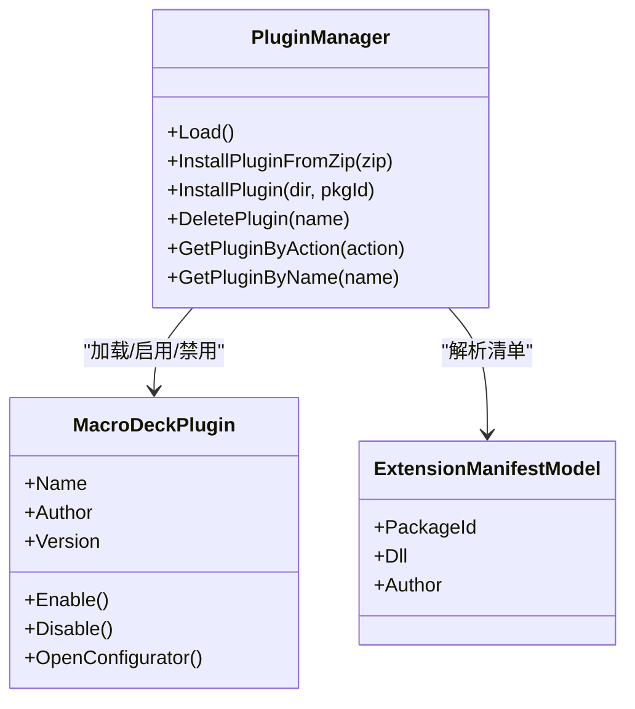
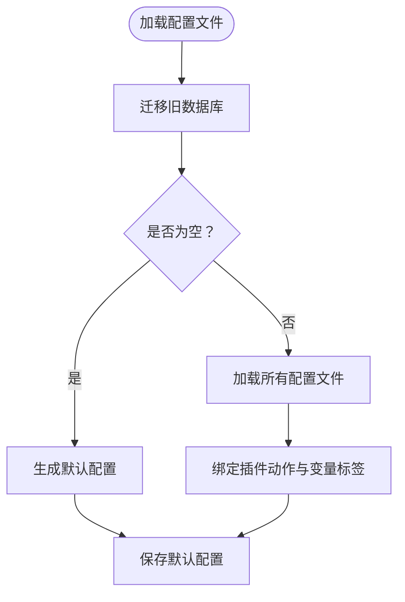
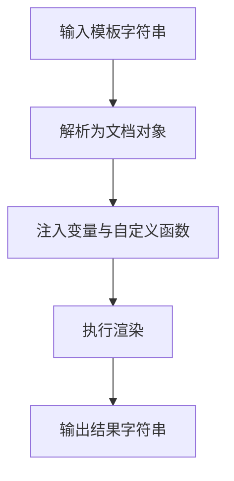
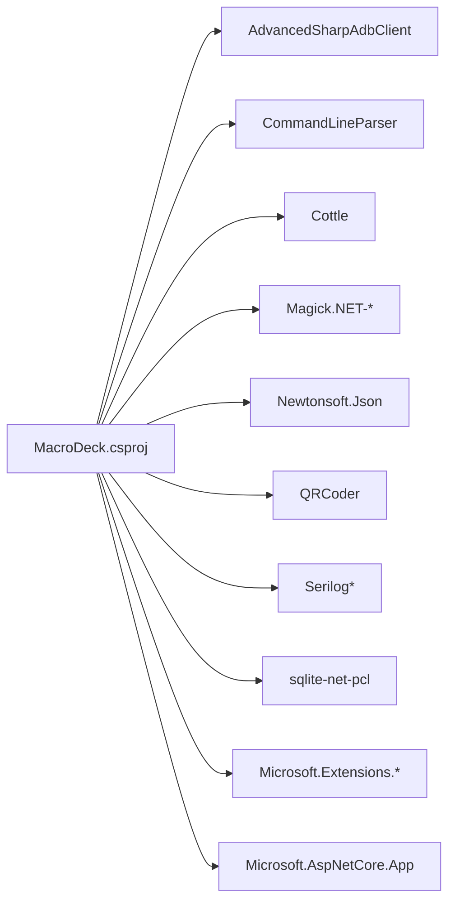

# 项目概述

<cite>
**本文档引用的文件**
- [README.md](file://src/MacroDeck/README.md)
- [MacroDeck.csproj](file://src/MacroDeck/MacroDeck.csproj)
- [Program.cs](file://src/MacroDeck/Program.cs)
- [MacroDeck.cs](file://src/MacroDeck/MacroDeck.cs)
- [Constants.cs](file://src/MacroDeck/Constants.cs)
- [MacroDeckServer.cs](file://src/MacroDeck/Server/MacroDeckServer.cs)
- [MainWindow.cs](file://src/MacroDeck/GUI/MainWindow.cs)
- [PluginManager.cs](file://src/MacroDeck/Plugins/PluginManager.cs)
- [ProfileManager.cs](file://src/MacroDeck/Profiles/ProfileManager.cs)
- [TemplateManager.cs](file://src/MacroDeck/CottleIntegration/TemplateManager.cs)
- [Version.cs](file://src/MacroDeck/DataTypes/Core/Version.cs)
- [MainConfiguration.cs](file://src/MacroDeck/Configuration/MainConfiguration.cs)
- [ApplicationPaths.cs](file://src/MacroDeck/StartupConfig/ApplicationPaths.cs)
- [ButtonPressType.cs](file://src/MacroDeck/Enums/ButtonPressType.cs)
- [PlatformIdentifier.cs](file://src/MacroDeck/Enums/PlatformIdentifier.cs)
</cite>

## 目录
1. [引言](#引言)
2. [项目结构](#项目结构)
3. [核心组件](#核心组件)
4. [架构总览](#架构总览)
5. [详细组件分析](#详细组件分析)
6. [依赖关系分析](#依赖关系分析)
7. [性能考量](#性能考量)
8. [故障排查指南](#故障排查指南)
9. [结论](#结论)
10. [附录](#附录)

## 引言
Macro-Deck 是一个基于 .NET Framework（通过 Microsoft.NET.Sdk.WindowsDesktop）的桌面应用程序，专为创建可编程的虚拟按钮界面而设计。它提供了一个可扩展的可编程按钮系统，支持实时设备连接、插件扩展机制以及模板渲染系统，使用户能够通过图形化界面快速构建和管理复杂的交互式按钮面板，并通过插件生态实现功能扩展。

本项目采用 WPF 和 Windows Forms 技术栈，结合 ASP.NET Core 内置服务器能力，提供 WebSocket 通信以实现与“软件客户端”或硬件设备的实时交互。项目还包含完善的配置管理、日志记录、更新服务、变量系统与模板引擎，确保在不同平台与场景下的稳定运行与良好用户体验。

## 项目结构
项目采用按功能域分层的组织方式，主要目录与职责如下：
- src/MacroDeck：核心应用代码与资源
  - ActionButton：按钮模型与动作绑定
  - Backup：备份与恢复
  - Configuration：主配置模型
  - Controllers：Web API 控制器（如 Ping）
  - CottleIntegration：模板渲染集成（Cottle）
  - Credentials：凭据管理
  - DataTypes：数据类型与版本模型
  - Device：设备管理与类型
  - Enums：枚举定义
  - Events：事件系统
  - Extension / ExtensionStore：扩展与商店辅助
  - Folders：文件夹与导航树
  - GUI：主窗口与自定义控件、对话框、视图
  - Hotkeys：热键管理
  - Icons：图标包与管理
  - InternalPlugins：内置插件（如 ActionButton、Device、Variables、Folder）
  - JSON：序列化模型
  - Language：多语言支持
  - Logging：日志配置与异常捕获
  - Models：扩展商店与版本模型
  - Notifications：通知中心
  - Pipe：进程间通信（命名管道）
  - Plugins：插件加载与生命周期管理
  - Profiles：配置文件与文件夹树
  - Properties：程序集信息与资源
  - Resources：语言与许可证资源
  - Server：WebSocket 服务器与客户端
  - Services：更新、证书、二维码等服务
  - StartupConfig：启动参数与路径初始化
  - Utils：通用工具类
  - Variables：变量系统
  - wwwroot/client：前端静态资源（Angular 应用）
- tests/MacroDeck.Tests：单元测试

**图表来源**
- [Program.cs:1-80](file://src/MacroDeck/Program.cs#L1-L80)
- [MacroDeck.cs:68-151](file://src/MacroDeck/MacroDeck.cs#L68-L151)
- [MainWindow.cs:19-290](file://src/MacroDeck/GUI/MainWindow.cs#L19-L290)
- [MacroDeckServer.cs:28-55](file://src/MacroDeck/Server/MacroDeckServer.cs#L28-L55)
- [PluginManager.cs:39-133](file://src/MacroDeck/Plugins/PluginManager.cs#L39-L133)
- [MainConfiguration.cs:9-103](file://src/MacroDeck/Configuration/MainConfiguration.cs#L9-L103)
- [ApplicationPaths.cs:36-102](file://src/MacroDeck/StartupConfig/ApplicationPaths.cs#L36-L102)
- [ProfileManager.cs:205-311](file://src/MacroDeck/Profiles/ProfileManager.cs#L205-L311)
- [TemplateManager.cs:8-88](file://src/MacroDeck/CottleIntegration/TemplateManager.cs#L8-L88)

**章节来源**
- [MacroDeck.csproj:1-363](file://src/MacroDeck/MacroDeck.csproj#L1-L363)
- [README.md:1-24](file://src/MacroDeck/README.md#L1-L24)

## 核心组件
- 启动与宿主
  - 入口程序负责设置 UI 样式、未处理异常捕获、单实例检查与命名管道通信，随后初始化日志、路径与配置，并启动主流程。
  - 宿主类负责应用生命周期、托盘图标、初始设置向导、网络接口搜索、服务器与 ADB 初始化、插件与图标包加载、变量系统初始化、更新检查与通知等。
- 服务器组件
  - 基于 WebSocket 的消息服务器，负责设备连接、认证、按钮事件分发、配置下发与状态同步。
- GUI 界面
  - 主窗口包含按钮面板、设备管理、扩展商店、设置与变量视图，支持多语言与通知中心。
- 插件系统
  - 支持从 ZIP 安装、清单解析、动态加载、启用/禁用、卸载与更新检测；内置若干核心插件。
- 配置与文件管理
  - JSON 配置文件、SQLite 迁移、路径管理、临时目录清理、备份与恢复。
- 模板渲染系统
  - 基于 Cottle 的模板引擎，支持变量注入、自定义函数与条件渲染，用于按钮标签等文本生成。
- 变量系统
  - 提供变量的读取、写入、持久化与跨按钮模板渲染联动。

**章节来源**
- [Program.cs:12-35](file://src/MacroDeck/Program.cs#L12-L35)
- [MacroDeck.cs:68-151](file://src/MacroDeck/MacroDeck.cs#L68-L151)
- [MacroDeckServer.cs:28-55](file://src/MacroDeck/Server/MacroDeckServer.cs#L28-L55)
- [MainWindow.cs:39-145](file://src/MacroDeck/GUI/MainWindow.cs#L39-L145)
- [PluginManager.cs:39-133](file://src/MacroDeck/Plugins/PluginManager.cs#L39-L133)
- [ProfileManager.cs:205-311](file://src/MacroDeck/Profiles/ProfileManager.cs#L205-L311)
- [TemplateManager.cs:8-88](file://src/MacroDeck/CottleIntegration/TemplateManager.cs#L8-L88)

## 架构总览
系统采用“桌面应用 + 内置 Web 服务器”的混合架构，核心交互通过 WebSocket 实现。整体架构由以下层次组成：
- 表现层：WPF/WinForms GUI，提供可视化编辑器与控制面板。
- 业务层：服务器、设备管理、配置管理、插件管理、变量与模板系统。
- 通信层：WebSocket（ASP.NET Core）、命名管道（进程间通信）、ADB（Android 调试桥）。
- 存储层：JSON 文件（配置与配置文件）、SQLite（历史迁移）、本地目录（插件、图标包、日志、备份）。
- 扩展层：插件 API 与扩展商店，支持第三方扩展与主题。

**图表来源**
- [MacroDeckServer.cs:28-55](file://src/MacroDeck/Server/MacroDeckServer.cs#L28-L55)
- [MainWindow.cs:39-145](file://src/MacroDeck/GUI/MainWindow.cs#L39-L145)
- [PluginManager.cs:39-133](file://src/MacroDeck/Plugins/PluginManager.cs#L39-L133)
- [ProfileManager.cs:205-311](file://src/MacroDeck/Profiles/ProfileManager.cs#L205-L311)
- [TemplateManager.cs:8-88](file://src/MacroDeck/CottleIntegration/TemplateManager.cs#L8-L88)
- [ApplicationPaths.cs:36-102](file://src/MacroDeck/StartupConfig/ApplicationPaths.cs#L36-L102)

## 详细组件分析

### 服务器组件（WebSocket 与设备交互）
- 启动流程：加载已知设备、注册会话事件、根据配置生成 SSL 证书并启动服务器。
- 连接管理：维护客户端列表，处理连接请求、令牌校验、设备类型识别与默认配置下发。
- 按钮事件：解析按钮按下/释放/长按事件，定位目标 ActionButton 并触发对应动作集合。
- 配置下发：按当前文件夹推送按钮集合，支持单个按钮更新与全量刷新。
- 状态同步：根据变量变化或窗口焦点变化动态更新按钮标签与显示状态。

**图表来源**
- [MacroDeckServer.cs:141-244](file://src/MacroDeck/Server/MacroDeckServer.cs#L141-L244)
- [MacroDeckServer.cs:246-277](file://src/MacroDeck/Server/MacroDeckServer.cs#L246-L277)
- [MacroDeckServer.cs:320-333](file://src/MacroDeck/Server/MacroDeckServer.cs#L320-L333)

**章节来源**
- [MacroDeckServer.cs:28-55](file://src/MacroDeck/Server/MacroDeckServer.cs#L28-L55)
- [MacroDeckServer.cs:141-244](file://src/MacroDeck/Server/MacroDeckServer.cs#L141-L244)
- [MacroDeckServer.cs:246-277](file://src/MacroDeck/Server/MacroDeckServer.cs#L246-L277)

### GUI 组件（主窗口与视图）
- 视图切换：支持按钮面板、设备管理、扩展商店、设置与变量视图的动态加载与复用。
- 多语言：语言变更时自动刷新界面文本与通知计数。
- 通知中心：显示系统通知与更新提示，支持气球提示与弹窗。
- 插件与图标包更新：监听安装完成事件，刷新视图中的更新标记。

**图表来源**
- [MainWindow.cs:39-145](file://src/MacroDeck/GUI/MainWindow.cs#L39-L145)
- [MainWindow.cs:199-204](file://src/MacroDeck/GUI/MainWindow.cs#L199-L204)

**章节来源**
- [MainWindow.cs:39-145](file://src/MacroDeck/GUI/MainWindow.cs#L39-L145)

### 插件系统（加载、启用与更新）
- 清单解析：从插件目录读取扩展清单，反射加载派生自基类的插件类型。
- 生命周期：支持启用、禁用、删除（带卸载标记）、更新检测与安装。
- 内置插件：系统预置若干核心插件（如 ActionButton、Device、Variables、Folder），保证基础功能可用。
- 安全模式：当插件加载失败时进入安全模式，阻止危险更改保存。

**图表来源**
- [PluginManager.cs:39-133](file://src/MacroDeck/Plugins/PluginManager.cs#L39-L133)
- [PluginManager.cs:290-396](file://src/MacroDeck/Plugins/PluginManager.cs#L290-L396)

**章节来源**
- [PluginManager.cs:39-133](file://src/MacroDeck/Plugins/PluginManager.cs#L39-L133)
- [PluginManager.cs:290-396](file://src/MacroDeck/Plugins/PluginManager.cs#L290-L396)

### 配置与文件管理（ProfileManager 与路径）
- 配置文件：JSON 格式，支持类型自动反序列化与错误处理；提供默认配置与选择当前配置。
- 数据迁移：从旧版 SQLite 数据库迁移到 JSON 文件，保留用户数据。
- 文件夹树：支持创建/删除文件夹、父子关系维护与按钮集合管理。
- 路径管理：支持便携模式与标准模式，统一创建与检查目录，清理临时文件。

**图表来源**
- [ProfileManager.cs:205-311](file://src/MacroDeck/Profiles/ProfileManager.cs#L205-L311)
- [ProfileManager.cs:382-456](file://src/MacroDeck/Profiles/ProfileManager.cs#L382-L456)

**章节来源**
- [ProfileManager.cs:205-311](file://src/MacroDeck/Profiles/ProfileManager.cs#L205-L311)
- [ApplicationPaths.cs:36-102](file://src/MacroDeck/StartupConfig/ApplicationPaths.cs#L36-L102)

### 模板渲染系统（Cottle 集成）
- 关键字与函数：内置运算符、函数与命令，支持自定义函数（如时间戳、定时器）。
- 变量注入：将变量系统中的值注入上下文，支持布尔/整数/浮点/字符串类型转换。
- 文档渲染：对模板进行解析与渲染，支持首尾空白行裁剪与错误提示。

**图表来源**
- [TemplateManager.cs:53-88](file://src/MacroDeck/CottleIntegration/TemplateManager.cs#L53-L88)
- [TemplateManager.cs:90-153](file://src/MacroDeck/CottleIntegration/TemplateManager.cs#L90-L153)

**章节来源**
- [TemplateManager.cs:8-88](file://src/MacroDeck/CottleIntegration/TemplateManager.cs#L8-L88)

### 版本与平台标识
- 版本模型：支持主/次/修订号与 Beta 标识，提供解析与格式化。
- 平台标识：枚举定义了 Windows、macOS、Linux 等平台标识，便于跨平台扩展规划。

**章节来源**
- [Version.cs:5-74](file://src/MacroDeck/DataTypes/Core/Version.cs#L5-L74)
- [PlatformIdentifier.cs:3-12](file://src/MacroDeck/Enums/PlatformIdentifier.cs#L3-L12)

## 依赖关系分析
- 项目依赖
  - AdvancedSharpAdbClient：ADB 服务
  - CommandLineParser：命令行参数解析
  - Cottle：模板渲染
  - Dax-FCTB：代码编辑器
  - Magick.NET：图像处理
  - Newtonsoft.Json：JSON 序列化
  - QRCoder：二维码生成
  - Serilog：日志记录
  - sqlite-net-pcl：轻量级 ORM
  - Microsoft.Extensions.*：依赖注入与主机
  - Microsoft.AspNetCore.App：内置 Web 服务器
- 内部模块耦合
  - 宿主类与服务器、插件、配置、路径、变量紧密耦合，形成核心控制流。
  - 服务器与设备管理、配置管理强耦合，确保连接与状态一致性。
  - GUI 与服务器、插件、通知弱耦合，通过事件与委托解耦。

**图表来源**
- [MacroDeck.csproj:42-67](file://src/MacroDeck/MacroDeck.csproj#L42-L67)

**章节来源**
- [MacroDeck.csproj:42-67](file://src/MacroDeck/MacroDeck.csproj#L42-L67)

## 性能考量
- 异步与并发
  - 服务器消息处理与按钮动作执行均采用异步任务，避免阻塞主线程。
  - 配置保存使用锁保护，防止并发写入冲突。
- 图像与标签渲染
  - 模板渲染后生成位图并进行 Base64 编码，建议在变量变化时批量更新，减少重复计算。
- 日志与诊断
  - 使用 Serilog 结构化日志，建议生产环境配置文件与控制台 Sink，便于问题定位。
- 资源管理
  - 插件与图标包采用延迟加载与缓存策略，避免频繁 IO。

## 故障排查指南
- 服务器启动失败
  - 检查端口占用与防火墙设置；查看日志中错误信息并确认 SSL 证书生成与配置。
- 设备无法连接
  - 确认设备令牌、API 版本匹配与连接限制设置；检查设备管理器中的已知设备列表。
- 插件加载失败
  - 查看插件清单与 DLL 是否完整；系统会在安全模式下阻止危险更改，需修复后再退出安全模式。
- 模板渲染异常
  - 检查模板语法与变量名；利用错误提示定位具体问题。
- 更新与扩展商店
  - 确认网络可达扩展商店地址；检查更新检测与安装日志。

**章节来源**
- [MacroDeckServer.cs:42-54](file://src/MacroDeck/Server/MacroDeckServer.cs#L42-L54)
- [PluginManager.cs:179-199](file://src/MacroDeck/Plugins/PluginManager.cs#L179-L199)
- [TemplateManager.cs:76-88](file://src/MacroDeck/CottleIntegration/TemplateManager.cs#L76-L88)
- [Constants.cs:5](file://src/MacroDeck/Constants.cs#L5)

## 结论
Macro-Deck 通过清晰的模块划分与稳健的技术选型，构建了一个可扩展、可移植且易于使用的可编程按钮系统。其核心优势在于：
- 实时设备连接与事件驱动的动作执行
- 开放的插件体系与内置核心功能
- 灵活的模板渲染与变量系统
- 完善的配置与存储管理

对于初学者，建议从主窗口的按钮面板与内置插件开始，逐步探索扩展商店与模板语法；对于开发者，可参考插件 API 与服务器协议，实现自定义动作与设备适配。

## 附录
- 技术栈概览
  - 框架：.NET Desktop（WPF/WinForms）、ASP.NET Core
  - 通信：WebSocket、命名管道、ADB
  - 模板：Cottle
  - 序列化：Newtonsoft.Json
  - 日志：Serilog
  - 数据库：SQLite（迁移）
  - 工具：Magick.NET、QRCoder、CommandLineParser 等